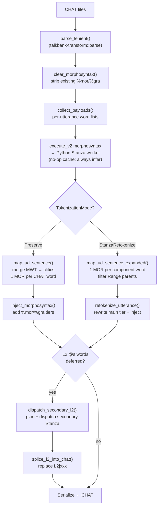
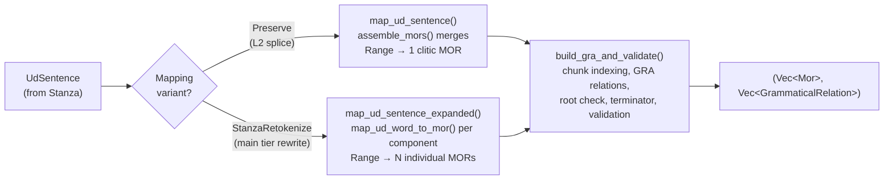
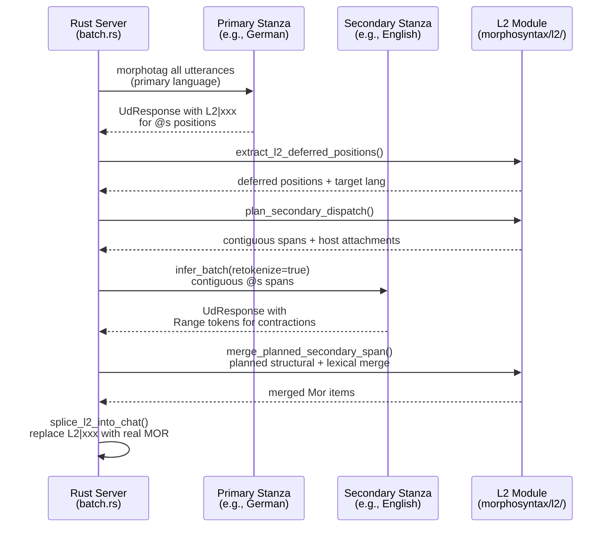

# Morphosyntax Pipeline

**Status:** Current
**Last updated:** 2026-05-23 23:52 EDT

## 1. Overview

The batchalign morphosyntax pipeline (`morphotag` command) adds %mor and %gra tiers to
CHAT transcripts.  Rust owns CHAT parsing, word extraction, UD-to-CHAT mapping, AST
injection, and serialization.  Python's only role is ML inference — calling Stanza for
POS/lemma/dependency analysis.

### Per-file scoping via `@Options`

`morphotag` reads two CHAT-level directives, both with narrow,
command-specific semantics:

- **`@Options: CA`** — "the morphotag command is not to be run on
  this file." CA transcripts are pass-through: existing %mor /
  %gra is preserved unchanged, no Stanza inference, no provenance
  comment.
- **`@Options: NoAlign`** — scoped to the `align` command, NOT
  morphotag. NoAlign files run morphotag normally. (Pre-2026-05-07
  the pipeline incorrectly conflated NoAlign with a global skip,
  leaving NoAlign files with stale morphotag and no rerun path;
  fixed.)

Full semantics + worked examples: [`@Options` and Per-File Command
Scoping](./chat-options.md).

## 2. Architecture



The diagram shows the two injection paths that diverge based on
`TokenizationMode`. The L2 secondary dispatch runs after primary
injection by default; pass `--no-l2-morphotag` to skip it.

**Cache note:** Morphosyntax (a text NLP task) uses a **no-op cache** —
all utterances skip cache lookup and are always sent to Stanza inference.
This is faster than SQLite lookups, as Stanza workers stay warm between
utterances in the cross-file batch. Audio tasks (transcribe, align)
use real caching; text tasks (morphosyntax, utseg, translate) do not.

### Data Flow

```text
Rust entry point: `crates/batchalign/src/morphosyntax/mod.rs::run_morphosyntax_impl`
  │
  ├── Parse CHAT (Rust AST via tree-sitter, parsed once per file)
  │
  ├── clear_morphosyntax()  — strip existing %mor/%gra tiers
  │     (talkbank-transform::morphosyntax::payload)
  │
  ├── collect_payloads()  — extract utterance word lists globally
  │     (talkbank-transform::morphosyntax::payload)
  │
  ├── Batch infer (all utterances pool → one Stanza call per language)
  │     ├── Group by language, dispatch concurrently
  │     ├── Python worker (batchalign/inference/morphosyntax.py)
  │     │     • Replace special forms with "xbxxx"
  │     │     • nlp(combined_text) → Stanza UD analysis
  │     │     • Return raw UD results as JSON
  │     └── Repartition responses back by file
  │
  ├── map_ud_sentence() or map_ud_sentence_expanded()
  │     → %mor/%gra (UD→CHAT mapping, Rust)
  │     (talkbank-transform::morphosyntax::sentence_mapping)
  │
  ├── inject_results()  — AST injection + validation
  │     (talkbank-transform::morphosyntax::injection)
  │
  ├── dispatch_secondary_l2() (if `@s` words and not `--no-l2-morphotag`)
  │     → transform-layer plan, secondary dispatch, merge, splice
  │     (crates/batchalign/src/morphosyntax/batch.rs)
  │
  ├── apply_pos_hints() (if --respect-pos-hints, default on)
  │     → transcriber `$POS` annotations override POS categories
  │     (talkbank-transform::morphosyntax::pos_hints)
  │
  ├── remove_empty_morphosyntax_placeholders()
  │     → sweep serialize-time empty %mor/%gra slots
  │     (talkbank-transform::morphosyntax::pos_hints)
  │
  └── Serialize → CHAT (now with %mor/%gra, L2 morphology, POS hints)
```

### Module Inventory

**Rust:** `batchalign-transform` crate (`crates/batchalign-transform/src/`)

The core morphosyntax pipeline logic lives in `talkbank-transform`. Most files
handle CHAT-side extraction, UD→CHAT mapping, and injection. The
`batchalign` crate orchestrates; `talkbank-transform` implements.

| File | Purpose |
|------|---------|
| `parse.rs` | `parse_lenient()` — top-level CHAT parsing entry point |
| `extract.rs` | `ExtractedWord` struct + word extraction from AST for morphosyntax input |
| `inject.rs` | `inject_morphosyntax()` — primary AST injection of %mor / %gra tiers |
| `morphosyntax/injection.rs` | `inject_results()` — orchestration helper called by the batch pipeline |
| `morphosyntax/payload.rs` | `clear_morphosyntax()`, `collect_payloads()`, `dispatch_secondary_l2()` host adapter |
| `morphosyntax/sentence_mapping.rs` | `map_ud_sentence()`, `map_ud_sentence_expanded()`, shared `build_gra_and_validate()` |
| `morphosyntax/gra_validate.rs` | `validate_generated_gra()` — single-root, cycle-free, valid-heads checks |
| `morphosyntax/mapping_helpers.rs` | `assemble_mors()` (clitic merge), `is_clitic()`, `map_relation()` |
| `morphosyntax/stanza_raw.rs` | Parse raw Stanza JSON output, supply defaults for Range token annotation fields |
| `morphosyntax/pos_hints.rs` | `apply_pos_hints()` and the empty-placeholder sweep |
| `morphosyntax/l2/` | L2 code-switching: planning, extract, merge, splice @s words via secondary Stanza models |
| `morphosyntax/lang_en.rs` | English-specific rules (irregular verbs, irrealis annotations) |
| `morphosyntax/lang_fr.rs` | French-specific rules (pronoun case, APM) |
| `morphosyntax/lang_ja.rs` | Japanese-specific rules (verb form overrides) |
| `morphosyntax/lang_it.rs` | Italian-specific rules |
| `retokenize/`, `retokenize.rs` | AST retokenization (Stanza-tokens rewrite); see Section 7 |
| `dp_align/` | Hirschberg DP alignment used by retokenize |

**Rust** — `batchalign` crate (`crates/batchalign/src/`)

The batchalign crate owns command orchestration; the morphosyntax-specific
glue is:

| File | Purpose |
|------|---------|
| `morphosyntax/mod.rs` | `run_morphosyntax_impl()` — top-level orchestrator called from the `morphotag` command |
| `morphosyntax/batch.rs` | `dispatch_secondary_l2()` — async wrapper that calls into the transform-layer L2 seam for secondary @s dispatch |
| `morphosyntax/worker.rs` | Stanza-pool dispatch, `partition_groups_by_stanza_support()` |
| `chat_ops/nlp/mapping/mod.rs` | Re-export shim: `pub use talkbank_transform::morphosyntax::*` — historical alias kept so existing imports keep resolving. New code should import from `talkbank_transform` directly. |
| `chat_ops/nlp/types.rs` | FA-only raw-response types (`FaRawToken`, `FaIndexedTiming`, `FaRawResponse`); the UD/NLP type set (`UdSentence`, `UdWord`, `UdId`, etc.) lives in `talkbank_transform::morphosyntax`. |

**Python** (stateless ML inference only)

| File | Purpose |
|------|---------|
| `inference/morphosyntax.py` | Calls Stanza `nlp()`, returns raw `to_dict()` output |
| `worker/_infer_hosts.py` | Worker-side host wrapper invoked by `execute_v2` |

Python does no orchestration, caching, or UD→CHAT mapping — all handled by Rust.

## 3. What Batchalign Needs from %mor

Batchalign treats %mor tiers as mostly opaque.  No pipeline decomposes POS, lemma, or
features into structured data for analysis.  The consumers and what they actually access:

| Consumer | What it accesses | Decomposes POS/lemma/features? |
|----------|-----------------|-------------------------------|
| **Cache** (`engine.py`) | Final %mor/%gra strings (BLAKE3 key) | No — stores/retrieves whole strings |
| **Coreference** (`coref`) | Token boundaries in %mor tier | No — counts tokens only |
| **WER evaluation** (`benchmark`) | Token count from %mor for word-level accuracy | No — counts only |
| **Pre-serialization validation** (`validation.py`) | Chunk count alignment (%mor chunks vs %gra relations) | No — calls `count_chunks()` in Rust |
| **CLAN commands** (talkbank-clan crate in talkbank-tools) | Full %mor structure (POS, lemma, suffixes for FREQ/MLU/MLT) | Yes — but via talkbank-model's Mor type |
| **Forced alignment** | No %mor access | N/A |
| **ASR / diarization** | No %mor access | N/A |

**Key finding:** Within batchalign itself, %mor is a cached final string.  The pipeline
generates it (via Stanza + Rust mapping), stores it, and injects it into the AST — but
never reads it back to extract linguistic information.  Downstream consumers that do
decompose %mor (CLAN commands) do so through `talkbank-model`'s typed `Mor` structure, not
through batchalign code.

**Implication for the format:** The flat `POS|lemma[-Feature]*` structure that Stanza
produces is sufficient for batchalign's needs.  Richer UD `key=value` features flow through
the pipeline without code changes — they'd be encoded as CHAT suffixes by `mapping.rs` and
round-tripped by the parser — but no batchalign consumer currently needs them.

## 4. Two MOR Traditions

%mor tiers in CHAT come from two fundamentally different sources, and understanding which
one batchalign produces is key to assessing "information loss."

### CLAN MOR Grammars (Legacy)

Hand-coded per-language grammars, maintained since the 1990s.  They produce rich
morphological structure:

- **Subcategorized POS:** `pro:sub|I`, `n:prop|John`, `v:cop|be`
- **Compounds:** `adj|+adj|big+n|bird` (structured multi-stem words)
- **Prefixes:** `trans#n|port`
- **Morpheme segmentation:** `go&PAST` (fusional) vs `cat-PL` (agglutinative)
- **Language-specific affix inventories** hand-coded per grammar

These grammars are incomplete (not all languages covered), inconsistent across languages,
and require manual maintenance.  They encode a specific morphological theory baked into
each grammar file.

### Stanza UD (What Batchalign Produces)

Automatically trained models producing Universal Dependencies analysis for 70+ languages:

- **Flat UPOS:** `pron|I`, `propn|John`, `aux|be`
- **Lemma + feature list:** `verb|go-Past`, `noun|cat-Plur`
- **MWT clitics:** `pron|I~aux|will`
- **No compounds, no prefixes, no morpheme segmentation**
- **Consistent cross-linguistic feature inventory** (UD standard)
- **Richer dependency structures** (%gra from UD is genuinely better than what CLAN produced)

### What the Model Looks Like

The shared `talkbank-model` `Mor` type:

```rust,ignore
struct Mor {
    main: MorWord,
    post_clitics: SmallVec<[MorWord; 2]>,
}

struct MorWord {
    pos: PosCategory,                      // "noun", "verb", "pron", ...
    lemma: MorStem,                        // cleaned stem text
    features: SmallVec<[MorFeature; 4]>,   // flat ordered list
}
```

Three fields per word: POS (string), lemma (string), features (ordered vector of
strings).  This maps cleanly to what Stanza produces — `UPOS` to `pos`, `lemma` to
`lemma`, UD feature values to `features`, MWT components to `post_clitics`.

### What's "Lost"

| Structure | Legacy MOR grammar | Stanza UD | Model representation |
|-----------|-------------------|-----------|---------------------|
| POS subcategories | `pro:sub\|I` | `pron\|I` | POS string — subcategories preserved if present (parser accepts `pro:sub`) |
| Compounds | `adj\|+adj\|big+n\|bird` | Not produced | Parsed by grammar if encountered; no typed compound field |
| Prefixes | `trans#n\|port` | Not produced | Parsed by grammar if encountered; stored in stem |
| Morpheme segmentation | `go&PAST` vs `go-PAST` | Not produced | Both parsed; suffix carries separator character |
| UD feature keys | N/A | `Number=Plur` | `MorFeature` has optional key field — preserved if present |
| xpos (language-specific POS) | N/A | Available in Stanza | Discarded — only UPOS used |

The structures that the model doesn't have typed fields for — compounds, prefixes,
morpheme boundaries — are structures that **Stanza never produces**.  The model was shaped
to match the producer.

### Freedom from CLAN MOR Constraints

This is mostly a good thing:

- **Cross-linguistic consistency.** CLAN MOR grammars varied wildly per language.  UD gives
  the same feature inventory everywhere.
- **No manual grammar maintenance.** Stanza models are trained automatically.  Adding a
  language means training a model, not writing a grammar by hand.
- **Better dependency analysis.** UD %gra is more accurate than what CLAN
  produced — the Rust mapper's O(N) cycle detection catches malformed-head
  structures that earlier CLAN-era pipelines silently accepted.
- **Feature transparency.** UD features like `Number=Plur` are semantically meaningful
  and machine-readable.  CLAN suffixes like `-PL` required per-grammar documentation.

### The CLAN Caveat

CLAN commands (`FREQ`, `MLU`, `MLT`) access %mor through `talkbank-model`'s `Mor` type.
For counting (MLU) and frequency (FREQ), the flat `pos + lemma + features` structure is
sufficient.  For fine-grained morphological queries on legacy corpus data — "find all
compound nouns", "count prefixed verbs" — you'd currently have to pattern-match on the POS
string (e.g., `n:prop` contains `:`) or lemma, which works but isn't ideal.

Should the model grow structured compound/prefix/subcategory fields?  Not urgently.
The flat model serves all current use cases, and enriching it would be additive (no
breakage).  Now that batchalign shares `talkbank-model` via path dependencies (no more
vendored copy), any such enrichment is a shared decision visible in talkbank-tools's review
process — the right place for it to happen.

## 5. UD-to-CHAT Mapping

Absorbed from the former `mor-gra-generation.md`.  The mapping lives in
`crates/batchalign-transform/src/morphosyntax/`, with the main entry point being
`sentence_mapping.rs::map_ud_sentence`.

### Pipeline

```text
Main tier words
    ↓
Stanza NLP (Python worker, `worker/_infer_hosts.py` → `inference/morphosyntax.py`)
    ↓  produces UdSentence { words: Vec<UdWord> }
    ↓  each UdWord has: id, text, lemma, upos, feats, head, deprel
    ↓
map_ud_sentence() (Rust, talkbank-transform::morphosyntax::sentence_mapping)
    ↓  produces (Vec<Mor>, Vec<GrammaticalRelation>)
    ↓
Post-construction validation (gra_validate.rs::validate_generated_gra)
    ↓  rejects if chunk count != gra count, single-root violated, or cycle detected
    ↓
inject_morphosyntax() (talkbank-transform::inject) /
inject_results()      (talkbank-transform::morphosyntax::injection)
    ↓  writes %mor and %gra tiers into the AST
    ↓
CHAT serialization
```

### MOR Generation: Two Mapping Variants

The mapping layer provides two functions that differ only in how MWT Range
tokens are handled. Both share identical GRA/validation logic via the
internal `build_gra_and_validate()` helper.



**`map_ud_sentence()`** — Preserve mode and L2 splice. Produces one `Mor`
item per CHAT word. MWT Range tokens are merged into a single clitic MOR
via `assemble_mors()`:

```text
"I'll" → Range(1,2): ["I", "'ll"]
  is_clitic("I", en) → false → main_idx = 0
  Post-clitics: ["'ll"]
  Result: pron|I~aux|will (1 MOR, 2 chunks)
```

**`map_ud_sentence_expanded()`** — Retokenize mode. Produces one `Mor`
per component word. Range parent tokens are skipped; each component gets
its own MOR via `map_ud_word_to_mor()`:

```text
"gonna" → Range(1,2): ["gon", "na"]
  gon → verb|go-Part-Pres-S (1 MOR)
  na  → part|to             (1 MOR)
  Result: 2 separate MORs (matched to 2 tokens on rewritten main tier)
```

The expanded variant exists because the retokenize path rewrites the
main tier with Stanza's tokens — each token needs its own MOR item.
The Preserve path keeps the original main tier, so Range components
must be merged into one clitic MOR to match the single CHAT word.

### GRA Generation

**Critical: %gra indices are per-chunk, not per-word.**

Each %mor chunk (including clitics) needs its own %gra relation.  The GRA builder:

1. **Builds a chunk-based index mapping** (`ud_to_chunk_idx`).  Each UD word ID maps
   to a sequential chunk index.  For MWT ranges, each component gets its own index:

   ```text
   Range(1,2) "I'll": ID 1 → chunk 1, ID 2 → chunk 2
   Single(3) "give":  ID 3 → chunk 3
   Single(4) "you":   ID 4 → chunk 4
   ```

2. **Emits one GRA relation per component** (not one per MWT).  Each component's
   UD head and deprel are used directly:

   ```text
   I:    head=3 (give), deprel=nsubj → 1|3|NSUBJ
   'll:  head=3 (give), deprel=aux   → 2|3|AUX
   give: head=0 (root)               → 3|0|ROOT
   you:  head=3 (give), deprel=iobj  → 4|3|IOBJ
   ```

3. **Adds terminator** PUNCT relation pointing to ROOT.

### TalkBank Conventions

The mapper applies four CHAT-specific transformations, all lossless:

| UD Convention | TalkBank Convention | Example |
|--------------|--------------------|---------|
| `head=0` for root | `head=0` (same — UD standard) | `2\|0\|ROOT` |
| Subtypes with colon | Subtypes with dash | `acl:relcl` → `ACL-RELCL` |
| Lowercase relations | Uppercase relations | `nsubj` → `NSUBJ` |
| Multi-value features with comma | Commas preserved | `PronType=Int,Rel` → `-Int,Rel` |

The first three are trivially reversible surface-syntax changes.  The comma convention
preserves the UD multi-value separator as-is.  This differs from older CLAN-produced
corpus data which used concatenation (`IntRel`, `AccNom`).  The tree-sitter grammar and
%mor parser both accept commas in suffix values.

### POS Mapping

POS categories use lowercased UPOS tags:

| UPOS | CHAT POS | Suffix features |
|------|----------|-----------------|
| NOUN | `noun\|` | Gender, Number, Case, Ger |
| VERB/AUX | `verb\|`/`aux\|` | VerbForm, Tense, Person, -irr |
| PRON | `pron\|` | PronType, Case, Reflex, Number, Person |
| DET | `det\|` | Gender, Definite, PronType |
| ADJ | `adj\|` | Degree, Case |
| ADP | `adp\|` | (none) |
| PROPN | `propn\|` | (none) |
| INTJ | `intj\|` | (none) |
| CCONJ | `cconj\|` | (none) |
| SCONJ | `sconj\|` | (none) |

Language-specific rules live in dedicated modules under
`crates/batchalign-transform/src/morphosyntax/`: `lang_en.rs` (English
irregular-verb table and irrealis annotations), `lang_fr.rs` (French
pronoun case and APM handling), `lang_ja.rs` (Japanese verb-form
overrides), `lang_it.rs` (Italian). Add a language by mirroring the
shape of one of these modules.

## 6. Post-Construction Validation

`map_ud_sentence` validates generated output before returning:

### Structural GRA Validation

`validate_generated_gra` enforces four rules:

- **Single root** — exactly one self-referential or head=0 relation (excluding terminator)
- **No circular dependencies** — no word is its own ancestor in the head chain
- **Valid heads** — all head references point to existing word indices or 0
- **Sequential indices** — guaranteed by construction

Cycle detection uses an **O(N) White-Gray-Black DFS with memoization**: each word follows
its head chain to the root, marking nodes IN_PROGRESS (gray) on the way down and NO_CYCLE
(black) on the way back.  Encountering a gray node means a cycle.

On failure, `validate_generated_gra` (in
`crates/batchalign-transform/src/morphosyntax/gra_validate.rs`) returns
`Err(MappingError)` with a detailed error message including the full
invalid structure. The caller (morphosyntax orchestrator) logs the
error and skips the utterance — no corrupted %gra is written to disk.

The mapper uses `HashMap<usize, usize>` to translate UD word IDs to
CHAT chunk indices. Missing keys fall through to `unwrap_or(&0)` and
are caught by the valid-heads check, so a wild UD response cannot
silently produce a malformed `%gra` line.

### Chunk Count Alignment

The critical guard added after the MWT/GRA bug:

```rust,ignore
let mor_chunk_count = mors.iter().map(|m| m.count_chunks()).sum::<usize>() + 1;
if gras.len() != mor_chunk_count {
    return Err(MappingError::ChunkCountMismatch { ... });
}
```

This catches any mismatch at generation time, preventing corrupted data from ever being
written to CHAT files.

## 7. Module Details

### PyO3 boundary

The PyO3 surface (`crates/batchalign-pyo3/src/lib.rs`) is intentionally
narrow: it exposes only the worker-side IPC and ML-inference adapters
(`worker_protocol`, `worker_asr_exec`, `worker_fa_exec`,
`worker_media_exec`, `worker_text_results`, `worker_artifacts`,
`cantonese_asr_bridge`). All morphosyntax orchestration — extract,
map, inject, cache key derivation, secondary L2 dispatch — happens
in Rust, called directly by the `run_morphosyntax_impl` orchestrator
in the `batchalign` crate. Python participates only as a Stanza
inference endpoint behind the worker IPC.

### `extract.rs` — Word Extraction

Walks the CHAT AST using `walk_words()` (from `talkbank-model`) and collects words appropriate for a given tier domain. The walker centralizes traversal of all 24 `UtteranceContent` variants and 22 `BracketedItem` variants; `extract.rs` provides only the word-handling closures for `counts_for_tier()` filtering and `ReplacedWord` branch logic.

```rust
pub struct ExtractedWord {
    pub text: String,              // cleaned text (for NLP)
    pub raw_text: String,          // original text (with markers)
    pub special_form: Option<String>,  // @c → "c", @s → "s", etc.
}
```

**Domain-aware traversal** via `TierDomain`:

| Domain | Retraces | Replacements | Untranscribed (xxx/yyy/www) |
|--------|----------|-------------|---------------------|
| Mor | Skipped | Use replacement words | Skipped (case-insensitive) |
| Wor | Included | Use original words | Included |

**Case-insensitive untranscribed detection:** The `counts_for_tier()` gate
recognizes `xxx`, `yyy`, and `www` **case-insensitively** — uppercase variants
like `XXX` (illegal per E241 but common in legacy corpora) are also excluded
from extraction. Without this, uppercase untranscribed markers would be sent to
Stanza, which assigns them `UPOS=X`, producing a spurious `x|XXX` entry on
%mor that breaks alignment (E706). See `Word::compute_untranscribed()` in
`talkbank-model`.

### `dp_align/` — Hirschberg Alignment

`crates/batchalign-transform/src/dp_align/` provides the linear-space
sequence aligner used by retokenization. Properties:

- **Cost model:** match=0, substitution=2, gap=1
- **Space:** O(min(n,m)) via Hirschberg's linear-space trick
- **Small cutoff:** Falls back to full DP table for small n × m

### `%mor` / `%gra` parsing

`%mor` and `%gra` lines are parsed through the canonical fragment
parsers in `../chatter/crates/talkbank-parser/` into typed `Mor` and
`GrammaticalRelation` values (`../chatter/crates/talkbank-model/src/model/
dependent_tier/mor/`). Batchalign never re-parses these tiers from
serialized strings during pipeline execution; it operates on the
typed AST.

### `inject.rs` — Morphosyntax Injection

The injection path lives in two places:

- `crates/batchalign-transform/src/inject.rs::inject_morphosyntax`:
  the top-level entry point that walks the AST using the same
  traversal order as `extract.rs` and assigns `Mor` items to
  alignable `Word` nodes.
- `crates/batchalign-transform/src/morphosyntax/injection.rs::inject_results`:
  the helper called by the batched orchestrator after
  `map_ud_sentence` returns.

**Key invariant:** the traversal order used by `inject_morphosyntax`
must exactly match the one used by `extract.rs`. The shared
`walk_words()` walker in `talkbank-model` enforces this — both
modules call into the same primitive and supply only their
leaf-handling closures.

### `retokenize/` — AST Retokenization

`crates/batchalign-transform/src/retokenize.rs` declares the module;
its implementation files live alongside in
`crates/batchalign-transform/src/retokenize/`:

- `rebuild.rs` — AST rebuilding when Stanza's tokens differ from the
  original main tier
- `parse_helpers.rs` — `resolve_token_text()` and word-parsing helpers
  used during rebuild

When `retokenize=true`, Stanza uses its own UD tokenizer, which can
change word boundaries (splits, merges, different text). The algorithm:

1. **Filter Range parent tokens** from `ud_sentence.words` — only
   component words appear in the token vector. Range parents are the
   container entry (e.g., `id=[1,2] text="gonna"`) whose components
   follow immediately. Including both would overcount tokens and break
   MOR alignment.
2. Character-level DP alignment between original and Stanza token texts
3. Build mapping: original_word_idx → stanza_token_indices
4. Walk AST, rebuilding content vectors (1:1, 1:N splits, preserving
   non-word content)
5. New `Word` values created by calling the fragment parser in
   `talkbank-parser` (not `Word::new`, which would bypass parser
   validation for Stanza-supplied text that may carry CHAT-significant
   characters)
6. Inject MOR/GRA tiers (MOR items are per-component via
   `map_ud_sentence_expanded()`)

### UD-to-CHAT mapping module path

The implementation of `map_ud_sentence()` and
`map_ud_sentence_expanded()` lives in
`crates/batchalign-transform/src/morphosyntax/sentence_mapping.rs`. The
older `crates/batchalign/src/chat_ops/nlp/mapping/mod.rs` is a
re-export shim (`pub use talkbank_transform::morphosyntax::*`) kept so
existing imports continue to resolve; new consumers should import
from `talkbank_transform` directly. See [Section 5](#5-ud-to-chat-mapping)
for the algorithm details.

## 8. The Callback Pattern

### Batched Payload (Rust → Python)

The primary path is batched: Rust collects all utterance payloads in one pass and sends
them as a JSON array.  Each element:

```json
{
  "words": ["I", "eat", "cookies"],
  "terminator": ".",
  "special_forms": [null, null, null]
}
```

With special forms (e.g., `gumma@c`):
```json
{
  "words": ["gumma", "is", "yummy"],
  "terminator": ".",
  "special_forms": [["gumma", "c"], null, null]
}
```

### Response (Python → Rust)

```json
{
  "mor": "pro:sub|I v|eat n|cookie-PL .",
  "gra": "1|2|SUBJ 2|0|ROOT 3|2|OBJ 4|2|PUNCT",
  "tokens": ["I", "eat", "cookies"]
}
```

The `tokens` field is always present.  When `retokenize=false`, it's ignored.  When
`retokenize=true`, Rust compares tokens against original words and rebuilds the AST if
they differ.

### Worker-side batch inference (`worker/_infer_hosts.py` + `inference/morphosyntax.py`)

The worker-side morphosyntax host wraps Stanza to conform to this interface:

1. Parse JSON payload array
2. For each utterance: replace special-form words with `"xbxxx"` (Stanza placeholder)
3. Strip parentheses, join words as text
4. Set `tokenizer_context["sentence"]` for Stanza's postprocessor
5. Call `nlp(text)` under lock on GIL-enabled Python
6. `map_ud_sentence()` converts UD output to %mor/%gra
7. Extract Stanza token texts
8. Return `[{mor, gra, tokens}, ...]` JSON array

### Cache orchestration

There is no morphosyntax cache. Morphosyntax is a text-only NLP task,
and the engine deliberately does not cache its outputs — see the
"Cache note" at the end of [Section 2](#2-architecture). Every utterance
runs through Stanza inference on every invocation; warm Stanza
workers make this faster than the SQLite lookup the audio caches
require. Caching applies only to FA and UTR.

## 9. L2 Morphotag (Default)

By default, @s (code-switched) words are routed to secondary language
Stanza models. Pass `--no-l2-morphotag` to opt out and emit `L2|xxx`
stubs on the %mor tier instead.

### Dispatch Flow



### How It Works

1. **Primary pass** produces %mor/%gra for the entire utterance. @s words
   get `L2|xxx` placeholders via the special form handler in `inject.rs`.
2. **Extract deferred positions** identifies which words have `L2|xxx` and
   their target languages (from `@s:spa`, `@s:eng`, or bare `@s` resolved
   via `@Languages`).
3. **Plan dispatch spans** creates contiguous per-utterance spans of same-language
   @s words and computes the host attachment for each span root
   (e.g., `los@s:spa niños@s:spa` → one span of 2 words with an explicit
   external-anchor plan).
4. **Secondary dispatch** sends each planned span to a Stanza worker for the target
   language with `retokenize=true`. MWT contractions (`it's`, `don't`) are
   expanded via Range tokens — `map_ud_sentence()` merges them into clitics.
5. **Merge** combines secondary lexical output (lemma, features) with primary
   structural info (deprel, head) plus the planned host attachment using a
   6-level POS resolution priority.
6. **Splice** replaces `L2|xxx` with the merged MOR items and corrects GRA
   relations where the resolved POS contradicts the primary deprel.

### Validation and repair policy

- Whole-utterance same-language all-`@s` patterns are rejected during
  pre-validation (E255). The accepted CHAT form is utterance-level `[- lang]`.
- Explicit `@s:LANG` still routes to `LANG` even if `LANG` is absent from
  `@Languages`, but validation emits warn-only E254 to surface the header drift.
- `chatter debug fix-s` is the intended normalization tool for both cases: it
  rewrites the qualifying whole-utterance `@s` pattern, appends missing
  explicit languages to `@Languages`, and skips files that already need no
  change.

The fix-s rewrite predicate verifies that **every** word-bearing item
on the main tier (words, fillers `&~`/`&-`/`&+`, nonwords, retraced
material) resolves to the same target language. Fillers and nonwords
participate in the predicate AND have their `@s` shortcuts cleared
when the rewrite fires — otherwise a bare `@s` would flip its resolved
language under the new `[- LANG]` precode. See
[`chatter` CLI reference: `fix-s`](../../chatter/user-guide/cli-reference.md#debug)
for the full safety contract.

### Unsupported non-primary languages

`morphotag` skips files whose **primary** `@Languages` code is not
Stanza-supported with a typed diagnostic (no pipeline entry). When the
primary IS supported, non-primary content targeting an unsupported
language degrades gracefully:

- `[- UNSUPPORTEDLANG]` precodes — `infer_batch` partitions language
  groups via `partition_groups_by_stanza_support`; unsupported groups
  bypass Stanza dispatch and the words receive `L2|xxx` in `%mor`.
- `@s:UNSUPPORTEDLANG` per-word markers — the secondary dispatch path
  for that span is short-circuited the same way; the host primary
  analysis is preserved and the `@s` token's slot stays as `L2|xxx`.

The worker never crashes on an unsupported secondary, and other
utterances or spans in the same file targeting supported languages
continue to receive real morphology.

### Key Files

| File | Purpose |
|------|---------|
| `morphosyntax/l2/plan.rs` | Contiguous span planning and host-attachment planning |
| `morphosyntax/l2/extract.rs` | Extract primary structural info from UD responses |
| `morphosyntax/l2/spans.rs` | Group @s positions into contiguous dispatch spans |
| `morphosyntax/l2/merge.rs` | POS resolution priority, planned structural merge |
| `morphosyntax/l2/splice.rs` | Replace L2\|xxx in ChatFile with merged MOR |
| `morphosyntax/l2/deprel.rs` | UdDeprel newtype, deprel→POS constraint mapping |
| `morphosyntax/batch.rs` | `dispatch_secondary_l2()` — thin worker adapter over the transform-layer L2 seam |

### MWT Contraction Handling

L2 dispatch sends `retokenize=true` to the secondary worker, enabling
Stanza's MWT expander for the target language. For English @s words:

- `it's@s:eng` → `pron|it~aux|be` (clitic MOR, not `L2|xxx`)
- `don't@s:eng` → `aux|do~part|not` (clitic MOR)
- `working@s:eng` → `noun|work-Part-Pres-S` (no contraction, regular MOR)

The L2 path uses `map_ud_sentence()` (merged clitics), which is correct
because L2 does NOT rewrite the main tier — the @s word stays as-is,
and its %mor slot gets the clitic form.

## 10. Gotchas

### `cleaned_text` is Derived, Not Settable

The CHAT serializer uses `Word.content` (`WordContents`), not
`raw_text` or `cleaned_text`. Simply changing
`word.cleaned_text = "new"` does not change serialized output. To
create a word with different text, parse it via the `talkbank-parser`
fragment API (`SingleItemParser::parse_word` or the
`parse_word_fragment` entry on `parser_api.rs`), which runs the full
tree-sitter parse and produces a structurally-valid `Word`.

### `Word::new()` Bypasses Validation

`Word::new(raw_text, cleaned_text)` creates a minimal `Word` with a
single `WordContent::Text` element. For retokenization where text
comes from Stanza (which may contain CHAT-significant characters),
prefer one of the fragment parser entries above instead, so that
markers, brackets, and other CHAT structure are recognized rather
than embedded raw.

### Traversal Order Must Match Between extract/inject/retokenize

All three modules walk the AST using `walk_words()` / `walk_words_mut()` from
`talkbank-model`, ensuring identical traversal order. The walker handles group recursion
and domain-aware gating centrally. If leaf-handling closures apply different filtering
between extraction and injection, morphology is assigned to wrong words.

### Separator Word Counter Sync

`extract.rs` includes tag-marker separators (comma `,`, tag `„`, vocative `‡`) as NLP
words in the Mor domain.  Any code walking the AST with a `word_counter` must also
increment for separators.  `retokenize.rs` handles this explicitly.  Forgetting causes
counter desync.

### Manual JSON Parsing

`batchalign-core` uses manual JSON field extraction instead of serde_json at runtime to
avoid the dependency in the release binary.  The parsers handle escapes but are not
general-purpose.

### Special Forms and `xbxxx`

Words with `@c`, `@s`, `@b` markers are replaced with `"xbxxx"` before Stanza analysis.
When `retokenize=true`, `retokenize.rs` restores original text via `resolve_token_text()`.

### `skipmultilang` and Language Handling

When `skipmultilang=true`, utterances with `[- lang]` override where the language differs
from the file's primary language are skipped.  Language codes: file language is ISO 639-3
(`"eng"`, `"fra"`); callback adapter converts to ISO 639-1 (`"en"`, `"fr"`) for Stanza.
This flag is only about utterance-level `[- lang]` routing. Per-word `@s`
secondary dispatch is controlled separately by `--no-l2-morphotag`.

### `BracketedItems` is a Newtype

`BracketedContent.content` is `BracketedItems(Vec<BracketedItem>)`, a newtype that does
not implement `Default`.  Use `std::mem::replace(&mut field, BracketedItems(Vec::new()))`
instead of `std::mem::take()`.

### Uppercase Untranscribed Markers (XXX, YYY, WWW)

Legacy corpora frequently contain uppercase `XXX` instead of the required
lowercase `xxx`. These are flagged as E241 by the validator, but the morphotag
pipeline must still handle them correctly. The extraction layer's
`counts_for_tier()` gate uses `Word::compute_untranscribed()`, which matches
case-insensitively. This prevents uppercase variants from being sent to Stanza,
which would produce spurious `x|XXX` entries on the %mor tier and cause E706
alignment mismatches.

### Stanza `token.id` is Always a Tuple

`(word_id,)` for regular words, `(start, end)` for MWT.  Never assume it's an int.
