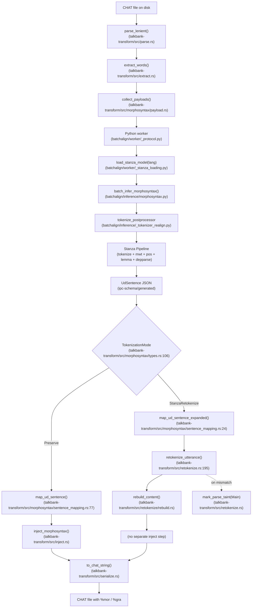
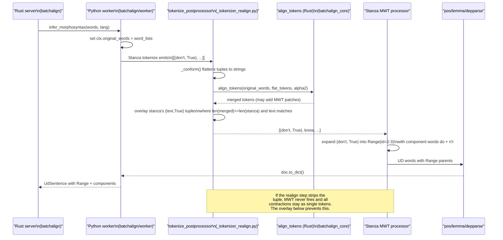
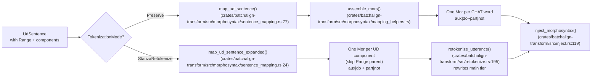

# Morphotag Retokenization

**Status:** Current
**Last updated:** 2026-05-20 20:25 EDT

## Purpose and audience

This page is the single entry point for understanding the retokenization
subsystem of `batchalign3 morphotag`. By the end you should know which mode
does what, how CHAT tokens flow through Stanza and back, where MWT hints
survive the round-trip, and how the BA3 pipeline differs from BA2. It is
aimed at a newcomer who has never read the Python or Rust morphosyntax code
before, and it links out to the deeper companion pages rather than repeating
them.

For deeper detail:

- [`reference/mwt-handling.md`](./mwt-handling.md), MWT mechanics in full.
- [`reference/stanza-limitations.md`](./stanza-limitations.md), Defect 2
  (MWT hint preservation) is the root cause of the Preserve-mode MWT
  regression discussed below.
- [`reference/l2-morphotag-status.md`](./l2-morphotag-status.md), L2 uses
  `retokenize=true` for secondary Stanza dispatch.
- [`developer/commands/morphotag.md`](../developer/commands/morphotag.md),
  CLI wiring and dispatch sketch.

## The problem: CHAT tokenization vs UD tokenization don't match

CHAT transcripts and Universal Dependencies treebanks disagree on what a
"word" is, and neither disagreement is wrong in its own domain.

CHAT tokenization is defined by the CLAN manual and is conservative about
word boundaries. A transcriber writes one token per word they heard:

- **Underscore-joined fillers.** `&-you_know`, `&-sort_of`, `&-I_mean`.
- **Hyphenated compounds.** `daddy-o`, `ice-cream`. Still one token.
- **Contractions kept whole.** `don't`, `gonna`, `it's`: one CHAT word each.
- **`@s` words.** `hola@s:spa` tags an utterance-internal language switch
  without splitting the token.
- **Special forms.** `xxx`, `yyy`, `www`, `&+`, `&~` all carry semantics that
  are invisible to a UD tokenizer.

Stanza's UD tokenizer, by contrast, aims at treebank conventions:

- `don't` → `do` + `n't` (two UD words inside one Multi-Word Token, "MWT").
- `gonna` → `gon` + `na`.
- French `au` → `à` + `le`.
- Italian `lei`, when mis-split by the model, must be re-merged to match
  treebank convention.

The tension is structural, not a bug: CHAT is a transcript-preserving
convention owned by the TalkBank manual; UD is a syntactic-annotation
convention owned by the treebank community. `morphotag` exists to marry
them, and retokenization is where we decide which side wins when they
disagree.

## The two modes

`morphotag` exposes the tension as a user choice, controlled by the
`--retokenize` CLI flag and the `TokenizationMode` enum defined in
`crates/batchalign-transform/src/morphosyntax/types.rs`:

```rust
pub enum TokenizationMode {
    Preserve,           // default — CHAT main tier wins
    StanzaRetokenize,   // --retokenize — Stanza main tier wins
}
```

### Preserve mode (default, `--keeptokens`)

The CHAT main tier is the source of truth. Stanza still analyses the text
and may internally produce MWTs; when it does, BA3 merges the MWT components
back into one MOR item with clitic syntax (`~`) so that the CHAT main tier
and `%mor` stay 1:1.

- Main tier stays untouched: `*PAR: I don't know .`
- `%mor` emits a single clitic-joined item:
  `aux|do-Fin-Ind-Pres-S3~part|not`
- Mapped by `map_ud_sentence()` in
  `crates/batchalign-transform/src/morphosyntax/sentence_mapping.rs` (line 77).

### Retokenize mode (`--retokenize`)

Stanza's tokenization is authoritative. The CHAT main tier is rewritten so
each UD word is its own CHAT word, and each UD word gets its own MOR item.

- Main tier rewritten: `*PAR: I do n't know .`
- `%mor` emits two items: `pro:sub|I aux|do-Fin-Ind-Pres-S3 part|not v|know .`
- Driven by `map_ud_sentence_expanded()` (same file, line 24) for the MOR
  side, and by `retokenize_utterance()` in
  `crates/batchalign-transform/src/retokenize.rs:195` for the main
  tier rewrite (with `parse_helpers.rs` and `rebuild.rs` as siblings
  under `crates/batchalign-transform/src/retokenize/`).

We chose this split because the two goals, "preserve the transcript" and
"produce UD-shaped morphology", are legitimate for different downstream
tasks. CLAN-style workflows want Preserve; UD-trained parsers and treebank
comparisons want Retokenize. Neither is a default "for everyone."

## Pipeline diagram (end-to-end, both modes)

The flowchart below traces a single CHAT utterance from Rust parse to CHAT
write for both modes on the same page, so the divergence is visible at a
glance. Every node labels its source file.



Both branches end with `inject_morphosyntax()`: the tier-insertion machinery is mode-agnostic.
The difference is upstream:
- **Preserve**: `map_ud_sentence()` merges MWT components into clitics
- **StanzaRetokenize**: `map_ud_sentence_expanded()` expands each component into a separate MOR item, then `retokenize_utterance()` rewrites the main tier to match Stanza's tokenization before calling `inject_morphosyntax()`

## Character-DP realignment (the Python layer)

Stanza's output does not line up cleanly with CHAT words, because Stanza's
tokenizer may split, merge, or drop characters in ways that a naive 1:1
index cannot recover. `batchalign/inference/_tokenizer_realign.py` runs as
Stanza's `tokenize_postprocessor` callback and reconciles the two.

We delegate the character-level alignment itself to
`batchalign_core.align_tokens()` (a Rust function, called from the Python
postprocessor). The Python wrapper supplies two extra things:

1. A thread-local `TokenizerContext` holding `original_words` for the
   current batch. This is populated in `batch_infer_morphosyntax()` in
   `batchalign/inference/morphosyntax.py` (around line 346) and cleared
   immediately after `nlp()` returns.
2. MWT hint preservation. Stanza's tokenizer natively emits
   `(text, True)` tuples to ask its MWT processor to expand a token
   (English contractions, French `au`, Italian `dal`, etc.). When we flatten
   tuples into plain strings to hand them to the Rust char-DP aligner, that
   hint is temporarily erased. `_realign_sentence()` re-overlays the
   original tuples onto the aligner's output when lengths match and no
   merging happened, so the downstream Stanza MWT processor can still see
   the hint and fire. See Defect 2 in
   [`stanza-limitations.md`](./stanza-limitations.md) for the full story.

The sequence below shows one `nlp()` call start-to-finish. It spans a
single Python process; "Rust server" and "Stanza MWT" are in-process
components, not remote services.



The "overlay" step in `_realign_sentence()` is what keeps the hint
intact. When `len(merged) == len(stanza_tokens)` and the aligner
returned a plain string for a token whose original was a tuple with
the same text, the tuple is put back. This is not a cosmetic change:
without it Stanza's MWT processor sees a plain string and silently
skips expansion.

## MWT handling across the two modes

Both modes see the same UD output. They differ only in how they turn
`UdSentence.words` (which contains `Range(start, end)` parent tokens
followed by their components) into `Vec<Mor>`.



`map_ud_sentence_expanded()` skips the Range parent entirely and returns
one Mor per component word, in order. The length of the returned Mor vector
equals the number of Stanza tokens in the main-tier rewrite, so the
retokenize path can consume them with a simple cursor
(`ctx.mor_cursor` in `retokenize/rebuild.rs`).

`map_ud_sentence()` assembles the MWT components into one clitic-joined
Mor via `assemble_mors()`, so the returned vector length matches the
original CHAT word count.

## Contrast: BA2 vs BA3

BA2 is a useful oracle for **semantic** correctness of the retokenize
output, but its architecture is not an oracle we want to reproduce. The
table and diagram below report what BA2 actually does, confirmed by
reading `~/batchalign2-master/batchalign/pipelines/morphosyntax/ud.py`.

| Concern | BA2 (`ud.py`) | BA3 |
|---|---|---|
| Stanza mode | `tokenize_no_ssplit=True`, free tokenizer (NOT pretokenized). Config built in `_build_nlp()` at line 1004. | Mixed: `tokenize_pretokenized=True` for non-MWT languages and Japanese; free tokenizer with `tokenize_postprocessor` for English and other MWT languages. Config in `batchalign/worker/_stanza_loading.py` line 102-140. |
| Preserve vs retokenize branch | Single `morphoanalyze()` function at line 713 branches on the `retokenize` boolean parameter at line 833. | Typed `TokenizationMode` enum in `morphosyntax/mod.rs`; dispatch branch in `morphosyntax/inject.rs` at line 158. |
| MWT contraction fix | Inline regex on emitted %mor string at line 826: `re.sub(r"~part\|s verb\|(\w+)-Ger-S", r"~aux|is verb|\1-Part-Pres-S", mor)`. | MWT handling is type-level, not textual: `UdId::Range` parent tokens are detected in `map_ud_sentence()` / `map_ud_sentence_expanded()` and mapped at the AST layer. |
| Character-DP aligner | Internal `align()` function from `batchalign.utils.dp` operating on `PayloadTarget`/`ReferenceTarget` lists, called at line 872. | Rust `align_tokens()` exposed via `batchalign_core`, called from the Python `_tokenizer_realign.py` postprocessor. Hirschberg divide-and-conquer (`crates/batchalign-transform/src/dp_align/`). |
| Main-tier rewrite | Text surgery: 14+ chained `.replace()` and `re.sub()` calls at lines 925-942, then a sanity-check reparse of the result. | AST rewrite: `rebuild_content()` walks the parsed `UtteranceContent` and splices Stanza tokens in place (`retokenize/rebuild.rs`), re-using the tree-sitter fragment parser. No string surgery. |
| `%wor` preservation | Not handled, BA2 had no `%wor` tier concept at this layer. | Retokenize-mode invalidates `%wor` bullets; FA must be re-run. See the Known Limitations section. |
| Cross-language routing | `MultilingualPipeline` with all lang alpha-2 codes (line 1058). | Per-language pipelines, with per-utterance `lang_code` dispatch in `batch_infer_morphosyntax()`. |

```mermaid
flowchart TD
    subgraph BA2 ["BA2 (Python-only, ud.py)"]
        B_In["Utterance text\n(str)"] --> B_Nlp["stanza.Pipeline\ntokenize_no_ssplit=True\nfree tokenizer"]
        B_Nlp --> B_Parse["parse_sentence()\nline 825"]
        B_Parse --> B_Regex["re.sub %mor patch\nline 826"]
        B_Regex --> B_Branch{"retokenize?"}
        B_Branch -->|"no"| B_Merge["chat_parse_utterance(line, mor, gra)\nline 956"]
        B_Branch -->|"yes"| B_Align["align() DP on chars\nline 872"]
        B_Align --> B_Surgery["14+ string replace / re.sub\nlines 925-942"]
        B_Surgery --> B_Reparse["chat_parse_utterance sanity check\nline 947"]
        B_Merge --> B_Doc["Document.content[idx] = ..."]
        B_Reparse --> B_Doc
    end

    subgraph BA3 ["BA3 (Rust + thin Python)"]
        R_In["Utterance AST\n(talkbank-model::Utterance)"] --> R_Extract["extract_words()\n(../chatter/crates/talkbank-transform/src/extract.rs)"]
        R_Extract --> R_Worker["Python worker\n(infer_morphosyntax)"]
        R_Worker --> R_Stanza["stanza.Pipeline\npretokenized or postprocessor"]
        R_Stanza --> R_Map{"TokenizationMode"}
        R_Map -->|"Preserve"| R_Merge["map_ud_sentence()\n(crates/batchalign-transform/src/morphosyntax/sentence_mapping.rs:77)"]
        R_Map -->|"StanzaRetokenize"| R_Exp["map_ud_sentence_expanded()\n(crates/batchalign-transform/src/morphosyntax/sentence_mapping.rs:24)"]
        R_Exp --> R_Retok["retokenize_utterance()\n(crates/batchalign-transform/src/retokenize.rs)"]
        R_Merge --> R_Inject["inject_morphosyntax()\n(crates/batchalign-transform/src/inject.rs)"]
        R_Retok --> R_Inject
        R_Inject --> R_Ser["to_chat_string()\n(../chatter/crates/talkbank-transform/src/serialize.rs)"]
    end
```



What BA2 got wrong that BA3 got right:

- BA2 does 14 text-surgery passes on the already-serialized utterance
  string. Each was a band-aid for a specific bug, and several interact
  with CHAT annotations (brackets, `⁎` creaky markers, `@wp` prefixes).
  BA3 never serializes in the middle of the pipeline; the main tier is
  rewritten at the AST layer.
- BA2's `re.sub` on the `%mor` string (line 826) is an ad-hoc patch for a
  specific Stanza wrong-analysis of `'s Ger-S`. BA3 addresses this at the
  UD layer in `map_ud_sentence` and `assemble_mors`.

What BA3 got wrong that BA2 got right (or at least, did simply):

- BA2 always runs the free tokenizer + postprocessor path. BA3's mix of
  `tokenize_pretokenized=True` for some languages and the postprocessor for
  others means the MWT hint preservation described above is load-bearing
  for English and other MWT languages, and a regression there silently
  disables MWT expansion without crashing. Defect 2 in
  [`stanza-limitations.md`](./stanza-limitations.md) covers the failure mode.

## Code map

| File | Role |
|---|---|
| `crates/batchalign-transform/src/morphosyntax/types.rs` | `TokenizationMode` enum (`:106`); top-level morphosyntax types |
| `crates/batchalign-transform/src/inject.rs` | Top-level `inject_morphosyntax()`: tier insertion, shared by both modes |
| `crates/batchalign-transform/src/morphosyntax/payload.rs` | Per-utterance payload collection sent to Python |
| `crates/batchalign-transform/src/retokenize.rs` | `retokenize_utterance()` entry point (`:195`); `build_word_token_mapping()` (`:67`); inline `#[cfg(test)]` tests |
| `crates/batchalign-transform/src/retokenize/rebuild.rs` | `rebuild_content()` (`:47`): AST walk that splices Stanza tokens into the `UtteranceContent` |
| `crates/batchalign-transform/src/retokenize/parse_helpers.rs` | Fragment-parser helpers (re-uses tree-sitter fragment parsing) |
| `crates/batchalign-transform/src/morphosyntax/sentence_mapping.rs` | `map_ud_sentence()` (merge, `:81`) and `map_ud_sentence_expanded()` (per-component, `:24`) |
| `crates/batchalign-transform/src/morphosyntax/mapping_helpers.rs` | `assemble_mors()` (`:60`): clitic-join MOR construction |
| `batchalign/inference/_tokenizer_realign.py` | `TokenizerContext`, `make_tokenizer_postprocessor`, `_realign_sentence`, `_conform` |
| `batchalign/inference/morphosyntax.py` | `batch_infer_morphosyntax()`: dispatches Stanza per language, sets `original_words` |
| `batchalign/worker/_stanza_loading.py` | Per-language Stanza pipeline construction (pretokenized vs postprocessor) |

## Known limitations

- **`%wor` bullets become invalid after retokenize.** `%wor` timing is
  per-CHAT-word; if a CHAT word is split, per-word timing does not survive
  cleanly. Retokenize-mode output should be re-aligned with `align` before
  `%wor` is trusted. See [`reference/wor-tier.md`](./wor-tier.md).
- **`%wor` validation breaks on re-transcription.** Files re-transcribed
  after a main-tier rewrite will fail downstream `%wor` count checks. This
  is a deliberate invariant: the old `%wor` is stale.
- **Phrasal-verb MWTs.** Cases like `wake@s up@s` produce
  `verb|wake part|up` with `COMPOUND-PRT` GRA deprel via the L2
  merge's Priority 0 check
  (`crates/batchalign-transform/src/morphosyntax/l2/merge.rs::resolve_merged_pos_with_context`).
  See [L2 Morphotag: Phrasal-verb recognition](l2-morphotag.md#phrasal-verb-recognition)
  for the mechanism.
- **Pretokenized-mode languages never run the postprocessor.** For
  non-MWT languages and Japanese, `tokenize_pretokenized=True` is used and
  `_tokenizer_realign.py` is not wired in. Any future MWT additions for
  those languages must either switch to the postprocessor path or add
  equivalent Rust-side handling.
- **Mandarin retokenize uses a separate pipeline.** When `req.retokenize`
  is true and the job language is `zho`/`cmn`, `batch_infer_morphosyntax`
  lazy-loads a second pipeline with `tokenize_pretokenized=False` so
  Stanza's neural segmenter can resegment Latin+CJK mixed text. See
  [`reference/chinese-word-segmentation.md`](./chinese-word-segmentation.md).

## Testing

Rust unit tests (inline `#[cfg(test)]` blocks):

- `crates/batchalign-transform/src/retokenize.rs`: mapping
  deterministic / fallback / mixed cases (e.g.
  `deterministic_mapping_succeeds_for_split_and_merge` at `:287`),
  rebuild walk, diagnostics, and taint marking on mismatch.

Rust ML golden tests:

- `crates/batchalign/tests/ml_golden/morphotag/golden.rs:158::golden_morphotag_retokenize_eng`
 , end-to-end Stanza call + retokenize on an English fixture;
  asserts specific MOR items.
- `crates/batchalign/tests/ml_golden/morphotag/golden_l2.rs:121::golden_l2_morphotag_eng_contractions`
 , L2 secondary dispatch with contractions; load-bearing for the
  MWT-hint preservation fix.

Python tests:

- `batchalign/tests/pipelines/morphosyntax/test_tokenizer_realign.py`: 25
  tests covering `_conform`, `_is_contraction`, `_realign_sentence`, and
  the MWT-hint overlay.
- `batchalign/tests/pipelines/morphosyntax/test_preserve_mwt.py`: 3 tests
  pinning the Preserve-mode MWT contract end to end.
- Adjacent files `test_preserve_mwt_end_to_end.py`, `test_retokenize_mwt.py`,
  `test_retokenize_retrace_e2e.py`, `test_retokenize_retrace_regression.py`,
  `test_retokenize_vs_engines.py` cover longer-running regressions.

To run the Rust side locally:

```bash
cargo nextest run -p batchalign retokenize::tests
```

The ML goldens require real Stanza models and only run on a
Large/Fleet-tier host (≥ 256 GB RAM). See
[`developer/testing.md`](../developer/testing.md) for the safety rules.

## Sources verified

The diagrams and function references on this page were verified against the
following source files, read during authoring:

- `crates/batchalign-transform/src/morphosyntax/types.rs:106`: `TokenizationMode`
  enum definition.
- `crates/batchalign-transform/src/inject.rs`: top-level
  `inject_morphosyntax()` shared by both modes.
- `crates/batchalign-transform/src/retokenize.rs:195`: `retokenize_utterance`
  entry point; sibling helpers under
  `crates/batchalign-transform/src/retokenize/{parse_helpers,rebuild}.rs`.
- `crates/batchalign-transform/src/morphosyntax/sentence_mapping.rs`:
  `map_ud_sentence` (`:81`) and `map_ud_sentence_expanded` (`:24`).
- `batchalign/inference/_tokenizer_realign.py`: `_conform`,
  `_is_contraction` (`:120`), `_realign_sentence` (`:148`), and the
  MWT-hint overlay block.
- `batchalign/inference/morphosyntax.py`: `batch_infer_morphosyntax`
  (`:201`) and the `ctx.original_words` dispatcher around it.
- `batchalign/worker/_stanza_loading.py`: per-language Stanza pipeline
  construction; `should_request_mwt` at `:40`; `load_stanza_models` at `:126`.
- `crates/batchalign/tests/ml_golden/morphotag/golden.rs:158` and
  `crates/batchalign/tests/ml_golden/morphotag/golden_l2.rs:121`,
  retokenize and L2 contractions golden tests respectively.
- BA2 comparison points (`morphoanalyze`, retokenize branch, text-surgery
  block, `%mor` regex patch, `_build_nlp`, tokenizer_processor rules) were
  read against a private archive copy of
  `batchalign2-master/batchalign/pipelines/morphosyntax/ud.py`; the
  archive is not part of this public repo.
