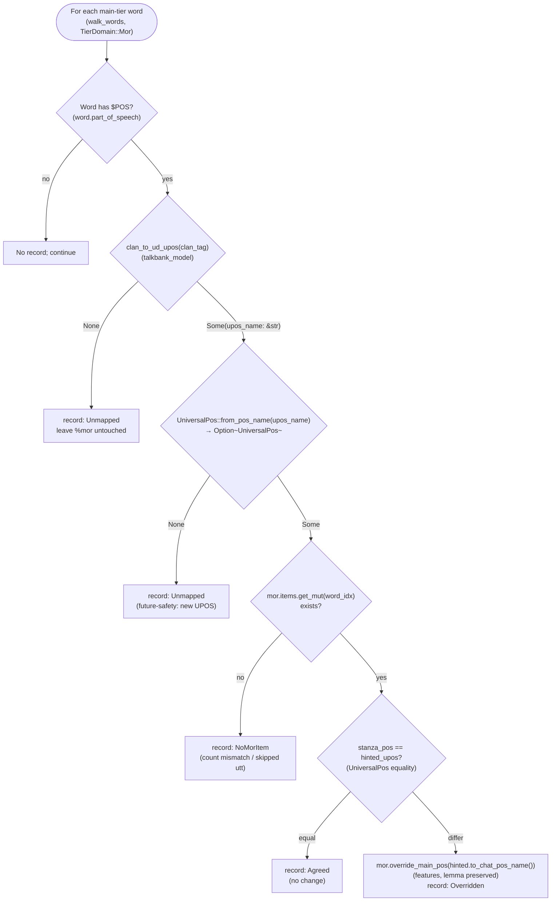
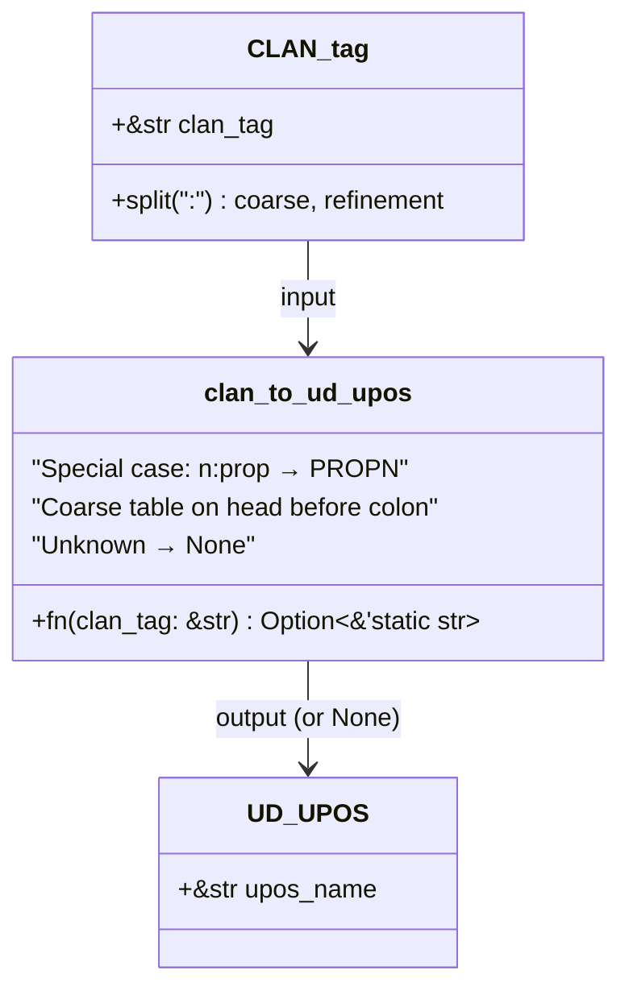

# Transcriber `$POS` Hints

**Status:** Reference — default on; opt out via `--no-pos-hints`
**Last updated:** 2026-05-21 08:40 EDT

CHAT main-tier words may carry a `$POS` suffix that encodes the
transcriber's part-of-speech annotation in CLAN-MOR conventions
(e.g. `school@s:eng$n`, `जब@s:hin$adv:temp`, `कि@s:hin$comp`). By
default the morphotag pipeline treats those hints as authoritative
POS evidence: after Stanza produces `%mor`, each hinted word's POS
category is compared against the transcriber's CLAN tag, and the
`%mor` POS is overridden on disagreement. Lemma and morphological
features from Stanza are preserved — only the POS category changes.

Pass `--no-pos-hints` on any `morphotag` invocation to suppress the
post-pass and keep Stanza's POS decisions as-is.

## Why the feature exists

Aggregate L2 eval has identified `FeaturePosMismatch` as the dominant
structural error class — cases where a finite verb in the embedded
language is tagged as `NOUN`, `PROPN`, or `CCONJ` because the primary
model's deprel constrains the merge away from `VERB`. A Hindi POC
observed the same pattern on matrix-language Hindi function words
(`हाँ` tagged `pron` rather than `intj`; `ना` tagged `pron` rather
than `part`).

In both regimes, when the transcriber has bothered to annotate a
word's POS with `$n`, `$v`, `$adv`, etc., they are encoding
linguistic knowledge Stanza lacks — either because the word is
low-resource, domain-mismatched, or embedded in a construction the
UD parser's deprel constraints don't cover. Honoring those hints is
a cheap, near-zero-risk correction when hints disagree with Stanza.

## Where it sits in the pipeline

The hint post-pass runs after the L2 secondary dispatch and splice,
before post-validation and serialization. This placement is
deliberate: the hint pass works on the final `%mor` state regardless
of whether the value came from the primary Stanza run, the L2
secondary dispatch, the phrasal-verb Priority 0 merge, or a fallback
to `L2|xxx`.

```mermaid
flowchart TD
    A["Parse CHAT\n(parse_lenient)"] --> B["Extract primary payloads\n(collect_payloads)"]
    B --> C["Stanza primary inference\n(infer_batch, per-language)"]
    C --> D["Inject %mor + %gra\n(inject_morphosyntax)"]
    D --> E{"L2 @s words present?"}
    E -->|yes| F["Dispatch secondary language Stanza\n(dispatch_secondary_l2)"]
    E -->|no| G["Skip L2 dispatch"]
    F --> H["Merge primary+secondary UD\n(resolve_merged_pos_with_context)"]
    H --> I["Splice merged Mor into ChatFile\n(splice_l2_into_chat)"]
    G --> J{"--no-pos-hints set?"}
    I --> J
    J -->|no (default)| K["apply_pos_hints(&mut ChatFile)\n(pos_hints::apply_pos_hints)"]
    J -->|yes| L["Skip hint post-pass"]
    K --> M["Validate alignment\n(validate_mor_alignment)"]
    L --> M
    M --> N["Serialize CHAT\n(to_chat_string)"]
```

Source verified:
`crates/batchalign/src/morphosyntax/mod.rs:72::run_morphosyntax_impl`
(orchestration entry) and
`crates/batchalign/src/morphosyntax/batch.rs:31::dispatch_secondary_l2`
(L2 dispatch);
`crates/batchalign-transform/src/morphosyntax/pos_hints.rs:36::apply_pos_hints`;
`crates/batchalign-transform/src/morphosyntax/l2/splice.rs:405::splice_l2_into_chat`.

## Per-hint decision flow

For every main-tier word in every utterance, the pass asks four
questions in order: is there a hint? does the CLAN tag map to a UD
UPOS? is there a `%mor` item to modify? does the UPOS disagree with
Stanza? The flow runs exactly once per word and is
pure — no Stanza re-invocation, no network I/O.



Source verified: `crates/batchalign-transform/src/morphosyntax/pos_hints.rs`
(`apply_pos_hints`, `resolve_hint` internal helper uses `UniversalPos::from_pos_name` and `UniversalPos::to_chat_pos_name`).

## The CLAN → UD UPOS table

The mapping lives in `talkbank-model` so it is a cross-cutting
artifact useable outside this feature (parity audits, CLAN-vs-UD
reconciliation, future tools):



Source verified: `talkbank-tools/../chatter/crates/talkbank-model/src/model/dependent_tier/mor/analysis/clan_ud_mapping.rs`.

Coverage (see the `#[test]` suite in `clan_ud_mapping.rs` for the
exhaustive list):

| CLAN tag family | UD UPOS | Notes |
|---|---|---|
| `n` | NOUN | |
| `n:prop` | PROPN | refinement crosses UPOS boundary |
| `n:gerund`, `n:deverbal`, … | NOUN | other `n:*` refinements stay NOUN |
| `v` | VERB | |
| `adj`, `adj:att`, … | ADJ | |
| `adv`, `adv:temp`, … | ADV | |
| `pro`, `pro:per`, `pro:dem`, `pro:sub`, `pro:int`, `pro:rel` | PRON | subtype isn't tracked in UPOS |
| `det`, `det:dem`, `det:poss`, `det:art` | DET | |
| `prep`, `post` | ADP | postpositions for Hindi/Tamil/etc. |
| `conj` | CCONJ | default coordinating |
| `comp` | SCONJ | complementizer (e.g. `कि`, "that") |
| `part` | PART | |
| `mod`, `aux` | AUX | |
| `qn` | DET | UD has no separate quantifier UPOS |
| `num` | NUM | |
| `co`, `int`, `intj` | INTJ | |
| `sym` | SYM | |
| `punct`, `cm`, `end`, `beg` | PUNCT | |
| anything else | None | unmapped — hint ignored |

## CLI usage

Morphotag has no `--lang` flag. Each file's processing language is read
from its own `@Languages:` header. The examples below assume the input
file's header declares the appropriate language (e.g. `@Languages: hin`
for Hindi).

```bash
# Default behavior — hints respected automatically.
batchalign3 morphotag input.cha --output out/

# Opt out for a single job:
batchalign3 morphotag --no-pos-hints input.cha --output out/

# `--no-pos-hints` is orthogonal to --retokenize, --skipmultilang,
# --no-l2-morphotag, etc.
batchalign3 morphotag \
    --no-pos-hints \
    --no-l2-morphotag \
    --lang eng \
    input/
```

With hints on (the default), every `$POS`-carrying word in every
utterance is considered. The pass is idempotent — running twice on
the same input produces the same output, because the second run sees
every hint as an Agreement.

## What gets preserved

| Field | Preserved? |
|---|---|
| Main tier (word order, `@s` tags, `$POS` suffixes, markup) | ✓ unchanged |
| `%mor` lemma (`MorStem`) | ✓ Stanza value kept |
| `%mor` features (tense, case, number, gender, …) | ✓ Stanza value kept |
| `%mor` POS category | **overwritten on disagreement** |
| `%gra` relations | ✓ unchanged |
| Post-clitics (`~aux|be` after `pron|it`) | ✓ unchanged (outer item only gets POS override) |
| `%xmor`, `%xgra`, `%com`, `%eng` and other user tiers | ✓ unchanged |

The pass never adds, removes, or reorders words or tiers. It only
mutates the single `PosCategory` string on `%mor` items whose paired
main-tier word has a disagreeing `$POS`.

## Known limitations

1. **Only applies to utterances with a `%mor` tier.** If Stanza
   skipped an utterance due to MOR-vs-main count mismatch (MWT,
   comma-handling, etc.), no `%mor` exists, so no hint can apply.
   The hint pass records these as `NoMorItem` but takes no action.
   On the Hindi POC 36% of utterances fell into this category — a
   bigger quality issue than the hint feature addresses.
2. **Unknown CLAN tags are silent.** The mapping is intentionally
   conservative: unknown tags return `None`, the record is logged
   as `UnmappedCLAN`, and Stanza's POS is kept. Widening the
   mapping is a matter of adding entries to
   `clan_ud_mapping.rs` and the corresponding unit tests.
3. **Refinements don't become UD features.** `$pro:dem` could
   plausibly propagate `PronType=Dem` to `%mor` features, but today
   only POS category is overridden. A future revision could handle
   refinements → features.
4. **Transcriber errors propagate.** If the transcriber wrote `$v`
   on a word Stanza tagged `DET` with full determiner features, the
   hint wins and produces `verb|the…Det-features`. A cross-check
   warning (feature vs POS consistency) is a candidate followup.
5. **No `%gra` deprel upgrade.** Changing a word's POS can make its
   `%gra` deprel inconsistent (e.g., `NOUN` → `VERB` on an item with
   deprel `OBJ`). Today we leave the deprel as-is; the cross-check
   is deferred.

## Current state

The hint pass is **default on**, with `--no-pos-hints` available as
the per-invocation opt-out. A future phase may remove the flag
entirely after wide corpus observation without regression reports.

The hint pass is narrow (POS-only overrides, Stanza features and
lemma preserved) and idempotent. If the default-on behavior produces
regressions in practice, `--no-pos-hints` provides immediate
per-invocation relief while a fix is prepared.

## Related documentation

- [L2 Morphotag design](l2-morphotag.md) — the feature the hint pass
  augments; `$POS` hints are a merge-algorithm-adjacent signal, not
  an L2-specific one.
- [L2 Morphotag Status](l2-morphotag-status.md) — L2 feature overview.
- `talkbank-tools/../chatter/crates/talkbank-model/src/model/dependent_tier/mor/analysis/clan_ud_mapping.rs`
  — the mapping source of truth.
- `crates/batchalign-transform/src/morphosyntax/pos_hints.rs`
  — the applicator source.

## Reproducing the POC evidence

The Hindi POC used a twin morphotag run (stock vs prototype) on a
100-utterance sample of Devanagari-converted classroom speech.
Reproduce by routing language per-file from the `@Languages:` header
(morphotag has no `--lang` flag, per
`crates/batchalign/src/cli/args/commands.rs:365-370`):

```bash
# 1. Stock run (hints disabled — the old pre-default behavior).
#    The sample-100-devanagari.cha @Languages: header drives routing.
batchalign3 morphotag --no-pos-hints sample-100-devanagari.cha \
    --output stock/ --sequential --workers 1

# 2. Hint-respecting run (current default)
batchalign3 morphotag sample-100-devanagari.cha \
    --output proto/ --sequential --workers 1

# 3. Diff the two outputs at the %mor tier level using diff/grep on
#    the .cha files, or write a small comparator against the
#    `chatter to-json` output.
```

On that sample: 5 POS overrides out of 26 hints applied; 3 of 5
unambiguously correct; 2 defensible; zero regressions.
