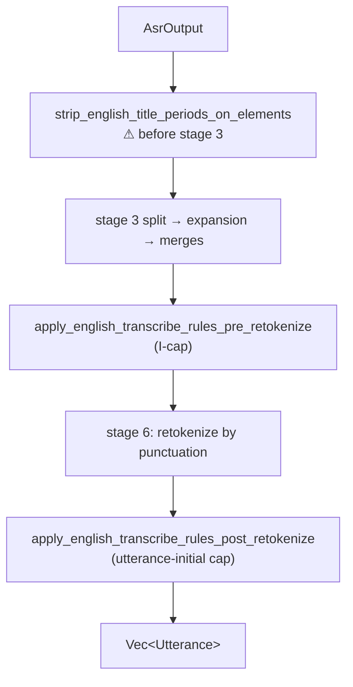

# Retokenization: Overview

**Status:** Current
**Last updated:** 2026-05-19 14:18 EDT

Retokenization in BA3 refers to **two distinct transformations** that
happen to share the name. A reader encountering "retokenization" in
BA3's codebase or in this book may be looking at either. This
chapter names them, routes the reader to the right reference
chapter for each, and then documents the per-language coverage gap.

## The two meanings

### ASR-stream retokenization

- **When it runs:** at transcribe time, as Stage 6 of the ASR
  post-processing pipeline.
- **What it does:** splits the raw ASR token stream into utterances
  by punctuation boundaries. Consumes `Vec<AsrWord>`, produces
  `Vec<Utterance>`.
- **Input shape:** ordered ASR words from a provider (Rev.AI,
  Whisper, etc.) with timestamps.
- **Output shape:** speaker-attributed utterances ready for CHAT
  assembly.
- **Source:** `crates/batchalign-transform/src/asr_postprocess/mod.rs`
  function `retokenize()` (around line 872).
- **Always on:** every transcribe run goes through this stage.
- **Reference:** `architecture/asr-token-pipeline.md` §Stage 6.

### Morphosyntax retokenization

- **When it runs:** at morphotag time, only when the user passes
  `--retokenize` (vs the default `--keeptokens`).
- **What it does:** reshapes CHAT utterance words to match Stanza's
  tokenization. Splits contractions, merges compounds, updates
  `%mor`/`%gra` alongside.
- **Input shape:** CHAT AST `Utterance` + Stanza output (tokens +
  MWT + UD annotations).
- **Output shape:** mutated `Utterance` with new word boundaries
  and injected morphosyntax tiers.
- **Source:** `crates/batchalign-transform/src/retokenize/` module
  (entry point `retokenize_utterance()` in `mod.rs`).
- **Gated:** opt-in via `--retokenize` CLI flag.
- **Reference:** `reference/morphotag-retokenization.md` (primary),
  `reference/mwt-handling.md` (MWT mechanics foundational to both
  Preserve and Retokenize modes).

### Visualizing the distinction

```mermaid
flowchart LR
    subgraph TranscribeTime["transcribe command (always)"]
        ASR["Rev.AI / Whisper tokens"] --> Clean["talkbank-transform<br/>asr_postprocess/mod.rs<br/>stages 1–5"]
        Clean --> ASRRetok["Stage 6: retokenize()<br/>split by punctuation"]
        ASRRetok --> Disfl["stages 7–8<br/>disfluency, retrace"]
        Disfl --> CHAT["CHAT file on disk"]
    end
    subgraph MorphotagTime["morphotag --retokenize (opt-in)"]
        CHAT2["CHAT file on disk"] --> Parse["parse_lenient()"]
        Parse --> Worker["Stanza worker:<br/>tokenize, pos, lemma, mwt"]
        Worker --> MorphRetok["talkbank-transform<br/>retokenize_utterance()<br/>reshape CHAT to match Stanza"]
        MorphRetok --> Inject["inject %mor / %gra"]
        Inject --> CHATOut["CHAT file on disk"]
    end
    CHAT -.->|"days or years later"| CHAT2
```

The two are **composable but unrelated**. A file transcribed today
(running ASR-stream retokenization) can be morphotagged months
later with or without `--retokenize`; they share no code path.

## Per-language coverage

The rest of this chapter focuses on morphosyntax retokenization,
because that's where the per-language complexity lives. ASR-stream
retokenization is language-agnostic (it operates on punctuation
boundaries).

BA3's morphosyntax retokenization inherits its per-language
competence from three sources, in order of leverage:

1. **Stanza's native models and MWT processor**: per-language
   neural tokenizers ship with each Stanza model. ~45 of the
   languages Stanza supports have an MWT processor.
2. **BA3's Rust per-language overrides**: morphology-level patches
   on Stanza's UD output (POS/lemma corrections, case features).
   Live in `crates/batchalign-transform/src/morphosyntax/lang_{en,fr,it,ja}.rs`.
3. **BA3's Python tokenizer realignment postprocessor**,
   `batchalign/inference/_tokenizer_realign.py`, a character-DP
   realigner that forces Stanza to respect BA3's pre-tokenized
   input. Mostly language-agnostic; one English-specific
   contraction hint rule.

A fourth layer existed in batchalign2 at the `jan9` snapshot but
was dropped in the rewrite:

4. **BA2's `tokenizer_processor()` + `auxiliaries` joining pass**,
   a hand-coded per-language tokenization override layer that
   expanded polyapostrophic contractions, joined clitics to hosts,
   and patched Stanza's mis-splits for Italian, French, Portuguese,
   and English. **Absent in BA3.**

### What moved where

Morphology-patching tables were fully ported from BA2 to BA3:

| BA2 file | Role | BA3 location |
|----------|------|--------------|
| `morphosyntax/en/irr.py` (170 verbs) | Past-tense irregularity flag | `talkbank-transform/morphosyntax/lang_en.rs::IRREGULAR_VERBS` |
| `morphosyntax/fr/case.py` | Nominative/accusative pronoun lists | `talkbank-transform/morphosyntax/lang_fr.rs::{PRON_NOM, PRON_ACC}` |
| `morphosyntax/fr/apm.py` + `fr/apmn.py` (158) | Auditory plural marking | `talkbank-transform/morphosyntax/lang_fr.rs::APM_NOUNS` |
| `morphosyntax/ja/verbforms.py` (50+ patterns) | Verb-form POS/lemma patches | `talkbank-transform/morphosyntax/lang_ja.rs` |
| Cantonese normalization (Python OpenCC) | OpenCC `s2hk` + 31 domain replacements | `talkbank-transform/asr_postprocess/cantonese.rs` (Rust `ferrous-opencc` + domain table) |

These ports were faithful; the underlying semantics carry over.

### What was dropped

BA2's tokenization-override layer was not ported. Specifically, the
following BA2 rules have **no BA3 equivalent**:

| BA2 rule | Phenomenon | BA2 location |
|----------|-----------|--------------|
| French `jusqu'` / `puisqu'` / `quelqu'` / `aujourd'hui` | Elision-prefix clitic handling | `ud.py:422-431`, `684-693` |
| French polyapostrophic splitter (`d'l'attraper`) | Multi-level apostrophe expansion | `ud.py:684-693` |
| French `c'est` / `l'ami` / `qu'il` preservation | Basic clitic elision | via `auxiliaries` pass |
| Italian `ll'` / `gliel'` / `d'` / `c'` / `qual'` / `l'` | Clitic + host joining | `ud.py:410-419` |
| Italian `le + i → lei` repair | Stanza mis-split fix | `ud.py:667-672` |
| Portuguese `d'água` | Idiomatic MWT force | `ud.py:673-674` |
| English apostrophe join (except `o'clock`) | Contraction handling | `ud.py:694-697` |

BA3's working assumption was that Stanza's native MWT processor
would handle these. In practice Stanza handles some correctly
(French `au`, Italian `dello`) but not others.

### The Italian xfails: where we know BA3 is worse than BA2

`batchalign/tests/investigations/_cases/italian.py` carries 8 xfail
cases pinned with defect slugs `stanza-it-verb-clitic-pos-split`
and `stanza-it-la-sentence-initial-split`:

| Case | Stanza behavior | BA2 would have |
|------|----------------|----------------|
| `dell_opera_in_context` | `parla` → `par` + `la` (fake lemma), 4 UD for 3 CHAT | Joined via `auxiliaries` |
| `parla_3sg_storia_context` | `la` → `il` + `i`, 7 UD for 6 CHAT | Handled via `le+i → lei` repair family |
| `parla_imperative_forte` | Sentence-initial `parla` splits even with no clitic | Rejected by `auxiliaries` rules |
| `arancione_noun_bogus_verb` | Noun `arancione` → `arancio` + `ne` (fake verb+clitic) | Wouldn't apply, `arancione` not in clitic list |
| `piccolo_adj_bogus_verb` | Adjective `piccolo` → `picco` + `lo` | Same |
| `gomitolo_noun_bogus_verb` | Noun `gomitolo` → `gomito` + `lo` | Same |
| `divano_noun_bogus_verb` | Noun `divano` → `diva` + `no` (invalid clitic ending) | Same |

These are pinned as "known Stanza limitations" but the BA2
perspective is that we had a working defense and gave it up.

### The test-coverage compound problem

Beyond the logic gap, default CI doesn't probe per-language
tokenization at all. The investigation probe matrix
(`batchalign/tests/investigations/_cases/`) covers French, Italian,
Portuguese, Dutch, Spanish, German for clitic / MWT phenomena,
but every case is `@pytest.mark.golden`, so `make test` and
default `uv run pytest` skip them.

A contributor can break BA3's handling of `c'est` or `d'água`
tomorrow, push the change, and nothing in default CI will notice.
The probes exist but are on-demand.

## Current work: gap investigation

A gap investigation is underway. Summary of the phased approach:

- **Phase 0, Investigation** (complete): cataloged BA2 overrides,
  BA3 ported vs absent tables, test-coverage state.
- **Phase 1, Book docs** (this chapter): distinguish the two
  retokenizations, document the per-language gap.
- **Phase 2, Extend the Stanza decision-probe harness** (v2):
  add a token-count `Gold` and new `CandidateClass` variants for
  the absent rule families.
- **Phase 3, Seed probes** for every BA2 rule family across
  every language BA3 supports (not only BA2-covered ones).
- **Phase 4, Adjudicate per rule**: decide port / replace /
  drop with evidence. Use the Q-B ruling (Stanza POS >
  hand-judgment gold) as the calibration standard.
- **Phase 5, Implement** only the rules adjudication demands,
  in the most principled home available (Stanza postprocessor
  extension, per-language Rust reconciler, or user lexicon).
- **Phase 6, Graduate** locked regression probes out of the
  `@pytest.mark.golden` tier into default CI.

The program covers **all languages BA3 supports**, tiered by
evidence strength:

- Tier A: English, French, Italian, Portuguese, Japanese, where
  BA2 had explicit rules.
- Tier B: Spanish, German, Dutch, Catalan, Polish, Romanian,
  Greek, Russian, Turkish, Arabic, Hebrew, Chinese, etc.,
  Stanza-MWT-supported, no BA2 precedent.
- Tier C: remaining languages with minimal Stanza support, probe
  for minimal tokenization correctness only.

## CHAT provenance emission

Two questions about whether retokenization should emit CHAT
provenance annotations:

- **`[: replacement]` annotations on retokenization-induced word
  changes**: neither BA2-jan9 nor BA3 emitted these; silent
  mutation is the status quo. The partial exception is the
  `(elided)` parens convention (e.g. `'cause` → `(be)cause`)
  which is already shipping as a lightweight form of provenance
  for contraction cases. No change planned.

- **`[= explanation]` annotations for expanded acronyms, numbers,
  etc.**: deferred indefinitely. Reviewers have flagged visual
  clutter when these annotations are dense. Silent mutation
  remains the norm; BA3 architecture should keep a
  "provenance-emit" mode possible as a future opt-in, but not
  bake it in now.

Both decisions prefer reader-friendly output over
machine-auditable provenance. Implementations of new
normalization rules (period stripping, I-cap, etc.) mutate word
forms directly without emitting annotations.

### Transcribe-time English orthographic rules

Three English orthographic corrections live in the transcribe
pipeline as narrow hooks inside the ASR post-processing stages.
They are *not* part of morphosyntax retokenization, they run at
transcribe time, before Stage 6, and are gated on `lang == "eng"`.
Full spec, allowlists, and probe-verdict citations live in
[English Transcribe Corrections](english-transcribe-corrections.md).

The position of each hook is load-bearing: title-period MUST
precede stage 3's `.`-separator split (otherwise `Dr.` fragments
before the allowlist sees it); I-cap sits on per-word chunks; the
utterance-initial cap runs *after* retrace detection so it can
skip `WordKind::Retrace` copies and land on the "real" first word.

## Open questions

- **ReplacedWord / AnnotatedWord splits**: today retokenize cannot
  split inside a replacement (1:1 text replacement only; see
  `crates/batchalign-transform/src/retokenize/rebuild.rs`). A future
  per-language fix that needs to split inside an annotation must
  first lift this constraint.

- **Stale `%wor` after retokenize**: per
  `architecture/asr-token-pipeline.md`, `%wor` is a timing-
  annotation tier; re-tokenizing the main tier invalidates its
  bullet alignment. Today this is documented and accepted. A
  stricter retokenization program might need to regenerate `%wor`
  or surface a warning.

- **Hebrew 1-to-n mismatch:** Stanza's Hebrew MWT fires under our
  postprocessor, producing 1-to-2 or 1-to-3 UD-word splits for
  prefixed forms. No other probed language shows this. Worth a
  Hebrew-corpus investigation to determine whether downstream code
  actually breaks on these counts; if so, Hebrew may need a
  per-language postprocessor override.

- **Italian Defect 6/7/8 family**: *partially resolved*.
  A Rust-side reconciler ships in
  `crates/batchalign-transform/src/morphosyntax/lang_it.rs` covering two
  allowlist families:
  `IT_MIS_SPLIT_OVERRIDES` (`parla`, `arancione`, `piccolo`,
  `gomitolo`, `divano`, `la`) collapses Stanza's bogus
  `UdId::Range` expansions back onto the single CHAT word.
  `IT_COMPOUND_IMPERATIVES` (`dammela`, `dammelo`, `prendilo`,
  `prendila`, `prendili`, `prendile`) keeps genuine compound
  imperatives as one word in CHAT while preserving Stanza's
  component POS/lemma on the collapsed MOR. Remaining follow-up:
  `mettere`-family lemma quality, dative `-glie-` stacks, 2pl
  imperatives, multi-chunk Defect 8 decomposition. See
  [Italian language reference](languages/italian.md) and
  [Stanza limitations](stanza-limitations.md) for the full
  shipped state and deferred work.

## Cross-references

- `reference/morphotag-retokenization.md`: primary morphosyntax
  retokenization chapter
- `reference/mwt-handling.md`: Multi-word token mechanics
  (foundation for both Preserve and Retokenize modes)
- `reference/stanza-limitations.md`: the xfailed Italian cases
  and other pinned Stanza defects
- `architecture/asr-token-pipeline.md`: ASR-stream retokenization
  (Stage 6)
- `architecture/preprocessing-postprocessing.md`: pipeline
  orchestration
- [Dynamic Programming](../../architecture/parser-and-grammar/dynamic-programming.md)
 , why morphosyntax retokenize uses deterministic span-join rather
  than character DP (intentional simplification)
