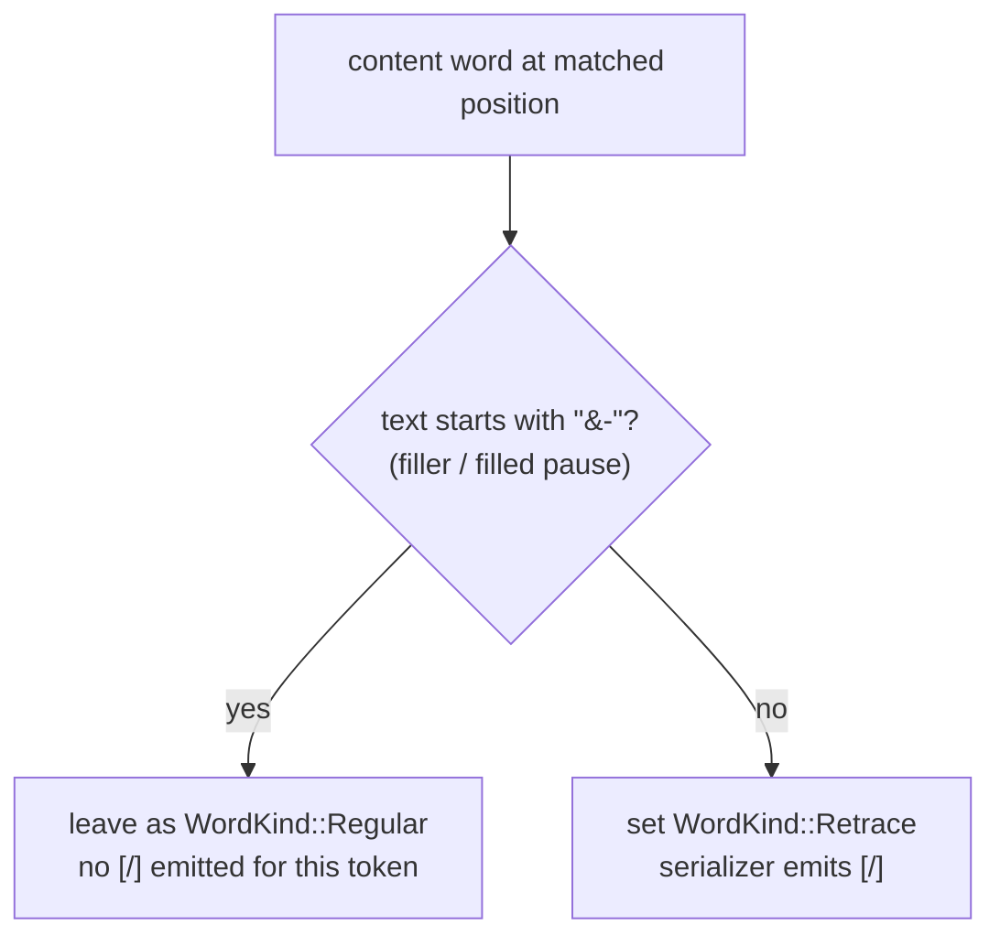
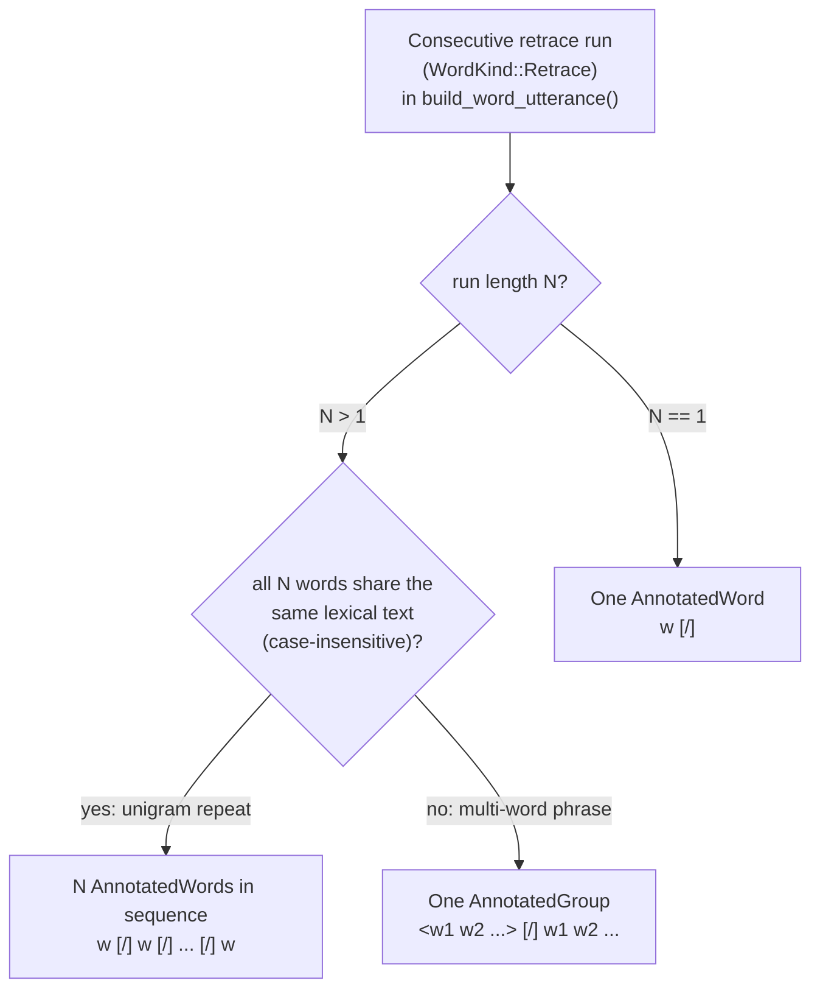

# Retrace Detection

**Status:** Current behavior reference
**Last verified:** 2026-05-21 15:20 EDT

This page documents how current batchalign retrace detection works. It does not
preserve branch-era side-by-side implementation archaeology.

## CHAT convention

CHAT marks repeated word sequences with `[/]` for partial retracing. The
angle-bracket form denotes a repeated **phrase** (a multi-word unit); a
run of identical single-word repetitions uses separate `[/]` markers:

- single-word retrace: `the [/] the dog .`
- repeated single word: `a [/] a [/] a side of the point .`
- multi-word phrase retrace: `<I want> [/] I want a cookie .`

Angle brackets are only used when two or more **different** words have
been repeated together as a phrase.

## Current detection rule

Retrace detection uses sliding-window repeated-sequence matching over the
lexical content words of an utterance, with language-specific safeguards
such as a higher minimum n-gram length for Chinese and Cantonese. The
comparison is case-insensitive: the detector lowercases a comparison key
per content word (`content_keys` in `apply_retrace_detection`) while the
stored word text keeps the case that the ASR provider returned, so CHAT
output continues to show `"I [/] I"` rather than `"i [/] i"`.

## Fillers do not produce retrace markers

Filled pauses (`&-um`, `&-uh`, `&-ur`: any token carrying the `&-`
prefix after stage 7 disfluency replacement) **participate in n-gram
matching** but are **never re-typed to `WordKind::Retrace`**. A bare
repetition of fillers is filler behavior, not a false start, and is
emitted as plain fillers with no `[/]` marker.

Worked examples:

| Input (post-disfluency)  | Retrace marks set | CHAT output              |
|--------------------------|-------------------|--------------------------|
| `&-um &-um I went`       | none              | `&-um &-um I went .`     |
| `I I went`               | first `I`         | `I [/] I went .`         |
| `&-um I &-um I went`     | first `I` only    | `&-um I [/] &-um I went .` (bigram repeat detected; the fillers embedded in the match stay as fillers) |

The gate lives at the marking step in `apply_retrace_detection`
(`crates/batchalign-transform/src/asr_postprocess/cleanup.rs`), using the
`is_filler(text)` helper that checks the `&-` prefix. `WordKind` does
not carry a dedicated filler variant; disfluency replacement (stage 7)
rewrites `um` to `&-um` before retrace detection runs, so the prefix is
the stable filler marker for this check.

## Current implementation properties

The current implementation is structured to avoid two common older failure
modes:

- larger repeated spans are preferred over smaller fragmentary matches
- overlap-safe claiming prevents the same region from being marked repeatedly by
  conflicting matches

## Current formatting rule

Retrace formatting is structure-driven. The serializer reads the
consecutive run of `WordKind::Retrace` words in each utterance and emits
one of three shapes:

Three worked examples:

| Input (main-tier words)    | Run shape | CHAT output         |
|----------------------------|-----------|---------------------|
| `the the dog`              | N=1       | `the [/] the dog`   |
| `a a a side`               | N=2, same | `a [/] a [/] a side`|
| `I want I want a cookie`   | N=2, diff | `<I want> [/] I want a cookie` |

Bracket choice follows the structured representation rather than ad-hoc
string postprocessing. Verified against
`build_word_utterance()` in
`crates/batchalign-transform/src/build_chat/utterances.rs` and
`apply_retrace_detection()` in
`crates/batchalign-transform/src/asr_postprocess/cleanup.rs`.

## Known limits

- current retrace detection targets exact repetition, not richer reformulation
  analysis such as `[//]`
- non-lexical or already-heavily-annotated content may reduce what can be
  recognized as a retrace candidate
- overlap-heavy or highly noisy utterances may still require manual review

## Legacy note

Earlier versions of this page compared older Python and newer Rust
implementations in detail. For public docs, the important point is the current
behavioral contract: retraces are detected structurally and formatted from
structure, not by fragile detokenize-time heuristics.
