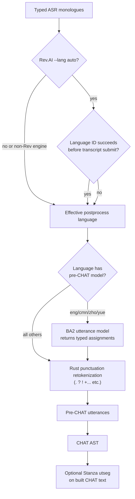

# Utterance Segmentation

**Status:** Current
**Last updated:** 2026-05-05 08:21 EDT

Utterance segmentation splits continuous ASR output into individual utterances
for CHAT transcription. This is a critical step — CHAT requires one utterance
per line, each terminated by a sentence-ending punctuation mark.

One important subtlety: the segmentation language and the upstream ASR request
language are related but not identical. For Rev.AI `--lang auto`, BA3 can reach
the English utterance model in two different ways:

1. Rev language ID succeeds before transcript submission, so the request itself
   becomes the explicit-English path.
2. Rev language ID fails, BA3 submits a true auto request, and only later
   resolves the returned transcript language to English for downstream
   segmentation.

Both branches can eventually run the English BA2 utterance model. Only the
first branch is provider-request-equivalent to explicit `--lang eng`.

## Three Mechanisms

batchalign3 has three utterance segmentation mechanisms:

1. **Pre-CHAT utterance models** — BA2-style token-classification models that
   predict utterance boundaries from typed ASR word lists before CHAT exists.
   Available for 3 language families / 4 supported codes (`eng`, `cmn`, `zho`,
   `yue`).
2. **Punctuation-based fallback** — Rust-side retokenization over typed ASR
   words. Used for unsupported languages and as cleanup after model-backed
   segmentation.
3. **Stanza utterance segmentation (`utseg`)** — a separate text-task
   refinement stage that runs on already-built CHAT text.



## BERT Utterance Models

| Language | Code | Model | Source | Architecture |
|----------|------|-------|--------|--------------|
| English | eng | `talkbank/CHATUtterance-en` | TalkBank fine-tuned | BERT token classification |
| Mandarin | cmn/zho | `talkbank/CHATUtterance-zh_CN` | TalkBank fine-tuned | BERT token classification |
| Cantonese | yue | `PolyU-AngelChanLab/Cantonese-Utterance-Segmentation` | Hong Kong Polytechnic | BERT token classification |

These models predict utterance-boundary actions as a token classification task.
In BA3, Python model inference stays token-based and returns typed
word-assignment groups to Rust; Rust then applies those assignments to the
prepared ASR chunks without round-tripping through ad hoc sentence strings.

Both standalone `utseg` and `transcribe`'s pre-CHAT segmentation path resolve
through the same utterance-model resolver, so `cmn` and `zho` both select
`talkbank/CHATUtterance-zh_CN`.

For Rev.AI `--lang auto`, model selection happens after the effective language
is resolved for post-processing. That means an auto-submitted Rev transcript can
still run through the English BERT utterance model later, even if the original
provider request was not identical to explicit `--lang eng`.

### Cantonese Model Details

The Cantonese model uses character-level tokenization (each Chinese character
is a separate token) and predicts 6 action classes:

| Class | Meaning |
|-------|---------|
| 0 | Normal (continue) |
| 1 | Capitalize next |
| 2 | Period (.) |
| 3 | Question mark (?) |
| 4 | Exclamation mark (!) |
| 5 | Comma (,) |

Before feeding text to the model, Cantonese-specific preprocessing runs:
- Strip punctuation: `.` `,` `!` `！` `？` `。` `，` `?` `（` `）` `：` `＊`
- Split on Cantonese sentence-final particles: 呀, 啦, 喎, 嘞, 㗎喇, 囉, 㗎, 啊, 嗯
- Feed each chunk to the BERT model as character-level tokens

### Memory Footprint

Each utterance model is ~400 MB. In the worker runtime it is loaded alongside
the `utseg` task so transcribe can reuse the same typed text-inference boundary
for both pre-CHAT segmentation and later CHAT-level refinement.

## Punctuation-Based Fallback

For languages without a dedicated utterance model, utterances are split by
punctuation in Rust (`crates/talkbank-transform/src/asr_postprocess/mod.rs`).

### CHAT-Legal Sentence Terminators

```
.  ?  !  +...  +/.  +//.  +/?  +!?  +"/.  +".  +//?  +..?  +.  ...  (.)
```

### Additional Normalizations

Before splitting:
- Japanese period (。) → `.`
- Spanish inverted punctuation (¿, ¡) → removed
- RTL punctuation (؟, ۔, ،, ؛) → ASCII equivalents

### Split Rules

1. If a word **is** a terminator → flush the current utterance
2. If a word **ends with** a terminator character → split the word, flush
3. If no terminator is found → auto-append `.` at the end
4. Trailing morphological punctuation (‡, „, ,) is stripped before flush

### Long Turn Splitting

Before punctuation-based retokenization, monologues longer than 300 words are
split into chunks of 300. BA3 also applies a long-pause fallback split before
retokenization so clearly separated runs are not forced into one giant
utterance when provider punctuation is missing.

## Stanza Utterance Segmentation (CHAT-text path)

Separately from ASR post-processing, the `utseg` NLP task can also use
**Stanza's constituency parser** to predict utterance boundaries during
standalone `utseg` processing on already-built CHAT text. On the live worker
boundary, Rust freezes a prepared-text batch and dispatches
`execute_v2(task="utseg")`. For model-backed languages, Python may return
direct typed assignments; for the Stanza path it returns raw constituency trees
and Rust computes assignments locally.

**Not all languages have constituency parsing.** Stanza has constituency
models for ~11 languages (en, de, es, it, pt, da, id, ja, tr, vi, zh-hans).
For other languages (e.g. Dutch, Polish, Russian), the utseg config builder
omits the constituency processor and falls back to sentence-boundary
segmentation. This is handled automatically by the Stanza capability table
(`batchalign/worker/_stanza_capabilities.py`), which reads Stanza's
`resources.json` to discover per-language processor availability.

This is a different mechanism from the pre-CHAT utterance models above — it
operates on already-built CHAT text and can refine boundaries using syntactic
structure. The user-facing surface for this path is the standalone `utseg`
command; `transcribe` uses the pre-CHAT utterance models when available.

## Why Only 3 Languages Have Models

Training utterance segmentation models requires large amounts of annotated
conversational data with gold-standard utterance boundaries. TalkBank has
this for English (extensive CHILDES/TalkBank corpora), Mandarin (growing
corpus), and Cantonese (PolyU research corpus).

For other languages, the punctuation-based fallback produces acceptable
results because ASR models (especially Whisper) tend to insert punctuation at
natural utterance boundaries. The main limitation is run-on speech without
clear sentence structure — the fallback will produce fewer, longer utterances.

## Adding a New Language Model

To add utterance segmentation for a new language:

1. Collect annotated conversational data with utterance boundaries
2. Fine-tune a BERT token classification model (6 classes: normal, capitalize,
   period, question, exclamation, comma)
3. Upload to HuggingFace Hub
4. Add the model-loading hook in `batchalign/worker/_model_loading/utterance.py`
5. Add any language-specific preprocessing (e.g., character-level tokenization
   for CJK, particle-based chunking)

## Source Files

| File | Purpose |
|------|---------|
| `batchalign/src/asr_postprocess/mod.rs` | Typed ASR normalization + punctuation retokenization |
| `batchalign/models/utterance/infer.py` | BA2-style utterance model runtime |
| `batchalign/worker/_model_loading/utterance.py` | Utterance model bootstrap |
| `batchalign/inference/utseg.py` | Worker-side utseg dispatch (typed assignments or Stanza trees) |
