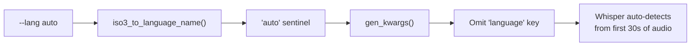

# Whisper Usage in Batchalign

**Status:** Current
**Last updated:** 2026-04-06 11:01 EDT

## Overview

Whisper is used in three distinct roles within batchalign:

1. **Transcription (ASR)** -- Converting audio to text via the `transcribe` command
2. **Forced Alignment (FA)** -- Using Whisper's encoder cross-attention for
   word-level timestamp alignment via the `align` command
3. **Utterance Timing Recovery (UTR)** -- Re-transcribing audio to improve
   forced alignment quality, automatically added by the `align` command

Each role loads a separate model instance.  In a full `align` pipeline, two
Whisper models may be loaded simultaneously (FA + UTR).

## ASR Engines

There are four ASR engines.  **Rev.AI is the production default** -- the three
Whisper variants are local alternatives for when a commercial API is not wanted.

### Rev.AI (default)

```bash
batchalign3 transcribe input/ output/ --lang=eng
```

- Rev.AI is no longer implemented in `inference/asr.py`
- Uses the Rev.AI commercial HTTP API through the Rust native client
  (`crates/batchalign/src/revai/`, wired from `crates/batchalign/src/revai/`)
- Supports speaker diarization natively
- Requires an API key (`batchalign3 setup` or `~/.batchalign.ini`)
- No local model loading, no GPU needed

### OpenAI Whisper (`--asr-engine whisper-oai`)

```bash
batchalign3 transcribe input/ -o output/ --asr-engine whisper-oai --lang=eng
```

- OAI Whisper engine in `inference/asr.py` (`_infer_whisper()` with OAI backend)
- Uses OpenAI's official `whisper` Python library directly
- **Hardcoded to "turbo" model** -- ignores language-specific model resolution
- Converts Whisper segments/words output to Rev.AI-style JSON internally
- Current Rust CLI default is `--asr-engine rev` when no ASR override is given.
- The internal engine string remains `whisper_oai` where engine registries or
  typed option payloads refer to engine names.

### HuggingFace Whisper (`--asr-engine whisper`)

```bash
batchalign3 transcribe input/ -o output/ --asr-engine whisper --lang=eng
```

- HuggingFace Whisper engine in `inference/asr.py` (`_infer_whisper()`)
- Uses HuggingFace `transformers.pipeline("automatic-speech-recognition")`
- Loads via `load_whisper_asr()` in `inference/asr.py` (returns `WhisperASRHandle`)
- Uses language-specific model resolution (see below)
- Supports `bfloat16` (CUDA) with `float16` fallback
- Chunk length 25s with 3s stride for long files
- Device selection: CUDA > CPU (`MPS` is intentionally excluded; see
  `developer/apple-mps-workarounds.md`)

### WhisperX (`--asr-engine whisperx`)

```bash
batchalign3 transcribe input/ -o output/ --asr-engine whisperx --lang=eng
```

- WhisperX engine in `inference/asr.py`
- Uses the `whisperx` library (Whisper + phoneme-level forced alignment)
- **Hardcoded to `large-v2`** -- ignores model resolution
- Loads both a transcription model and an alignment model
- Chunked processing with fallback: 60s -> 30s -> 15s
- CUDA-only for `float16`; falls back to `float32` on CPU

## Model Selection

Language-specific model resolution lives in `inference/asr.py`:

| Language   | Model (fine-tuned)              | Base (tokenizer)          |
|------------|---------------------------------|---------------------------|
| English    | `talkbank/CHATWhisper-en`       | `openai/whisper-large-v2` |
| Cantonese  | `alvanlii/whisper-small-cantonese` | same                   |
| Hebrew     | `ivrit-ai/whisper-large-v3`     | same                      |
| `auto`     | `openai/whisper-large-v3`       | same                      |
| All others | `openai/whisper-large-v3`       | same                      |

**Only the HuggingFace Whisper engine (`--asr-engine whisper`) uses this resolution.**
The other engines have hardcoded models:

- OpenAI Whisper (`--asr-engine whisper-oai`): always `"turbo"` (via `whisper.load_model("turbo")`)
- WhisperX (`--asr-engine whisperx`): always `"large-v2"` (via `whisperx.load_model("large-v2")`)

## Auto-Detect Mode (`--lang auto`)

When `--lang auto` is passed, the `language` and `task` keys are **omitted**
from Whisper's `generate_kwargs`, allowing the model to auto-detect the spoken
language from the audio. This enables transcription of bilingual or
code-switched recordings (e.g., English/Spanish) where forcing a single
language would cause the model to skip or garble content in the other language.

```bash
batchalign3 transcribe bilingual_audio/ -o output/ --asr-engine whisper --lang auto
```

**How it works:**



**Behavior per engine:**

| Engine | `--lang auto` behavior |
|--------|----------------------|
| `whisper` (HuggingFace) | Uses `openai/whisper-large-v3` (multilingual); omits `language` from kwargs |
| `whisper-oai` | Turbo model; omits `language` from kwargs |
| `whisperx` | Uses `large-v2`; omits `language` from kwargs |
| `rev` (Rev.AI) | Rev.AI has its own auto-detection via the API |

**Limitations:**

- Whisper auto-detects from the **first ~30 seconds** of audio, so the dominant
  language in the opening segment drives detection for the whole file
- Language-specific fine-tuned models (e.g., `talkbank/CHATWhisper-en`) are
  **not used** in auto mode — the generic multilingual model is loaded instead
- Downstream stages (`morphotag`, `align`) still need an explicit language for
  their own model selection; `auto` currently applies only to ASR transcription

The TalkBank fine-tuned model (`talkbank/CHATWhisper-en`) is trained on
conversational speech with CHAT-specific patterns (utterance boundaries, speaker
overlap).

## Forced Alignment

```bash
batchalign3 align input/ output/ --lang=eng
```

- Whisper FA engine in `inference/fa.py` (`infer_whisper_fa()`)
- Loads via `load_whisper_fa()` (returns `WhisperFAHandle`)
- **Always uses `openai/whisper-large-v2`** -- no language-specific resolution
- Loads the full `WhisperForConditionalGeneration` model with `attn_implementation="eager"`
- Uses cross-attention alignment heads + dynamic time warping (DTW) to extract
  per-token timestamps
- The encoder output and DTW alignment run in Python; the DP alignment of
  Whisper tokens against CHAT words runs in Rust (`batchalign_core.add_forced_alignment`)
- Results are cached by audio chunk + text hash

### How FA Works

1. Whisper processes an audio chunk with the transcript as forced decoder input
2. Cross-attention weights are extracted from designated alignment heads
3. Attention matrix is normalized (mean/std) and median-filtered
4. Dynamic time warping aligns decoder tokens to audio frames (20ms resolution)
5. Token-level timestamps are mapped back to words
6. Current Rust FA handling matches Whisper token timings to CHAT words by
   deterministic in-order stitching; unmatched words remain explicit untimed
   slots rather than triggering transcript-wide remap.

## Utterance Timing Recovery (UTR)

UTR is **automatically added** whenever `align` is run (unless `--no-utr`).
It re-transcribes the full audio file to get word-level timestamps, then uses
those timestamps to improve forced alignment quality.

Two UTR engines exist:

### Whisper UTR (default)

- Whisper UTR in `inference/asr.py` (reuses `WhisperASRHandle` with a different model):
- Loads via `load_whisper_asr()` with UTR-specific model IDs:
  - English: `talkbank/CHATWhisper-en-large-v1` (a different fine-tune than ASR)
  - Others: `openai/whisper-large-v2`
- Results cached by audio file identity (BLAKE3 of path + size)
- Hands timed words to `batchalign_core.add_utterance_timing` (Rust)

### Rev.AI UTR (alternative)

- Rev.AI UTR uses the Rust-owned `batchalign::revai` client directly
- Same API key as the Rev.AI ASR engine
- Timed words are handled entirely in Rust (server-side)

## Post-Processing Pipeline

All ASR engines normalize their output through the Rust post-processing pipeline
in `crates/talkbank-transform/src/asr_postprocess/`:

1. **Compound word merging** -- joins words like `["ice", "cream"]` into
   `"icecream"` using a known compound list (`data/compounds.json`, 3,660 pairs)
2. **Number-to-words** -- converts digits to words using language-specific
   lookup tables (`data/num2lang.json`, 12 languages) plus Chinese/Japanese
   via `num2chinese.rs`
3. **Retokenization** into utterances:
   - With utterance engine (English, Chinese, Cantonese): uses a BERT model
     to predict utterance boundaries
   - Without: splits on punctuation (`.`, `?`, `!`, etc.)
4. **CHAT generation** via `batchalign_core.build_chat()` -- constructs valid
   CHAT from structured JSON (participants, utterances, words with timestamps)

The utterance segmentation engine is a separate model loaded alongside the ASR
engine.  Available for: English (`talkbank/CHATUtterance-en`), Mandarin
(`talkbank/CHATUtterance-zh_CN`), Cantonese
(`PolyU-AngelChanLab/Cantonese-Utterance-Segmentation`).

## Memory and Performance

A full `align` pipeline loads up to three models:

| Component        | Model                        | Approx. Memory |
|------------------|------------------------------|----------------|
| FA (Whisper)     | `whisper-large-v2`           | ~3 GB          |
| UTR (Whisper)    | `CHATWhisper-en-large-v1`    | ~3 GB          |
| UTR engine only  | `whisper-large-v2`           | ~3 GB          |

The ASR `transcribe` command loads one Whisper model (~3 GB) plus optionally
an utterance segmentation BERT model (~400 MB).

All models use lazy loading -- imports and model weights are loaded on first
use, not at CLI startup.

## Whisper Models in Use (Summary)

| Context              | Model ID                           | Size    |
|----------------------|------------------------------------|---------|
| ASR (English)        | `talkbank/CHATWhisper-en`          | large-v2 base |
| ASR (Hebrew)         | `ivrit-ai/whisper-large-v3`        | large-v3 |
| ASR (Cantonese)      | `alvanlii/whisper-small-cantonese` | small   |
| ASR (other)          | `openai/whisper-large-v3`          | large-v3 |
| ASR (OAI engine)     | `openai/whisper-turbo`             | turbo   |
| ASR (WhisperX)       | `openai/whisper-large-v2`          | large-v2 |
| FA                   | `openai/whisper-large-v2`          | large-v2 |
| UTR (English)        | `talkbank/CHATWhisper-en-large-v1` | large-v1 base |
| UTR (other)          | `openai/whisper-large-v2`          | large-v2 |

## Implications for whisper.cpp Migration

### What would be straightforward

- **ASR transcription**: whisper.cpp supports large-v2 and large-v3 with GGML
  quantization.  Direct replacement for the OpenAI Whisper and HuggingFace Whisper engines.
- **UTR**: Same encoder architecture, same word-level timestamps.

### What would require work

- **Fine-tuned models** (`talkbank/CHATWhisper-en`, `CHATWhisper-en-large-v1`,
  `alvanlii/whisper-small-cantonese`, `ivrit-ai/whisper-large-v3`): These are
  HuggingFace format.  They would need conversion to GGML format and quality
  validation.
- **Forced alignment**: whisper.cpp does not expose cross-attention alignment
  heads the way HuggingFace Transformers does.  The DTW-based alignment in
  the Whisper FA model would need a different approach -- likely using whisper.cpp's
  built-in token-level timestamps (which use a simpler method than our
  custom DTW pipeline).
- **Utterance segmentation BERT models**: Unrelated to Whisper, would remain
  in Python regardless.

### What would not change

- **Rev.AI engine**: Already fully Rust (`crates/batchalign/src/revai/`, called directly by the server).
- **Post-processing pipeline**: Already Rust (`crates/talkbank-transform/src/asr_postprocess/`).
- **CHAT generation**: Already Rust (`batchalign`).
