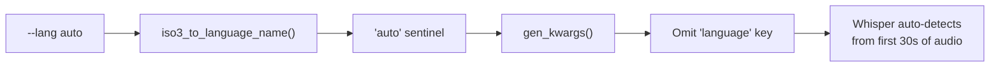

# Whisper Usage in Batchalign

**Status:** Current
**Last updated:** 2026-08-06 16:10 EDT

## Overview

Whisper is used in three distinct roles within batchalign:

1. **Transcription (ASR)** -- Converting audio to text via the `transcribe` command
2. **Forced Alignment (FA)** -- Using Whisper's encoder cross-attention for
   word-level timestamp alignment via the `align` command
3. **Utterance Timing Recovery (UTR)** -- Re-transcribing audio to improve
   forced alignment quality, automatically added by the `align` command

Each role loads a separate model instance.  In a full `align` pipeline, two
Whisper models may be loaded simultaneously (FA + UTR).

## ASR Engines

There are five ASR engines.  **Rev.AI is the production default** -- the four
Whisper variants are local alternatives for when a commercial API is not wanted.
One of those variants, `whisper_rs`, is Rust-native (whisper.cpp, in-process);
the other three run in a Python worker.

### Rev.AI (default)

```bash
batchalign3 transcribe input/ output/ --lang=eng
```

- Rev.AI is no longer implemented in `inference/asr.py`
- Uses the Rev.AI commercial HTTP API through the Rust native client
  (`crates/batchalign/src/revai/`, wired from `crates/batchalign/src/revai/`)
- Supports speaker diarization natively
- Requires an API key (`batchalign3 setup` or `~/.batchalign.ini`)
- No local model loading, no GPU needed

### OpenAI Whisper (`--asr-engine whisper-oai`)

```bash
batchalign3 transcribe input/ -o output/ --asr-engine whisper-oai --lang=eng
```

- OAI Whisper engine in `inference/asr.py` (`_infer_whisper()` with OAI backend)
- Uses OpenAI's official `whisper` Python library directly
- **Hardcoded to "turbo" model** -- ignores language-specific model resolution
- Converts Whisper segments/words output to Rev.AI-style JSON internally
- Current Rust CLI default is `--asr-engine rev` when no ASR override is given
  AND no per-language default applies (see "Per-language defaults" below).
- The internal engine string remains `whisper_oai` where engine registries or
  typed option payloads refer to engine names.

### HuggingFace Whisper (`--asr-engine whisper`)

```bash
batchalign3 transcribe input/ -o output/ --asr-engine whisper --lang=eng
```

- HuggingFace Whisper engine in `inference/asr.py` (`_infer_whisper()`)
- Uses HuggingFace `transformers.pipeline("automatic-speech-recognition")`
- Loads via `load_whisper_asr()` in `inference/asr.py` (returns `WhisperASRHandle`)
- Uses language-specific model resolution (see below)
- Supports `bfloat16` (CUDA) with `float16` fallback
- Chunk length 25s with 3s stride for long files
- Device selection: CUDA > CPU (`MPS` is intentionally excluded; see
  `developer/apple-mps-workarounds.md`)

### WhisperX (`--asr-engine whisperx`)

```bash
batchalign3 transcribe input/ -o output/ --asr-engine whisperx --lang=eng
```

- WhisperX engine in `inference/asr.py`
- Uses the `whisperx` library (Whisper + phoneme-level forced alignment)
- **Hardcoded to `large-v2`** -- ignores model resolution
- Loads both a transcription model and an alignment model
- Chunked processing with fallback: 60s -> 30s -> 15s
- CUDA-only for `float16`; falls back to `float32` on CPU

### Native Whisper (`--asr-engine whisper_rs`)

```bash
BATCHALIGN_WHISPER_RS_MODEL=/path/to/ggml-large-v3.bin \
  batchalign3 transcribe input/ -o output/ --asr-engine whisper_rs --lang=eng
```

Rust-native Whisper via whisper.cpp (the `whisper-rs` bindings), run
**in-process** in the server rather than through a Python worker. It is the
first non-Rev.AI ASR engine that is Rust-owned (`is_rust_owned`).

- **Build-gated.** Requires the `whisper-rs-backend` Cargo feature at compile
  time; it is NOT built by default because whisper.cpp is a C/C++ build.
  Selecting `whisper_rs` in a build without the feature returns a clear
  "native Whisper path is not available in this build" error.
- **Model.** Point `BATCHALIGN_WHISPER_RS_MODEL` at a ggml `.bin` model
  (for example from `ggerganov/whisper.cpp`). One model per process: the loaded
  `WhisperContext` is cached process-wide, so changing models needs a restart
  (a second model path returns `ModelPathChanged` rather than reloading).
- **Acceleration.** macOS builds always enable Metal; CoreML
  (`whisper-rs-coreml`, needs a sibling `<model>-encoder.mlmodelc` bundle) and
  CUDA (`whisper-rs-cuda`) are additive opt-in features.
- **Language.** Requires a resolved `--lang`; whisper.cpp language
  auto-detection is not wired on this path yet, so `--lang auto` returns a
  validation error. Use Rev.AI (or a resolved language) for auto-detect.
- **Output parity.** The chunk output is lowered to the shared `AsrResponse`
  domain through the same converter the Python Whisper worker uses, so identical
  chunks produce identical downstream CHAT.
- Because it is Rust-owned with no pool-managed Python worker, it does not
  appear in worker-admission accounting; the model loads in the server process.

## Per-language defaults

The fallback dispatch when no `--asr-engine` is set
AND no Rev.AI key is configured is **not** unconditionally Whisper. The
worker resolver consults a per-language default table
(`_LANG_DEFAULTS` in `batchalign/worker/_model_loading/asr.py`) before
falling through to Whisper. Currently:

- `yue` (Cantonese) → FunASR/SenseVoice (per the 2026-05 Cantonese ASR
  benchmark, where vanilla Whisper-large-v3 was the worst-measured
  engine on TalkBank Tier 3 child speech)
- all other languages → Whisper (the documented historical fallback)

To override the per-language default, pass an explicit
`--asr-engine <engine>`. The override always wins.

## Model Selection

The default `--asr-engine whisper` engine loads `openai/whisper-large-v3`
across every language; the model id is wired at
`batchalign/inference/asr.py:120` (`model: str = "openai/whisper-large-v3"`).
There is no per-language fine-tune table on this engine.

Per-language fine-tunes are opt-in via the separate `--asr-engine
whisper_hub` backend. The resolver lives at
`batchalign/models/resolve.py::_RESOLVER["whisper_hub"]` and is
seeded reactively, one entry at a time, with dated provenance comments
(today the only seeded entry is `mal → thennal/whisper-medium-ml`).
Absent languages raise `WhisperHubModelNotFoundError` directing the
user to pass an explicit `model_id` via `--engine-overrides`. See
[Whisper Hub ASR](whisper-hub-asr.md).

Other engines have hardcoded models:

- OpenAI Whisper (`--asr-engine whisper-oai`): always `"turbo"` (via `whisper.load_model("turbo")`)
- WhisperX (`--asr-engine whisperx`): always `"large-v2"` (via `whisperx.load_model("large-v2")`)

## Auto-Detect Mode (`--lang auto`)

When `--lang auto` is passed, the `language` and `task` keys are **omitted**
from Whisper's `generate_kwargs`, allowing the model to auto-detect the spoken
language from the audio. This enables transcription of bilingual or
code-switched recordings (e.g., English/Spanish) where forcing a single
language would cause the model to skip or garble content in the other language.

```bash
batchalign3 transcribe bilingual_audio/ -o output/ --asr-engine whisper --lang auto
```

**How it works:**


```mermaid
graph LR
    A["--lang auto"] --> B["iso3_to_language_name()"]
    B --> C["'auto' sentinel"]
    C --> D["gen_kwargs()"]
    D --> E["Omit 'language' key"]
    E --> F["Whisper auto-detects\nfrom first 30s of audio"]
```

**Behavior per engine:**

| Engine | `--lang auto` behavior |
|--------|----------------------|
| `whisper` (HuggingFace) | Uses `openai/whisper-large-v3` (multilingual); omits `language` from kwargs |
| `whisper-oai` | Turbo model; omits `language` from kwargs |
| `whisperx` | Uses `large-v2`; omits `language` from kwargs |
| `rev` (Rev.AI) | Rev.AI has its own auto-detection via the API |

**Limitations:**

- Whisper auto-detects from the **first ~30 seconds** of audio, so the dominant
  language in the opening segment drives detection for the whole file
- Language-specific fine-tuned models (e.g., `talkbank/CHATWhisper-en`) are
  **not used** in auto mode, the generic multilingual model is loaded instead
- Downstream stages (`morphotag`, `align`) still need an explicit language for
  their own model selection; `auto` currently applies only to ASR transcription

The TalkBank fine-tuned model (`talkbank/CHATWhisper-en`) is trained on
conversational speech with CHAT-specific patterns (utterance boundaries, speaker
overlap).

## Forced Alignment

```bash
batchalign3 align input/ output/ --lang=eng
```

- Whisper FA engine in `inference/fa.py` (`infer_whisper_fa()`)
- Loads via `load_whisper_fa()` (returns `WhisperFAHandle`)
- **Always uses `openai/whisper-large-v2`** -- no language-specific resolution
- Loads the full `WhisperForConditionalGeneration` model with `attn_implementation="eager"`
- Uses cross-attention alignment heads + dynamic time warping (DTW) to extract
  per-token timestamps
- The encoder output and DTW alignment run in Python; the DP alignment of
  Whisper tokens against CHAT words runs in Rust (`batchalign_core.add_forced_alignment`)
- Results are cached by audio chunk + text hash

### How FA Works

1. Whisper processes an audio chunk with the transcript as forced decoder input
2. Cross-attention weights are extracted from designated alignment heads
3. Attention matrix is normalized (mean/std) and median-filtered
4. Dynamic time warping aligns decoder tokens to audio frames (20ms resolution)
5. Token-level timestamps are mapped back to words
6. Current Rust FA handling matches Whisper token timings to CHAT words by
   deterministic in-order stitching; unmatched words remain explicit untimed
   slots rather than triggering transcript-wide remap.

## Utterance Timing Recovery (UTR)

UTR is **automatically added** whenever `align` is run (unless `--no-utr`).
It re-transcribes the full audio file to get word-level timestamps, then uses
those timestamps to improve forced alignment quality.

Two UTR engines exist:

### Whisper UTR (default)

- Whisper UTR loads via `load_whisper_asr()` in
  `batchalign/inference/asr.py:119` and reuses the `WhisperASRHandle`
  type.
- The same `openai/whisper-large-v2` checkpoint is used for every
  language, UTR engines are not language-keyed in BA3 (see
  [Language Code Resolution](language-code-resolution.md)
  §"Model Resolution (UTR)"). Per-language fine-tunes for UTR are
  not wired in the current resolver.
- Results cached by audio file identity (BLAKE3 of path + size).
- Hands timed words to `batchalign_core.add_utterance_timing` (Rust).

### Rev.AI UTR (alternative)

- Rev.AI UTR uses the Rust-owned `batchalign::revai` client directly
- Same API key as the Rev.AI ASR engine
- Timed words are handled entirely in Rust (server-side)

## Post-Processing Pipeline

All ASR engines normalize their output through the Rust post-processing pipeline
in `crates/batchalign-transform/src/asr_postprocess/`:

1. **Compound word merging** -- joins words like `["ice", "cream"]` into
   `"icecream"` using a known compound list (`crates/batchalign-transform/data/compounds.json`;
   3,660 raw entries → 3,584 unique pairs after dedup, asserted at
   `crates/batchalign-transform/src/asr_postprocess/compounds.rs:84`)
2. **Number-to-words** -- converts digits to words using language-specific
   lookup tables (`crates/batchalign-transform/data/num2lang.json`; 46 languages today)
   plus Chinese/Japanese via
   `crates/batchalign-transform/src/asr_postprocess/num2chinese.rs`
3. **Retokenization** into utterances:
   - With utterance engine (English, Chinese, Cantonese): uses a BERT model
     to predict utterance boundaries
   - Without: splits on punctuation (`.`, `?`, `!`, etc.)
4. **CHAT generation** via `batchalign_core.build_chat()` -- constructs valid
   CHAT from structured JSON (participants, utterances, words with timestamps)

The utterance segmentation engine is a separate model loaded alongside the ASR
engine.  Available for: English (`talkbank/CHATUtterance-en`), Mandarin
(`talkbank/CHATUtterance-zh_CN`), Cantonese
(`PolyU-AngelChanLab/Cantonese-Utterance-Segmentation`).

## Memory and Performance

A full `align` pipeline loads up to two Whisper checkpoints (FA + UTR
with the Whisper backend):

| Component        | Model                        | Approx. Memory |
|------------------|------------------------------|----------------|
| FA (Whisper)     | `openai/whisper-large-v2`    | ~3 GB          |
| UTR (`--utr-engine whisper`) | `openai/whisper-large-v2` | ~3 GB |

Switching UTR to Rev.AI (`--utr-engine rev`) avoids the second model
load entirely. The ASR `transcribe` command loads one Whisper model
(~3 GB) plus optionally an utterance segmentation BERT model (~400 MB).

All models use lazy loading -- imports and model weights are loaded on first
use, not at CLI startup.

## Whisper Models in Use (Summary)

| Context              | Model ID                           | Size    |
|----------------------|------------------------------------|---------|
| ASR (`--asr-engine whisper`, all languages) | `openai/whisper-large-v3` | large-v3 |
| ASR (`--asr-engine whisper-oai`)            | `openai/whisper-turbo`    | turbo   |
| ASR (`--asr-engine whisperx`)               | `openai/whisper-large-v2` | large-v2 |
| ASR (`--asr-engine whisper_hub`, opt-in fine-tunes) | per `_RESOLVER["whisper_hub"]` or `--engine-overrides model_id` | varies |
| FA                                          | `openai/whisper-large-v2` | large-v2 |
| UTR (`--utr-engine whisper`, all languages) | `openai/whisper-large-v2` | large-v2 |

## Implications for whisper.cpp Migration

### What would be straightforward

- **ASR transcription**: whisper.cpp supports large-v2 and large-v3 with GGML
  quantization.  Direct replacement for the OpenAI Whisper and HuggingFace Whisper engines.
- **UTR**: Same encoder architecture, same word-level timestamps.

### Landed 2026-07-28 (fully-supported-and-default directive)

- `whisper-rs-backend` is a DEFAULT Cargo feature: every build carries
  the `whisper_rs` engine (the non-default gate had silently dropped the
  engine from rebuilt binaries).
- Model auto-resolution: `BATCHALIGN_WHISPER_RS_MODEL` still overrides,
  but without it the default `ggml-large-v3.bin` is fetched once from
  `ggerganov/whisper.cpp` via hf-hub and cached.
- Language auto-detect: `Auto` no longer errors; whisper.cpp's own
  detection runs and the detected code is mapped back through the same
  closed language table used for explicit input.

### What would require work

- **Fine-tuned models**: any HuggingFace fine-tune seeded into
  `_RESOLVER["whisper_hub"]` (today only `thennal/whisper-medium-ml`)
  would need conversion to GGML format and quality validation before
  whisper.cpp could load it.
- **Forced alignment**: PILOT PARITY ACHIEVED (2026-07-29). whisper.cpp
  cannot teacher-force an arbitrary transcript, so the FA port goes
  through the CANDLE arm, reproducing the HF algorithm exactly:
  teacher-forced forward pass, `alignment_heads` cross-attentions,
  per-(head,frame) standardization over tokens, median filter,
  head-mean cost matrix (row 0 flattened), DTW at 20 ms frames. Pieces:
  the shared numeric core (`whisper_native/fa_dtw.rs`, unit-tested),
  a vendored capture-enabled model + driver + parity harness in
  `batchalign-whisper-pilot` (`fa_model.rs`, `fa.rs`, `bin/fa_parity`).
  Measured parity on large-v2/JFK vs the production Python path: token
  sequences identical, max |delta| 0.040 s, mean 0.014 s. The critical
  subtlety, do not lose it: HF's `model(labels=...)` applies
  `shift_tokens_right` before the decoder, so attention row `k` is
  produced from input token `k-1`; the Rust decoder input must be
  `[sot] + labels[..n-1]` while timings zip with the UNSHIFTED labels.
  Landed since: the numeric core lives in the leaf crate
  `batchalign-fa-core` (shared without the server stack);
  `FaAssets::load`/`align` is the promotion seam (load once, align per
  call); capture is restricted to the alignment-head layers; an
  ignored-by-default equivalence test guards the vendored model against
  upstream candle drift; per-job model selection
  (`whisper_rs_model` engine-override extra) and
  `setup --prefetch-whisper-rs` complete the ASR-side surface.
  Remaining for production: the `FaInferItem`-shaped dispatch behind
  the FA engine seam (with `FaAssets` cached per model+device) and
  corpus-scale parity (the 114 aligned IISRP sessions are the
  designated parity corpus).
- **Utterance segmentation BERT models**: Unrelated to Whisper, would remain
  in Python regardless.

### What would not change

- **Rev.AI engine**: Already fully Rust (`crates/batchalign/src/revai/`, called directly by the server).
- **Post-processing pipeline**: Already Rust (`crates/batchalign-transform/src/asr_postprocess/`).
- **CHAT generation**: Already Rust (`batchalign`).
