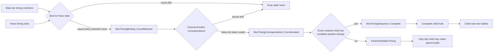

# %wor Tier Specification

**Status:** Current
**Last updated:** 2026-08-30 19:38 EDT

How main tier words map to the %wor (word-level timing) dependent tier.

## Overview

The %wor tier is a **flat** list of words, each optionally paired with a
timing bullet. It mirrors the main tier's spoken word slots in the same
order, providing word-level audio timestamps. Unlike the main tier, %wor
never contains groups, annotations, replacements, events, pauses, or any
nested structure.

```text
*CHI:    I want cookies .
%wor:    I 1000_1200 want 1200_1400 cookies 1400_1800 .
```

## Correspondence to the Main Tier

`%wor` is a **timing-annotation tier**: it records word-level start/end
timestamps for tokens with a known phoneme sequence. It is NOT a structural
1-to-1 mirror of all main-tier content.

Both the forced alignment word extraction (`collect_fa_words`) and the `%wor`
generation (`generate_wor_tier`) walk the main tier AST identically,
applying the same alignability rules (`TierDomain::Wor`). Any token excluded
by these rules has no `%wor` slot and receives no timing bullet.

There is no CLAN-level positional indexing into `%wor`; `%wor` indices carry
no external semantics beyond tracking which word received which timing.

Internally, current Batchalign alignment groups also retain stable AST-derived
word identifiers. Those identifiers support evidence joins and experiments;
they are not serialized as `%wor` content. This separation lets the public
tier remain compatible and uncluttered without forcing research code to use
display text or flat position as identity.

## What Text Appears in %wor

The %wor tier uses each word's **`cleaned_text`** as display text, the
spoken slot remains the original main-tier word, but the rendered token has
CHAT-specific prosodic markup removed:

| Main tier | cleaned_text (in %wor) | Notes |
|-----------|----------------------|-------|
| `a::n` | `an` | Lengthening `:` removed |
| `hel^lo` | `hello` | Syllable pause `^` removed |
| `som(e)thing` | `something` | Shortening expanded |
| `°softer°` | `softer` | CA delimiters removed |
| `⌈word⌉` | `word` | Overlap points removed |
| `&-uh` | `uh` | Category prefix `&-` stripped (filler, included) |
| `&+fr` | (excluded) | Fragment, excluded from `%wor` |
| `&~um` | (excluded) | Nonword, excluded from `%wor` |
| `xxx` | (excluded) | Untranscribed, no phoneme sequence to align |
| `ice+cream` | `icecream` | Compound marker `+` removed |

## Inclusion Rules

### Words INCLUDED in %wor

The %wor tier includes spoken main-tier word tokens:

| Form | Example | In %wor? | cleaned_text |
|------|---------|----------|-------------|
| Regular words | `want`, `cookie` | Yes | `want`, `cookie` |
| Fillers | `&-uh`, `&-um` | **Yes** | `uh`, `um` |
| Fragments | `&+fr`, `&+w` | **No** |, |
| Nonwords | `&~gaga`, `&~um` | **No** |, |
| Untranscribed placeholders | `xxx`, `yyy`, `www` | **No** |, |
| Words with error marks | `goed [*]` | Yes | `goed` |
| Words inside retrace groups | `<I want> [/] I need` | Yes (all 4 words) | `I`, `want`, `I`, `need` |
| Words inside reformulation groups | `<I want> [//] I need` | Yes (all 4 words) | `I`, `want`, `I`, `need` |
| Words inside quotations | `+"/.` ... `+".` | Yes | word text |
| Words inside phonological groups | `[pho]` | Yes | word text |
| Words inside special form groups | `[sin]` | Yes | word text |

### Words EXCLUDED from %wor

| Form | Example | Why excluded |
|------|---------|-------------|
| **Omitted words** | `0is`, `0det` | Never spoken (`WordCategory::Omission`) |
| **CA-style omissions** | `(word)` in CA mode | Never spoken (`WordCategory::CAOmission`) |
| **Untranscribed placeholders** | `xxx`, `yyy`, `www` | No alignable phoneme sequence; CTC alignment cannot produce timings for unknown material |
| **Fragments** | `&+fr`, `&+w` | Incomplete phoneme sequences; FA engine cannot reliably anchor partial phonological material (matches batchalign2 policy) |
| **Nonwords** | `&~gaga`, `&~um` | Interactional/gestural sounds without stable lexical phoneme content (matches batchalign2 policy) |
| **Timing tokens** | `100_200` | %wor metadata artifacts, not lexical content |
| **Empty words** | (parser artifacts) | `cleaned_text` is empty string |

### Non-word items that never appear in %wor

These main tier elements are not words and are simply skipped during tree
traversal:

- **Pauses**: `(.)`, `(..)`, `(...)`, `(2.5)`
- **Events / actions**: `&=laughs`, `0 [=! vocalizes]`
- **Internal bullets**: timing markers between words
- **Linkers**: `++`, `+<`, `+^`, etc.
- **Postcodes**: `[+ text]`, `[+bch]`
- **Tag separators**: `,`, `‡`, `„`
- **Utterance-level annotations**: language codes `[- spa]`, etc.

## Replacement Words (`[: ...]`)

For words with replacement annotations (`original [: replacement]`):

**The ORIGINAL spoken word appears in %wor**, not the replacement. The
replacement does not create a new `%wor` slot or replace the spoken one.

```text
*CHI:    what's is dis [: this] ?
%wor:    what's 1000_1200 is 1200_1400 dis 1400_1600 ?
```

This means `%wor` follows the spoken surface slot, while `%mor` continues to
follow the editorial replacement.

### Fragment / nonword with replacement

Fragments and nonwords are excluded from `%wor` even when they carry a
replacement. The replacement matters for `%mor`, but the original token
category (fragment or nonword) governs `%wor` membership:

```text
*CHI:    &+fr [: friend] is here .
%wor:    is 1200_1400 here 1400_1800 .
         (fragment excluded regardless of replacement)
```

Untranscribed placeholders (`xxx`, `yyy`, `www`) are similarly excluded from
`%wor` even when they carry a replacement:

```text
*CHI:    xxx [: something] is here .
%wor:    is 1200_1400 here 1400_1800 .
         (xxx excluded, no phoneme sequence regardless of replacement)
```

### Omission with replacement

If an omission (`0word`) has a replacement, the omission is still excluded
(the replacement does not rescue it):

```text
*CHI:    0gonna [: going+to] eat .
         (omission, not in %wor regardless of replacement)
```

## Retrace and Reformulation Groups

Retraced and reformulated content (`<...> [/]`, `<...> [//]`, `<...> [///]`,
`<...> [/?]`) **IS included** in %wor.

This differs from %mor, where retraced content is excluded. Retrace ancestry
does **not** change `%wor` membership: the same spoken-token rule applies both
inside and outside retrace.

- **%mor** = linguistic/morphological analysis → retraced words are
  corrected speech, not linguistically intended
- **%wor** = word-level audio timing → retraced words were phonologically
  produced and occupy audio time, but they do not receive any special token
  class promotion or demotion

```text
*CHI:    <I want> [/] I need cookie .
%wor:    I 100_200 want 200_400 I 500_600 need 600_800 cookie 800_1200 .
```

Both `collect_fa_words()` and `generate_wor_tier()` descend into retrace
content and then apply the same `%wor` word-membership rules to the leaves.

## Timing Bullet Format

Each word may optionally have a timing bullet:

```text
word \u0015start_ms_end_ms\u0015
```

Where:
- `\u0015` is the Unicode control character U+0015 (NAK), used as the CHAT
  bullet delimiter
- `start_ms` and `end_ms` are unsigned integers representing milliseconds
- Words without timing simply appear without a following bullet

Example raw encoding:
```text
%wor:    hello \u00150_500\u0015 world \u0015500_1000\u0015 .
```

Words CAN lack timing bullets, this means timing is unknown, NOT an error.

### What `%wor` cannot preserve

A `%wor` bullet is only a start/end pair. It cannot say whether a boundary was
measured by an engine, copied from an older transcript, derived from a neighbor,
or adjusted by a repair pass. It also cannot carry an aligner's per-word model
score. Consequently, reusing an existing `%wor` tier is observable as
`wor_reuse`, but the provenance of the run that originally created its bullets
cannot be reconstructed from CHAT alone.

For research and adjudication runs, `align --debug-dir DIR` writes a versioned
`<stem>_fa_evidence.json` sidecar. Schema version 2 contains stable word IDs,
group cache keys and evidence sources, pre-injection timings, full start/end
origin chains, Wave2Vec-family model scores where the engine supplies them,
and the exact typed decisions that later clamped or removed timing.
Nested input identities receive a short digest suffix after the basename so
two corpus branches containing the same filename retain distinct sidecars.
The score is model evidence, not a calibrated boundary-correctness probability.
Version 2 does not yet contain final per-word post-processing results, so the
sidecar and output CHAT are complementary rather than interchangeable.

## Tier-Level Structure

A `%wor` tier has:

```text
%wor:\t[- lang_code] word1 [bullet1] word2 [bullet2] ... terminator
```

| Component | Required | Notes |
|-----------|----------|-------|
| Language code | No | Inherited from main tier's `[- code]` |
| Words | Yes | Flat list of cleaned_text values |
| Timing bullets | No | Per-word, optional |
| Terminator | Yes | Same as main tier (`.`, `?`, `!`, `+...`, etc.) |

There is no tier-level `%wor` bullet. Chatter 0.17 removed that redundant
location because the only timing observations owned by `%wor` are the inline
word bullets. An utterance span belongs to the main tier; when it is safely
derivable from complete word timing, it is the minimum-start/maximum-end hull
of those inline bullets.

### Main-tier bullets after utterance splitting

When CHAT-text `utseg` splits an utterance that already has a `%wor` tier, BA3
first asks Chatter to bind the pair under the named word-membership policy.
Equal counts admit lexical corroboration; only canonical token-for-token
correspondence admits partitioning. Thus, a same-count main-tier edit cannot
silently give an old word's timing to a different child. If every retained
child then has positive timing for every one of its corroborated `%wor` words,
the split is in the complete per-child timing state: each child main tier
receives the minimum-start/maximum-end hull of its own word bullets.

If `%wor` is absent, count-drifted, lexically uncorroborated, empty for a
retained child, or has even one untimed or non-positive word interval, BA3 does
not mix exact child hulls with guessed spans. Count or lexical drift drops the
stale `%wor` tier entirely. Incomplete timing after safe partitioning keeps the
partitioned word bullets but selects the parent-only main-tier timing state:
earlier children have no main-tier bullet and the original parent bullet, if
present, stays on the last child.

The implementation follows Chatter's explicit state transitions:
`WorTimingBinding::CountMatched` →
`WorTimingCorrespondence::Corroborated` →
`WorTimingSequence::Complete`. Only the final state exposes a hull. Child
`%wor` terminators are copied from their child main tiers after splitting, so
an earlier child cannot incorrectly retain the parent's question mark or
exclamation mark.



This policy concerns timing projection after a boundary has already been
chosen. It neither selects utterance boundaries nor improves the lexical or
speaker evidence received from ASR and diarization.

## Generation Pipeline

1. **Forced alignment engines** extract `%wor` word slots from the main tier
   AST via `collect_fa_words()`
2. The FA model processes the audio and returns per-word `[start_ms,
   end_ms]` pairs (or `null` for unaligned words)
3. Timings are injected back into the AST via
   `inject_timings_for_utterance()`, stored on each word's
   `timing_alignment` field
4. Post-processing (`postprocess_utterance_timings`) heals small gaps between
   words unless `--pauses` was given (`WordGapHealing`), and **conditionally**
   clamps word timings to the utterance
   bullet range. Clamping only applies when BOTH conditions hold: the bullet is
   `BulletSource::Authoritative` (not a runtime UTR hint) AND a `%wor` tier
   already exists (indicating this is a re-alignment, not a first-time run).
   On first-time alignment, e.g., after `transcribe` + `utseg`: no clamping
   occurs, because the utterance bullet came from narrow ASR-derived timestamps
   that may not cover the full speech span. See
   [Word timing clamping policy](forced-alignment.md#word-timing-clamping-policy)
   for the full rationale.
5. `MainTier::generate_wor_tier()` walks the AST one final time, collecting
   each spoken word slot's `cleaned_text` and `timing_alignment` into a flat
   `WorTier`
6. The `WorTier` is serialized via `WriteChat` into the `%wor:\t...` line

Steps 1 and 5 both use the same `%wor` membership rules (`TierDomain::Wor`),
guaranteeing identical traversal order. The `%wor` word count equals the
number of Wor-domain words (regular words and fillers), NOT a count of
all main-tier tokens. Fragments, nonwords, and untranscribed placeholders
are not counted.

## Comparison with %mor Domain

| Aspect | %wor | %mor |
|--------|------|------|
| Fillers (`&-uh`) | **Included** | Excluded |
| Nonwords (`&~gaga`) | **Excluded** | Excluded |
| Fragments (`&+fr`) | **Excluded** | Excluded |
| Untranscribed (`xxx`, `yyy`, `www`) | **Excluded** | Excluded |
| Retraced groups (`<...> [/]`) | Included | Excluded |
| Replacement (`word [: repl]`) | Original spoken word | Replacement text |
| Regular words | Included | Included |
| Omissions (`0word`) | Excluded | Excluded |
| Tag separators (`,`, `„`, `‡`) | Included | Included (as cm\|cm, etc.) |

## Source Code References

- **Content walker**: `talkbank-model/src/alignment/helpers/walk/`,
  `walk_words()`, `walk_words_mut()`, `WordItem`, `WordItemMut`.
  Centralizes recursive traversal of `UtteranceContent` and `BracketedItem`;
  used by %wor generation, FA extraction, FA injection, and FA postprocessing.
- **Alignability rules**: `talkbank-model/src/alignment/helpers/rules.rs`,
  `counts_for_tier()`, `should_skip_group()`,
  `should_align_replaced_word_in_pho_sin()`
- **%wor tier model**: `talkbank-model/src/model/dependent_tier/wor.rs`,
  `WorWord`, `WorTier`, serialization
- **%wor generation from AST**:
  `talkbank-model/src/model/content/main_tier.rs`,
  `generate_wor_tier()`, `collect_wor_items_content()` (uses `walk_words`)
- **FA word extraction**: `crates/batchalign/src/chat_ops/fa/extraction.rs`,
  `collect_fa_words()` (uses `walk_words`)
- **Timing injection**: `crates/batchalign/src/chat_ops/fa/injection.rs`,
  `inject_timings_for_utterance()` (uses `walk_words_mut`)
- **Timing postprocessing**: `crates/batchalign/src/chat_ops/fa/postprocess.rs`,
  `postprocess_utterance_timings()` (uses both `walk_words` and `walk_words_mut`)
- **Word categories**:
  `talkbank-model/src/model/content/word/category.rs`,
  `WordCategory` enum
- **Untranscribed status**:
  `talkbank-model/src/model/content/word/untranscribed.rs`,
  `UntranscribedStatus` enum
- **Tier domains**:
  `talkbank-model/src/alignment/helpers/domain.rs`,
  `TierDomain` enum
