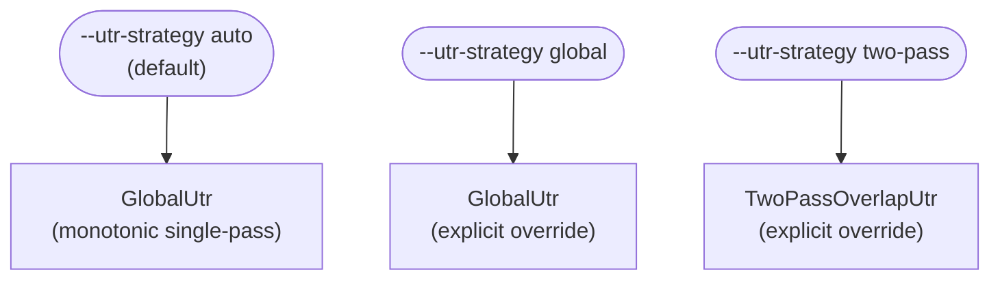
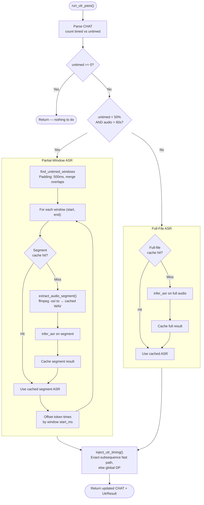
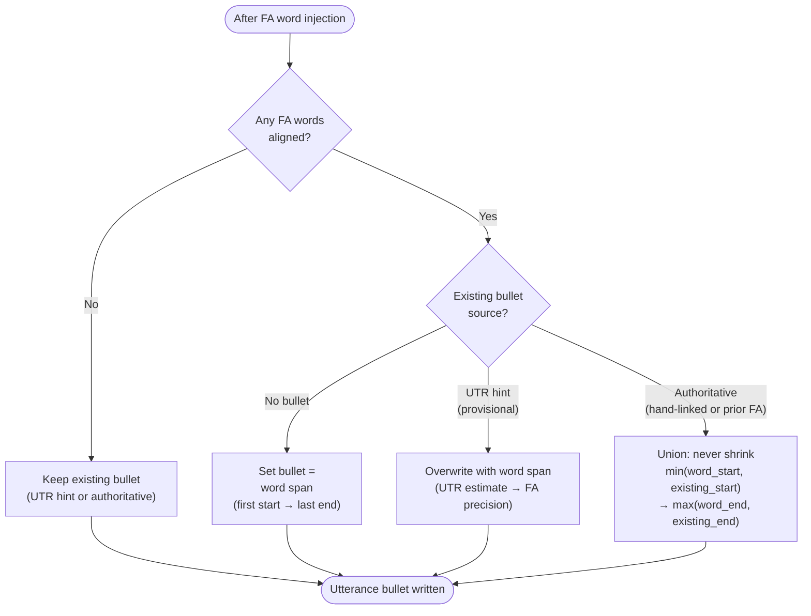

# align

**Status:** Current
**Last updated:** 2026-05-02 02:30 EDT

Add word-level and utterance-level timestamps to an existing CHAT transcript
by running forced alignment against the corresponding audio file.

**Requires:** a `.cha` file whose `@Media` header names an audio file visible
to the server (or to the local daemon). See
[Media Resolution](../../reference/command-io.md#1-align).

---

## Quick start

```bash
# Align one file in place
batchalign3 align file.cha

# Cantonese / other non-RevAI languages: choose a compatible UTR backend explicitly
batchalign3 align yue_file.cha --utr-engine whisper

# Align a corpus directory, writing results to a separate output directory
batchalign3 align corpus/ -o aligned/

# Audio lives in a different directory from the .cha files
batchalign3 align transcripts/ -o out/ --media-dir /path/to/audio/

# Align a curated list of files against a remote server
batchalign3 --server http://your-server:8001 align --file-list rerun.txt
```

---

## Pipeline

`align` is **FA-first**. It does not always need utterance timing recovery
(UTR), and the selected UTR backend only matters when the parsed CHAT file
actually contains untimed utterances.

In practice that means:

- fully timed files can skip UTR entirely and go straight to FA
- partially timed or untimed files may require UTR before FA
- backend/language errors should be read as “this file needs UTR, and the
  selected UTR backend cannot support it”, not as “forced alignment itself is
  unavailable for this language”

The diagram below shows how CLI flags control the alignment pipeline at
runtime. Source: `crates/batchalign/src/runner/dispatch/`.

```mermaid
flowchart TD
    start([align invoked]) --> read[Read CHAT file]
    read --> resolve_audio[Resolve audio file]
    resolve_audio --> ensure_wav[ensure_wav — convert mp4→wav if needed]
    ensure_wav --> parse[parse_lenient → ChatFile]
    parse --> reuse_check{Complete reusable\n%wor timing?}
    reuse_check -->|Yes| reuse[Refresh main-tier bullets\nfrom %wor + optionally\nregenerate %wor]
    reuse_check -->|No| count[count_utterance_timing → timed, untimed]
    reuse --> done([Output .cha file])

    count --> utr_check{untimed > 0?}
    utr_check -->|No| skip_utr[Skip UTR — all timed]
    utr_check -->|Yes| utr_engine_check{UTR enabled\nand selected backend\nsupports this file?}

    utr_engine_check -->|Yes| run_utr_pass["run_utr_pass()"]
    utr_engine_check -->|No: --no-utr| warn_interp[Log warning\nFall back to interpolation]

    run_utr_pass --> utr_done[Re-serialize CHAT\nwith recovered timing]
    utr_done --> group

    warn_interp --> group
    skip_utr --> group

    group[group_utterances → time windows]

    group --> before_check{--before path\nprovided?}
    before_check -->|Yes| incremental[process_fa_incremental\nDiff old vs new, copy stable %wor,\nreuse preserved groups]
    before_check -->|No| full[process_fa\nProcess all groups]

    incremental --> engine_select
    full --> engine_select

    engine_select{--fa-engine?}
    engine_select -->|whisper| whisper_fa[WhisperFa engine\nmax_group_ms=20000]
    engine_select -->|wav2vec| wav2vec_fa[Wave2Vec engine\nmax_group_ms=15000]

    whisper_fa --> pause_check{--pauses?}
    pause_check -->|Yes| with_pauses[FaTimingMode::WithPauses]
    pause_check -->|No| continuous_w[FaTimingMode::Continuous]

    wav2vec_fa --> continuous_wv[FaTimingMode::Continuous]

    with_pauses --> cache_check
    continuous_w --> cache_check
    continuous_wv --> cache_check

    cache_check[Cache lookup — BLAKE3 keys]
    cache_check --> worker_infer[execute_v2(task="fa") misses → Python FA worker\nprepared audio + prepared text]
    worker_infer --> dp_align_fa[DP-align model output → transcript words]
    dp_align_fa --> inject_fa[Inject word-level timings into AST]

    inject_fa --> retry_check{FA\nsucceeded?}
    retry_check -->|Yes| wor_check
    retry_check -->|No + retryable| fallback_check{Untimed utts\nnot recovered?}
    fallback_check -->|Yes + not tried| fallback_utr["Fallback: run_utr_pass()\n(at most once)"]
    fallback_utr --> retry_loop[Retry FA with\nrecovered timing]
    retry_loop --> cache_check
    fallback_check -->|No or already tried| backoff[Backoff + retry]
    backoff --> cache_check

    wor_check{--wor / --nowor?}
    wor_check -->|--wor| gen_wor[Generate %wor tier]
    wor_check -->|--nowor| skip_wor[Omit %wor tier]

    gen_wor --> merge_check
    skip_wor --> merge_check

    merge_check{--merge-abbrev?}
    merge_check -->|Yes| merge[merge_abbreviations transform]
    merge_check -->|No| validate

    merge --> validate[Post-validate → serialize CHAT output]
    validate --> done([Output .cha file])
```

### Validation model

`align` uses staged validation:

1. request-shape validation
   Invalid path-mode shapes, malformed flags, and incompatible option payloads
   fail immediately.
2. file-state inspection
   After parsing the CHAT file, Batchalign inspects whether the file is already
   timed well enough to skip UTR.
3. stage-specific backend validation
   If the file needs UTR, Batchalign validates the selected UTR backend against
   the file's language before running timing recovery.

This is why `--utr-engine` matters for some files but is irrelevant for others.

### UTR strategy selection (Auto disabled)

When `--utr-strategy auto` (the default), the strategy is currently
always `GlobalUtr` regardless of file content or language. The
previous content/language-aware auto-routing (which auto-picked
`TwoPassOverlapUtr` for English files containing `+<` or `⌊` markers)
was disabled 2026-03-30 — see the inline comment in the `Auto` arm of
`resolve_strategy()` at
`crates/batchalign/src/runner/dispatch/utr.rs`. Two-pass overlap-aware
recovery is reachable only via the explicit `--utr-strategy two-pass`
override.



Why Auto was disabled: an operator reported alignment regressions on
real files; investigation found that `enforce_monotonicity()` only
checks start times, not end times, so overlapping utterance bullets
go uncorrected. The two-pass tuning was also based on only four
corpora and not broadly validated. The previously-measured gains
under that mechanism (English: +4.3pp SBCSAE, +3.8pp Jefferson;
non-English on Hakka/Welsh/German/Serbian: GlobalUtr matched or beat
TwoPassOverlapUtr) are retained here as historical context for the
benchmark numbers that motivated the original gate, not as a
description of current default behavior.

### UTR internals: partial vs full-file ASR

When fewer than 50% of utterances are untimed and audio is longer than 60 s,
`run_utr_pass()` uses partial-window ASR (running ASR only over untimed
regions) rather than a full-file pass.



### Rerun hardening rules

`align` does not blindly trust existing `%wor` timing on reruns. Several
regression-driven safeguards now keep stale timing shapes from being refreshed
back into the output:

1. **Cheap `%wor` reuse is health-checked first.** Existing `%wor` timing is
   reused only when the word distribution already looks plausible. Rerun falls
   back to fresh FA instead of reuse when:
   - any `%wor` word is near-zero (`< 40 ms`)
   - a 3+-word utterance has one `%wor` word consuming more than 40% of the
     utterance span
   - the last `%wor` word already overruns the utterance boundary or other
     reuse-shape invariants fail

2. **Continuous smoothing only bridges small gaps by default.** In
   `FaTimingMode::Continuous`, Batchalign may extend a word to the next word's
   start to remove tiny pauses, but ordinary smoothing only applies to
   plausibly small internal gaps (currently `<= 1000 ms`). Larger gaps are
   treated as real pauses or mistracks and are left visible unless a more
   specific rerun-healing rule applies.

3. **Continuous smoothing treats boundary-sensitive seams specially.** Several
   traced rerun bugs showed that some words already have the right FA timing
   *before* postprocess, then become dominant only after smoothing, while
   others need a targeted heal:
    - merged compound fillers like `&-you_know` are not stretched forward a
      second time after injection merges their split FA parts
    - ordinary lexical words are not stretched into a following timed filler
      span such as `&-um` when that bridge would make the lexical word dominate
      the utterance
    - timed fillers are likewise not stretched across a following pause when
      that smoothing would make the filler itself dominate the utterance
    - a near-zero lexical word may still bridge to the following filler start
      when that heal stays below the same 40% utterance-share plausibility cap
   - if a collapsed lexical word already touches an adjacent word boundary,
     continuous mode may rebalance that shared boundary so the lexical word
     reaches the 40 ms floor without collapsing the neighboring span in turn;
     this now applies when borrowing from either the following word or the
     preceding word, and for both fillers and ordinary lexical words

4. **Rerun clamping is selective.** Fresh FA timings are not clamped to narrow
   provisional UTR hints, and small final-word overruns can heal instead of
   being chopped back to a near-zero tail. This prevents reruns from preserving
   stale narrow bullet windows that were only ever estimates.

The practical effect is that reruns now prefer **fresh FA over stale reuse**
whenever the old timing distribution already looks suspicious, and postprocess
is more conservative about turning real pauses/fillers into dominant words.

---

## Options

### Path options (shared with all processing commands)

| Option | Meaning |
| --- | --- |
| `PATHS...` | Input `.cha` files or directories |
| `-o`, `--output DIR` | Output directory (omit to overwrite inputs in place) |
| `--file-list FILE` | Read input paths from a text file (one path per line; `#` comments and blank lines ignored) |
| `--in-place` | Explicit in-place flag |

### Alignment options

| Option | Default | Meaning |
| --- | --- | --- |
| `--media-dir PATH` | alongside `.cha` | Directory to search for audio files matching the `@Media` header stem |
| `--utr-engine {rev,whisper}` | `rev` in CLI defaults | UTR backend. `rev` requires working Rev.AI credentials/config; operators without Rev.AI should choose `whisper` or a custom UTR backend explicitly |
| `--utr-engine-custom NAME` | — | Override UTR engine by name (e.g. `tencent_utr`) |
| `--utr` / `--no-utr` | enabled | Enable or skip the UTR pre-pass entirely |
| `--utr-strategy {auto,global,two-pass}` | `auto` | Overlap strategy: `auto` currently always returns `GlobalUtr` (the language/content-aware gate was disabled 2026-03-30; see §"UTR strategy selection" above). `two-pass` is the only way to reach `TwoPassOverlapUtr` today. |
| `--utr-fuzzy THRESHOLD` | `0.85` | Jaro-Winkler similarity threshold for word matching. `1.0` = exact only |
| `--utr-ca-markers {enabled,disabled}` | `enabled` | Use CA overlap markers (⌈⌉⌊⌋) to set alignment windows |
| `--utr-density-threshold N` | `0.30` | Max overlap fraction before skipping pass-1 exclusion (0.0–1.0) |
| `--utr-tight-buffer MS` | `500` | Pass-2 tight window buffer in milliseconds |
| `--fa-engine {wav2vec,whisper}` | `wav2vec` | Forced-alignment model |
| `--fa-engine-custom NAME` | — | Override FA engine by name (e.g. `wav2vec_fa_canto`) |
| `--wor` / `--nowor` | `--wor` | Include or suppress the `%wor` word-timing tier |
| `--pauses` | off | Group words into pause-separated chunks (Whisper FA only) |
| `--merge-abbrev` | off | Merge abbreviations in the output CHAT |
| `--before PATH` | — | Previous version of the file for incremental alignment (skip unchanged utterances) |
| `--bullet-repair` | off | Post-FA bullet repair for timing violations (experimental) |
| `--review-level {none,low-confidence,all}` | `low-confidence` | `%xalign`/`%xrev` review tier verbosity when `--bullet-repair` is set |

---

## What changes in the `.cha` file

- `%wor` tier added or replaced with word-level timestamps (`word ·start_end·`)
- Utterance-level bullet times (`·start_end·`) updated (see below for how)
- Existing `%mor` and `%gra` tiers are preserved and untouched
- The audio file is read but never modified

### How utterance bullet times are set

Utterance bullet timing goes through two stages and the result depends on
whether this is the file's first alignment or a re-alignment.

**First alignment (UTR → FA):**

1. UTR runs first, setting a provisional timing hint on each untimed utterance.
   These hints are rough estimates — they come from a global DP alignment of
   ASR tokens against transcript words and serve as grouping windows for the FA
   step. They are not written to the output.
2. FA runs within those windows and aligns each word individually.
3. After injection, each utterance bullet is **replaced** with the span derived
   from the FA word timings (first aligned word start → last aligned word end).
   This is the self-healing property: valid FA word timings produce a valid
   utterance bullet by construction, regardless of how accurate the UTR hint was.

**Re-alignment (file already has FA word timings):**

If the file already has utterance bullets set by a previous FA run (or
hand-linked by an annotator), the bullet is **expanded but never shrunk**:

- The new bullet covers `min(word_start, existing_start)` →
  `max(word_end, existing_end)`.
- This preserves timing coverage around fillers (`&-uh`), pauses, gestures
  (`&=laughs`), and other elements that FA cannot align but whose timing was
  already captured in the original bullet.

**FA failure fallback:**

If FA produces no aligned words for an utterance (audio quality too poor,
utterance skipped by the engine), the UTR hint is kept unchanged and written
as the utterance bullet. This is the safe fallback: approximate timing is
better than no timing.

The following diagram shows the decision logic inside
`update_utterance_bullet()` (`fa/mod.rs`):



---

## Gotchas

**`@Media: unlinked` is not an error.** `unlinked` means the transcript
exists but utterances have not yet been aligned to timestamps — it is the
normal pre-alignment state. `align` is precisely the command that creates
those links. The audio file is still resolved and used normally.

**Re-aligning an already-aligned file never shrinks utterance bullets.**
If an utterance already has a bullet from a previous FA run or from
hand-linking, the new bullet will cover _at least_ as wide a span as the
original. This is intentional: the original bullet may cover fillers,
pauses, and gestures at the edges of the utterance that FA itself cannot
align (because they produce no acoustic signal the aligner recognises).
The union policy ensures that re-running `align` on the same file is safe
and idempotent.

**Audio must be visible to the execution host.** With `--server`, the server
resolves `@Media` against its own filesystem. Paths that are valid on your
machine may not be valid on the server. Use `--media-dir` to point to a
server-visible path, or use the server's `media_mappings` configuration.

**`--utr-strategy global` is the default behavior anyway.** Since the
`auto` routing currently always returns `GlobalUtr` (see §"UTR strategy
selection"), passing `global` explicitly produces identical behavior.
If you see timing regressions and want to try the two-pass overlap-aware
mechanism, use `--utr-strategy two-pass` — that's the only way to
reach it today.

**For large re-run lists**, split the list into batches and submit
each batch as a separate `batchalign3 align --file-list <batch>`
invocation rather than passing thousands of files at once. Each
invocation gets a fresh worker pool, which keeps memory pressure
predictable.

---

## Related documentation

- [Forced Alignment](../../reference/forced-alignment.md) — algorithm details, prerequisites, media resolution
- [%wor Tier](../../reference/wor-tier.md) — %wor tier semantics and format
- [Overlapping Speech](../../reference/overlap-markers.md) — CA overlap markers and `+<` encoding
- [Command I/O: align](../../reference/command-io.md#1-align) — I/O patterns, server vs local, mutation behavior
- [Command Flowcharts: align](../../architecture/command-flowcharts.md#align) — full architecture flowchart
- [Dynamic Programming](../../../architecture/parser-and-grammar/dynamic-programming.md) — Hirschberg alignment algorithm
- [Incremental Processing](../../architecture/incremental-processing.md) — `--before` flag mechanics
