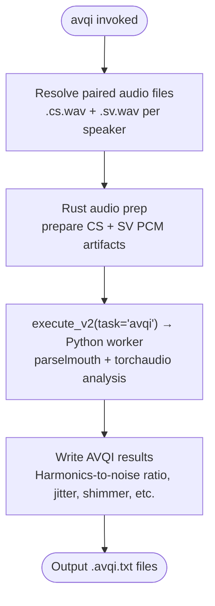

# avqi

**Status:** Current
**Last updated:** 2026-04-08 07:40 EDT

Calculate the Acoustic Voice Quality Index (AVQI) from paired audio files.
Requires paired **continuous speech** (`.cs.*`) and **sustained vowel**
(`.sv.*`) recordings per speaker. Produces `.avqi.txt` output.

Uses positional `INPUT_DIR OUTPUT_DIR` arguments (not the shared
`PATHS... -o OUTPUT` form used by `align`, `morphotag`, etc.).

---

## Quick start

```bash
# Calculate AVQI for all paired audio in a directory
batchalign3 avqi input_dir/ output_dir/

# Use the remote server
batchalign3 --server http://your-server:8001 avqi input_dir/ output_dir/
```

---

## Pipeline



---

## Options

### Positional arguments

| Argument | Meaning |
| --- | --- |
| `INPUT_DIR` | Directory containing paired `.cs.*` and `.sv.*` audio files |
| `OUTPUT_DIR` | Directory for output `.avqi.txt` files |

### avqi options

| Option | Default | Meaning |
| --- | --- | --- |
| `--lang CODE` | `eng` | 3-letter ISO language code |

---

## Input file naming convention

For each speaker, place two files in `INPUT_DIR`:
- `SPEAKER.cs.wav` (or `.mp3`, `.mp4`), continuous speech sample
- `SPEAKER.sv.wav`: sustained vowel sample

The pair is matched by the common stem before `.cs.` / `.sv.`. Missing
partners are reported as an error.

---

## Output format

Each speaker pair produces `SPEAKER.avqi.txt` with AVQI metrics including:
harmonics-to-noise ratio (HNR), jitter, shimmer, and the composite AVQI
score. BA3 uses the same metrics and text format as BA2 while moving audio
preprocessing behind the typed media-analysis worker boundary.

---

## Gotchas

**`avqi` prefers the local daemon** when `auto_daemon` is enabled. Use
explicit `--server` to override.

**Both files must be present.** A missing `.cs.*` or `.sv.*` partner causes
the whole pair to fail.

---

## Related documentation

- [Command I/O: avqi](../../reference/command-io.md#11-avqi), I/O patterns
- [Command Flowcharts: avqi](../../architecture/command-flowcharts.md#avqi), full architecture flowchart
