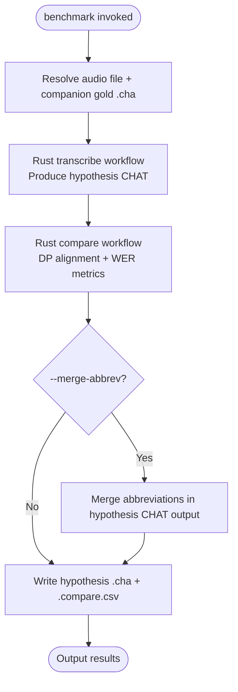

# benchmark

**Status:** Current
**Last updated:** 2026-05-02 07:30 EDT

Transcribe audio via ASR and evaluate word error rate (WER) against gold
`.cha` transcripts in the same directory. A composite command that runs
`transcribe` followed by `compare` internally.

Outputs per audio file:
1. A hypothesis `.cha` transcript
2. A `.compare.csv` with WER metrics

---

## Quick start

```bash
# Benchmark a directory of audio files against gold .cha companions
batchalign3 benchmark input/ -o output/ --lang eng

# Use a specific ASR engine
batchalign3 benchmark input/ -o output/ --lang eng --asr-engine whisper

# Use the remote server
batchalign3 --server http://your-server:8001 benchmark input/ -o output/ --lang eng
```

---

## Pipeline



---

## Options

### Path options

| Option | Meaning |
| --- | --- |
| `PATHS...` | Input audio files (`.mp3`, `.mp4`, `.wav`) or directories |
| `-o`, `--output DIR` | Output directory |

### benchmark options

| Option | Default | Meaning |
| --- | --- | --- |
| `--lang CODE` | `eng` | 3-letter ISO language code |
| `-n`, `--num-speakers N` | `2` | Number of speakers |
| `--asr-engine {rev,whisper,whisper-oai}` | `rev` | ASR engine |
| `--asr-engine-custom NAME` | — | Override ASR engine by name |
| `--wor` / `--nowor` | `--nowor` | Include or suppress the `%wor` tier in the hypothesis output |
| `--merge-abbrev` | off | Merge abbreviations in the output |
| `--bank NAME` | — | Server media bank name from `server.yaml` `media_mappings` (server-backed runs only) |
| `--subdir PATH` | — | Subdirectory under the selected `--bank` to scope the run |

---

## Gold file convention

For each audio file `FILE.mp3`, the gold companion must be `FILE.cha` in the
**same directory**. If the gold file is missing, the audio file is reported as
failed.

---

## What gets created

- `FILE.cha`: hypothesis transcript produced by ASR
- `FILE.compare.csv`: WER metrics: aggregate row plus per-POS breakdown

The hypothesis `.cha` contains a main-annotated view (unlike `compare`, which
outputs the projected reference). The `%xsrep` and `%xsmor` tiers are
injected on the hypothesis utterances showing how the hypothesis deviates from
the gold.

---

## Gotchas

**`benchmark` prefers the local daemon** when `auto_daemon` is enabled. Use
explicit `--server` to override.

**Gold files are not passed through the network** with `--server`. The server
must be able to find the gold `.cha` files on its own visible filesystem
alongside the audio.

---

## Related documentation

- [Benchmarks](../../reference/benchmarks.md), WER metrics and evaluation methodology
- [compare](compare.md), standalone transcript comparison
- [transcribe](transcribe.md), ASR transcription pipeline
- [Command I/O: benchmark](../../reference/command-io.md#9-benchmark), I/O patterns
- [Command Flowcharts: benchmark](../../architecture/command-flowcharts.md#benchmark), full architecture flowchart
