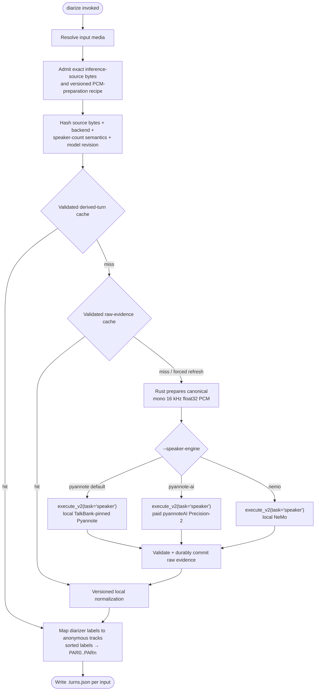

# diarize

**Status:** Current
**Last updated:** 2026-09-02 06:51 EDT

Detect speaker turns in audio (speaker diarization) without transcribing.
Each input media file produces a speaker-turns JSON artifact naming which
anonymous voice track speaks during which media span. The output schema is
exactly what `chatter rediarize --turns` consumes, so the two commands
compose into a speaker-attribution repair pipeline: batchalign3 supplies
anonymous acoustic tracks, and chatter projects those tracks onto the
transcript. Neither command can infer that an anonymous track is the child,
mother, investigator, or another semantic CHAT role without additional role
evidence.

The standalone command defaults to the local TalkBank-pinned Pyannote
pipeline. Pass `--speaker-engine pyannote-ai` to use the paid pyannoteAI
Precision-2 service instead. This is not merely an alternate spelling of
`transcribe --diarization enabled`: the integrated transcription path defaults
to the paid pyannoteAI Precision-2 cloud service and applies its speaker
evidence before utterance segmentation and CHAT construction. Use standalone
`diarize` when you need reusable acoustic turns for an existing transcript;
use integrated transcription when creating a new transcript from audio.

---

## Quick start

```bash
# Turns JSON for every audio file in a directory (auto-detect speaker count)
batchalign3 diarize recordings/ -o turns/

# One file, with a known speaker count
batchalign3 diarize session.mp3 -o turns/ --num-speakers 2

# Explicitly use paid pyannoteAI Precision-2 (requires its API key)
batchalign3 diarize session.mp3 -o turns/ --speaker-engine pyannote-ai

# Then repair a transcript's speaker attribution with chatter
chatter rediarize session.cha --turns turns/session.turns.json
```

---

## Pipeline



---

## Options

| Option | Default | Meaning |
| --- | --- | --- |
| `PATHS...` | | Input media files and/or directories (`.mp3`, `.mp4`, `.wav`) |
| `-o, --output DIR` | | Output directory for `.turns.json` artifacts |
| `--num-speakers N` | auto-detect | Expected speaker count hint. Omit unless known: auto-detection is the point of the engine |
| `--speaker-engine {pyannote,pyannote-ai,nemo}` | `pyannote` | Local TalkBank Pyannote, paid pyannoteAI Precision-2, or local NeMo |
| `--lang CODE` | `eng` | 3-letter ISO code for worker-pool selection only; diarization itself is language-independent |

---

## Output format

For input `session.mp3`, the artifact is `session.turns.json`:

```json
{
  "source": "batchalign3:pyannote",
  "turns": [
    { "start_ms": 1887, "end_ms": 2039, "track": "PAR0" },
    { "start_ms": 2039, "end_ms": 4672, "track": "PAR1" }
  ]
}
```

Track codes (`PAR0`..`PARn`) are **anonymous acoustic identities**, not
CHAT roles: `PAR0` means "the first distinct voice", not "the target
participant". Diarizer-native labels are mapped to track codes
deterministically (distinct labels sorted lexically become `PAR0..PARn`),
so re-running the same audio yields the same track assignment. Track-to-tier
projection happens downstream in `chatter rediarize`; semantic role assignment
remains a separate step, for example `chatter speaker-id` using additional
evidence or adjudication.

The command does not run ASR and does not modify a CHAT file. The later
`chatter rediarize` step uses interval overlap to assign existing transcript
material to acoustic tracks; it does not turn anonymous tracks into known
participant roles by itself.

---

## Local model download: today's truth, including a gated dependency

Standalone `diarize` runs the open-source `pyannote.audio` pipeline locally,
and pins three artifacts by exact Hugging Face commit in its release
manifest: the pipeline config (`talkbank/dia-fork`), the segmentation model
(`talkbank/seg-fork-3.0`), and the speaker-embedding model
(`hbredin/wespeaker-voxceleb-resnet34-LM`). All three repositories are public
and ungated, and "pinned" is literal: a later update to a repository's
default branch does not silently change a released BA3 runtime or reuse
evidence produced by another model graph.

**A fourth, UNPINNED dependency is fetched anonymously behind those three,
and it is currently gated.** `pyannote.audio`'s `SpeakerDiarization` pipeline
class unconditionally loads a PLDA calibration artifact during construction,
regardless of which clustering algorithm the pinned config selects; when the
config does not name a PLDA artifact of its own (ours does not), the class's
own default applies, and that default is the gated
`pyannote/speaker-diarization-community-1` repository. On a machine with no
accepted terms and no Hugging Face token, standalone `diarize` and
integrated `transcribe --speaker-engine pyannote` therefore fail on first
use with a "model access" error naming that repository.

**The fix is a Hugging Face token, in either of two places, checked in this
order:**

- `~/.batchalign.ini`, section `[auth]`, key `hf_token`:

  ```ini
  [auth]
  hf_token = <your Hugging Face token, after accepting the model's terms>
  ```

- Hugging Face's own resolution: the `HF_TOKEN` environment variable, or the
  token saved by running `hf auth login`.

Accepting the gated repository's terms at
<https://huggingface.co/pyannote/speaker-diarization-community-1> is required
regardless of which of the two the token comes from. An operator who instead
wants to avoid a Hugging Face account entirely should use
`--speaker-engine pyannote-ai` (below) or `--speaker-engine nemo`, neither of
which touches this dependency.

This local model download must not be confused with the pyannoteAI API key.
That separate credential authorizes the paid pyannoteAI cloud service selected
by standalone `--speaker-engine pyannote-ai` and used by default in integrated
diarized transcription. It is not a Hugging Face token. BA3 reads it from
either place, in this order:

- the environment: `BATCHALIGN_PYANNOTE_API_KEY` (also accepted:
  `BATCHALIGN_PYANNOTE_KEY`, `PYANNOTE_API_KEY`);
- the configuration file `~/.batchalign.ini`, section `[diarize]`, key
  `engine.pyannote.key`:

```ini
[diarize]
engine.pyannote.key = <your pyannoteAI API key>
```

With the key in place, `batchalign3 diarize ... --speaker-engine pyannote-ai`
needs nothing further. That route neither touches the gated PLDA dependency
above nor sends audio anywhere but pyannoteAI's own service. See
[transcribe](transcribe.md) for the integrated cloud path.

An operator who changes the local engine to a different, gated custom
Hugging Face model must independently accept that model's terms and
authenticate as required by its publisher. That is not the released
default.

---

## Gotchas

**`diarize` prefers the local daemon** when `auto_daemon` is enabled, like
the other audio commands. Use `--no-server` for one-off in-process runs or
explicit `--server` to target a remote daemon.

**Auto-detect beats a wrong hint.** Passing `--num-speakers 2` when four voices are
present forces the model to collapse speakers, which is the classic failure
mode this command exists to repair. Omit `--num-speakers` unless the count is
certain. (`-n` was removed on 2026-08-19; it read as a worker count.)

**Turns JSON is strict on the chatter side.** `chatter rediarize` rejects
files with unknown or missing fields rather than guessing; do not
post-process the artifact with ad-hoc scripts.

**Standalone and integrated diarization share the speaker-evidence cache.** A
warm standalone run replays validated derived turns or re-normalizes retained
raw evidence; it does not call the selected backend again. This matters most
for `pyannote-ai`, where a repeat miss could otherwise incur another paid job.
Use global `--require-media-cache` for a fail-closed replay experiment, or
`--override-media-cache` only when deliberately requesting fresh inference.

---

## Related documentation

- [transcribe](transcribe.md), the composed ASR + diarization path
- [Command I/O](../../reference/command-io.md), I/O patterns
