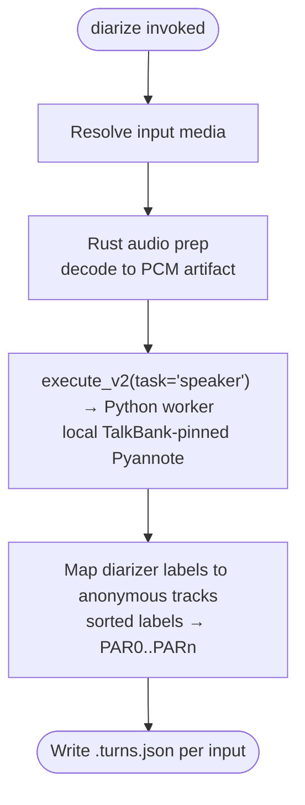

# diarize

**Status:** Current
**Last updated:** 2026-08-31 07:13 EDT

Detect speaker turns in audio (speaker diarization) without transcribing.
Each input media file produces a speaker-turns JSON artifact naming which
anonymous voice track speaks during which media span. The output schema is
exactly what `chatter rediarize --turns` consumes, so the two commands
compose into a speaker-attribution repair pipeline: batchalign3 supplies
anonymous acoustic tracks, and chatter projects those tracks onto the
transcript. Neither command can infer that an anonymous track is the child,
mother, investigator, or another semantic CHAT role without additional role
evidence.

The standalone command currently uses the local TalkBank-pinned Pyannote
pipeline. This is not merely an alternate spelling of
`transcribe --diarization enabled`: the integrated transcription path defaults
to the paid pyannoteAI Precision-2 cloud service and applies its speaker
evidence before utterance segmentation and CHAT construction. Use standalone
`diarize` when you need reusable acoustic turns for an existing transcript;
use integrated transcription when creating a new transcript from audio.

---

## Quick start

```bash
# Turns JSON for every audio file in a directory (auto-detect speaker count)
batchalign3 diarize recordings/ -o turns/

# One file, with a known speaker count
batchalign3 diarize session.mp3 -o turns/ --num-speakers 2

# Then repair a transcript's speaker attribution with chatter
chatter rediarize session.cha --turns turns/session.turns.json
```

---

## Pipeline



---

## Options

| Option | Default | Meaning |
| --- | --- | --- |
| `PATHS...` | | Input media files and/or directories (`.mp3`, `.mp4`, `.wav`) |
| `-o, --output DIR` | | Output directory for `.turns.json` artifacts |
| `--num-speakers N` | auto-detect | Expected speaker count hint. Omit unless known: auto-detection is the point of the engine |
| `--lang CODE` | `eng` | 3-letter ISO code for worker-pool selection only; diarization itself is language-independent |

---

## Output format

For input `session.mp3`, the artifact is `session.turns.json`:

```json
{
  "source": "batchalign3:pyannote",
  "turns": [
    { "start_ms": 1887, "end_ms": 2039, "track": "PAR0" },
    { "start_ms": 2039, "end_ms": 4672, "track": "PAR1" }
  ]
}
```

Track codes (`PAR0`..`PARn`) are **anonymous acoustic identities**, not
CHAT roles: `PAR0` means "the first distinct voice", not "the target
participant". Diarizer-native labels are mapped to track codes
deterministically (distinct labels sorted lexically become `PAR0..PARn`),
so re-running the same audio yields the same track assignment. Track-to-tier
projection happens downstream in `chatter rediarize`; semantic role assignment
remains a separate step, for example `chatter speaker-id` using additional
evidence or adjudication.

The command does not run ASR and does not modify a CHAT file. The later
`chatter rediarize` step uses interval overlap to assign existing transcript
material to acoustic tracks; it does not turn anonymous tracks into known
participant roles by itself.

---

## Hugging Face access

Standalone `diarize` uses the local Pyannote route and therefore needs Hugging
Face access to the configured model and any gated dependencies. Authenticate
the account that is authorized to use those assets:

```bash
hf auth login
```

If a model page requires acceptance of terms, accept them once in the browser
for the same account. An `HF_TOKEN` exported in the CLI or daemon environment
is also supported. Tokens are user or service credentials: do not copy another
person's token into email, documentation, or a shared configuration file.

This credential is distinct from `BATCHALIGN_PYANNOTE_API_KEY`, which selects
the paid pyannoteAI cloud service for integrated diarized transcription. See
[transcribe](transcribe.md) for that path.

---

## Gotchas

**`diarize` prefers the local daemon** when `auto_daemon` is enabled, like
the other audio commands. Use `--no-server` for one-off in-process runs or
explicit `--server` to target a remote daemon.

**Auto-detect beats a wrong hint.** Passing `--num-speakers 2` when four voices are
present forces the model to collapse speakers, which is the classic failure
mode this command exists to repair. Omit `--num-speakers` unless the count is
certain. (`-n` was removed on 2026-08-19; it read as a worker count.)

**Turns JSON is strict on the chatter side.** `chatter rediarize` rejects
files with unknown or missing fields rather than guessing; do not
post-process the artifact with ad-hoc scripts.

**Standalone results are not yet replayed from the speaker-evidence cache.**
Integrated `transcribe --diarization enabled` caches validated raw and derived
speaker evidence, but repeating standalone `diarize` currently reruns local
inference.

---

## Related documentation

- [transcribe](transcribe.md), the composed ASR + diarization path
- [Command I/O](../../reference/command-io.md), I/O patterns
