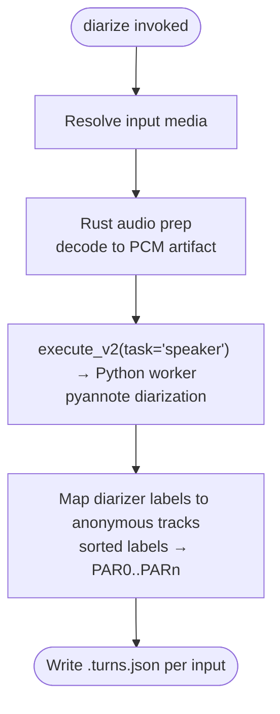

# diarize

**Status:** Current
**Last updated:** 2026-07-10 16:30 EDT

Detect speaker turns in audio (speaker diarization) without transcribing.
Each input media file produces a speaker-turns JSON artifact naming which
anonymous voice track speaks during which media span. The output schema is
exactly what `chatter rediarize --turns` consumes, so the two commands
compose into a speaker-attribution repair pipeline: batchalign3 supplies
the acoustics, chatter applies them to the transcript.

Diarization runs the pyannote pipeline that also powers
`transcribe --diarization enabled`, exposed as a standalone step.

---

## Quick start

```bash
# Turns JSON for every audio file in a directory (auto-detect speaker count)
batchalign3 diarize recordings/ -o turns/

# One file, with a known speaker count
batchalign3 diarize session.mp3 -o turns/ -n 2

# Then repair a transcript's speaker attribution with chatter
chatter rediarize session.cha --turns turns/session.turns.json
```

---

## Pipeline



---

## Options

| Option | Default | Meaning |
| --- | --- | --- |
| `PATHS...` | | Input media files and/or directories (`.mp3`, `.mp4`, `.wav`) |
| `-o, --output DIR` | | Output directory for `.turns.json` artifacts |
| `-n, --num-speakers N` | auto-detect | Expected speaker count hint. Omit unless known: auto-detection is the point of the engine |
| `--lang CODE` | `eng` | 3-letter ISO code for worker-pool selection only; diarization itself is language-independent |

---

## Output format

For input `session.mp3`, the artifact is `session.turns.json`:

```json
{
  "source": "batchalign3:pyannote",
  "turns": [
    { "start_ms": 1887, "end_ms": 2039, "track": "PAR0" },
    { "start_ms": 2039, "end_ms": 4672, "track": "PAR1" }
  ]
}
```

Track codes (`PAR0`..`PARn`) are **anonymous acoustic identities**, not
CHAT roles: `PAR0` means "the first distinct voice", not "the target
participant". Diarizer-native labels are mapped to track codes
deterministically (distinct labels sorted lexically become `PAR0..PARn`),
so re-running the same audio yields the same track assignment. Role
assignment happens downstream, e.g. in `chatter rediarize`.

---

## Gotchas

**`diarize` prefers the local daemon** when `auto_daemon` is enabled, like
the other audio commands. Use `--no-server` for one-off in-process runs or
explicit `--server` to target a remote daemon.

**Auto-detect beats a wrong hint.** Passing `-n 2` when four voices are
present forces the model to collapse speakers, which is the classic failure
mode this command exists to repair. Omit `-n` unless the count is certain.

**Turns JSON is strict on the chatter side.** `chatter rediarize` rejects
files with unknown or missing fields rather than guessing; do not
post-process the artifact with ad-hoc scripts.

---

## Related documentation

- [transcribe](transcribe.md), the composed ASR + diarization path
- [Command I/O](../../reference/command-io.md), I/O patterns
