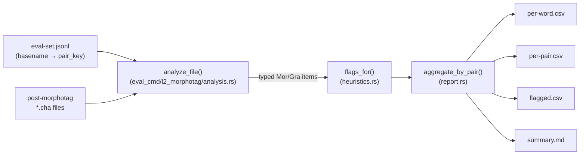

# eval l2-morphotag

**Status:** Current
**Last updated:** 2026-05-02 02:30 EDT

`batchalign3 eval l2-morphotag` evaluates the output of `batchalign3
morphotag` (L2 dispatch is on by default) against a curated evaluation
corpus. It produces aggregate per-pair statistics.

## What it does

For every `@s` word in every post-morphotag CHAT file, the command:

1. Walks the CHAT AST with `talkbank-model::walk_words(TierDomain::Mor)`
   so the pairing with `%mor` / `%gra` items is domain-correct (retraces,
   fragments, untranscribed placeholders do not consume positions).
2. Classifies the splice outcome as `Spliced`, `L2Xxx` (dispatch failed
   to `L2|xxx`), or `MissingMor` (no MOR item at the expected position —
   should be near-zero with the AST walker).
3. Applies rule-based suspicious-output detectors (heuristic flags):
   `PropnForFunctionWord` and `FeaturePosMismatch`. Flags are
   candidates for manual review, not confirmed errors.
4. Writes four artifacts to `--output`:
   - `per-word.csv` — one row per `@s` word
   - `per-pair.csv` — one row per language pair, with dispatch rate,
     splice rate, heuristic-clean rate
   - `flagged.csv` — subset of `per-word.csv` where at least one flag fired
   - `summary.md` — human-readable report against the pre-registered gates



## Usage

```bash
# Step 1: run morphotag (L2 dispatch is on by default), collecting
#         outputs in one directory.
batchalign3 morphotag \
    --sequential \
    corpus/ /tmp/l2-eval-out/

# Step 2: run the evaluator against the curated eval set.
batchalign3 eval l2-morphotag \
    --eval-set <eval-set>.jsonl \
    --morphotag-output /tmp/l2-eval-out/ \
    --output /tmp/l2-eval-report/
```

## CLI options

| Flag | Meaning |
|------|---------|
| `--eval-set <JSONL>` | File listing input CHAT files with their `pair_key` labels. One JSONL object per line with at least `path` and `pair_key`. The selection script that originally produced these files lives outside this repo (private workspace under `docs/l2-eval-batchalign3/data/`); for new evaluations, hand-write or generate the JSONL with whatever process labels each input. |
| `--morphotag-output <DIR>` | Directory (flat or nested) of post-morphotag CHAT files. Matched against the eval set by filename **basename**, so the input-side path in the JSONL does not have to match. |
| `--output <DIR>` | Destination for `per-word.csv`, `per-pair.csv`, `flagged.csv`, `summary.md`. Created if missing. |

## Why this replaces the legacy Python analyzer

An earlier Python analyzer used regexes over serialized CHAT to pair
`@s` words with `%mor` items by token position. That approach
mis-counted positions under CHAT retrace markers (`[/]`, `[//]`,
`<foo bar> [//]`), producing ~2% `missing_mor` noise that had to be
disclaimed in every summary. It has been removed; the Rust analyzer
in `crates/batchalign/src/cli/eval_cmd/l2_morphotag/` replaces it,
driving off the typed AST via `walk_words(TierDomain::Mor)` with a
`counts_for_tier` gate so position counts lock-step with
`mor_tier.items` by construction, eliminating the analyzer artifact.

On a 2026-04-15 eval corpus (54 files, 19 language pairs), the
side-by-side numbers (Python analyzer vs the Rust replacement,
captured before the Python analyzer was removed) were:

| Metric | Python analyzer | Rust analyzer |
|--------|-----------------|---------------|
| `@s` words counted | 17,352 | 16,845 |
| Aggregate splice rate | 98.4% | 99.9% |
| Aggregate heuristic-clean rate | 95.0% | 98.0% |
| Pairs with zero `missing_mor` | 6 / 19 | 18 / 19 |

The 502-word delta is retraced `@s` words the regex counted but that
have no paired `%mor` item by CHAT spec. The Rust number is the true
measure; the Python number was inflated by analyzer noise.

## See also

- [L2 morphotag design](../../reference/l2-morphotag.md)
- [Content walker (`walk_words`)](../../architecture/type-driven-design.md)
