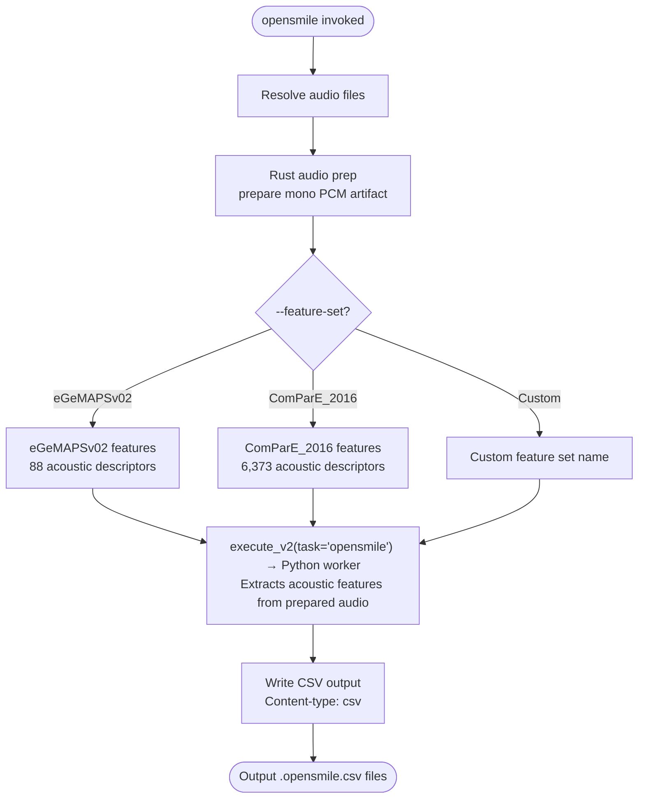

# opensmile

**Status:** Current
**Last updated:** 2026-05-02 07:30 EDT

Extract acoustic features from audio files using openSMILE. Produces
`.opensmile.csv` output, **not CHAT**. This is the only processing command
that does not produce `.cha` output.

Uses positional `INPUT_DIR OUTPUT_DIR` arguments (not the shared
`PATHS... -o OUTPUT` form used by `align`, `morphotag`, etc.).

---

## Quick start

```bash
# Extract default eGeMAPSv02 features from all audio in a directory
batchalign3 opensmile input_dir/ output_dir/

# Use a different feature set
batchalign3 opensmile input_dir/ output_dir/ --feature-set ComParE_2016

# Use the remote server
batchalign3 --server http://your-server:8001 opensmile input_dir/ output_dir/
```

---

## Pipeline



---

## Options

### Positional arguments

| Argument | Meaning |
| --- | --- |
| `INPUT_DIR` | Directory containing audio files |
| `OUTPUT_DIR` | Directory for output `.opensmile.csv` files |

### opensmile options

| Option | Default | Meaning |
| --- | --- | --- |
| `--feature-set SET` | `eGeMAPSv02` | Feature set: `eGeMAPSv02`, `eGeMAPSv01b`, `GeMAPSv01b`, or `ComParE_2016` |
| `--lang CODE` | `eng` | 3-letter ISO language code |
| `--bank NAME` | — | Server media bank name from `server.yaml` `media_mappings` (server-backed runs only) |
| `--subdir PATH` | — | Subdirectory under the selected `--bank` to scope the run |

---

## Output format

Each audio file produces `FILE.opensmile.csv` with feature names as column
headers and one row per file (or one row per frame for frame-level sets).
BA3 uses a row-oriented CSV (feature names as columns), which differs from
BA2's transposed feature-per-row export.

---

## Related documentation

- [Command I/O: opensmile](../../reference/command-io.md#10-opensmile), I/O patterns
- [Command Flowcharts: opensmile](../../architecture/command-flowcharts.md#opensmile), full architecture flowchart
