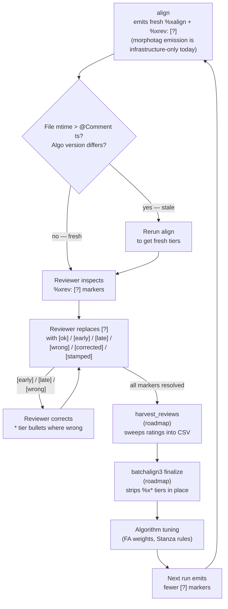

# Review Tiers: `%xalign` and `%xrev`

**Status:** Current
**Last modified:** 2026-05-02 01:30 EDT

When batchalign3 makes a decision that could be wrong — clamping a timestamp,
filling a gap between utterances, stripping non-monotonic timing, failing to
map a Stanza token back to a CHAT word — it records the decision in a
`%xalign` tier and, on the subset that warrant human attention, flags a
paired `%xrev: [?]` marker. Together these tiers make an aligned CHAT file
**self-documenting for one review cycle**: a reviewer can see what the
algorithm did and why, then confirm, correct, or overrule the decision.

This page is the reviewer's guide to that workflow.

## Read this first: the tiers are short-lived scaffolding

`%xalign` and `%xrev` are **not long-lived CHAT annotations**. They are a
snapshot of a specific algorithm's reasoning at a specific moment. They are
only trustworthy while three things hold:

1. The align (or morphotag) run that emitted them is recent.
2. The main tiers have not been manually edited since that run.
3. The align algorithm has not changed since that run.

If any of these breaks, the tiers are **stale** — the `%xalign` reasoning
may reference decisions the current algorithm would no longer make, or
point to utterances whose content has shifted. A reviewer who works through
stale tiers is wasting their own time.

**How to spot stale tiers**:

- Look at the `@Comment: [ba3 align | ... | <timestamp>]` line near the
  top of the file. If the file's last modification time (`ls -l FILE.cha`)
  is **after** that timestamp, someone has edited the main tiers since
  align ran. The `%xalign` entries are stale.
- Look at the `@Comment` for the engine/algorithm version. If it differs
  from what the current batchalign3 version emits, the tiers predate the
  current algorithm.
- Going forward, every `%xalign` entry will carry its own inline algorithm
  version tag (e.g. `%xalign: monotonicity:end_clamped@algo-v3.2 ...`) so
  staleness can be read off each entry individually. Until that ships, the
  `@Comment`-vs-mtime check is the authoritative signal.

**What to do with stale tiers**: rerun `align` (or `morphotag`) on the
file. The rerun strips all existing `%x*` tiers and emits fresh ones
against the current algorithm and current file content. Never review a
stale tier.

## What the tiers look like

A decision tier entry is written directly below the utterance it applies to:

```chat
*CHI:   hello world . •1000_5000•
%xalign:	monotonicity:end_clamped overlap=1200ms prev_end=6200 next_start=5000
%xrev:	[?]
```

`%xalign` content follows the shape `module:strategy reason_string`, where
`reason_string` is a space-separated list of `key=value` pairs. `%xrev`
content is one short bracket-marker from the review vocabulary below, with an
optional free-text note after it.

## The review marker vocabulary

Reviewers replace the `[?]` in `%xrev` with one of:

| Marker | Meaning |
|---|---|
| `[ok]` | The algorithm's decision was correct. No change needed. |
| `[early]` | The bullet on the `*` tier starts earlier than it should. |
| `[late]` | The bullet on the `*` tier starts later than it should. |
| `[wrong]` | The decision was wrong but the reviewer has not yet fixed it. Leaves the file in a known-broken state. |
| `[corrected]` | The decision was wrong and the reviewer has fixed the `*` tier (e.g., moved or replaced a bullet). |
| `[stamped]` | The reviewer manually placed timing on an utterance that had none. |

A short free-text note may follow the marker, e.g. `[corrected] bullet was ~200ms late`.

## Decision modules

The `module` prefix on `%xalign` content tells the reviewer which pipeline
stage raised the decision. All decisions currently land in a single unified
`%xalign` tier regardless of module.

| Module prefix | Source stage | Status today | Typical strategies |
|---|---|---|---|
| `fa:` | Forced alignment (`align`) | Live | `gap_filled`, `boundary_averaged`, `lis_removal`, `words_timing_dropped` |
| `monotonicity:` | Timing sanity (`align`) | Live | `end_clamped`, `timing_stripped` |
| `utr:` | Utterance timing recovery (`align` pre-pass) | Live | `unmatched`, `zero_duration_skipped` |
| `morphosyntax:` | Stanza mapping (`morphotag`) | **Infrastructure only** — strategy enum exists at `crates/talkbank-transform/src/decisions.rs::MorphosyntaxStrategy` and `DecisionRecord`s are constructed at `morphosyntax/injection.rs`, but the morphotag dispatch path does not currently call any tier-emission function, so no `morphosyntax:` `%xalign` lines actually land in output today. | `mapping_failed`, `retokenization_failed`, `injection_failed`, `nlp_no_sentences` |

The live `fa:`, `monotonicity:`, and `utr:` decisions are emitted by the
FA pipeline via `inject_review_tiers` in
`crates/batchalign/src/chat_ops/fa/review_tiers.rs:26`, called from
`crates/batchalign/src/fa/incremental.rs:340`. `fa:` and `monotonicity:`
strategy decisions are constructed in
`crates/batchalign/src/chat_ops/fa/orchestrate.rs`; `utr:` strategies
are constructed in `crates/batchalign/src/chat_ops/fa/utr.rs` (e.g.
`utr.rs:326,351`). The generalized cross-pipeline writer
`inject_decision_tiers` exists at
`crates/talkbank-transform/src/decisions.rs:380` but is currently only
exercised in tests; wiring it into morphotag is the path that would
turn the `morphosyntax:` row above from "infrastructure only" to
"live".

## Controlling emission: `--review-level`

The `align` command accepts `--review-level` (the field
`AlignArgs.review_level` at `crates/batchalign/src/cli/args/commands.rs:179`).
Since `morphotag` does not currently emit these tiers, it does not
accept the flag — the table row in §"Decision modules" notes that the
`morphosyntax:` infrastructure exists but is not wired up.

| Level | Emits |
|---|---|
| `none` | No `%xalign` or `%xrev` tiers. Smallest output — use for publication. |
| `low-confidence` (default) | `%xalign` + `%xrev: [?]` only on uncertain decisions. |
| `all` | `%xalign` on every bulleted utterance plus `%xrev: [?]` on uncertain ones. |

Source: `CliReviewLevel` in `crates/batchalign/src/cli/args/commands.rs:61`.

## The review loop

The review loop is a **short same-cycle** process: emit, review, harvest
ratings into a training CSV, strip the tiers. Ratings that sit around
unharvested for months lose their value because the algorithm they rated
moves on.



Source files verified against:
`crates/batchalign/src/chat_ops/fa/review_tiers.rs` (writer side —
`inject_review_tiers` builds the `%xalign`/`%xrev` dependent tiers),
`crates/talkbank-transform/src/decisions.rs` (typed `DecisionStrategy`
enum, `xalign_content` rendering, and `strip_decision_tiers` cleanup
helper), and `docs/pipeline-decision-metadata-design.md` (design doc).

The `finalize` and `harvest_reviews` stages are currently **roadmap** —
they are not yet shipped. Today, reviewers clean a file by re-running with
`--review-level=none` (or by deleting the tiers in an editor). See
*Publishing a clean copy* below.

## Reviewer workflow (step by step)

1. **Open the CHAT file** in your editor of choice. Any editor that preserves
   tabs between the tier label and the content will work.
2. **Search for `%xrev: [?]`**. Each match is one decision awaiting review.
3. **Read the paired `%xalign` line**. The `module:strategy` prefix and the
   `key=value` reason string together tell you what the pipeline did.
4. **Inspect the `*` tier and the bullet**. Decide whether the decision was
   right.
5. **Replace `[?]` with a marker from the vocabulary.** If you had to fix a
   bullet, use `[corrected]` and add a short note.
6. **Save.** The file is now reviewed for that utterance.

When every `%xrev: [?]` has been replaced with a resolved marker, the file is
ready for publication.

## Publishing a clean copy

### Today

Re-run the command with `--review-level=none`:

```bash
batchalign3 --no-open-dashboard align FILE.cha -o published/ --lang eng --review-level none
```

This strips all existing `%x*` tiers and does not emit new ones. The
published file has no audit scaffolding.

**Caveat:** this also throws away the reviewed ratings — they exist only in
the pre-strip file. Save a copy before publishing if you want to preserve
reviewer work.

### Roadmap

`batchalign3 finalize` will be the principled replacement:

```bash
# sketch — not yet shipped
batchalign3 finalize FILE.cha --require-reviewed
```

`finalize` will (a) refuse to run if any `%xrev: [?]` markers remain, (b)
refuse to run if the tiers are stale (file mtime newer than the align
`@Comment` timestamp, or algorithm version tag doesn't match current), (c)
strip `%x*` tiers from the file in place, and (d) rewrite the `@Comment`
provenance line to record the finalize step. No archive directory: the
persistent artifact of review is the harvested training CSV, not a
per-file archive.

**Harvest before finalize.** Once the harvest tool ships, run it on the
reviewed file to capture ratings into the training CSV, then run finalize
to strip the tiers. If you finalize without harvesting, the ratings are
lost — that's intentional; stale ratings are worthless, so the tooling
refuses to let you preserve them into an ambiguous future.

## Patterns worth attention

These are the decisions that most often warrant reviewer correction. Skim
for them first.

### Alignment (`align`)

| Prefix:strategy | What it means | What to check |
|---|---|---|
| `monotonicity:end_clamped` | Utterance end was pulled in to prevent overlap with the next utterance. | Is the overlap a real overlap (`[<]`/`[>]` style) or a timing error? |
| `monotonicity:timing_stripped` | Utterance timing was removed because it started before the previous utterance. | Was the timing just swapped? Is this a two-track conversation? |
| `utr:unmatched` | Untimed utterance could not be matched to any ASR tokens. | Is the transcript different from what was said? Is the audio silent at that point? |
| `fa:words_timing_dropped` | Word-level timings were dropped because clamping made `start >= end`. | Is the utterance bullet too narrow? Does it need widening? |
| `fa:gap_filled` | A bullet gap was filled by extending the adjacent utterance. | Did the speaker really continue, or is there silence that should stay? |

### Morphotag (`morphotag`) — strategies defined but not yet emitted

The strategy enum (`MorphosyntaxStrategy` at
`crates/talkbank-transform/src/decisions.rs:158`) defines these
variants, and `DecisionRecord`s for them are constructed during
morphotag injection — but no morphotag code path currently calls
`inject_decision_tiers`, so they are never written into output CHAT.
Treat this table as the contract you would see *after* wiring is
added, not as a description of what currently lands in files.

| Prefix:strategy | What it means | What to check |
|---|---|---|
| `morphosyntax:mapping_failed` | UD→CHAT conversion failed. No `%mor`/`%gra` was produced for this utterance. | Is there an unusual word, code-switch, or punctuation that confused the tagger? |
| `morphosyntax:retokenization_failed` | Stanza split or merged tokens in a way that couldn't be mapped back to CHAT words. | Are there contractions, MWTs, or compound words that need hand-annotation? |
| `morphosyntax:injection_failed` | Word-count mismatch between main tier and `%mor`. | Often an MWT expansion issue. |
| `morphosyntax:nlp_no_sentences` | Stanza returned an empty result. | Is the utterance content so short or unusual that Stanza produced nothing? |

## FAQ

**Why do the tiers come back when I re-run the command?**

Re-running `align` strips any existing `%x*` tiers before emitting new
ones (see `strip_decision_tiers()` in
`crates/talkbank-transform/src/decisions.rs:438`, called from
`inject_review_tiers` in `chat_ops/fa/review_tiers.rs`). The ratings
you entered are discarded on re-run. `morphotag` does not currently
touch these tiers in either direction — it neither emits nor strips
them — so review-tier state on a file persists across morphotag
reruns until the next `align` run rewrites them. To preserve ratings,
finalize (once shipped) or save a copy before re-running `align`.

**Can I delete the tiers by hand?**

Yes. They're ordinary CHAT dependent tiers. Deleting every `%xalign` and
`%xrev` line from the file is equivalent to re-running with
`--review-level=none`, except faster for a single file.

**Do my ratings actually feed into algorithm improvement?**

They will, once the harvest tool ships. The
intended discipline is short-cycle: review a file, harvest the ratings
into the training CSV, finalize the file, repeat. Ratings sitting in a
file for months without being harvested **lose their value** because the
algorithm that rated them moves on. Rate the file *and* make sure someone
harvests it soon after.

**I opened a file and the `%xalign` tiers look old. Are they still useful?**

Probably not. Check the `@Comment: [ba3 align | ... | <timestamp>]` line
and compare it against the file's last modification time. If the file has
been edited since align ran, or the algorithm has been bumped since then,
the tiers are **stale** — the `%xalign` reasoning no longer reflects what
the current pipeline would do. **Rerun align before reviewing.** Stale
tiers are misleading, not helpful.

**I reviewed a file, but nobody harvested it for three months. What now?**

The ratings are probably no longer usable because the algorithm has
changed. Rerun align (which strips the old tiers and emits fresh ones),
re-review, and harvest promptly this time. Old ratings against an old
algorithm are not rescuable — they don't describe decisions the current
pipeline makes.

**What's the difference between `[wrong]` and `[corrected]`?**

`[wrong]` means the decision was wrong and the reviewer has not fixed the
`*` tier. `[corrected]` means the decision was wrong and the reviewer has
fixed the `*` tier (usually by moving a bullet or replacing a word). Use
`[corrected]` whenever you actually edit the file; use `[wrong]` only when
flagging for someone else to fix.

**Is there a `%xmor` tier?**

Not currently. Morphotag decisions are recorded in the unified `%xalign`
tier with a `morphosyntax:` prefix. A draft design in
`docs/pipeline-decision-metadata-design.md` proposes splitting per-task
tiers, but implementation depends on project-level decisions about whether
the split is worth the extra tier noise.

## Related

- [Processing Provenance](./provenance.md) — `@Comment` headers that record
  which commands were run on a file.
- [Developer: Decision Provenance](../developer/decision-provenance.md) —
  internals of the `DecisionRecord` pipeline that produces `%xalign`
  content.
