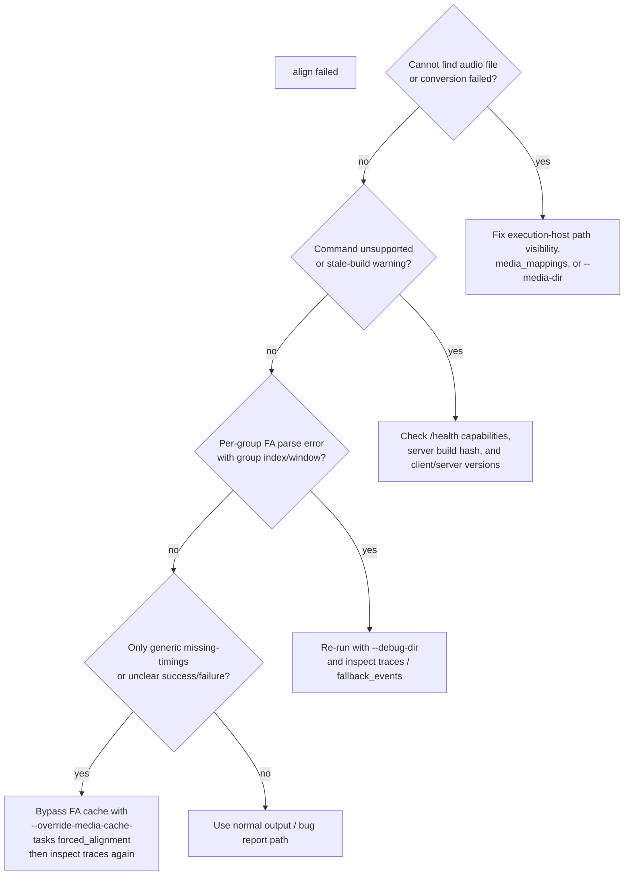

# Troubleshooting

**Status:** Current
**Last updated:** 2026-05-02 02:00 EDT

## Start with verbose output

```bash
batchalign3 -vvvv align ~/corpus/ -o ~/output/
```

Use the final error message together with the sections below.

## Attach run logs to bug reports

```bash
batchalign3 logs --export
```

CLI-managed runs write structured logs under `~/.batchalign3/logs/`.

## Worker Python resolution order

When debugging which Python the CLI selects, the full resolution order is:

1. `BATCHALIGN_PYTHON` environment variable
2. Active `VIRTUAL_ENV`
3. A sibling Python next to the binary that can import `batchalign.worker`
4. A project `.venv` discovered by walking up from the binary
5. `python3.12` on macOS/Linux, or `python` on Windows

## The CLI cannot start local workers

For local processing, the selected Python interpreter must be able to import
`batchalign.worker`.

Check the runtime explicitly:

```bash
$BATCHALIGN_PYTHON -c "import batchalign.worker"
```

If you are not using `BATCHALIGN_PYTHON`, run the same import test with the
Python you expect Batchalign to discover.

## `batchalign3: command not found`

Install the package:

```bash
uv tool install batchalign3
```

If `uv` installed the tool but your shell still cannot find it, ensure the uv
tool bin directory is on `PATH`.

## The daemon will not start

Check the daemon log:

```bash
cat ~/.batchalign3/daemon.log
```

Then force a clean restart:

```bash
batchalign3 serve stop
rm -f ~/.batchalign3/daemon.json
batchalign3 morphotag corpus/ -o output/
```

## Cache looks stale

Bypass the cache for one run:

```bash
batchalign3 --override-media-cache morphotag corpus/ -o output/
```

Clear cached data:

```bash
batchalign3 cache clear --yes
batchalign3 cache clear --all --yes
```

## Runs are slow or memory-heavy

Cap workers explicitly:

```bash
batchalign3 --workers 2 morphotag corpus/ -o output/
```

Force CPU mode:

```bash
batchalign3 --force-cpu morphotag corpus/ -o output/
```

The first real worker-backed run is usually slower because models may still need
to load.

## Job deferred or rejected due to memory pressure

If a job fails with `MemoryPressure` or logs say "job deferred due to memory
pressure", the server's memory gate detected insufficient RAM. The gate
polls available memory for up to `memory_gate_timeout_s` seconds before
giving up (default 120; see `default_memory_gate_timeout_s` in
`crates/batchalign/src/types/config/server.rs`).

**Common causes:**

1. Too many concurrent workers — reduce `max_workers_per_job` or
   `max_concurrent_jobs` in `~/.batchalign3/server.yaml`
2. Other processes consuming RAM
3. Idle workers holding loaded models — the pool evicts idle workers
   automatically when host memory pressure rises; if eviction isn't
   firing fast enough, restart the server

**Quick fixes in `~/.batchalign3/server.yaml`:**

```yaml
# Force the server to use small-machine memory budgets
memory_tier: small

# Or override individual values
memory_gate_mb: 2000            # Reduce headroom reserve
stanza_startup_mb: 3000         # Stanza actually uses ~2-3 GB

# Disable the gate entirely (not recommended for production)
# memory_gate_mb: 0
```

The server auto-detects a memory tier from total RAM (Small &lt;24 GB,
Medium 24-48 GB, Large 48-128 GB, Fleet &gt;128 GB). Use `memory_tier`
to override. See [Worker Tuning](worker-tuning.md) for details.

## "Cannot find audio file" or "Media conversion failed"

**Cannot find audio file:** The server could not locate a media file
matching the CHAT file's stem. Audio `--server` jobs now require the execution
host to see the same filesystem paths as the CLI invocation. Run the CLI on the
execution host itself (or over SSH/VNC), or make sure the same corpus path is
mounted there. If the corpus root and media root differ on that host, configure
local `media_mappings` or pass a server-visible `--media-dir`. See
[Media Resolution](../reference/media-conversion.md#media-resolution).

**Media conversion failed — ffmpeg not found:** MP4 (and M4A, WebM, WMA)
files require ffmpeg for conversion to WAV. Install ffmpeg:

```bash
# macOS
brew install ffmpeg

# Ubuntu/Debian
sudo apt install ffmpeg

# Or download from https://ffmpeg.org/download.html
```

After installing, restart the server (`batchalign3 serve stop && serve start`).

**Media conversion failed — ffmpeg error:** The ffmpeg conversion itself
failed. Check that the source media file is not corrupted. The error
message includes ffmpeg's stderr output for diagnosis.

## `align` / forced-alignment failures: where to look first

When `align` fails, the useful distinction is **which stage failed**:



The two most useful commands are:

```bash
batchalign3 -vvvv align \
  --debug-dir /tmp/ba-debug \
  --override-media-cache-tasks forced_alignment \
  -o output/ \
  file.cha
```

and, for server mode:

```bash
curl http://SERVER:8001/jobs/JOB_ID/traces | python3 -m json.tool
```

What to look for in the trace payload:

- `fa_timeline.fallback_events[]` — confirms a Wave2Vec group retried with
  Whisper FA
- empty `fallback_events` on a successful rerun — often means the run was served
  from FA cache rather than reproducing the failure
- group index + `audio_start_ms` / `audio_end_ms` — the exact failing window to
  reproduce offline

If you are debugging direct mode instead of `--server`, the same `--debug-dir`
switch enables trace capture, but the trace is exported as `debug-traces.json`
in the local job staging directory rather than through `/jobs/{id}/traces`.

## Some utterances lose timing after `align`

If `align` leaves some utterances without timing bullets, or if `chatter
validate` reports E362 (non-monotonic timestamps) on align output, the most
likely cause is **overlapping speech** in the transcript.

### Why this happens

CHAT transcription convention places utterances in conversational order for
readability. Overlapping speech markers (`&*SPK:words`) interleave one
speaker's words inside another speaker's utterance. But in the audio, those
words occur in temporal order, which may differ from the text order.

The alignment engine uses a monotonic matcher: it can only assign timestamps
that increase through the file in text order. When text order and audio order
diverge -- which is inherent in transcripts with dense `&*` markers -- the
matcher cannot assign correct timestamps to every utterance without violating
monotonicity.

Rather than write invalid CHAT or silently corrupt timestamps, `align` strips
timing from the affected utterances. They appear in the output as plain
untimed text, just as they would before alignment. The surrounding utterances
retain their full word-level timing.

### How to identify affected utterances

Untimed utterances have no bullet at the end of the main tier line and no
`%wor` dependent tier. You can find them with:

```bash
# Show main-tier lines without timing bullets
grep '^\*' output.cha | grep -v '[0-9]_[0-9]'
```

If the untimed utterances cluster in blocks (especially around sections with
frequent `&*` markers), the cause is almost certainly text/audio order
divergence.

### What you can do

1. **Accept partial coverage.** For many workflows, having most utterances
   timed is sufficient. The untimed utterances are still valid CHAT -- they
   just lack timing.

2. **Reorder utterances to temporal order before aligning.** If you need full
   coverage and the transcript has sections where conversational grouping
   differs from temporal order, reordering those sections will let the aligner
   assign timestamps to all utterances. This is the most reliable fix.

3. **Use `align --before`** when re-aligning after hand edits. This preserves
   existing good timing for unmodified utterances and only re-aligns the
   changed regions, reducing the chance of cascading timing loss.

### Known high-impact patterns

- **Dense `&*` markers** (3+ per utterance, or long stretches where most
  utterances contain `&*`): common in aphasia protocols, conversation analysis,
  and multi-party recordings. These produce the largest untimed blocks.

- **Hand-edited transcripts with restructured speaker turns**: When a
  reviewer splits, merges, or reattributes ASR utterances, the resulting
  text order may diverge substantially from the original audio order.

- **Short backchannels ("mhm", "yeah", "okay")**: These are often placed
  after the main speaker's utterance in the transcript but occurred during it
  in the audio. A single misplaced backchannel can push subsequent utterances
  out of monotonic order.

This is a known architectural limitation of monotonic alignment, not a bug.
For moderate-overlap files, improvements to `&*` handling should reduce the
problem.  For heavily restructured transcripts with dense overlap, a more
fundamental change (per-speaker alignment) is needed.  See
[Monotonicity Invariant](../reference/forced-alignment.md#monotonicity-invariant)
for the technical details and roadmap.

## "Command not supported" or missing commands

If the server rejects a command (e.g., `align` or `transcribe`) with an error
like "command not supported", the server did not detect the required Python
dependencies at startup.

**Check what the server advertises:**

```bash
curl http://localhost:8000/health | python3 -m json.tool
```

Look at the `capabilities` list. If the command you need is missing:

1. **Check the server log** for lines containing "excluding from server
   capabilities" — these show which commands failed the capability gate and why.

2. **Verify the Python environment** has the required packages installed. All
   core commands work out of the box with a standard install (`uv tool install
   batchalign3`). If a dependency was removed or failed to build, the capability
   probe will exclude the affected command. Key dependencies:
   - `align` needs `torch` and `torchaudio`
   - `transcribe` needs `openai-whisper`
   - `translate` needs `googletrans`
   - `morphotag`, `utseg`, `coref` need `stanza`
   - `opensmile` needs `opensmile`
   - `avqi` needs `parselmouth` and `torchaudio`

   All of these are included in the base `batchalign3` package, including the
   Cantonese providers.

3. **Restart the server** after installing missing packages — capabilities are
   detected once at startup:

   ```bash
   batchalign3 serve stop
   batchalign3 serve start
   ```

## `--server` seems to be ignored

That should no longer happen for audio commands. If `align`, `transcribe`, or
another audio workflow still behaves like a local-only run, double-check that:

1. you actually passed `--server http://...`
2. the target server advertises the command in `/health.capabilities`
3. the server can see the same absolute input/output paths on its filesystem

Check remote dispatch with a command that supports it:

```bash
batchalign3 serve status --server http://yourserver:8000
batchalign3 --server http://yourserver:8000 morphotag corpus/ -o output/
```

## "Did my long-running job die when the server restarted?"

If you redeployed or restarted `batchalign3 serve` while a multi-hour
`align` or `transcribe` batch was in progress, whether it survived
depends entirely on the control-plane backend, which is selected by the
`temporal_server_url` field in `~/.batchalign3/server.yaml`:

- **In-process backend** (`temporal_server_url` empty / `"none"` /
  `"local"` / `"disabled"`, or the field omitted) — the job is gone.
  The control plane lives inside this server process.
- **Temporal backend** (`temporal_server_url` set to a real URL) —
  the job almost certainly survived. The Temporal workflow re-leases
  the activity to a worker after the server reconnects.

Confirm by querying `http://<server>:<port>/jobs` (the public JSON
endpoint — `/api/jobs` is **404**, that's the SPA shell route prefix).
A surviving Temporal job will show `status: running` again with
`completed_files` advancing, even if `completed_at` is stamped.

Full survival semantics, including how to read `last_cancelled_source`
and `last_cancelled_reason` columns in `~/.batchalign3/jobs.db`:
[Server Mode → What happens to in-flight jobs when the server restarts](server-mode.md#what-happens-to-in-flight-jobs-when-the-server-restarts).

## Submission errors

### `server returned 413: length limit exceeded`

**Symptom:** `batchalign3` aborts a submission with
`server returned 413: length limit exceeded` (or the JSON `detail`
contains that phrase).

**Cause:** The chunk's total serialized CHAT content exceeded the server's
`max_body_bytes_mb`. This only happens on **remote** submissions
(explicit `--server http://host:port` with a non-loopback host), where the
request body carries every selected file's CHAT text. Local submissions
(the auto-daemon path or a loopback-addressed server) use
`paths_mode=true` and never put file contents in the body, so 413 is
structurally unreachable on the local path. See
[Submission Modes](../reference/command-io.md#submission-modes-paths_modetrue-vs-paths_modefalse)
for the selection rule.

**Remediation.** Pick one:

1. **Raise the remote server's body limit.** On the server, edit
   `~/.batchalign3/server.yaml`:

   ```yaml
   max_body_bytes_mb: 1024
   ```

   Then restart: `batchalign3 serve stop && batchalign3 serve start`.
   The default is 512 MB; raise it only if your payloads genuinely
   exceed that.

2. **Submit smaller batches.** Split the input set so each submission
   stays under the current limit. `--file-list` makes chunking trivial:
   write the filenames for each chunk to a separate list and submit in
   sequence.

3. **Use a local daemon instead of remote `--server`.** If the CLI and
   the server share a filesystem, dropping `--server` lets the CLI use
   the local daemon on `127.0.0.1`, which bypasses the body limit
   entirely (path lists instead of file contents). This is the simplest
   fix when a fleet machine keeps the corpus on shared storage.

The CLI does **not** retry 413 — a deterministic rejection indicates the
payload itself is too large, and re-sending would waste work. See
[Submit-path retries](../architecture/observability.md#submit-path-retries)
for the full retry contract.

### Submission silently drops chunks

**Symptom (historical):** A batch script reported success on every chunk
but the output directory had fewer files than input, and server logs
showed no trace of the missing submissions.

**Cause:** A transient connect-refused from the daemon during job
finalization reached the CLI as an immediate error. Scripts that
treated submission errors as terminal silently skipped the chunk.

**Remediation.** The CLI retries transient connect/timeout failures
automatically (`RETRY_ATTEMPTS = 3`, exponential backoff). Use a current
`batchalign3` build. A non-CLI client talking directly to the REST API
must implement its own retry on connect/timeout — but must not retry
HTTP 4xx/5xx.

## External service timeouts

Timeouts reaching `api.rev.ai`, `huggingface.co`, or other external providers
usually mean the host cannot reach the required service. Confirm network access
from the machine running the worker runtime.

## Apple Silicon / MPS issues

If you hit GPU-specific failures, retry with CPU mode:

```bash
batchalign3 --force-cpu align corpus/ -o output/
```

The `--force-cpu` flag is the only supported way to force CPU mode at the
CLI surface. (The only `BATCHALIGN_*` env vars wired into CLI args are
`BATCHALIGN_SERVER`, `BATCHALIGN_PYTHON`, and `BATCHALIGN_DEBUG_DIR`;
there is no `BATCHALIGN_FORCE_CPU` env override. To pin the
behavior across runs without typing the flag, set `force_cpu: true`
in `~/.batchalign3/server.yaml` and run via `batchalign3 serve`.)

## "Stripped N upstream-library warnings" in the server log

You may see lines in `~/.batchalign3/server.log` like:

```
WARN Stripped 2 Stanza control-token leak(s) from fin item 15
     (stanza defect registry: Defect 4). Leaks: [...]
```

These are the **normal signal of an active workaround**, not an
error. Batchalign knows about specific defects in the upstream
libraries it uses (Stanza, Whisper, Apple MPS, and others) and
silently corrects them in place. Every correction emits a warning
so the workaround is visible in your logs.

What to do:

- **If your output CHAT looks correct** (check with
  `chatter validate path/to/output.cha`): nothing. The workaround
  did its job. The warning is informational — it tells you "we
  applied a known upstream-defect workaround N times on this job."
- **If `chatter validate` reports errors on the output**: the
  workaround may have missed a new variant of the defect. Please
  file a bug with the input file, the warning log excerpt, and the
  validation error — we will extend the workaround vocabulary.

The comprehensive list of known upstream defects and their registered
workarounds is maintained at
[reference/stanza-limitations.md](../reference/stanza-limitations.md)
(for Stanza) and
[developer/apple-mps-workarounds.md](../developer/apple-mps-workarounds.md)
(for Apple MPS). The engineering policy governing how we add and
retire workarounds is at
[developer/upstream-defect-policy.md](../developer/upstream-defect-policy.md).

## Capture a full debug transcript

```bash
batchalign3 -vvv morphotag corpus/ -o output/ 2>&1 | tee debug.log
```

Attach `debug.log` together with `batchalign3 logs --export` when filing an
issue.

## Filing bug reports

Open an issue at <https://github.com/TalkBank/talkbank-tools/issues>.

Attach:
- `batchalign3 logs --export` output
- `batchalign3 -vvv <your-command> 2>&1 | tee debug.log`
- Your OS, Python version, and `batchalign3 version` output
