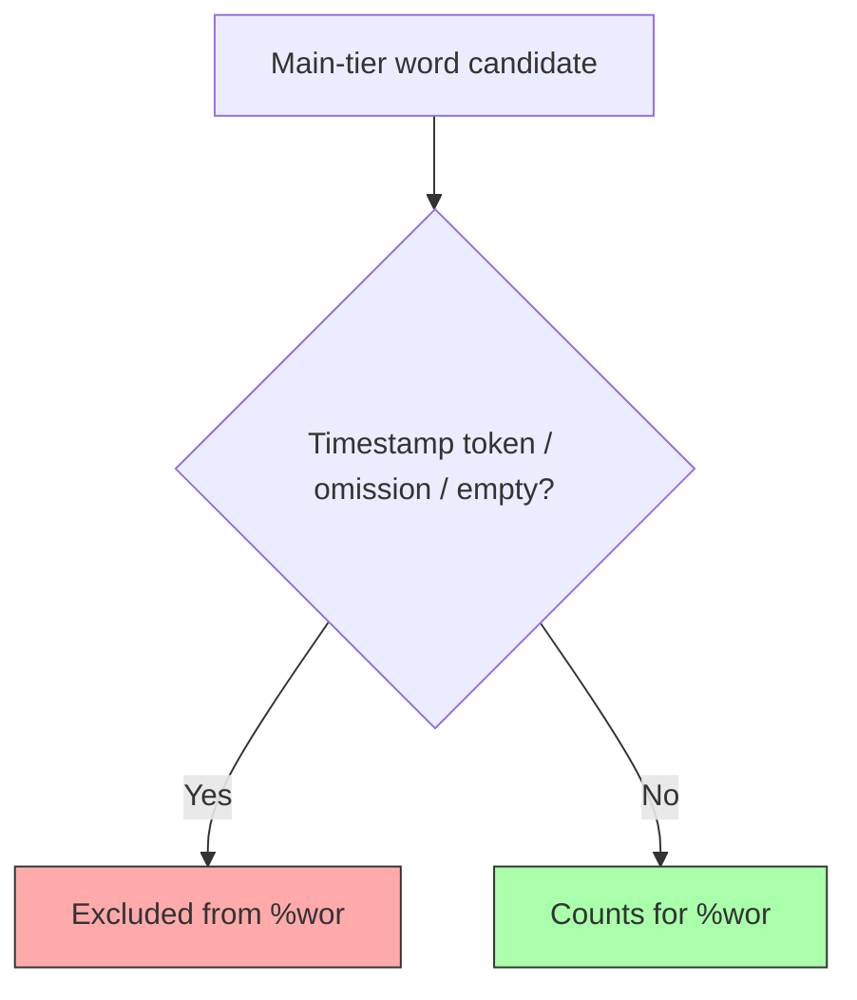

# Dependent Tiers

**Status:** Reference
**Last updated:** 2026-03-24 00:01 EDT

Dependent tiers appear on lines beginning with `%` immediately after an utterance. They provide annotations linked to the main tier content.

CHAT defines four structural categories of dependent tiers:

1. **Structured linguistic tiers** — parsed into typed AST nodes with word-level alignment
2. **Phon phonological tiers** — syllabification and segmental alignment from the Phon project
3. **Bullet-content tiers** — free-form text with optional inline timing markers
4. **Text tiers** — plain text with no structural alignment

## Structured Linguistic Tiers

These tiers have rich, parsed representations in the data model. Each token aligns 1-to-1 with an alignable word on the main tier (excluding retraces, pauses, and events). Terminators (`.`, `?`, `!`) must match the main tier terminator.

### %mor — Morphological Analysis

The `%mor` tier carries part-of-speech tags, lemmas, and morphological features for each word on the main tier. See [The %mor Tier](mor-tier.md) for full documentation covering the UD-style format, data model, divergences from Universal Dependencies, and migration from traditional CHAT MOR.

Format: `POS|lemma[-Feature]*`, with `~` separating post-clitics.

```chat
*CHI:	she's eating cookies .
%mor:	PRON|she~AUX|be-Pres-S3 VERB|eat-Prog NOUN|cookie-Plur .
```

### %gra — Grammatical Relations

The `%gra` tier encodes dependency syntax using Universal Dependencies relation labels. Each entry has the format `index|head|relation`, where indices are 1-based and head `0` indicates ROOT.

```chat
*CHI:	I want cookies .
%mor:	PRON|I VERB|want NOUN|cookie-Plur .
%gra:	1|2|SUBJ 2|0|ROOT 3|2|OBJ 4|2|PUNCT
```

The `%gra` tier aligns with `%mor` chunks (clitics expand into multiple chunks). Validation checks sequential indices (E721), ROOT structure (E722 missing root, E723 multiple roots), and circular dependencies (E724).

### %pho / %mod — Phonological Transcription

The `%pho` tier records actual pronunciation; `%mod` records target/model pronunciation. Both use the same format: space-separated phonetic tokens aligned 1-to-1 with main tier words.

```chat
*CHI:	I want three cookies .
%pho:	aɪ wɑnt fwi kʊkiz .
%mod:	aɪ wɑnt θri kʊkiz .
```

Phonological tiers support IPA, UNIBET, X-SAMPA, or custom notation systems. They are used for child language, speech disorders, L2 learning, and dialectal variation studies.

> **Parsing strategy:** We deliberately parse only the minimal word/group-level
> structure in `%pho` and `%mod` needed for coarse alignment with the main tier.
> The full IPA phoneme content is stored as opaque strings — deep phonological
> analysis is handled by [Phon](https://www.phon.ca/), and we avoid duplicating
> that work. The Phon extension tiers (`%modsyl`, `%phosyl`, `%phoaln`) follow
> the same strategy.

### %sin — Gesture and Sign Annotation

The `%sin` tier codes gestures and signs aligned with speech. Each token is either `0` (no gesture) or `g:referent:type` (e.g., `g:ball:dpoint` for a deictic point at a ball).

```chat
*CHI:	that ball .
%sin:	g:ball:dpoint 0 .
```

Multiple simultaneous gestures use bracket grouping: `〔g:toy:hold g:toy:shake〕`.

### %wor — Word Timing

The `%wor` tier carries word-level timing annotations for media synchronization.
Words may include inline bullets with millisecond timestamps. Word text is
display-only ("eye candy") — timing data comes from the bullet fields.

`%wor` is **not** a flat "all tokens except punctuation" tier. It follows a
word-level alignment rule:

- **Regular words** count.
- **Fillers** (`&-um`, `&-uh`, `&-you_know`) count.
- **Fragments** (`&+...`) count.
- **Nonwords** (`&~...`) count.
- **Untranscribed placeholders** (`xxx`, `yyy`, `www`) count.
- **Replacements** keep the **original spoken word slot** for `%wor`; the
  replacement text matters for `%mor`, not `%wor`.
- **Retrace scope does not change `%wor` membership.**
- **Overlap markers do not change `%wor` membership.**

These bullets define **membership only**. After `%wor` membership is determined,
alignment is **strictly 1:1**: every counted main-tier item must have exactly one
`%wor` word, and every `%wor` word must correspond to exactly one counted
main-tier item. There are no optional `%wor` classes.

```chat
*CHI:	I want cookies .
%wor:	I want cookies .
```

Exact corpus-shaped contrast:

```chat
*CHI:	<one &+ss> [/] one play ground .
%wor:	one •321008_321148• ss •321148_321368• one •321809_321969• play •322049_322310• ground •322390_322890• .

*EXP:	&+ih <the what> [/] what's letter &+th is this ?
%wor:	ih •49063_49103• the •49103_49163• what •49183_50205• what's •50205_50405• letter •50405_50685• th •50886_50946• is •50946_51046• this •51086_51586• ?

*EXP:	what's is dis [: this] ?
%wor:	what's •37050_37471• is •37491_37631• dis •37631_38131• ?

*CHI:	xxx snack .
%wor:	xxx •884568_884668• snack •884668_885168• .

*CHI:	&~um a boat .
%wor:	um •1073579_1073779• a •1073779_1073799• boat •1076861_1077361• .

*CHI:	&-mm [<] bananas are good .
%wor:	bananas •1949566_1949766• are •1949846_1949987• good •1950067_1950567• .
# INVALID: filler `&-mm` counts for `%wor`, so omitting it is an alignment error.
```



## Phon Phonological Tiers

These tiers originate from the [Phon](https://www.phon.ca/phon-manual/getting_started.html)
project and provide syllable-annotated phonological transcription and segmental
alignment. They were originally serialized as `%x`-prefixed user-defined tiers
(`%xmodsyl`, `%xphosyl`, `%xphoaln`) and are being promoted to official CHAT
tiers. Phon stores phonological data in its own XML format; the CHAT
representation is generated by [PhonTalk](https://github.com/phon-ca/phontalk).

### %modsyl / %phosyl — Syllabified Phonology

`%modsyl` is a syllabified version of `%mod` (target pronunciation); `%phosyl`
is a syllabified version of `%pho` (actual pronunciation). Each phoneme is
annotated with a syllable position code (`N`=nucleus, `O`=onset, `C`=coda,
etc.). Words are space-separated and align 1-to-1 with the corresponding
`%mod` or `%pho` tier.

```chat
*CHI:	the best .
%mod:	ðə bɛst .
%modsyl:	ð:Oə:N b:Oɛ:Ns:Ct:C .
%pho:	ðə bɛs .
%phosyl:	ð:Oə:N b:Oɛ:Ns:C .
```

**Alignment:** Content-based — stripping position codes (`:N`, `:O`, `:C`, etc.)
and stress markers (`ˈ`, `ˌ`) from `%modsyl` should yield the same phonemes
as `%mod`. Same for `%phosyl` → `%pho`.

### %phoaln — Phone Alignment

`%phoaln` provides segmental alignment between target and actual IPA,
showing phoneme-by-phoneme correspondence. Each pair uses `source↔target`
notation; `∅` marks insertions or deletions.

```chat
*CHI:	the best .
%phoaln:	ð↔ð,ə↔ə b↔b,ɛ↔ɛ,s↔s,t↔∅
```

**Alignment:** Positional, word-by-word — word N in `%phoaln` aligns with
word N in both `%mod` and `%pho`.

**Parsing strategy:** Same as `%pho`/`%mod` — we parse just enough structure
for alignment (word boundaries for `%modsyl`/`%phosyl`, alignment pairs for
`%phoaln`). IPA phoneme content is treated as opaque strings.

### Validation (E725–E728)

Because these are derived views, word counts must match between each
syllabification tier and its parent IPA tier:

| Check | Error code |
|-------|------------|
| `%modsyl` word count ≠ `%mod` word count | E725 |
| `%phosyl` word count ≠ `%pho` word count | E726 |
| `%phoaln` word count ≠ `%mod` word count | E727 |
| `%phoaln` word count ≠ `%pho` word count | E728 |

These checks are gated on `ParseHealth` — if either tier in a pair has parse
errors, the alignment check is suppressed to avoid false positives.

### Known PhonTalk Export Issue

The PhonTalk XML→CHAT converter writes `%mod`/`%pho` through a `OneToOne`
alignment path that maps IPA words to orthography words and silently drops
extras. The syllabification tiers (`%modsyl`, `%phosyl`, `%phoaln`) bypass
this path and include all IPA words. In child phonology data where children
produce more IPA words than orthographic targets (~4% of Phon corpus files),
this creates tier-to-tier word count mismatches. The mismatches originate in
the Phon XML source data (orthography↔IPA word count discrepancies) and are
inconsistently handled during CHAT export. This is being investigated in
collaboration with the Phon team.

## Bullet-Content Tiers

These tiers contain free-form text with optional embedded timing markers (`•START_END•`) and picture references (`•%pic:"file.jpg"•`). They do not align word-by-word with the main tier.

| Tier | Purpose |
|------|---------|
| `%act` | Physical actions, gestures, non-verbal behaviors |
| `%cod` | Research-specific coding (semantic roles, thematic coding, error classification) |
| `%com` | Comments, annotations, and contextual notes |
| `%exp` | Explanations or expansions of ambiguous/incomplete speech |
| `%add` | Addressee identification in multi-party conversations |
| `%spa` | Speech act coding (request, assertion, question, directive) |
| `%sit` | Situational context or setting description |
| `%gpx` | Extended gesture position coding |
| `%int` | Intonational contours and prosodic patterns |

`%cod` remains bullet-content in the shared TalkBank AST, but current
`talkbank-clan` coding commands derive a semantic `%cod` item stream on top of
that parsed content so selectors such as `<w4>` scope the following code
instead of being counted as codes themselves.

Example with timing:

```chat
*CHI:	gimme that .
%act:	reaches toward shelf
%com:	child is pointing to picture
```

## Text Tiers

These tiers contain plain text with no bullets, timing, or structural alignment:

| Tier | Purpose |
|------|---------|
| `%alt` | Alternative transcriptions |
| `%coh` | Cohesion annotation |
| `%def` | Definitions |
| `%eng` | English translations (for non-English transcripts) |
| `%err` | Error annotations |
| `%fac` | Facial expressions |
| `%flo` | Flow annotation |
| `%gls` | Glosses |
| `%ort` | Orthographic representations |
| `%par` | Paralinguistic information |
| `%tim` | Timing information |

## User-Defined Tiers

Tiers prefixed with `%x` (e.g., `%xcod`, `%xact`) are user-defined dependent tiers. They are preserved during parsing and roundtrip but receive no structural validation beyond basic format checks.
