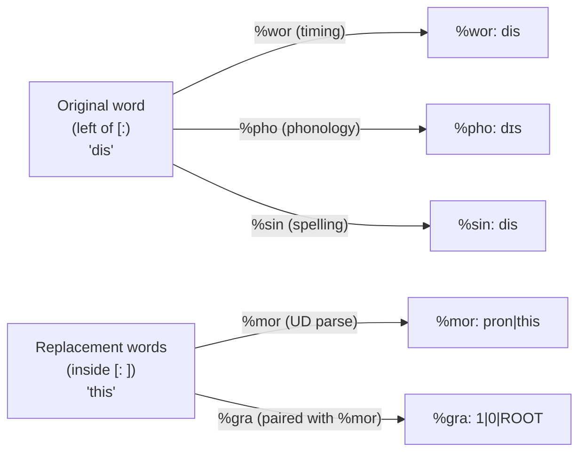

# Replacements

**Status:** Current
**Last updated:** 2026-04-27 13:47 EDT

A **replacement** is a CHAT annotation `[: ...]` that pairs a single
spoken word on the main tier with one or more "intended" words. It
records both what the speaker actually said and what the analysis should
treat the utterance as containing.

```chat
*CHI:	wanna [: want to] go .
*CHI:	dis [: this] is fun .
*CHI:	rocking+house [: rocking+horse] [*] ?
```

This page is the canonical reference for what replacements mean in
TalkBank — both as a CHAT-manual construct and as a typed AST in this
repo. The most important load-bearing fact, which the rest of the page
expands on:

> **Replacements are word-level, not group-level. Each tier domain
> chooses *one* side of the pair: `%mor` analyzes the replacement
> (right side); `%wor`, `%pho`, `%sin` align to the original (left
> side). `%gra` follows `%mor`.**

## CHAT Syntax

### Word-Level Scope

A replacement attaches to a single `standalone_word` on the main tier
and contains one or more replacement words inside the brackets:

```chat
*CHI:	gonna [: going to] eat lunch .
*CHI:	dis [: this] toy .
*CHI:	rocking+house [: rocking+horse] [*] ?
```

The grammar rule is in
[`grammar/grammar.js:1063-1071`](https://github.com/TalkBank/talkbank-tools/blob/main/grammar/grammar.js)
(`word_with_optional_annotations`) and
[`grammar.js:1341-1352`](https://github.com/TalkBank/talkbank-tools/blob/main/grammar/grammar.js)
(`replacement`). Replacement words can be separated by whitespace, so
`[: going to]` is a single replacement of `gonna` with two words.

### There Is No Group-Level Replacement

`<dat is> [: that is]` is **not** valid CHAT. A replacement does not
attach to a group; it attaches to a single word. The grammar enforces
this by typing: `ReplacedWord.word: Word`, never `Group`. To replace
words inside a group, attach the replacement to the inner word:

```chat
*CHI:	<dat [: that] is> [/] is broken .
```

This shape — replacement inside a group inside a retrace — is legal
because each annotation operates at its own scope.

### There Is No `[::]` Form

Some literature on CHILDES tooling references a `[::]` annotation; it
does **not** exist in this repo's grammar, parser, or model, and is not
defined by the current CHAT manual. Only `[:]` exists. If you encounter
`[::]` in legacy data, treat it as a parse error to investigate, not a
construct to support.

## The Per-Domain Alignment Rule

This is the rule contributors most often get wrong. Different tier
domains align to different sides of a replacement pair:

| Tier | Side aligned to | Rationale |
|------|----------------|-----------|
| `%mor` | **replacement** (right) | Morphosyntactic analysis annotates the *target* form, not the error |
| `%gra` | **replacement** (right) | Grammatical relations align to `%mor`'s structure |
| `%wor` | **original** (left) | Word-level timing is for what was actually spoken |
| `%pho` | **original** (left) | Phonological transcription describes what was actually spoken |
| `%sin` | **original** (left) | Spelling-in-actual describes the original surface form |

The mnemonic: **the replacement encodes the intended form** (what the
speaker meant or what a corrected transcript would read). Tiers
analyzing intent (`%mor`/`%gra`) use the replacement; tiers
documenting realization (`%wor`/`%pho`/`%sin`) use the original.



For multi-word replacements like `gonna [: going to]`, the rule
generalizes consistently:

- `%wor` / `%pho` / `%sin` produce **one** entry — for `gonna`.
- `%mor` produces **two** entries — for `going` and `to`.
- `%gra` produces **two** entries — paired to the two `%mor` items.

The alignment-counting code that enforces this is in
[`alignment/units.rs:144-162`](https://github.com/TalkBank/talkbank-tools/blob/main/crates/talkbank-model/src/model/file/utterance/metadata/alignment/units.rs).
The full table of per-domain rules is in `ALIGNMENT_RULES.md` in the
same directory tree.

## Rust AST

A replacement is modeled as a first-class `UtteranceContent` variant,
not as a flag on `Word`:

```rust
// crates/talkbank-model/src/model/annotation/replacement.rs
pub struct ReplacedWord {
    pub word: Word,                       // left side: original spoken word
    pub replacement: Replacement,         // right side: 1+ intended words
    pub scoped_annotations: ReplacedWordAnnotations,
}
```

Two consequences of this shape:

1. **There is no `WordKind::Replacement` enum variant.** A replacement
   is a wrapper around a `Word`, not a kind of `Word`. (Contrast with
   retraces, which use `WordKind::Retrace` plus the structural
   `Retrace` content node — different mechanism for a different
   concept.)
2. **The `walk_words()` content walker yields `WordItem::ReplacedWord`
   as a distinct leaf.** Domain-aware extraction code branches on this
   leaf type and chooses original or replacement per the table above.
   See [`crates/talkbank-model/src/alignment/`](https://github.com/TalkBank/talkbank-tools/tree/main/crates/talkbank-model/src/alignment).

## Validation

### Each Replacement Word Is Validated Like a Main-Tier Word

The replacement is a `Vec<Word>`. Each `Word` inside it goes through
the same validator that runs on main-tier words:

```chat
*CHI:	dog [: C-3PO] .
```

This produces `[E220] "C-3PO" is not a legal word in language(s) "eng":
numeric digits not allowed` — exactly as if `C-3PO` had appeared on the
main tier directly. **The replacement does not provide an escape from
word-level validation.** The implementation is in
[`replacement.rs:117-202`](https://github.com/TalkBank/talkbank-tools/blob/main/crates/talkbank-model/src/model/annotation/replacement.rs).

This is critical for any code generating replacements programmatically:
do not assume `[: ...]` lets you smuggle arbitrary text past the word
validator. If your producer emits a replacement, both sides must be
CHAT-legal under the utterance's declared language.

### Replacement-Specific Error Codes

Three error codes are specific to replacements and do not apply to
main-tier words:

| Code | Meaning |
|------|---------|
| `E208` | Empty replacement `[:]` (no words provided between `:` and `]`) |
| `E390` | Replacement contains an omission (`0prefix` form) — disallowed inside replacements |
| `E391` | Replacement contains untranscribed material (`xxx`, `yyy`, `www`) — disallowed inside replacements |

The principle: a replacement must be a **concrete intended form**. Empty,
omitted, or unintelligible content defeats that purpose.

## Interactions with Other Annotations

### Replacements and Retraces Are Orthogonal

A retrace (`[/]`, `[//]`, `[///]`, `[/-]`, `[/?]`) and a replacement
(`[:]`) are distinct annotations operating at different structural
levels:

- Retraces wrap **content** (a single word or a group). They are first-
  class `UtteranceContent` variants and represent post-hoc speaker
  correction.
- Replacements attach **inside** a `Word` slot via `ReplacedWord`. They
  are editorial metadata about an individual spoken word.

Both can coexist:

```chat
*CHI:	<dat [: that] is> [/] is broken .   (replacement inside retrace)
```

A retrace cannot live *inside* a replacement (the grammar wraps
replacements around `standalone_word`, not arbitrary content).

### Replacements and Error Coding

Error codes follow the replacement and operate on the replaced word as
a unit:

```chat
*CHI:	rocking+house [: rocking+horse] [*] ?
```

Here `[*]` marks `rocking+house` as containing a phonological/lexical
error; the `[: rocking+horse]` records the intended form. The two
annotations cooperate: the replacement encodes *what was meant*, the
error code classifies *how it deviates*. Implementation:
`scoped_annotations` field on `ReplacedWord`.

## Common Misconceptions

These are bugs we have repeatedly written down then forgotten — recording
them here so future contributors don't reinvent them.

1. **"`[: ...]` lets me put any text I want."** No. Each replacement
   word is validated. `[: C-3PO]` fails E220 in English just as
   `C-3PO` would.
2. **"`[:]` is the right mechanism for ASR sanitization."** Usually
   no. ASR-introduced normalization typically wants `[% ...]` (free-
   form comment) or `[= ...]` (free-form explanation), neither of
   which validates word grammar. Use `[:]` only when you have a
   concrete CHAT-legal intended form.
3. **"`%mor` analyzes the original."** No. `%mor` analyzes the
   replacement. This is the correction's morphology, not the error's.
4. **"`%wor` count must equal `%mor` count."** No. For
   `gonna [: going to]`, `%wor` has 1 entry and `%mor` has 2. They
   align to different sides. The validator's per-domain rule respects
   this.
5. **"`<a b> [: c d]` is a group-level replacement."** No.
   Group-level replacements don't exist. Either replace inside
   (`<a [: c] b [: d]>`) or rephrase the transcription.

## Source Citations

| Concern | File:line |
|---------|-----------|
| Grammar rule (`replacement`) | `grammar/grammar.js:1341-1352` |
| Word-with-replacement rule | `grammar/grammar.js:1063-1071` |
| `ReplacedWord` struct | `crates/talkbank-model/src/model/annotation/replacement.rs:463-488` |
| Per-domain alignment | `crates/talkbank-model/src/model/file/utterance/metadata/alignment/units.rs:144-162` |
| Replacement validation | `crates/talkbank-model/src/model/annotation/replacement.rs:117-202` |
| Reference corpus example | `corpus/reference/annotation/errors-and-replacements.cha` |
| CHAT manual | <https://talkbank.org/0info/manuals/CHAT.html#Replacement_Scope> |

## See Also

- [Retraces and Repetitions](./retraces.md) — the orthogonal post-hoc
  correction mechanism.
- [The %mor Tier](./mor-tier.md) — UD-syntax morphosyntactic analysis
  that aligns to the replacement form.
- [Word Syntax](./word-syntax.md) — the word grammar that replacement
  words must satisfy.
- [Dependent Tiers](./dependent-tiers.md) — overview of `%mor`,
  `%wor`, etc., with their alignment relationships.
