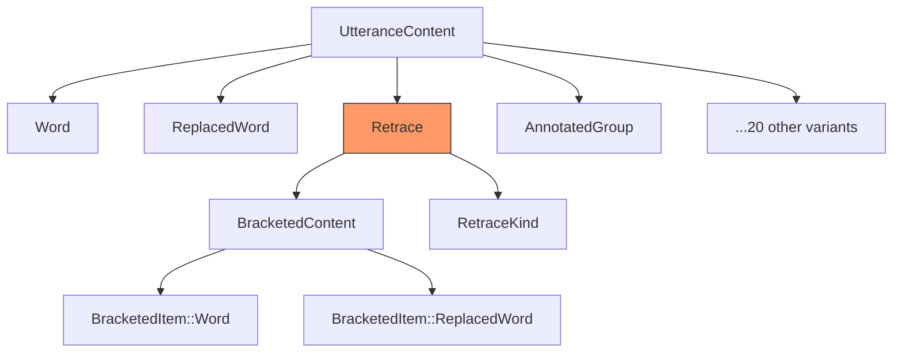
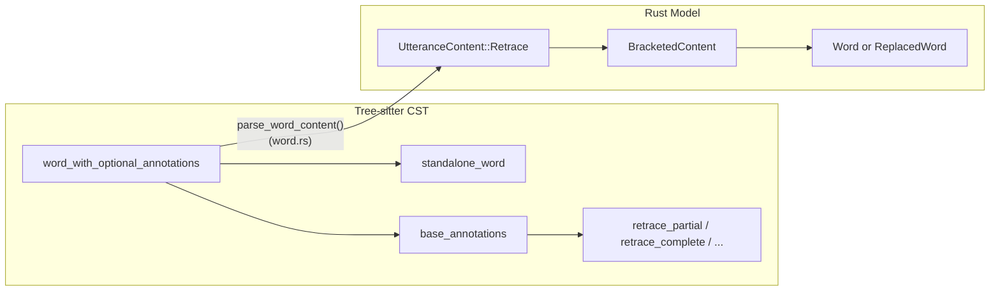
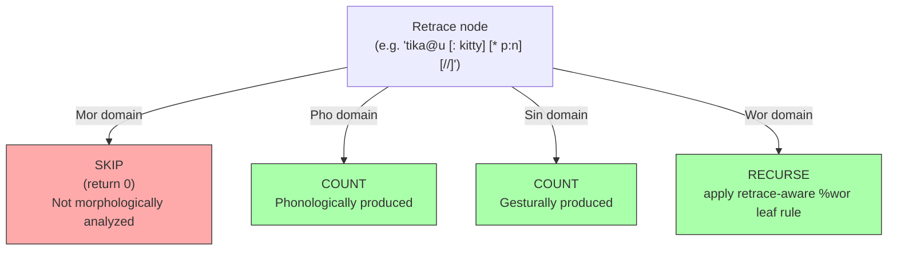

# Retraces and Repetitions

**Status:** Current
**Last updated:** 2026-03-26 10:33 EDT

Retraces mark content that the speaker said but then corrected, repeated,
or abandoned. They are one of the most consequential constructs in CHAT
because they affect how every dependent tier aligns to the main tier.

## CHAT Syntax

A retrace has two parts: the **retraced content** (what the speaker said
first) and the **correction** (what follows). The retraced content is
marked with a trailing bracket code:

| Marker | Name | Meaning |
|--------|------|---------|
| `[/]` | Partial repetition | Speaker repeats the same words |
| `[//]` | Full correction | Speaker restarts with different words |
| `[///]` | Multiple correction | Multiple false starts |
| `[/-]` | Reformulation | Speaker rephrases with different structure |
| `[/?]` | Uncertain | Unclear whether repetition is intentional |

### Single-Word Retraces

When only one word is retraced, no angle brackets are needed:

```chat
*CHI: I [/] I want that .
*CHI: ana [//] an .
*MOT: the book [/-] the magazine is here .
```

### Group Retraces

When multiple words are retraced, angle brackets delimit the scope:

```chat
*MOT: <the dog> [//] the cat ran .
*CHI: <I want> [/] I need cookie .
*CHI: <I want the> [///] give me that .
```

### Retraces with Replacements

A retraced word often has a replacement `[: target]` and/or error code
`[* code]`. This is common in aphasia and child language corpora where
the speaker produces an incorrect form:

```chat
*PAR: tika@u [: kitty] [* p:n] [//] kitty is nice .
%mor: noun|kitty aux|be-Fin-Ind-Pres-S3 adj|nice-S1 .

*PAR: lɛɾɪ@u [: later] [* p:n] [//] later in the day .
%mor: adv|late adp|in det|the-Def-Art noun|day .

*CHI: male [: female] [* s:r] [/] male [: female] [* s:r] .
%mor: adj|female-S1 .
```

In each case, the retraced word (before the `[//]` or `[/]`) is excluded
from %mor alignment. Only the correction (after the marker) is counted.

## Data Model

Retraces are a **first-class variant** of `UtteranceContent`:



The `Retrace` struct wraps the retraced content in a `BracketedContent`
container, which can hold any combination of words, replaced words, and
other content items:

```rust
// crates/talkbank-model/src/model/content/retrace.rs
pub struct Retrace {
    pub content: BracketedContent,          // the retraced words
    pub kind: RetraceKind,                  // Partial, Full, Multiple, Reformulation, Uncertain
    pub is_group: bool,                     // <word> [/] vs word [/]
    pub annotations: Vec<ContentAnnotation>,// non-retrace annotations after marker
    pub span: Span,
}
```

### Why First-Class?

Before the retrace refactor, retraces were represented as annotations
on words or groups. This meant every `match` on content had to inspect
annotation lists to determine whether a word was retraced. This led to
a class of bugs where retraced content was accidentally included in
alignment counting, word extraction, or retokenization.

Making `Retrace` a top-level `UtteranceContent` variant means:

1. **The compiler enforces handling.** Every `match` on `UtteranceContent`
   must have a `Retrace` arm. Forgetting to handle retraces is a compile
   error, not a silent runtime bug.
2. **Domain-aware gating is centralized.** The content walker checks the
   `Retrace` variant once, not at every annotation-inspection site.
3. **Alignment counting is simple.** The count function returns `0` for
   `Retrace` in Mor domain, no annotation inspection needed.

### Parser Conversion

The tree-sitter grammar parses retrace markers (`[/]`, `[//]`, etc.) as
annotations on `word_with_optional_annotations`. The Rust parser converts
them to structural `Retrace` nodes in `parse_word_content()`:



Three cases in `parse_word_content()`:

1. **Word + retrace** (`I [/]`) — wrap `Word` in `BracketedItem::Word`
   inside `Retrace`
2. **Word + replacement + retrace** (`tika@u [: kitty] [* p:n] [//]`) —
   build `ReplacedWord`, then wrap in `BracketedItem::ReplacedWord`
   inside `Retrace`
3. **Word + replacement, no retrace** (`tika@u [: kitty]`) — emit bare
   `ReplacedWord`

Group retraces (`<content> [/]`) are handled in `group/parser.rs` via
the same structural wrapping.

## Alignment Behavior

Retraces interact differently with each dependent tier domain:



**Why %mor skips retraces:** The %mor tier represents the morphological
analysis of what the speaker *meant* to say. Retraced content is a false
start or error — it was produced phonologically but is not part of the
intended linguistic structure. The correction after the retrace marker
carries the morphological analysis.

**Why %pho/%sin/%wor include retraces:** These tiers document what was
*actually produced* — the sounds, gestures, and timing of the speech as
it happened, including false starts. The retrace was physically spoken,
so it appears in these tiers.

For `%wor`, retrace ancestry does **not** change leaf-level membership:

- spoken word tokens count both inside and outside retrace
- that includes fillers, fragments, nonwords, and untranscribed placeholders
- overlap annotations do not affect `%wor` membership

Exact corpus-shaped contrast:

```chat
*CHI:	<one &+ss> [/] one play ground .
%wor:	one •321008_321148• ss •321148_321368• one •321809_321969• play •322049_322310• ground •322390_322890• .

*CHI:	&+ih <the what> [/] what's letter &+th is this ?
%wor:	ih •49063_49103• the •49103_49163• what •49183_50205• what's •50205_50405• letter •50405_50685• th •50886_50946• is •50946_51046• this •51086_51586• ?
```

### Implementation

Counting: `count_alignable_item()` in `alignment/helpers/count.rs`:

```rust
UtteranceContent::Retrace(retrace) => {
    if domain == TierDomain::Mor {
        0  // excluded from morphological alignment
    } else {
        count_bracketed_alignable_content(&retrace.content, domain, true)
    }
}
```

Walking: `walk_words()` in `alignment/helpers/walk/mod.rs`:

```rust
UtteranceContent::Retrace(retrace) => {
    if !matches!(domain, Some(TierDomain::Mor)) {
        walk_bracketed_content(&retrace.content.content, domain, f);
    }
}
```

`%wor` generation and overlap counting still use dedicated recursive helpers,
but now for `%wor`-specific sequencing details like replacement handling rather
than for retrace-sensitive membership.

## Validation

### Cross-Utterance Retrace Validation

The retrace validators in `validation/retrace/` check:

- **Collection:** `collection/utterance.rs` and `collection/bracketed.rs`
  walk the content tree to find all `Retrace` nodes
- **Detection:** `detection.rs` provides `utterance_item_has_retrace()`
  for quick retrace presence checks

### Alignment Validation (E705)

E705 fires when the main tier has more alignable items than %mor. If
retraces are correctly parsed as `Retrace` nodes, they are excluded
from the count and E705 does not fire. If a retrace is accidentally
parsed as a bare `ReplacedWord` (the bug fixed in `c90b9bf`), it is
counted and triggers a false E705.

## Regression Tests

`tests/retrace_replaced_word_regression.rs` contains 6 targeted tests:

| Test | Pattern | Verifies |
|------|---------|----------|
| `single_word_retrace_with_replacement_full` | `word [: repl] [* err] [//]` | Retrace wraps ReplacedWord |
| `single_word_retrace_with_replacement_partial` | `word [: repl] [* err] [/]` | Partial retrace with replacement |
| `single_word_retrace_with_replacement_multiple` | `word [: repl] [* err] [///]` | Multiple retrace with replacement |
| `single_word_retrace_with_replacement_no_error_marker` | `word [: repl] [///]` | No `[*]` still produces Retrace |
| `single_word_retrace_without_replacement` | `word [//]` | Baseline (no replacement) |
| `retrace_with_replacement_does_not_cause_e705` | Full pipeline with %mor | No false E705 |

Reference corpus entries: `corpus/reference/annotation/retrace.cha`

## See Also

- [Alignment Architecture](../architecture/alignment.md) — full alignment system docs
- [The %mor Tier](mor-tier.md) — morphological tier format and alignment rules
- [CHAT Manual: Retracing](https://talkbank.org/0info/manuals/CHAT.html#Retracing_Scope)
