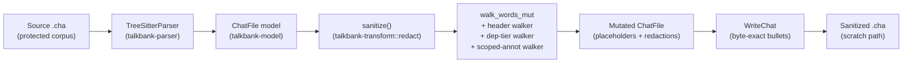

# Sanitize (`chatter debug sanitize`)

**Status:** Current
**Last updated:** 2026-04-28 22:18 EDT

`chatter debug sanitize` strips contributor lexical content from a CHAT
file while preserving structure (timing bullets, `%wor` per-word offsets,
speaker codes, dependent-tier scaffolding, structural counts, POS tags,
language markers). Output is structurally identical to the input but
contains no participant words, names, or free-text annotations.

The command exists so engineering tooling — including LLM-assisted
debugging — can operate on protected-corpus files (`aphasia/`,
`dementia/`, `rhd/`, `fluency/Password/`, clinical-children corpora,
etc.) without exposing contributor speech to commercial LLM services.

## When to use it

Run `chatter debug sanitize` on the source file *before* loading it into
any tool (LLM-backed debugger, scratch directory, screen-shareable
session) where you don't want participant content visible.

When you need to ask a contributor for help debugging a specific
file, frame the request as "run the sanitizer locally and send me
the output" rather than asking for the raw file.

## Usage

```bash
# Write sanitized output to stdout
chatter debug sanitize input.cha

# Write sanitized output to a file
chatter debug sanitize input.cha --output sanitized.cha
```

Working location for sanitized files: prefer a stable, non-`/tmp`
scratch directory (e.g. set `TB_SCRATCH_DIR` to a per-project dir
under your workstation's persistent storage) for any state that
should outlive a single command. macOS clears `/tmp` on reboot.

## What is preserved (byte-exact)

- Timing bullets `•start_end•` on the main tier.
- `%wor` per-word offsets (`word START_END` triples).
- Speaker codes (`*PAR`, `*INV`, `*CHI`, …).
- Utterance count, word count per utterance, dependent-tier count.
- Structural markers: compound `+`, clitic `~`, CA elements, overlap
  points, lengthening, stress markers, syllable pause, underline
  begin/end, proper-noun `@n` markers.
- Language markers (`@s:LANG`), form types (`@a`, `@b`), POS tags
  (`$adj`, `$n`).
- Headers: `@Languages`, `@Birth`, `@Date`, `@Media`, `@PID`, `@L1Of`,
  `@Begin`/`@End`/`@UTF8`.
- `%mor` POS categories and morphological features (e.g., `n|`, `-Past`).
- `%gra` (numeric grammatical relations) and `%tim` (timing).
- Untranscribed tokens `xxx` / `yyy` / `www` — preserving them changes
  semantic meaning, so they pass through unchanged.

## What is replaced or redacted

| Source | Replacement |
|---|---|
| `WordContent::Text` | `wN` placeholder, indexed by document position |
| `Shortening` text | `(x)` |
| `%mor` lemmas (`MorWord.lemma`) | `lemmaN`; POS + features preserved |
| `%pho` / `%mod` / `%modsyl` / `%phosyl` / `%phoaln` / `%sin` | tier dropped |
| Free-text dependent tiers (`%com` `%add` `%exp` `%sit` `%spa` `%int` `%gpx` `%eng` `%gls` `%ort` `%flo` `%def` `%coh` `%fac` `%par` `%alt` `%err`) | `[redacted]` |
| `@Comment`, `@Transcriber`, `@Birthplace`, `@Activities`, `@Situation`, `@RoomLayout`, `@Location`, `@TapeLocation`, `@Warning`, `@Bck` | `[redacted]` (when content was free text) |
| `@Participants` participant-name field | dropped (`Participant_<SPEAKER_CODE>` is implied by speaker code + role) |
| `@ID` `custom_field` and `education` | cleared |
| `Event` event_type (`&=imitates:Mary` → `&=[redacted]`) | `[redacted]` |
| `Freecode` text (`[^ aside]`) | `[redacted]` |
| `OtherSpokenEvent` text | `[redacted]` |

## Determinism + Idempotence

Placeholder generation is keyed off `(utterance_index, word_index)`
tree position, not a global counter. Two consequences:

- **Deterministic**: sanitizing the same input twice produces
  byte-identical output.
- **Idempotent**: sanitizing a sanitized file produces the same file
  again — no double-replacement, no shifting placeholder numbers.

## Pipeline



The walker step replaces `WordContent::Text` segments inside
`Word.content`, mutates `MorWord.lemma` fields, redacts free-text
header / dep-tier / scoped-annotation strings, and drops phonological
tiers. `WriteChat` then re-serializes — and because it serializes from
`Word.content` (not from `Word.raw_text`), every CA element, compound
marker, clitic boundary, and timing bullet round-trips byte-exact.

## Out of v1 scope

Documented for transparency; v2 work:

- Speaker-code anonymization (graph rewrite across `@Participants`,
  `@ID`, `*SPK:`, `@Birth`, `@L1Of`).
- `@Birth` / `@Date` fuzzing (exact birth dates can be identifying).
- `@Media` filename redaction.
- Audio-side sanitization. (Audio bytes are *never* touched by the
  sanitizer; the audio stays at its original path.)
- "Unsanitize" or round-trip mapping. Explicitly **not** built — the
  sanitizer is one-way, the mapping table that would reverse it is the
  exact artifact we don't want to exist.

## Implementation

Library module: `talkbank_transform::redact`. CLI surface: `chatter debug sanitize`.
The strict policy is the only public preset in v1; future variants can
grow on `SanitizationPolicy`.

