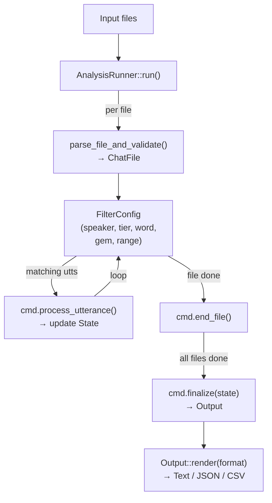
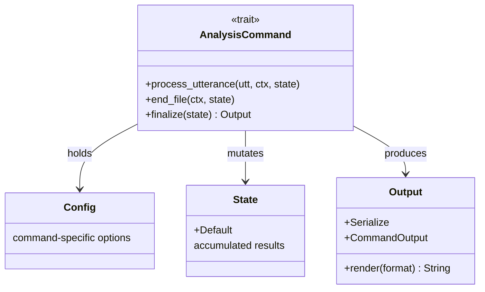

# Framework

The framework (`src/framework/`) provides shared infrastructure for all commands.

## Runner

The command runner handles the lifecycle:

1. **Parse** — read and parse the CHAT file via `talkbank-transform`
2. **Filter** — apply speaker, tier, word, gem, range, and ID filters
3. **Dispatch** — call `process_utterance()` for each matching utterance
4. **Finalize** — call `end_file()` to produce the result
5. **Render** — format the result as text, JSON, CSV, or CLAN-compatible output



## Traits

### `AnalysisCommand`

```rust
trait AnalysisCommand {
    type Config;
    type State: Default;
    type Result: CommandOutput;

    fn process_utterance(config: &Config, state: &mut State, utterance: &Utterance);
    fn end_file(config: &Config, state: State) -> Self::Result;
}
```



### `TransformCommand`

Transform commands receive a mutable `ChatFile` and modify it in place.

### `CommandOutput`

```rust
trait CommandOutput {
    fn render_text(&self) -> String;
    fn render_clan(&self) -> String;  // CLAN-parity output
    fn render_json(&self) -> Value;
    fn render_csv(&self) -> String;
}
```

## Word utilities

- `countable_words()` — iterate words that should be counted (skips untranscribed, fillers, etc.)
- `is_countable_word()` — predicate for individual words
- `NormalizedWord` — wrapper with `Borrow<str>` for zero-allocation frequency map lookups

## Filter system

Filters are configured from CLI flags and applied by the runner before dispatching to commands. Commands never check filters directly.
