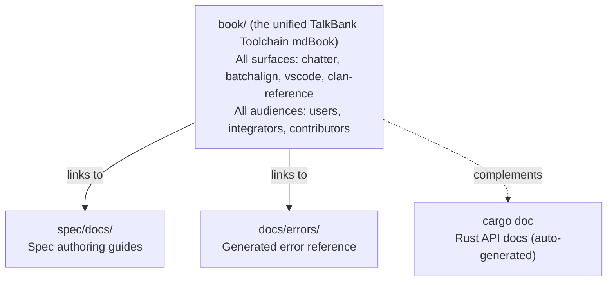

# Documentation Architecture

**Status:** Current
**Last updated:** 2026-05-21 13:05 EDT

## Principle: Centralized Book + Subsystem Satellites

User-facing and contributor-facing prose lives in **mdBook**
(`book/`). The repo-level `docs/` directory holds operator-facing
material (release contract, versioning, code-signing, platform
support, validation feature flags) plus the generated error reference
under `docs/errors/`. Subsystem-specific working docs stay in place
only when tightly coupled to files in that directory.

## Where Documentation Goes

| Content type | Location | Examples |
|---|---|---|
| User guides, CHAT format reference | `book/src/chatter/user-guide/`, `book/src/chat-format/` | CLI usage, validation errors, VS Code extension |
| Architecture and design | `book/src/architecture/` | Parsing, data model, concurrency, memory |
| Contributor workflows | `book/src/contributing/` | Grammar workflow, testing, coding standards |
| Integrator contracts | `book/src/chatter/integrating/` | JSON schema, diagnostic contract |
| Technical reference and audits | `book/src/` (Technical Reference section) | Parity audits, UTF-8 audit, risk register |
| CLAN command reference | `book/src/clan-reference/` | Per-command docs, divergence analysis |
| Spec authoring guides | `spec/docs/` | Error spec format, curation workflow |
| Generated error docs | `docs/errors/` | Auto-generated by the current spec/error-doc pipeline (`make test-gen` today) |
| Historical/archived docs | project archive | Old audits, superseded proposals |
| AI assistant context | `CLAUDE.md` files (per repo/subdir) | Not documentation for humans |

## Rules

1. **One canonical page per topic.** No duplicate coverage across locations.
2. **No crate-level `docs/` directories.** Architectural explanations go in the book.
   Crate API docs come from `///` doc comments via `cargo doc`.
3. **Satellites stay only when the audience is editing files in that directory.**
   Spec authors need `WRITING_ERROR_SPECS.md` next to their specs. Everyone else
   reads the book.
4. **Generated docs are build artifacts.** Never hand-edit `docs/errors/`. Regenerate
   via the current error-doc generation pipeline (`make test-gen` today).
5. **Historical docs go to project archive.** Don't keep old audit logs,
   investigation notes, or superseded proposals in the public repo.

## One unified book

There is one mdBook for the entire TalkBank toolchain at `book/`,
titled "TalkBank Toolchain", organized by audience-first sections
under `book/src/`:

| Section | Audience | Content |
|---|---|---|
| `book/src/install/`, `book/src/quickstart/` | All users | Front-matter install hub + 3-task quickstart |
| `book/src/batchalign/` | Batchalign users + devs | Pipeline, server, migration from BA2, ML commands |
| `book/src/chatter/` | chatter CLI users + integrators | CLI reference, library usage, JSON contracts |
| `book/src/chat-format/` | All users + integrators | CHAT format reference (headers, tiers, symbols) |
| `book/src/vscode/` | VS Code extension users + extension devs | Editor workflows, configuration, design ADRs |
| `book/src/clan-reference/` | CLAN users + porters | Per-command reference pages, divergence + migration |
| `book/src/architecture/` | All devs | Cross-surface architecture, parser/grammar/data-model design |
| `book/src/contributing/` | Contributors | Setup, testing, coding standards, dev checks |

One `book.toml` and one `SUMMARY.md` for the whole tree. Cross-section
links resolve as ordinary in-book paths.
