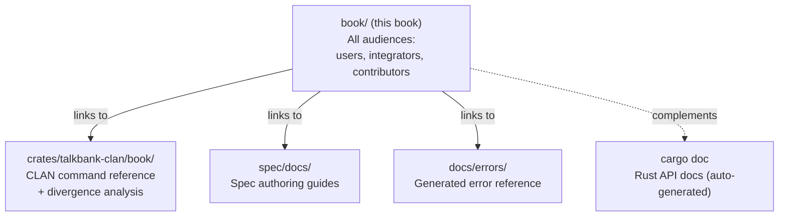

# Documentation Architecture

**Status:** Current
**Last updated:** 2026-03-24 00:01 EDT

## Principle: Centralized Book + Subsystem Satellites

All prose documentation lives in **mdBook** (`book/`). The `docs/` directory contains
only generated build artifacts. Subsystem-specific working docs stay in place only when
tightly coupled to files in that directory.

## Where Documentation Goes

| Content type | Location | Examples |
|---|---|---|
| User guides, CHAT format reference | `book/src/user-guide/`, `book/src/chat-format/` | CLI usage, validation errors, VS Code extension |
| Architecture and design | `book/src/architecture/` | Parsing, data model, concurrency, memory |
| Contributor workflows | `book/src/contributing/` | Grammar workflow, testing, coding standards |
| Integrator contracts | `book/src/integrating/` | JSON schema, diagnostic contract |
| Technical reference and audits | `book/src/` (Technical Reference section) | Parity audits, UTF-8 audit, risk register |
| CLAN command reference | `crates/talkbank-clan/book/` | Per-command docs, divergence analysis |
| Spec authoring guides | `spec/docs/` | Error spec format, curation workflow |
| Generated error docs | `docs/errors/` | Auto-generated by the current spec/error-doc pipeline (`make test-gen` today) |
| Historical/archived docs | project archive | Old audits, superseded proposals |
| AI assistant context | `CLAUDE.md` files (per repo/subdir) | Not documentation for humans |

## Rules

1. **One canonical page per topic.** No duplicate coverage across locations.
2. **No crate-level `docs/` directories.** Architectural explanations go in the book.
   Crate API docs come from `///` doc comments via `cargo doc`.
3. **Satellites stay only when the audience is editing files in that directory.**
   Spec authors need `WRITING_ERROR_SPECS.md` next to their specs. Everyone else
   reads the book.
4. **Generated docs are build artifacts.** Never hand-edit `docs/errors/`. Regenerate
   via the current error-doc generation pipeline (`make test-gen` today).
5. **Historical docs go to project archive.** Don't keep old audit logs,
   investigation notes, or superseded proposals in the public repo.

## Three Books

| Book | Location | Audience | Content |
|---|---|---|---|
| **TalkBank Tools** | `book/` | All stakeholders | Architecture, user guide, CHAT format, contributing, integrating |
| **CLAN Commands** | `crates/talkbank-clan/book/` | CLAN users + porters | 80+ command reference pages, divergence analysis, migration guide |
| **Batchalign** | `../../batchalign3/book/` | Batchalign users + devs | Pipeline, server, migration from batchalign2 |

Each book has its own `book.toml` and `SUMMARY.md`. They link to each other where
relevant but don't duplicate content.
