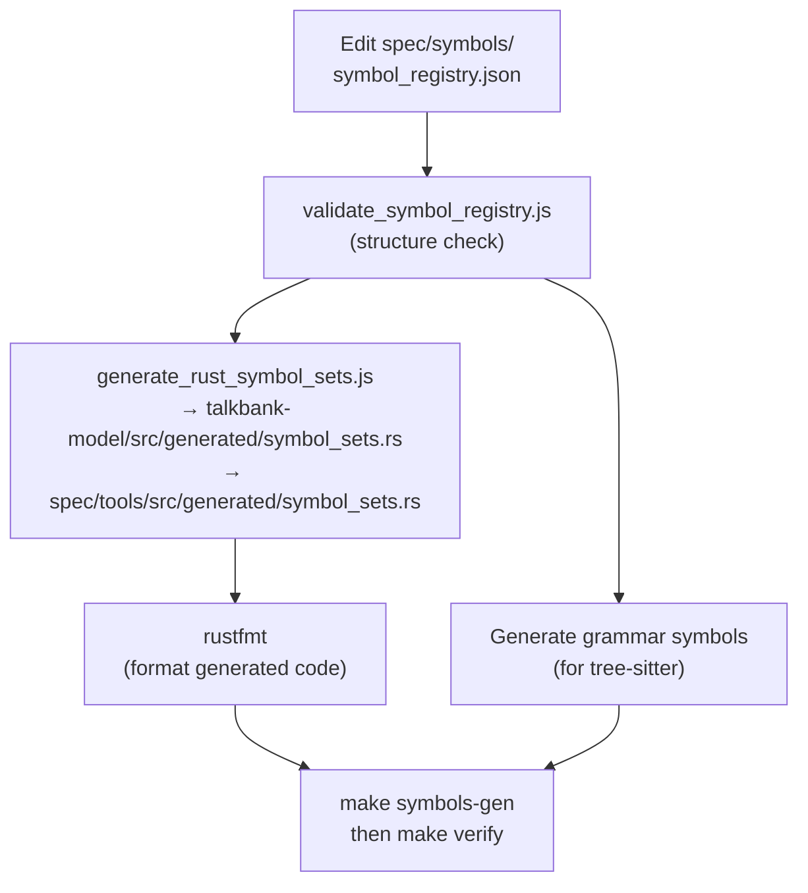

# Spec Workflow

**Status:** Current
**Last updated:** 2026-05-21 08:38 EDT

Specifications in `spec/` are the source of truth for CHAT format intent, grammar
examples, and validation/error contracts.

## Adding a Construct Spec

Construct specs define valid CHAT patterns with expected parse trees.

### 1. Create the Spec File

Create a new markdown file in the appropriate `spec/constructs/` subdirectory:

```text
spec/constructs/
├── header/         # Header-related constructs
├── main_tier/      # Main tier patterns
├── tiers/          # Dependent tier patterns
├── utterance/      # Utterance-level patterns
└── word/           # Word syntax patterns
```

### 2. Write the Spec

```markdown
# my_example

Description of what this example demonstrates.

## Input

\```utterance
*CHI:	hello world .
\```

## Expected CST

\```cst
(utterance
  (main_tier
    ...))
\```

## Metadata

- **Level**: utterance
- **Category**: main_tier
```

The code fence label (e.g., `utterance`, `mor_dependent_tier`) selects which
template wraps the input into a full CHAT file.

### 3. Generate the CST

Parse your input with tree-sitter to get the actual CST, then copy it as the Expected CST (stripping positions and field names).

### 4. Regenerate The Affected Generated Artifacts

```bash
make test-gen
```

Use `make test-gen` when you intentionally changed generated grammar corpus
tests, generated Rust tests, or generated error docs.

For isolated grammar additions, keep the change small:

1. Add or adjust one grammar example.
2. Add one full-file fixture if the change matters in context.
3. Regenerate only the artifacts that truly changed.

## Adding an Error Spec

Error specs define invalid CHAT patterns with expected error codes.

### 1. Create the Spec File

Error specs live in `spec/errors/`, named by error code. The
convention is `E###_auto.md` (or `E###_<short-slug>.md`); for example
`spec/errors/E301_auto.md` covers "Empty speaker code".

### 2. Write the Spec

The actual on-disk format (per `spec/errors/E301_auto.md`) uses
bolded metadata keys; there is no `Name` field and severity is
implicit in the error-code numbering:

```markdown
# E301: Empty speaker code

## Description

Empty speaker code

## Metadata

- **Error Code**: E301
- **Category**: Main tier validation
- **Level**: utterance
- **Layer**: parser

## Example 1

**Source**: `E3xx_main_tier_errors/E301_empty_speaker.cha`
**Trigger**: Main tier with * but no speaker code
**Expected Error Codes**: E301

\```chat
@UTF8
@Begin
@Languages:	eng
@Participants:	CHI Child
...
\```
```

### Key Metadata Fields

- **Layer: parser** — the error is caught during `parser.parse_chat_file()` (file fails to parse)
- **Layer: validation** — the error is caught by `validate_with_alignment()` after successful parse
- **Status: not_implemented** — generates `#[ignore]` tests (validation logic not yet coded)

### 3. Regenerate The Affected Artifacts

```bash
make test-gen
make verify
```

## Updating the Symbol Registry

The symbol registry at `spec/symbols/symbol_registry.json` defines character sets used by the grammar and Rust crates.



After editing:

```bash
make symbols-gen    # Regenerate Rust and JS constants
make test-gen       # If generated grammar/tests/docs depend on the symbols
```

## Common Mistakes

- **Editing generated files** — never edit `grammar/test/corpus/` or `crates/talkbank-parser-tests/tests/generated/` by hand
- **Running `make test-gen` reflexively** — use it when generated artifacts changed, not as a substitute for thinking about what kind of test authority the change really needs
- **Wrong layer** — parser-layer specs expect parse failure; validation-layer specs expect parse success + error report
