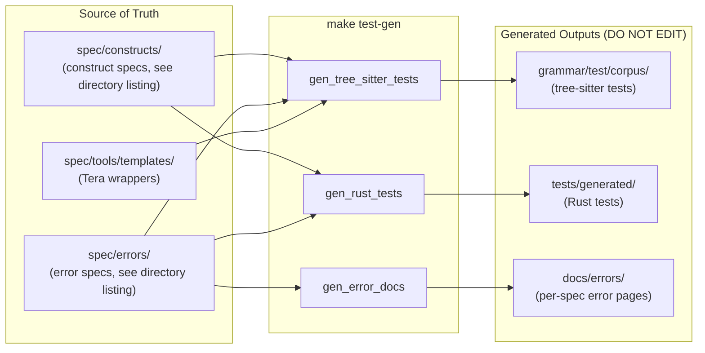
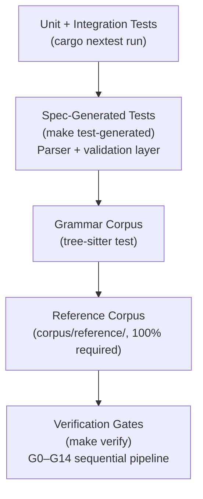
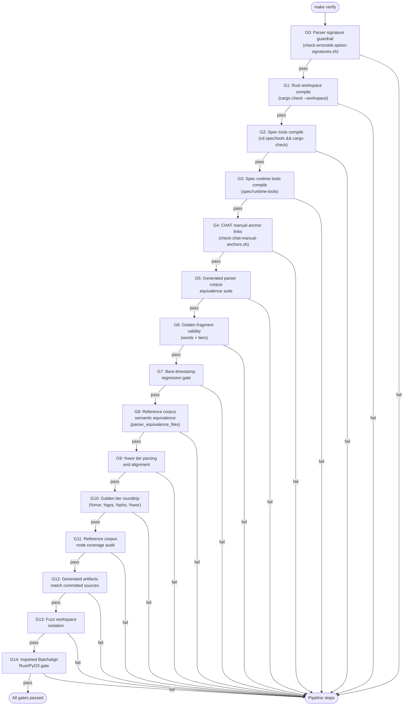

# Testing

**Status:** Current
**Last updated:** 2026-05-20 20:26 EDT

## Test Generation Pipeline

Specs are the source of truth. All grammar corpus tests, Rust parser tests,
and error docs are **generated** from specs. `make test-gen` wipes the output
directories and recreates them — never hand-edit generated files.



To add a grammar test or error test, add a spec file in `spec/constructs/`
or `spec/errors/`, then run `make test-gen`. See `spec/CLAUDE.md` for the
spec format.

## Test Strategy

Testing is organized in layers, from fastest to most comprehensive.



### Unit Tests (nextest)

```bash
cargo nextest run
```

Runs all unit and integration tests across all crates (~2300+ tests). These test individual functions, serialization roundtrips, and model invariants.

`cargo nextest` does not run doctests. Keep `cargo test --doc` as a separate
verification step when you change public API examples or doc comments.

### Parser Equivalence

```bash
cargo nextest run -p talkbank-parser-tests -E 'test(parser_equivalence)'
```

Runs the parser on each file in the `corpus/reference/` tree and validates
results. Each `.cha` file is its own test, enabling per-file parallelism and
failure isolation via nextest. The exact file count is whatever
`find corpus/reference -name '*.cha' -type f | wc -l` reports — do not
hard-code it here.

### Spec-Generated Tests

Part of `talkbank-parser-tests`. These are generated from specs via `make test-gen` and currently test:
- Construct specs: input parses correctly
- Parser-layer error specs: input fails to parse with expected error code
- Validation-layer error specs: input parses but validation reports expected error code

Concrete entrypoint:

```bash
make test-generated
```

### Tree-Sitter Grammar Tests

```bash
make test-grammar
```

Runs the tree-sitter grammar corpus tests. This is the right gate for
grammar structure changes.

### Error Corpus Tests

Error fixtures live in `spec/errors/` and are turned into Rust tests
via `make test-gen`. There is no separate `tests/error_corpus/`
manifest in the current layout; add a new error spec under
`spec/errors/E###_*.md` and regenerate.

### Tree-Sitter Tests

```bash
cd grammar
tree-sitter test
```

Verifies the grammar produces correct CSTs for known inputs. The
actual test count comes from `ls grammar/test/corpus/*.txt | wc -l`;
do not hard-code it.

## Reference Corpus

The reference corpus at `corpus/reference/` is organized into subdirs
(`annotation/`, `audio/`, `ca/`, `content/`, `core/`, `edge-cases/`,
`languages/`, `tiers/`, `word-features/`). The parser must handle
every file at 100% — the exact file count is whatever
`find corpus/reference -name '*.cha' -type f | wc -l` reports.

This corpus is the ultimate arbiter of correctness for full-file parsing.

## Verification Gates

`make verify` runs the pre-merge verification suite (G0–G14). All gates
run sequentially — the first failure stops the pipeline.



| Gate | Check |
|------|-------|
| G0 | Parser signature guardrail |
| G1 | Rust workspace compile check |
| G2 | Spec tools compile check |
| G3 | Spec runtime tools compile check |
| G4 | CHAT manual anchor links |
| G5 | Generated parser corpus equivalence suite |
| G6 | Golden fragment validity (words + tiers) |
| G7 | Bare-timestamp regression gate |
| G8 | Reference corpus semantic equivalence (`parser_equivalence_files` over the full `corpus/reference/` tree) |
| G9 | %wor tier parsing and alignment |
| G10 | Golden tier roundtrip (%mor, %gra, %pho, %wor) |
| G11 | Reference corpus node coverage |
| G12 | Generated artifacts match committed sources |
| G13 | Fuzz workspace isolation |
| G14 | Imported Batchalign Rust/PyO3 gate |

## Running Specific Tests

```bash
# Single test by name
cargo nextest run test_name

# Tests in a specific crate
cargo nextest run -p talkbank-model

# Tests matching a pattern
cargo nextest run -- mor

# With output
cargo nextest run --no-capture
```

## What to Run When

| What you changed | Run |
|-----------------|-----|
| Grammar (`grammar.js`) | `cd grammar && tree-sitter generate && tree-sitter test` then `make test-generated` |
| Parser (CST-to-model) | `cargo nextest run -p talkbank-parser` |
| Model (types, validation, alignment) | `cargo nextest run -p talkbank-model` |
| CLAN command | `cargo nextest run -p talkbank-clan -E 'test(command_name)'` + golden test |
| CLI (chatter args, dispatch) | `cargo nextest run -p talkbank-cli` |
| LSP | `cargo nextest run -p talkbank-lsp` |
| Spec files | `make test-gen && make verify` |
| Pre-merge (any change) | `make verify` |
| Pre-push (quick) | `make ci-local` |

## Mutation Testing

Use `cargo-mutants` to find code that can be changed without any test failing — the true coverage gaps.

```bash
# Install (once)
cargo install cargo-mutants

# Run against a specific crate (--jobs 1 to avoid OOM on 64 GB machines)
cargo mutants -p talkbank-parser --timeout 120 --jobs 1

# Run against CLAN commands
cargo mutants -p talkbank-clan --timeout 120 --jobs 1

# Review results
cat mutants.out/missed.txt    # Mutations no test caught
cat mutants.out/caught.txt    # Mutations properly detected
```

Mutation testing is not part of CI but should be run periodically (after major changes) to find untested logic paths. Results guide where to add new tests.

Configuration: `mutants.toml` at the repo root excludes trivial functions.

## Adding Tests

- **Model tests**: add to the relevant crate's `tests/` directory or `#[cfg(test)]` module
- **Parser tests**: if the change is about grammar shape or validation contracts,
  add or update specs and regenerate with `make test-gen`
- **Error tests**: add a new spec under `spec/errors/E###_*.md` and run
  `make test-gen`; the Rust test under `tests/generated/` is produced automatically
- **CLAN command tests**: add golden test cases in `tests/clan_golden/` using the manifest-driven `ParityCase` / `RustSnapshotCase` pattern
