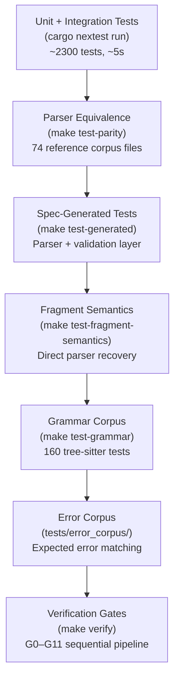
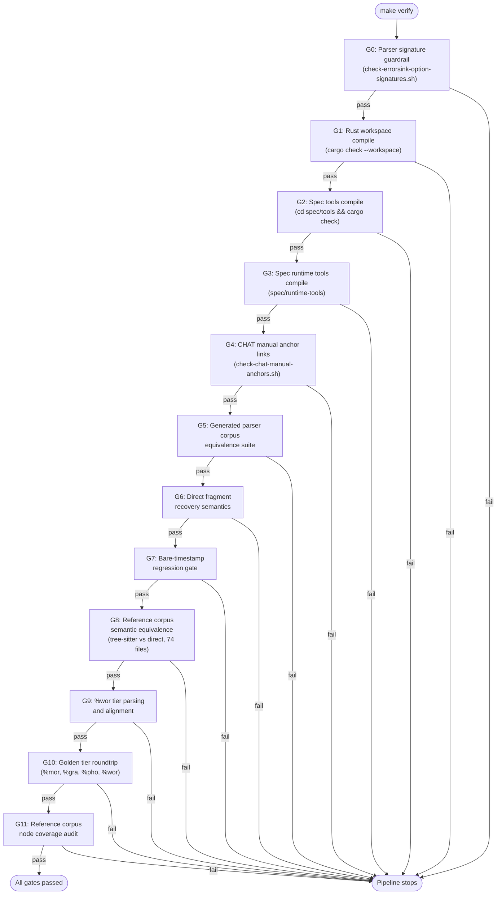

# Testing

## Test Strategy

Testing is organized in layers, from fastest to most comprehensive.



### Unit Tests (nextest)

```bash
cargo nextest run
```

Runs all unit and integration tests across all crates (~2300+ tests). These test individual functions, serialization roundtrips, and model invariants.

`cargo nextest` does not run doctests. Keep `cargo test --doc` as a separate
verification step when you change public API examples or doc comments.

### Parser Equivalence

```bash
make test-parity
```

Runs both parsers (tree-sitter and direct) on each file in the reference corpus and compares results. Each `.cha` file is its own test, enabling per-file parallelism and failure isolation via nextest.

`make test-parity` is the clearer post-bootstrap entrypoint for this full-file
contract.

### Spec-Generated Tests

Part of `talkbank-parser-tests`. These are generated from specs via `make test-gen` and currently test:
- Construct specs: input parses correctly
- Parser-layer error specs: input fails to parse with expected error code
- Validation-layer error specs: input parses but validation reports expected error code

**Important:** this generated layer is under architectural reassessment. It was
designed during the direct-parser bootstrap era and should not be treated as
the sole or final answer for parser-semantic testing.

The intended long-term split is:

- grammar corpus generation for grammar behavior
- direct-parser-native semantic tests for fragment behavior and recovery
- full-file parity tests for end-to-end parser agreement
- validation/error specs for diagnostic contracts

Concrete entrypoint:

```bash
make test-generated
```

### Direct Fragment Semantics

```bash
make test-fragment-semantics
```

Runs the direct-parser-native recovery and parse-health contract suite. This is
the right place for malformed-fragment recovery behavior, sibling retention, and
non-fabrication checks.

### Legacy Fragment Parity Audit

```bash
make test-legacy-fragment-parity
```

Runs the old tree-sitter-vs-direct word-fragment parity suite. This remains
useful as a migration audit, but it is not the semantic source of truth for
direct-parser fragment behavior.

### Tree-Sitter Grammar Tests

```bash
make test-grammar
```

Runs the tree-sitter grammar corpus tests directly. This is the right gate for
grammar structure changes, separate from direct-parser fragment semantics.

### Error Corpus Tests

Supplementary test fixtures in `tests/error_corpus/`. The `expectations.json` manifest maps `.cha` files to expected outcomes.

### Tree-Sitter Tests

```bash
cd grammar
tree-sitter test
```

160 tests that verify the grammar produces correct CSTs for known inputs.

## Reference Corpus

The reference corpus at `corpus/reference/` contains 74 `.cha` files across 20 languages that represent the diversity of real-world CHAT data. Both parsers must agree on every file at 100%.

This corpus is the ultimate arbiter of correctness for **full-file** parsing.
It is not, by itself, the arbiter of isolated direct-parser fragment semantics.

## Verification Gates

`make verify` runs the pre-merge verification suite (G0–G11). All gates
run sequentially — the first failure stops the pipeline.



| Gate | Check |
|------|-------|
| G0 | Parser signature guardrail |
| G1 | Rust workspace compile check |
| G2 | Spec tools compile check |
| G3 | Spec runtime tools compile check |
| G4 | CHAT manual anchor links |
| G5 | Generated parser corpus equivalence suite |
| G6 | Direct fragment recovery semantics |
| G7 | Bare-timestamp regression gate |
| G8 | Reference corpus semantic equivalence (tree-sitter vs direct) |
| G9 | %wor tier parsing and alignment |
| G10 | Golden tier roundtrip (%mor, %gra, %pho, %wor) |
| G11 | Reference corpus node coverage |

## Running Specific Tests

```bash
# Single test by name
cargo nextest run test_name

# Tests in a specific crate
cargo nextest run -p talkbank-model

# Tests matching a pattern
cargo nextest run -- mor

# With output
cargo nextest run --no-capture
```

## What to Run When

| What you changed | Run |
|-----------------|-----|
| Grammar (`grammar.js`) | `cd grammar && tree-sitter generate && tree-sitter test` then `make test-generated` |
| Parser (tree-sitter CST-to-model) | `cargo nextest run -p talkbank-parser && make test-parity` |
| Direct parser (fragment parsing) | `cargo nextest run -p talkbank-direct-parser && make test-fragment-semantics` |
| Model (types, validation, alignment) | `cargo nextest run -p talkbank-model` |
| CLAN command | `cargo nextest run -p talkbank-clan -E 'test(command_name)'` + golden test |
| CLI (chatter args, dispatch) | `cargo nextest run -p talkbank-cli` |
| LSP | `cargo nextest run -p talkbank-lsp` |
| Spec files | `make test-gen && make verify` |
| Pre-merge (any change) | `make verify` |
| Pre-push (quick) | `make ci-local` |

## Mutation Testing

Use `cargo-mutants` to find code that can be changed without any test failing — the true coverage gaps.

```bash
# Install (once)
cargo install cargo-mutants

# Run against a specific crate (--jobs 1 to avoid OOM on 64 GB machines)
cargo mutants -p talkbank-direct-parser --timeout 120 --jobs 1

# Run against CLAN commands
cargo mutants -p talkbank-clan --timeout 120 --jobs 1

# Review results
cat mutants.out/missed.txt    # Mutations no test caught
cat mutants.out/caught.txt    # Mutations properly detected
```

Mutation testing is not part of CI but should be run periodically (after major changes) to find untested logic paths. Results guide where to add new tests.

Configuration: `mutants.toml` at the repo root excludes trivial functions.

## Adding Tests

- **Model tests**: add to the relevant crate's `tests/` directory or `#[cfg(test)]` module
- **Parser tests**: if the change is about grammar shape or validation contracts,
  add or update specs and regenerate as needed; if the change is about
  direct-parser fragment semantics or recovery, prefer direct-parser-native
  tests over routing everything through `make test-gen`
- **Error corpus tests**: add a `.cha` file to `tests/error_corpus/` and update `expectations.json`
- **CLAN command tests**: add golden test cases in `tests/clan_golden/` using the manifest-driven `ParityCase` / `RustSnapshotCase` pattern
