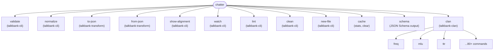

# CLI Reference

**Status:** Current
**Last updated:** 2026-03-26 10:33 EDT

The `chatter` CLI is the public command-line surface for `talkbank-tools`.

The following diagram shows the command dispatch structure. Each
top-level command dispatches to a handler in the corresponding crate.



## Top-Level Commands

```bash
chatter validate PATH
chatter normalize INPUT
chatter to-json INPUT
chatter from-json INPUT
chatter show-alignment INPUT
chatter watch PATH
chatter lint PATH
chatter clean PATH
chatter new-file
chatter cache stats
chatter cache clear --prefix PATH
chatter schema
chatter clan ...
```

Use `chatter --help` or `chatter <command> --help` for the exact live surface.

## `validate`

Validate one file or a directory tree of `.cha` files.

```bash
chatter validate file.cha
chatter validate corpus/
chatter validate corpus/ --format json
chatter validate corpus/ --force --audit audit.jsonl
```

Important options:

- `--format text|json` for human-readable or structured output
- `--skip-alignment` to disable dependent-tier alignment checks
- `--force` to ignore cached clean results and revalidate
- `--audit OUTPUT.jsonl` to stream bulk-validation results without caching new errors

## `normalize`

Serialize a CHAT file into canonical formatting.

```bash
chatter normalize input.cha
chatter normalize input.cha -o normalized.cha
chatter normalize input.cha --validate
```

`normalize` writes to stdout unless you pass `-o/--output`. There is no `--in-place` flag.

## JSON Conversion

```bash
# Single file
chatter to-json input.cha                          # pretty-printed JSON to stdout
chatter to-json input.cha --compact                # minified JSON to stdout
chatter to-json input.cha -o output.json           # JSON to file

# Directory (recursive, preserves structure)
chatter to-json corpus/ --output-dir json/          # incremental by default (mtime check)
chatter to-json corpus/ --output-dir json/ --compact # minified output (saves disk)
chatter to-json corpus/ --output-dir json/ --force   # full rebuild
chatter to-json corpus/ --output-dir json/ --prune   # remove orphaned .json files
chatter to-json corpus/ --output-dir json/ --jobs 4  # parallel workers

# Reverse and schema
chatter from-json input.json -o output.cha
chatter schema
chatter schema --url
```

**Single-file mode:** `to-json` validates by default. Use `--skip-validation`,
`--skip-alignment`, or `--skip-schema-validation` to bypass checks.

**Directory mode:** Walks recursively, converting each `.cha` to `.json` under `--output-dir`
with the same relative path. **Incremental by default**: skips files whose JSON is
already newer than the source. Use `--force` to rebuild all. Use `--prune` to remove
`.json` files with no matching `.cha` (handles renames/deletions). Use `--jobs N` for
parallel conversion (defaults to number of CPUs).

## Editing and Inspection Commands

```bash
chatter show-alignment file.cha
chatter watch corpus/
chatter lint corpus/ --fix
chatter clean file.cha --diff-only
chatter new-file -o starter.cha --speaker CHI --language eng
```

## Cache Commands

```bash
chatter cache stats
chatter cache stats --json
chatter cache clear --prefix /path/to/corpus
chatter cache clear --all --dry-run
```

The validation cache lives under the platform cache directory and stores per-file validation results. `validate --force` refreshes cache state for the specified path.

## `clan`

`chatter clan` is the single entry point for CLAN-style analysis and transform commands.

Examples:

```bash
chatter clan freq corpus/
chatter clan mlu corpus/ --per-file --format json
chatter clan phonfreq corpus/
chatter clan flo file.cha -o flo.cha
```

Many analysis commands share these options:

- `--speaker CODE` / `--exclude-speaker CODE`
- `--gem LABEL` / `--exclude-gem LABEL`
- `--include-word WORD` / `--exclude-word WORD`
- `--range START-END`
- `--per-file`
- `--include-retracings`
- `--format text|json|csv|clan`

Legacy CLAN `+flag` syntax is accepted where documented by the command help, but `chatter clan ...` is the supported public interface going forward.

## Exit Codes

| Code | Meaning |
| --- | --- |
| `0` | Success |
| `1` | Validation or processing failure |
| `2` | CLI usage error |

## Output Contracts

- Text output is intended for humans.
- JSON output is intended for automation and downstream tools.
- Error codes and the JSON Schema are documented public contracts; see the Integrating section of this book.
