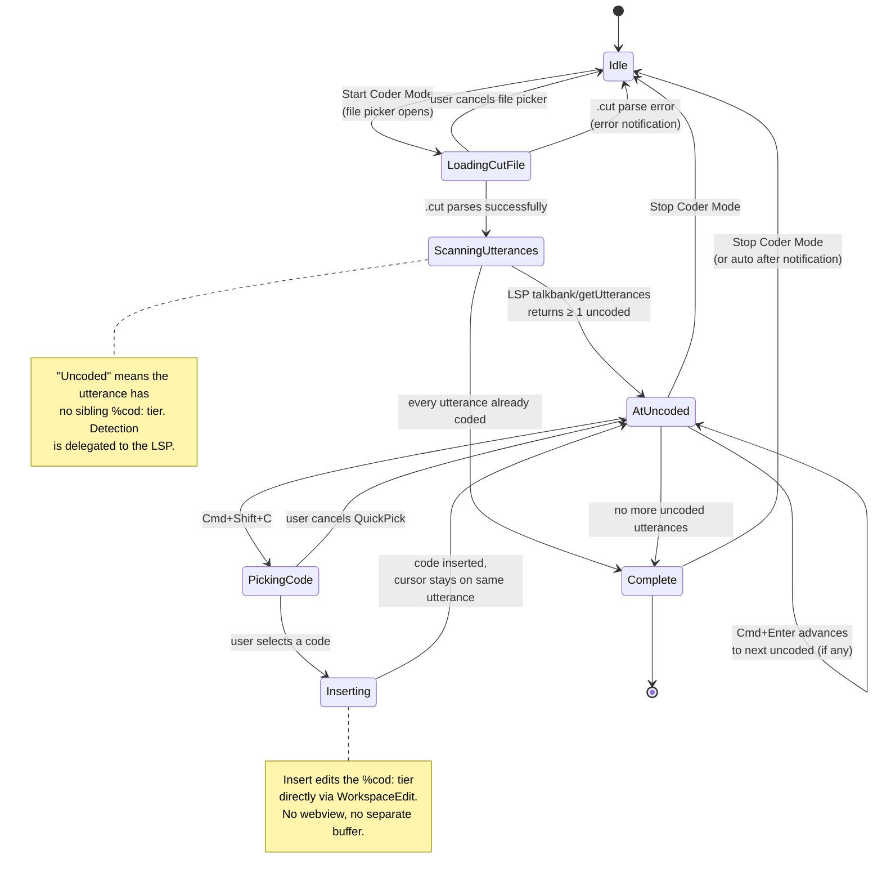

# Coding Workflow

**Status:** Current
**Last updated:** 2026-04-16 16:45 EDT

This chapter walks through the complete Coder Mode workflow in VS Code, from starting a coding session to finishing and reviewing the results.

## Prerequisites

Before starting:

- A `.cha` transcript file open in the editor
- A `.cut` codes file defining your coding scheme (see [Codes Files](codes-files.md))

## Starting Coder Mode

1. Open a `.cha` file in the editor
2. Open the Command Palette (`Cmd+Shift+P` on macOS, `Ctrl+Shift+P` on Windows/Linux)
3. Type **"Start Coder Mode"** and select **TalkBank: Start Coder Mode**
4. A file picker appears -- navigate to and select your `.cut` codes file
5. The extension parses the `.cut` file and loads the code hierarchy

Alternatively, right-click in the editor and select **TalkBank: Navigation** then **Start Coder Mode**.

Once started, the cursor jumps to the first utterance that does not already have a coded tier. A status indicator confirms that Coder Mode is active.

> **(SCREENSHOT: Command Palette showing "Start Coder Mode" with the file picker for .cut files)**
> *Capture this: Open Command Palette, type "Start Coder", show the QuickPick file selector with .cut files listed*

## Inserting Codes

With Coder Mode active, press `Cmd+Shift+C` (macOS) or `Ctrl+Shift+C` (Windows/Linux) to open the code picker.

The QuickPick displays all codes from the `.cut` file as a flat list with indentation to show the hierarchy:

```
  $POS
    :QUE
      :NV
      :VE
    :ANS
      :NV
      :VE
    :COM
```

Type to filter the list using VS Code's fuzzy matching. Select a code and press Enter.

The selected code is inserted as a dependent tier immediately after the current utterance:

```
*CHI:	I want the red one .
%cod:	$PRA:request
```

The picker placeholder shows progress information (e.g., "12 of 45 utterances coded") so you can track how much work remains.

> **(SCREENSHOT: QuickPick code picker showing hierarchical codes with progress indicator)**
> *Capture this: During active Coder Mode, press Cmd+Shift+C to show the picker with indented codes and the "X of Y coded" placeholder text*

## Stepping Through Utterances

After inserting a code, press `Cmd+Enter` (macOS) or `Ctrl+Enter` (Windows/Linux) to advance to the next uncoded utterance. The editor scrolls to center the utterance, and the cursor is positioned on the main tier line.

The stepping logic is backed by the LSP via the `talkbank/getUtterances` command. It identifies utterances that already have a coded tier and skips them, so you only visit utterances that need coding.

If all utterances are coded, the stepping command displays a notification that coding is complete.

## Keyboard Shortcuts

These shortcuts are active only when Coder Mode is running (the `talkbank.coderActive` context is set):

| Shortcut | macOS | Windows/Linux | Action |
|----------|-------|---------------|--------|
| Next uncoded utterance | `Cmd+Enter` | `Ctrl+Enter` | Skip to the next utterance without a coded tier |
| Insert code | `Cmd+Shift+C` | `Ctrl+Shift+C` | Open the code picker and insert the selected code |

## Stopping Coder Mode

When you are finished coding (or want to pause):

1. Open the Command Palette
2. Type **"Stop Coder Mode"** and select **TalkBank: Stop Coder Mode**

This deactivates the Coder Mode keyboard shortcuts and clears the session state. Your work is already saved -- codes were inserted into the document as you went, and normal VS Code auto-save or manual save (`Cmd+S`) persists them to disk.

## State Machine

Coder Mode is a stateful editing mode with five observable states. The
`talkbank.coderActive` VS Code context is bound to whichever of these
is non-idle; keyboard shortcuts `Cmd+Enter` and `Cmd+Shift+C` are gated
on that flag.


<!-- Verified against: vscode/src/commands/coder.ts, vscode/src/coderState.ts, crates/talkbank-lsp/src/backend/chat_ops/get_utterances.rs -->

Key properties the diagram documents:

- The transitions out of `LoadingCutFile` form a **three-way
  branch** (cancel → Idle, parse error → Idle with notification,
  parse success → `ScanningUtterances`). A successor reading only
  the prose would miss the cancel branch.
- `AtUncoded ↔ PickingCode ↔ Inserting` is a **loop that keeps
  you on the same utterance** — the code insertion does not
  auto-advance; advancement requires an explicit `Cmd+Enter`. This
  decouples "coded?" from "moved on?" so mis-codes can be
  corrected in place.
- `Stop Coder Mode` is reachable from `AtUncoded` and `Complete`
  but **not** from `LoadingCutFile` / `PickingCode` / `Inserting`
  (those are modal dialogs VS Code owns).

## Typical Session

A typical coding session looks like this:

1. Open the `.cha` file
2. Start Coder Mode, select your `.cut` file
3. The cursor jumps to the first uncoded utterance
4. Read the utterance, press `Cmd+Shift+C`, select the appropriate code
5. Press `Cmd+Enter` to advance to the next uncoded utterance
6. Repeat steps 4-5 until done
7. Stop Coder Mode

For transcripts with many utterances, you can code in multiple sessions. The extension tracks which utterances already have codes and skips them on the next session.

> **[VIDEO: 60-second Coder Mode demo)**
> *Capture this: Screen recording showing the full workflow -- start coder mode, select .cut file, code 3-4 utterances using Cmd+Shift+C and Cmd+Enter, then stop coder mode. Show the QuickPick hierarchy and the coded tiers being inserted.*

## Tips

- **Use fuzzy search in the picker.** If you know the code you want, start typing its name instead of scrolling through the hierarchy. VS Code's fuzzy matching is fast.

- **Code in batches.** For large transcripts, code 50-100 utterances at a time to avoid fatigue-related errors.

- **Review before committing.** After coding, use the [Scoped Find](../navigation/scoped-find.md) feature to search within coded tiers specifically, reviewing all codes in context.

- **Use consistent `.cut` files across coders.** When multiple people code the same corpus, ensure everyone uses the identical `.cut` file to maintain inter-rater reliability.

## Related Chapters

- [Coder Mode Overview](overview.md) -- what coding is and why to use it
- [Codes Files (.cut)](codes-files.md) -- file format and how to create custom code files
- [Keyboard Shortcuts](../configuration/keyboard-shortcuts.md) -- full shortcut reference including Coder Mode keys
