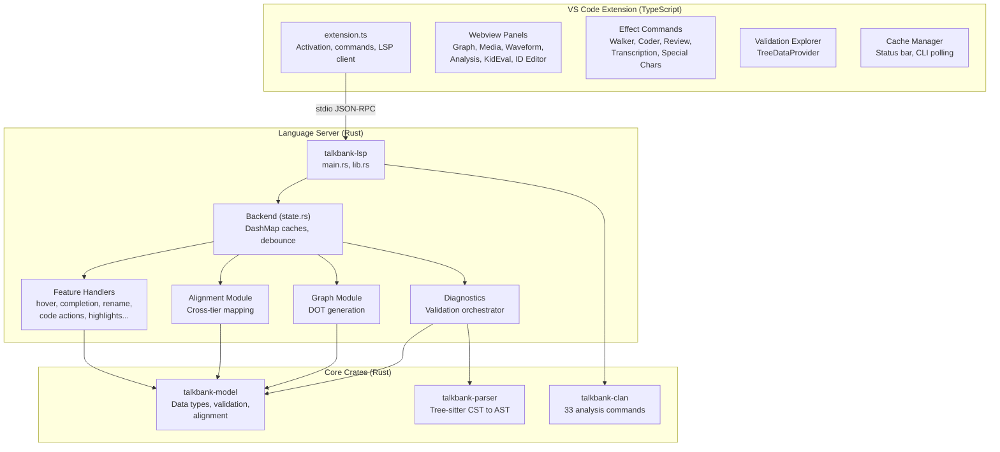
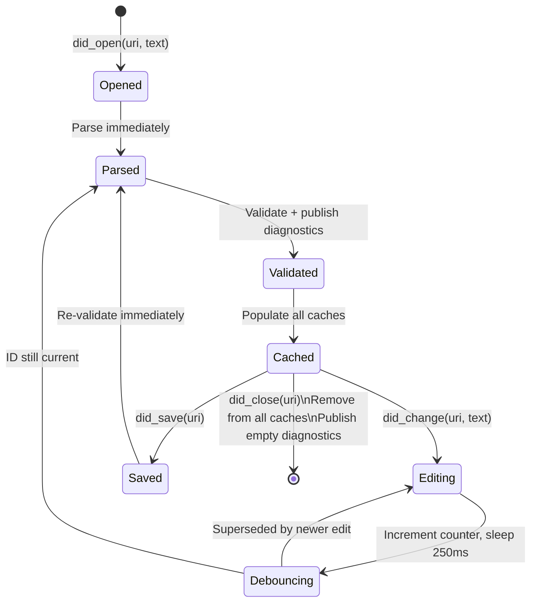
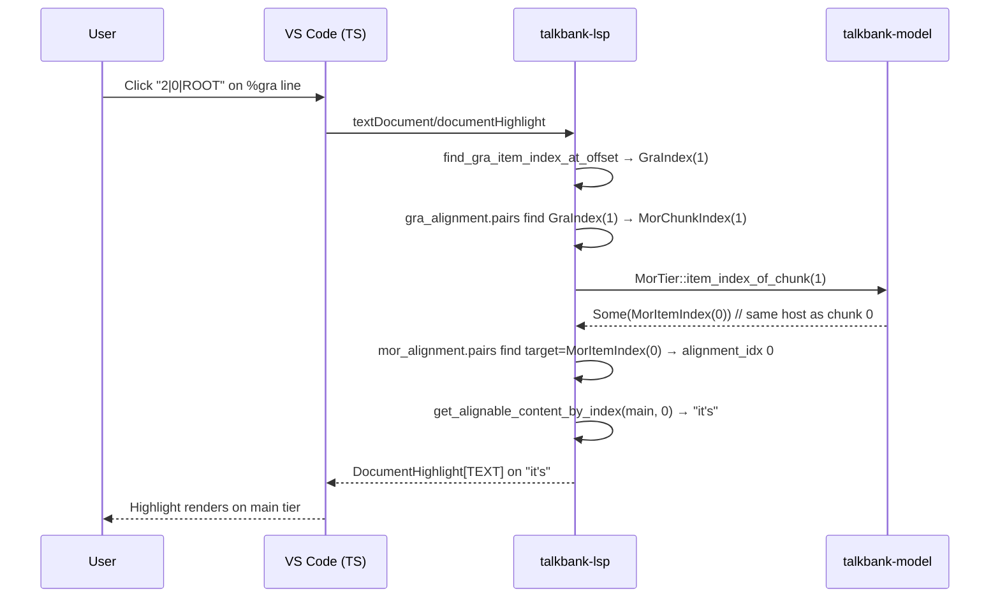
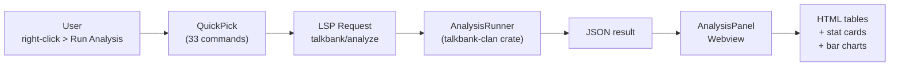

# Architecture

**Status:** Current
**Last updated:** 2026-04-16 16:19 EDT

This chapter describes the internal architecture of the TalkBank CHAT VS Code extension and its backing language server. It is written for developers who want to understand or contribute to the codebase.

## Three-Layer Architecture

The system is split into three layers, each with a clear responsibility:



**Key principle:** the LSP server is a presentation layer. All parsing, validation, and alignment computation lives in `talkbank-model` and `talkbank-parser`. The LSP crate formats and routes that information to the VS Code client. The TypeScript extension is a thin UI layer that registers commands, manages webviews, and communicates with the LSP over stdio.

## Document Lifecycle

Every `.cha` file goes through a well-defined lifecycle as it is opened, edited, and closed:



The 250ms debounce on `did_change` prevents thrashing during fast typing. When the user saves, validation runs immediately without debounce.

## Backend State

All LSP server state lives in the `Backend` struct (`backend/state.rs`). It is `Clone`-safe (everything behind `Arc`), shared across all async request handlers.

### Caches

| Cache | Type | Contents | Lifetime |
|-------|------|----------|----------|
| `documents` | `DashMap&lt;Url, String&gt;` | Raw file text | did_open to did_close |
| `parse_trees` | `DashMap&lt;Url, Tree&gt;` | tree-sitter parse trees | Rebuilt on every edit |
| `chat_files` | `DashMap&lt;Url, ChatFile&gt;` | Parsed model objects | Rebuilt on every edit |
| `parse_clean` | `DashMap&lt;Url, bool&gt;` | Parse health flag | Rebuilt on every edit |
| `validation_cache` | `DashMap&lt;Url, ValidationCache&gt;` | Errors grouped by scope | Rebuilt on validation |
| `pending_validations` | `DashMap&lt;Url, u64&gt;` | Debounce IDs | Transient |

All caches use `DashMap` for lock-free concurrent reads. Parser and semantic-token generation use lazily initialized thread-local instances instead of shared mutexes.

### Cache Miss Strategy

Feature handlers (hover, highlights, etc.) first check the `chat_files` cache. On miss, they re-parse the document text from `documents`. This means features always work even if validation has not completed yet.

## Key Source Files

If you are new to the codebase, read these files in order:

### Rust (Language Server)

1. **`backend/state.rs`** -- the shared state struct and all caches
2. **`backend/mod.rs`** -- how LSP requests are dispatched to handlers
3. **`backend/documents.rs`** -- the document lifecycle (open/change/save/close)
4. **`diagnostics/validation_orchestrator.rs`** -- the validation pipeline
5. **`alignment/mod.rs`** -- how hover and highlight find alignment data
6. **`alignment/tier_hover/main_tier.rs`** -- concrete example of a tier handler
7. **`graph/mod.rs`** -- dependency graph DOT generation
8. **`backend/capabilities.rs`** -- all 23 advertised LSP capabilities

### TypeScript (Extension)

1. **`extension.ts`** -- entry point: LSP client setup, command registration
2. **`validationExplorer.ts`** -- TreeDataProvider for bulk validation
3. **`analysisPanel.ts`** -- webview rendering for CLAN analysis results
4. **`mediaPanel.ts`** -- audio/video playback with segment tracking
5. **`coderPanel.ts`** -- Coder Mode: `.cut` file parsing and code insertion

## Alignment and the `%mor` Chunk Sequence

Cross-tier alignment — main ↔ `%mor`, `%mor` ↔ `%gra`, main ↔ `%pho` /
`%sin` / `%wor` — is implemented **once** in `talkbank-model`. The LSP
crate is a consumer; it never recomputes alignment. This boundary is
strict and is codified in `crates/talkbank-lsp/CLAUDE.md`.

### The `%mor` chunk primitive

`%gra` relations address a sequence that is distinct from
`MorTier::items`: each item expands to one chunk for its main word plus
one chunk per post-clitic, and the optional terminator is one final
chunk. `MorTier::chunks()` is the canonical iterator over this sequence;
`MorTier::chunk_at(idx)` indexes directly into it; `MorTier::item_index_of_chunk(idx)`
projects a chunk back to its host item for main↔`%mor` lookups.

```rust
// talkbank-model
pub enum MorChunk<'a> {
    Main(&'a Mor),
    PostClitic(&'a Mor, &'a MorWord),
    Terminator(&'a str),
}

impl MorTier {
    pub fn chunks(&self) -> impl Iterator<Item = MorChunk<'_>>;
    pub fn chunk_at(&self, chunk_index: usize) -> Option<MorChunk<'_>>;
    pub fn item_index_of_chunk(&self, chunk_index: usize) -> Option<usize>;
}
```

Five places in the workspace used to walk the chunk expansion by hand
(`count_chunks`, `align_mor_to_gra`, `extract_mor_chunk_items`, the LSP
hover helper, the graph DOT label builder). All now delegate to
`MorTier::chunks()`. Any future consumer — CLI, CLAN analyses,
`batchalign3` — must do the same.

### Three distinct index spaces

`%mor` / `%gra` address three integer spaces that all look identical
as `usize`; the compiler now tells them apart via newtypes in
`talkbank-model::alignment::indices`:

| Type | 0- or 1-indexed | Over what | Where it comes from |
|------|-----------------|-----------|---------------------|
| `MorItemIndex` | 0-indexed | `MorTier::items` | `AlignmentPair.target` on the main↔mor alignment |
| `MorChunkIndex` | 0-indexed | `MorTier::chunks()` sequence | `GraAlignmentPair.mor_chunk_index` |
| `SemanticWordIndex1` | **1-indexed** | Author-written position in a `%gra` relation | `GrammaticalRelation::index`, `::head` |

The bug class the newtypes prevent: taking a `MorChunkIndex` from a
`%gra` alignment pair and using it as a `MorItemIndex` in the main↔mor
alignment. On any post-clitic, that lands on the wrong item and mis-
renders highlights, hovers, or navigation jumps. `GraAlignmentPair`
carries `Option<MorChunkIndex>` / `Option<GraIndex>` rather than bare
`Option<usize>`, so the two spaces cannot swap at the type level.
`GraHeadRef { Root | Word(SemanticWordIndex1) }` forces callers to
handle the `head == 0` ROOT sentinel explicitly instead of inlining the
magic number.

### Flow for a `%gra` click



The user-facing behavior is described in
[Navigation → Cross-Tier Alignment](../navigation/alignment.md#clitics-and-the-mor-chunk-sequence).

## Validation Pipeline

The validation pipeline is the most critical path in the server:

```
validate_and_publish(resources, uri, text, old_text?)
  1. Parse text with TreeSitterParser -> ChatFile + Vec<ParseError> + Tree
  2. Run model validation (ChatFile::validate()) -> Vec<ParseError>
  3. Convert ParseError -> lsp_types::Diagnostic
     - Map Span to LSP Range
     - Map severity to DiagnosticSeverity
     - Set error code, source ("talkbank")
     - Attach related_information (context pointers)
  4. Build ValidationCache (grouped by scope)
  5. Update all backend caches
  6. Publish diagnostics via client.publish_diagnostics()
```

## Performance Notes

### Edit debounce

A 250 ms debounce on `did_change` trades responsiveness against CPU usage.
For large files, parsing + validation can take 10–50 ms, so 250 ms
prevents thrashing on fast typing while keeping diagnostics near-live.
Saves bypass the debounce and validate immediately.

### `DashMap` vs thread-local services

`DashMap` is used for every per-document cache because multiple LSP
requests can arrive concurrently (e.g. hover while validation is
running). The tree-sitter parser and semantic-token provider are
thread-confined resources; the backend reaches them through thread-local
language services instead of holding a shared `Mutex`, eliminating one
contention point under load.

### Semantic tokens

Full semantic tokens are recomputed on every request. Range-based
semantic tokens compute tokens only for the visible range — cheaper on
large files. Delta (incremental) semantic tokens are not yet
implemented and are not on the critical path.

### Validation Explorer vs per-file validation

The Validation Explorer shells out to the `chatter` CLI, which uses
crossbeam workers for fully parallel corpus-scale validation. This is
intentionally separate from the LSP: the LSP handles per-file
validation on every edit; the CLI handles bulk validation across
thousands of files. Keeping these two paths separate avoids burning
the LSP loop on multi-second corpus scans.

## Webview Panels

All webview panels follow the singleton pattern: `createOrShow()` reuses an existing panel or creates a new one. Communication between the extension and webviews uses the PostMessage JSON protocol.

| Panel | File | Purpose |
|-------|------|---------|
| `AnalysisPanel` | `analysisPanel.ts` | CLAN analysis results as styled tables |
| `GraphPanel` | `graphPanel.ts` | Dependency graph (DOT to SVG via Graphviz WASM) |
| `MediaPanel` | `mediaPanel.ts` | Audio/video playback with segment tracking |
| `WaveformPanel` | `waveformPanel.ts` | Web Audio API waveform visualization |
| `KidevalPanel` | `kidevalPanel.ts` | KidEval/Eval/Eval-D normative comparison |
| `IdEditorPanel` | `idEditorPanel.ts` | @ID header table editor |
| `PicturePanel` | `picturePanel.ts` | Elicitation picture display |
| `CoderPanel` | `coderPanel.ts` | Coder Mode code insertion |

## Analysis Pipeline

The analysis pipeline illustrates the full flow from user action to rendered output:



No per-command renderer is needed -- the `AnalysisPanel` renders JSON results generically as section headings, key-value fields, and tables.

## Related Chapters

- [LSP Protocol](lsp-protocol.md) -- all advertised capabilities
- [Adding Features](adding-features.md) -- step-by-step guide to adding new LSP features
- [Custom Commands](custom-commands.md) -- the 12 non-standard LSP commands
- [Testing](testing.md) -- how to test the server and extension
