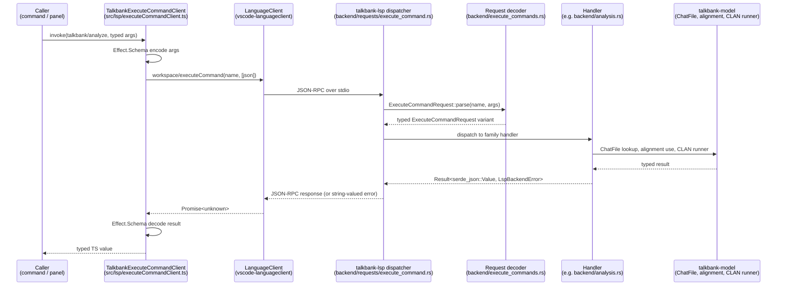

# Custom Commands

**Status:** Current
**Last updated:** 2026-04-16 22:09 EDT

The TalkBank language server defines twelve custom LSP commands
invoked via `workspace/executeCommand`. They provide functionality
that doesn't fit standard LSP capabilities (hover, completion, rename)
— things like "run a CLAN analysis," "produce an alignment sidecar,"
"filter a document by speaker."

**The per-command reference lives at
[`reference/rpc-contracts.md`](../reference/rpc-contracts.md).**
That page is the single source of truth for request/response shapes,
TS callers, Rust handlers, and example payloads. This chapter covers
the shared architecture behind all twelve endpoints.

## Why custom commands?

Standard LSP capabilities have fixed request/response shapes defined
by the LSP specification. Custom commands allow arbitrary JSON
parameters and typed return values — the escape hatch protocols use
for extension-specific functionality. Alternatives considered and
rejected: ad-hoc HTTP sidecars, embedded WASM parsers, shared-memory
bridges. See [ADR-001](../design/adr-001-lsp-over-embedded-parser.md).

## Round-trip sequence



## Typed boundary rules

- **Every command name** is a variant of `ExecuteCommandName` in
  `execute_commands.rs`. Adding a command means adding a variant —
  the compiler forces you to handle it in dispatch and the unit test
  pins the advertised-list against the enum.
- **Every request payload** decodes through
  `ExecuteCommandRequest::parse`. On malformed input the dispatcher
  returns a typed `LspBackendError`, never panics.
- **Every response** is `serde_json::Value` at the LSP wire boundary;
  handlers build typed structs and `serde_json::to_value` at the
  edge. The `?` operator lifts serialization failures via
  `LspBackendError::JsonSerializeFailed`.
- **On the TypeScript side**, `TalkbankExecuteCommandClient` wraps
  `client.sendRequest('workspace/executeCommand', …)` and runs the
  JSON through an Effect `Schema` decoder. Callers receive typed
  values, never `unknown`. Three tagged error classes classify
  failure modes — see
  [`executeCommandErrors.ts`][errors].

[errors]: https://github.com/TalkBank/talkbank-tools/blob/main/vscode/src/lsp/executeCommandErrors.ts

## Usage from TypeScript

```ts
// Example: getting speakers for the filter picker
import type { ExecuteCommandStructuredError } from './lsp/executeCommandErrors';

const speakersEffect: Effect.Effect<SpeakerInfo[], ExecuteCommandStructuredError> =
    client.getSpeakers({ uri: document.uri.toString() });
```

Never call `client.sendRequest('workspace/executeCommand', ...)` directly
— every custom command flows through the
`TalkbankExecuteCommandClient` facade so the payload decode stays
typed. If a new command is needed, add a method to the facade (see
[Adding Features](adding-features.md) for the full checklist).

## Adding a new custom command

See the detailed checklist in
[Adding Features → Adding a custom LSP RPC command](adding-features.md#adding-a-custom-lsp-rpc-command).
The short version: variant in `ExecuteCommandName`, handler in the
appropriate family module, dispatch in
`backend/requests/execute_command.rs`, typed method on
`TalkbankExecuteCommandClient`, and a new row in
[`reference/rpc-contracts.md`](../reference/rpc-contracts.md).

## Related chapters

- [RPC Contracts](../reference/rpc-contracts.md) — per-endpoint reference
- [Architecture](architecture.md) — system design
- [LSP Protocol](lsp-protocol.md) — standard LSP capabilities
- [Adding Features](adding-features.md) — general feature-addition checklist
- [ADR-002: Effect-based command runtime](../design/adr-002-effect-runtime.md)
