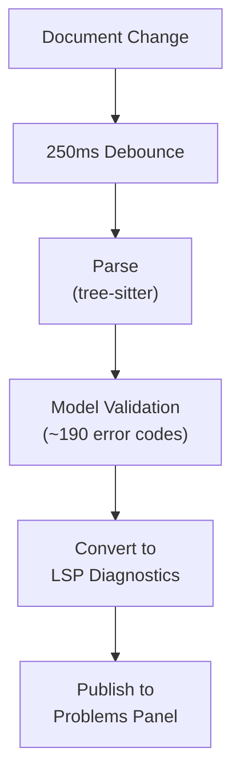

# Real-Time Validation

**Status:** Current
**Last updated:** 2026-04-16 22:27 EDT

The extension validates your CHAT file continuously as you type. Errors
appear as underlined squiggles with diagnostic messages in the Problems
panel — no need to save or run a separate command.

## What gets validated

| Category | Examples |
|----------|---------|
| Syntax | Malformed headers, invalid tier prefixes, missing terminators |
| Required structure | @UTF8, @Begin, @End, @Languages, @Participants |
| Participant consistency | Undeclared speakers, @ID field counts, role/language mismatches |
| Tier alignment | %mor word count vs main tier, %gra index consistency |
| Morphology format | POS tag syntax, feature syntax, compound structure |
| Grammar relations | Valid relation types, index ranges, ROOT presence |
| Timing bullets | Monotonicity, same-speaker overlap, start < end |
| Terminators | Missing or invalid utterance terminators |

## Diagnostic structure

Each diagnostic includes:

- **Error code** (e.g., E301, E705) — links to the
  [error reference](https://talkbank.org/errors/)
- **Severity** — Error (red), Warning (yellow), Information (blue), Hint (gray)
- **Related information** — points to the conflicting location (e.g., the
  @Participants header when a speaker is undeclared)

> **(SCREENSHOT: Editor showing validation errors with squiggles and Problems panel)**
> *Capture this: Open a CHAT file with deliberate errors (missing @End, undeclared speaker). Show the red squiggles and the Problems panel at the bottom.*

## Inlay hints

When the main tier and %mor tier have different word counts, inlay hints
appear as muted inline annotations showing the alignment status.

When counts match, a checkmark appears. When they mismatch, the hint shows
both counts with a cross mark, making it easy to spot alignment issues
without running a separate command.

Toggle with `talkbank.inlayHints.enabled` setting.

## Diagnostic tags

Some diagnostics use VS Code's diagnostic tag system for visual styling:

- **Unnecessary** — fade-out (dimmed text) for deprecated constructs
- **Deprecated** — strikethrough for obsolete syntax

## Severity filtering

The `talkbank.validation.severity` setting controls which diagnostics appear:

| Value | Shows |
|-------|-------|
| `all` (default) | Errors, warnings, and information |
| `errorsAndWarnings` | Errors and warnings only |
| `errorsOnly` | Errors only |

## Validation pipeline

Changes are debounced at 250ms to avoid overwhelming the parser during
rapid typing. After parsing, the full model validation pipeline runs
(the same pipeline as `chatter validate`), producing diagnostics with
error codes, spans, and related information.

## See also

- [Quick Fixes](quick-fixes.md) — automatic fixes for common errors
- [Corpus Validation](../workflows/corpus-validation.md) — validating
  entire directories
