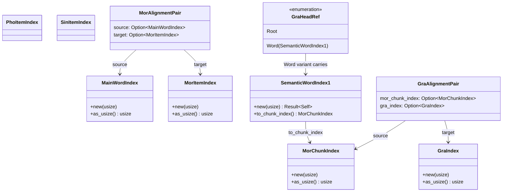

# Alignment Index Spaces

**Status:** Current
**Last updated:** 2026-04-16 21:50 EDT

`%mor` / `%gra` / `%pho` / `%sin` alignment code in this extension
crosses three integer index spaces that all look identical when typed
as `usize`. Confusing them is the bug class the typed newtypes defined
in [`talkbank_model::alignment::indices`][indices] exist to prevent.

This page is the canonical source for which space each integer lives
in, how the spaces convert into each other, and a worked example on a
post-clitic utterance.

[indices]: https://github.com/TalkBank/talkbank-tools/blob/main/crates/talkbank-model/src/alignment/indices.rs

## The three spaces

| Newtype | 0- / 1-indexed | Over which sequence | Where it comes from |
|---------|----------------|---------------------|---------------------|
| [`MorItemIndex`][MorItemIndex] | 0-indexed | `MorTier::items` (one entry per `%mor` item, no post-clitic expansion) | `MorAlignmentPair.target_index` on the main↔`%mor` alignment |
| [`MorChunkIndex`][MorChunkIndex] | 0-indexed | `MorTier::chunks()` (item main word, then each post-clitic, then the optional terminator) | `GraAlignmentPair.mor_chunk_index` on the `%mor`↔`%gra` alignment |
| [`SemanticWordIndex1`][SemanticWordIndex1] | **1-indexed** | Author-written position in a `%gra` relation | `GrammaticalRelation::index`, `::head` |

[MorItemIndex]: https://github.com/TalkBank/talkbank-tools/blob/main/crates/talkbank-model/src/alignment/indices.rs
[MorChunkIndex]: https://github.com/TalkBank/talkbank-tools/blob/main/crates/talkbank-model/src/alignment/indices.rs
[SemanticWordIndex1]: https://github.com/TalkBank/talkbank-tools/blob/main/crates/talkbank-model/src/alignment/indices.rs

The `%gra` ROOT sentinel (`head == 0`) is not a chunk — it is
represented separately as [`GraHeadRef::Root`][GraHeadRef] so the
sentinel is a variant, not a magic number.

[GraHeadRef]: https://github.com/TalkBank/talkbank-tools/blob/main/crates/talkbank-model/src/alignment/indices.rs



## Worked example

Consider the CHAT line

```text
*CHI: it's cookies .
%mor: pron|it~aux|be n|cookie .
%gra: 1|2|SUBJ 2|0|ROOT 3|2|OBJ 4|2|PUNCT
```

The `%mor` tier has **two** items (`pron|it~aux|be` and `n|cookie`).
The same tier has **four** chunks when `MorTier::chunks()` expands the
items by their post-clitics and appends the terminator:

| Chunk index | Chunk kind | Word / Text | Host item index |
|-------------|------------|-------------|-----------------|
| 0 | `Main` | `pron\|it` | 0 |
| 1 | `PostClitic` | `aux\|be` | 0 |
| 2 | `Main` | `n\|cookie` | 1 |
| 3 | `Terminator` | `.` | (none) |

The `%gra` relations address this chunk sequence, 1-indexed. So
`2|0|ROOT` says "semantic word 2 (chunk 1 = `aux|be`) has head 0
(ROOT)."

Common pitfall this file exists to prevent: taking
`relation.index == 2`, treating it as `MorItemIndex(2)` — which would
be *out of range* (only two items exist) — or `MorItemIndex(1)` after
a naïve `- 1` — which would pick up `n|cookie` instead of `aux|be`.
Neither maps the semantic word to its `%mor` lemma.

The correct projection is:

```rust
// 1. Semantic word index → chunk index via subtract-1.
let chunk_idx = (relation.index as usize).checked_sub(1)?;

// 2. Chunk → host item for anyone who needs main↔%mor alignment.
let host_item_idx = mor_tier.item_index_of_chunk(chunk_idx)?;
```

## When to use which projection

| Need | Use |
|------|-----|
| "What lemma does this `%gra` relation refer to?" | [`MorTier::chunk_at(chunk_idx)`][chunk_at] then `chunk.lemma()` |
| "Which main-tier word does this `%gra` relation correspond to?" | [`MorTier::item_index_of_chunk(chunk_idx)`][item_index_of_chunk] then look up the main↔`%mor` pair |
| "Is this relation pointing at ROOT?" | `relation.head_ref()` → match on `GraHeadRef::Root` |
| "Walk all chunks in order" | `mor_tier.chunks()` (never hand-roll `items.iter().flat_map(|i| ... i.post_clitics ...)`) |

[chunk_at]: https://github.com/TalkBank/talkbank-tools/blob/main/crates/talkbank-model/src/model/dependent_tier/mor/tier.rs
[item_index_of_chunk]: https://github.com/TalkBank/talkbank-tools/blob/main/crates/talkbank-model/src/model/dependent_tier/mor/tier.rs

## The other alignments

`%pho`, `%mod`, and `%sin` do not expand — they align 1:1 with main-tier
alignable words. Their typed pairs are:

| Tier | Pair alias | Source | Target |
|------|------------|--------|--------|
| `%mor` | `MorAlignmentPair` | `MainWordIndex` | `MorItemIndex` |
| `%gra` | `GraAlignmentPair` | `MorChunkIndex` | `GraIndex` |
| `%pho` (and `%mod`) | `PhoAlignmentPair` | `MainWordIndex` | `PhoItemIndex` |
| `%sin` | `SinAlignmentPair` | `MainWordIndex` | `SinItemIndex` |

`%wor` is **not** a structural alignment — it is a timing sidecar
([`WorTimingSidecar`][WorTimingSidecar]) with a `Positional { count }` /
`Drifted { main_count, wor_count }` shape rather than a pair list.
Count mismatches are tolerated rather than diagnosed.

[WorTimingSidecar]: https://github.com/TalkBank/talkbank-tools/blob/main/crates/talkbank-model/src/alignment/wor.rs

## See also

- [Cross-Tier Alignment](../navigation/alignment.md) — user-facing behavior on hover and highlight.
- [Architecture](../developer/architecture.md) — three-layer design and chunk-projection flow.
- [`talkbank-lsp/CLAUDE.md`][lsp-claude] — AI-assistant discipline for any future LSP code that touches these indices.

[lsp-claude]: https://github.com/TalkBank/talkbank-tools/blob/main/crates/talkbank-lsp/CLAUDE.md
