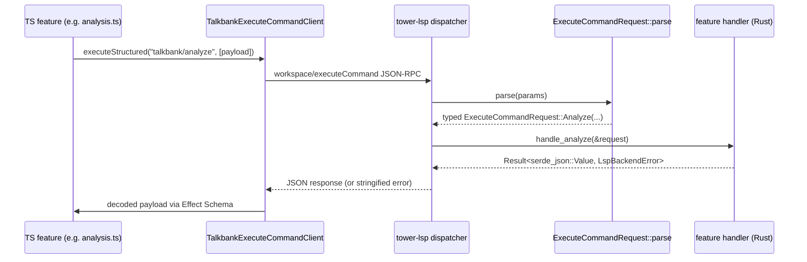

# Custom LSP RPC Contracts

**Status:** Current
**Last updated:** 2026-04-16 21:52 EDT

The extension drives twelve custom `workspace/executeCommand` endpoints
exposed by [`talkbank-lsp`][lsp]. This page is the per-endpoint reference:
command identifier, request shape, response shape, TS caller, Rust
handler. Everything here is verified against the current source on
both sides — if an endpoint's behavior drifts, update this page in
the same commit.

[lsp]: https://github.com/TalkBank/talkbank-tools/tree/main/crates/talkbank-lsp

## One typical call at runtime

Twelve endpoints grouped by handler family.

## Documents family

### `talkbank/showDependencyGraph`

Generate a Graphviz DOT dependency graph for the utterance at a cursor
position.

| | |
|---|---|
| Rust request | `DocumentPositionRequest { uri: Url, position: Position }` in `backend/execute_commands.rs` |
| Rust handler | `graph::build_dependency_graph_response(utterance, parse_state)` in `crates/talkbank-lsp/src/graph/mod.rs` |
| Rust response | `DependencyGraphResponse::Dot { source } \| Unavailable { reason }` |
| TS caller | `executeCommandClient.getDependencyGraph` (or similar — see `graphPanel.ts`) |
| TS response type | `DependencyGraphResponse` (Effect Schema discriminated union) in `lsp/executeCommandPayloads.ts` |

Request layout: argument position `0` is the document URI, position `1`
is the cursor as `{ line, character }`. See the [Cross-Tier
Alignment](../navigation/alignment.md) and [Dependency
Graphs](../navigation/dependency-graphs.md) pages for user-facing
behavior; the DOT output includes a `stale baseline` header label when
the backend is serving a stale-baseline parse (see
[`developer/architecture.md`](../developer/architecture.md)).

### `talkbank/getAlignmentSidecar`

Produce the alignment-sidecar payload for one document — a JSON view
of every utterance's `AlignmentSet` usable by the extension's alignment
overlays.

| | |
|---|---|
| Rust request | `DocumentUriRequest { uri: Url }` |
| Rust handler | `build_alignment_sidecar(&uri, text, &chat_file)` in `backend/requests/alignment_sidecar.rs` |
| Rust response | `AlignmentSidecarDocument { schema_version, uri, utterances[] }` |
| TS caller | `TalkbankExecuteCommandClient.getAlignmentSidecar` |
| TS response type | `AlignmentSidecarDocument` in `lsp/executeCommandPayloads.ts` |

`alignments.wor` on each utterance carries synthetic positional pairs
`{source_index: i, target_index: i}` when the backing
`WorTimingSidecar` is `Positional`, and is empty when it is `Drifted`
or absent. See [alignment-indices.md](alignment-indices.md).

## Analysis family

### `talkbank/analyze`

Run one CLAN analysis command (freq, mlu, kideval, …) and return JSON.

| | |
|---|---|
| Rust request | `AnalyzeRequest` = `AnalyzeCommandPayload` (shared with `talkbank-clan`) |
| Rust handler | `handle_analyze(&request)` in `backend/analysis.rs` |
| Rust response | `serde_json::Value` — the analysis command's native JSON output |
| TS caller | `TalkbankExecuteCommandClient.analyze(request)` |
| TS request type | `AnalyzeCommandRequest` in `lsp/executeCommandPayloads.ts` |

Payload carries `command_name`, `target_uri`, and an `AnalysisOptions`
struct with every per-command flag. See the
[Command Reference](../analysis/command-reference.md) page for
the command-name catalog.

### `talkbank/kidevalDatabases` · `talkbank/evalDatabases`

Discover normative databases in a CLAN library directory. Returns the
same shape for both; the extension surfaces them in different UIs.

| | |
|---|---|
| Rust request | `DiscoverDatabasesRequest { library_dir: PathBuf }` |
| Rust handler | `handle_discover_databases(&request)` in `backend/analysis.rs` |
| Rust response | `Vec<AvailableDatabase>` |
| TS caller | `TalkbankExecuteCommandClient.kidevalDatabases` / `.evalDatabases` |
| TS response type | `AvailableDatabase[]` in `lsp/executeCommandPayloads.ts` |

## Participants family

### `talkbank/getParticipants`

Extract `@ID` participant entries from a document.

| | |
|---|---|
| Rust request | `DocumentUriRequest { uri: Url }` |
| Rust handler | `handle_get_participants(&backend, &request)` in `backend/participants.rs` |
| Rust response | `Vec<ParticipantEntry>` |
| TS caller | `TalkbankExecuteCommandClient.getParticipants` |
| TS response type | `ParticipantEntry[]` |

### `talkbank/formatIdLine`

Format one `@ID` header line from field values. Pure formatting —
does not touch a document.

| | |
|---|---|
| Rust request | `IdLineFieldsRequest { language, corpus, speaker, age, sex, group, ses, role, education, custom }` |
| Rust handler | `handle_format_id_line(&request)` in `backend/participants.rs` |
| Rust response | `{ formatted: String }` |
| TS caller | `TalkbankExecuteCommandClient.formatIdLine` |
| TS request type | `IdLineFields` |

## ChatOps family

### `talkbank/getSpeakers`

Extract declared speaker metadata from `@Participants`.

| | |
|---|---|
| Rust request | `DocumentUriRequest { uri: Url }` |
| Rust handler | `handle_get_speakers(&backend, &request)` in `backend/chat_ops/speakers.rs` |
| Rust response | `Vec<SpeakerInfo>` |
| TS caller | `TalkbankExecuteCommandClient.getSpeakers` |
| TS response type | `SpeakerInfo[]` |

### `talkbank/filterDocument`

Filter a document down to selected speakers. Returns the filtered
document text for use as a virtual document.

| | |
|---|---|
| Rust request | `FilterDocumentRequest { uri: Url, speakers: Vec<String> }` |
| Rust handler | `handle_filter_document(&backend, &request)` in `backend/chat_ops/filter_document.rs` |
| Rust response | `{ text: String }` |
| TS caller | `TalkbankExecuteCommandClient.filterDocument` |

### `talkbank/getUtterances`

Return utterance metadata used by coder mode (speaker, text, range).

| | |
|---|---|
| Rust request | `DocumentUriRequest { uri: Url }` |
| Rust handler | `handle_get_utterances(&backend, &request)` in `backend/chat_ops/utterances.rs` |
| Rust response | `Vec<UtteranceInfo>` |
| TS caller | `TalkbankExecuteCommandClient.getUtterances` |
| TS response type | `UtteranceInfo[]` |

### `talkbank/formatBulletLine`

Format one timing-bullet insertion for the transcription mode's F4
insertion key.

| | |
|---|---|
| Rust request | `FormatBulletLineRequest { prev_ms, current_ms, speaker }` |
| Rust handler | `handle_format_bullet_line(&request)` in `backend/chat_ops/format_bullet.rs` |
| Rust response | `FormattedBulletLine { bullet, new_line }` |
| TS caller | `TalkbankExecuteCommandClient.formatBulletLine` |
| TS response type | `FormattedBulletLine` |

### `talkbank/scopedFind`

Execute semantically scoped search in one document (main tier only,
all tiers, specific dependent tier, with optional regex).

| | |
|---|---|
| Rust request | `ScopedFindRequest { uri, query, scope, speakers[], regex }` |
| Rust handler | `handle_scoped_find(&backend, &request)` in `backend/chat_ops/scoped_find.rs` |
| Rust response | `Vec<ScopedFindMatch>` |
| TS caller | `TalkbankExecuteCommandClient.scopedFind` |
| TS request type | `ScopedFindRequest` · TS response type `ScopedFindMatch[]` |

## Error contract

All handlers return `Result<serde_json::Value, LspBackendError>`.
The dispatcher in `backend/requests/execute_command.rs` serializes
successes to the JSON-RPC `result`; failures are returned as a
string-valued result (one-field wire format) so the extension can
render them inline even when no LSP Diagnostic applies. `LspBackendError`
variants include `ArgumentMissing`, `ArgumentInvalid`, `InvalidUriParse`,
`UriNotFilePath`, `DocumentNotFound`, `LanguageServicesUnavailable(BackendInitError)`,
and the command-agnostic `ExternalServiceFailed { service, reason }`.

The TS side wraps every call in three typed error classes:

- `ExecuteCommandRequestError` — transport failed (disconnected, timeout)
- `ExecuteCommandResponseError` — wrong payload shape
- `ExecuteCommandServerError` — server returned a string-valued error

See `vscode/src/lsp/executeCommandErrors.ts` for the tagged error
family and [Webview Message Contracts](webview-contracts.md) for the
panel-side decoding patterns.

## Advertised command list

The LSP advertises its twelve command names during `initialize` via
`ExecuteCommandName::advertised_commands()`. A unit test in
`backend/execute_commands.rs::tests` pins the list against the
manifest so adding a command without updating the advertisement is a
compile-and-test failure.
