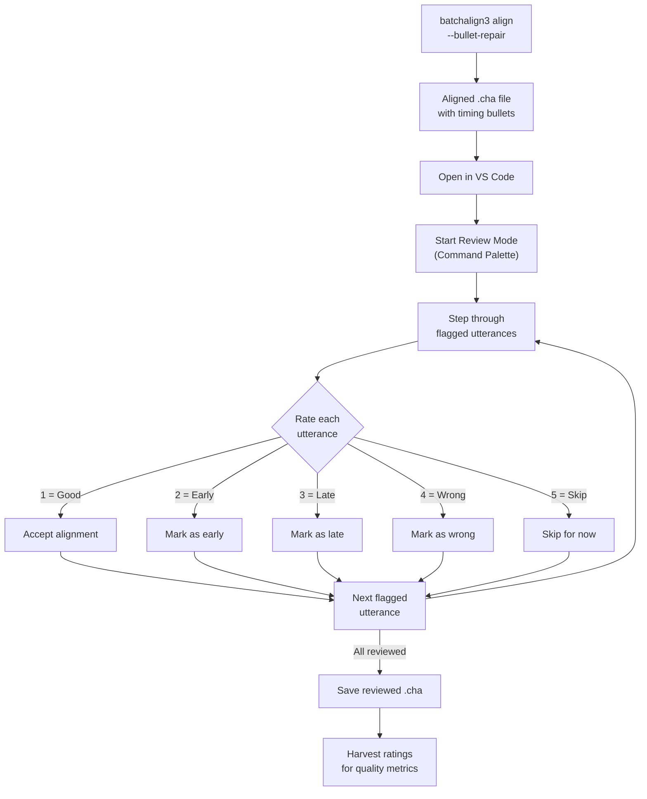

# Post-Alignment Review

**Last updated:** 2026-03-30 13:40 EDT

After running automatic alignment with batchalign3, timing bullets may not be perfectly placed. Review Mode provides a structured workflow for a human reviewer to step through flagged utterances, rate alignment quality, correct errors, and produce a final validated transcript.

## Workflow Overview

The following diagram shows the end-to-end post-alignment review workflow:



## Step-by-Step

### 1. Align the transcript

Run batchalign3 to add or repair timing bullets:

```bash
batchalign3 align --bullet-repair input.cha -o output/
```

This produces an aligned `.cha` file where each utterance has timing bullets derived from the audio.

### 2. Open in VS Code

Open the aligned `.cha` file. The extension loads and begins real-time validation.

### 3. Start Review Mode

Open the Command Palette (`Cmd+Shift+P` / `Ctrl+Shift+P`) and select **TalkBank: Start Review Mode**.

The extension enters Review Mode:
- The cursor jumps to the first flagged utterance
- Review-specific keybindings activate
- The media panel opens for playback

### 4. Review each utterance

For each flagged utterance:

1. **Listen** -- the segment plays automatically so you can hear the audio
2. **Read** -- compare the transcript text against what you hear
3. **Rate** -- press a number key to rate the alignment quality:

| Key | Rating | Meaning |
|-----|--------|---------|
| `1` | Good | Timing is correct, no changes needed |
| `2` | Early | Bullet starts too early |
| `3` | Late | Bullet starts too late |
| `4` | Wrong | Alignment is completely off |
| `5` | Skip | Come back to this one later |

After rating, the cursor advances to the next flagged utterance.

### 5. Navigate between flagged utterances

| Shortcut | Action |
|----------|--------|
| `Alt+]` | Jump to next flagged utterance |
| `Alt+[` | Jump to previous flagged utterance |

### 6. Correct errors

When you rate an utterance as Early, Late, or Wrong, you can manually adjust the timing bullets in the transcript. Edit the bullet values directly, then use `Alt+]` to move on.

### 7. Stop Review Mode

When all flagged utterances have been reviewed, open the Command Palette and select **TalkBank: Stop Review Mode**. Save the file.

### 8. Harvest ratings

The ratings embedded by Review Mode can be harvested for quality metrics -- how many utterances were correctly aligned, what percentage needed correction, and so on. This data feeds back into alignment quality assessment.

## Rating Key Behavior

The number keys (`1`-`5`) for rating are only active when:

- Review Mode is active (`talkbank.reviewActive` context is set)
- The editor does **not** have text focus (`!editorTextFocus`)

This means you can freely type in the editor to correct transcript text without accidentally triggering ratings. Click outside the text area (e.g., on the editor margin or the media panel) to re-enable the rating keys.

## Tips

- **Use headphones.** Alignment review requires careful listening. External speakers make it harder to catch small timing errors.

- **Rate before correcting.** Rate every utterance first to get a quality overview, then go back and fix the ones rated Early, Late, or Wrong.

- **Use the waveform.** Open the [Waveform View](../media/waveform.md) alongside the editor. The visual waveform helps you see where speech starts and ends relative to the bullet boundaries.

- **Batch your reviews.** Review 50-100 utterances at a time. Alignment review is cognitively demanding and accuracy drops with fatigue.

## Related Chapters

- [Review Mode](../review/overview.md) -- detailed reference for Review Mode features
- [Waveform View](../media/waveform.md) -- visual waveform for timing verification
- [Keyboard Shortcuts](../configuration/keyboard-shortcuts.md) -- full shortcut reference including Review Mode keys
