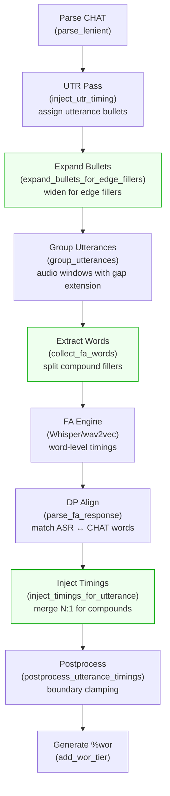

# Compound Filler Alignment

**Status:** In progress
**Last updated:** 2026-05-01 09:47 EDT

## Problem

Compound fillers like `&-you_know`, `&-sort_of`, `&-I_mean` lose their
timing when they appear at utterance boundaries. They disappear from the
%wor tier entirely.

**Reporter:** a user, on a real corpus file.

## Root Cause

Two issues combine:

### 1. Extraction: compound token vs multi-word ASR output

The FA word extraction (`extraction.rs:collect_fa_words`) sends
`&-you_know` to the FA engine as a single token `"you_know"` (after
stripping the `&-` prefix). But Whisper/wav2vec hear "you know" as two
separate words:

```
CHAT words:    ["you_know", "I", "see", "a", "boy"]
Whisper output: [("you", 100, 300), ("know", 300, 500), ("I", 600, 700), ...]
```

The Hirschberg DP aligner (`dp_align.rs`) cannot match `"you_know"`
against either `"you"` or `"know"` individually. Result: zero timing
for the filler.

### 2. Boundary clamping

Even if a filler does get timing, `postprocess.rs:postprocess_utterance_timings`
clamps all word timings to the utterance bullet range. If the filler's
timing falls outside the bullet (which is computed from timed words
only), clamping makes `start >= end` and the timing is dropped.

## Fix: Extraction (DONE)

`extraction.rs:push_fa_word` now splits compound fillers at underscores
before sending to FA:

```rust
if word.category == Some(WordCategory::Filler) && text.contains('_') {
    for part in text.split('_') {
        out.push(part.to_string());
    }
}
```

This produces `["you", "know", "I", "see", "a", "boy"]` — the DP
aligner can now match each part against Whisper's multi-word output.

Test: `fa::tests::compound_filler_extracted_as_separate_words_for_fa`

## Fix: Injection (TODO)

After FA returns timing for the split parts, the injection code
(`injection.rs`) must merge them back into one timing span for the
single `&-you_know` CHAT token.

Current injection assumes 1:1 mapping: FA word count == CHAT word
count. With compound filler splitting, we have N:1 (N FA words → 1
CHAT word).

### Design options

**Option A: Merge during injection.** Track which FA words came from a
compound filler split. When injecting, consume N timings and merge
them into one span (min start, max end) for the CHAT word.

**Option B: Merge during extraction metadata.** Return a mapping
alongside the word list that records "FA indices 0-1 map to CHAT
word 0". The injection code uses this mapping.

**Option C: Post-hoc merge.** After injection, scan for compound fillers
that have no timing but whose constituent parts (if they existed as
separate words) do have timing. Merge retroactively.

Option A is cleanest — it keeps the merge logic in the injection phase
where word-to-CHAT mapping is already managed.

## Affected Words

Any filler (`WordCategory::Filler`) whose `cleaned_text()` contains
underscores. Common examples from the CHAT manual:

- `&-you_know`
- `&-sort_of`
- `&-I_mean`
- `&-kind_of`
- `&-let's_see`

Single-word fillers (`&-um`, `&-uh`, `&-oh`) are unaffected — they
already align correctly as single tokens.

## CHAT Underscore Convention

In CHAT notation, underscores join multi-word expressions into a single
token. The `&-` prefix marks fillers (spoken but non-lexical content).

| CHAT form | Meaning | FA treatment |
|-----------|---------|-------------|
| `&-um` | Single-word filler | 1 FA token: `"um"` |
| `&-you_know` | Compound filler (one discourse unit) | Split to 2 FA tokens: `"you"`, `"know"` |
| `&-sort_of` | Compound filler | Split to 2 FA tokens: `"sort"`, `"of"` |
| `&-I_mean` | Compound filler | Split to 2 FA tokens: `"I"`, `"mean"` |
| `&-let's_see` | Compound filler | Split to 2 FA tokens: `"let's"`, `"see"` |
| `ice_cream` | Compound regular word | NOT split (only fillers are split) |

**Why not write `&-you &-know`?** Because `&-you_know` is one discourse
unit — the phrase "you know" functions as a single filler. Splitting it
into two separate fillers would change the linguistic semantics. The
underscore join is the correct CHAT notation per the manual.

**Why split for FA only?** ASR engines (Whisper, wav2vec) don't
understand CHAT underscore notation. They hear "you know" as two words
and return two separate timings. The DP aligner needs individual words
to match against the ASR output. After alignment, the two timings merge
back into one span for the single CHAT token.

**Why only fillers?** Regular compound words (`ice_cream`) are also
underscore-joined in CHAT, but ASR models recognize them as compounds
and may return them as one token. Fillers are specifically problematic
because they're high-frequency discourse markers that ASR always
tokenizes as separate words. We may need to extend this to regular
compounds later if ASR consistently splits them.

## Not a BA2 Regression

BA2 (commit `84ad500b`) had the same extraction logic —
compound fillers were sent as single tokens. This bug existed in BA2
but was unreported on this specific file.

## Pipeline Diagram

The full filler-aware FA pipeline, showing where each fix applies:



Green boxes are the three new algorithmic steps added for filler handling.

## Related Code

| File | Role |
|------|------|
| `fa/extraction.rs` | Word extraction for FA (fixed) |
| `fa/injection.rs` | Timing injection back into CHAT (TODO) |
| `fa/postprocess.rs` | Utterance boundary clamping |
| `fa/mod.rs:update_utterance_bullet` | Utterance bullet from word timings |
| `fa/tests.rs` | Test for compound filler extraction |
| `talkbank-model/alignment/helpers/rules.rs` | `counts_for_tier` — fillers included in Wor domain |
