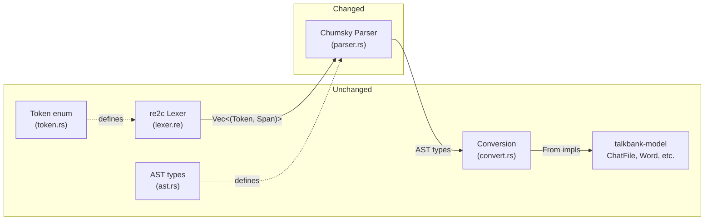

# Pivoting from Hand-Written Parser to Chumsky

**Status:** Draft
**Last modified:** 2026-03-30 17:45 EDT

## Why Pivot

The re2c lexer + hand-written recursive descent parser reached **98.51%
parity** with TreeSitterParser on 99,742 files. The remaining **1,482
divergences** are structural parsing decisions that recursive descent
handles poorly:

- **Bullet classification** (~800 files) — whether a media bullet is an
  inline content item or the utterance-level timing depends on what comes
  after (continuation line or newline). Requires multi-token lookahead
  and context that changes meaning of already-consumed tokens.
- **Annotation scope** (~200 files) — annotations on events, groups, and
  words interact with retrace markers in ways that require backtracking
  or context-sensitive dispatch.
- **CA notation** (~500 files) — the CA corpus uses overlap markers,
  voice quality, and pitch contours that create complex interleaving.

These are exactly the problems parser combinators solve well: declarative
grammar rules, automatic backtracking, composable sub-parsers.

## What Stays

```
┌─────────────────────────────────────────────┐
│ KEEP: re2c Lexer (lexer.re → lexer.rs)      │
│   5,711 lines, 99,907-file validated         │
│   Rich tokens with tagged field extraction   │
│   13 lexer conditions for tier dispatch      │
│   Zero errors on valid CHAT                  │
├─────────────────────────────────────────────┤
│ KEEP: Token enum (token.rs)                  │
│   ~100 variants, Clone + Debug + PartialEq   │
│   EnumDiscriminants for type dispatch        │
│   Ready for chumsky (no changes needed)      │
├─────────────────────────────────────────────┤
│ KEEP: AST types (ast.rs)                     │
│   Self-contained (raw_text on every node)    │
│   Source-free conversion via From impls      │
│   539 lines, 40 named types                  │
├─────────────────────────────────────────────┤
│ KEEP: AST → Model conversion (convert.rs)    │
│   1,844 lines of From<ast> → model impls     │
│   No source dependency, no parser internals  │
│   Fully decoupled from parser implementation │
├─────────────────────────────────────────────┤
│ KEEP: ChatParser trait impl (chat_parser_impl)│
│   Wires parser output to talkbank-model API  │
│   Offset propagation, error reporting        │
├─────────────────────────────────────────────┤
│ KEEP: All tests and specs                    │
│   10 construct specs, 184 tree-sitter tests  │
│   963 Rust tests, corpus comparison infra    │
│   These test the TOKEN → AST → MODEL chain   │
└─────────────────────────────────────────────┘
```

## What Changes

```
┌─────────────────────────────────────────────┐
│ REPLACE: parser.rs (1,923 lines)             │
│   62 hand-written parsing functions          │
│   Manual pos tracking, skip_ws(), peek()     │
│   → Chumsky combinators producing same AST   │
│   Expected: ~800-1,000 lines                 │
└─────────────────────────────────────────────┘
```

One file changes. Everything else stays.

## Architecture



## Chumsky Integration Pattern

### Input Type

Chumsky needs an input stream. The re2c lexer already produces
`Vec<(Token<'a>, LexerSpan)>`. Chumsky's `Stream` adapter wraps this:

```rust
use chumsky::prelude::*;

type TokenStream<'a> = Vec<(Token<'a>, SimpleSpan)>;

fn parse_chat_file<'a>(tokens: TokenStream<'a>) -> ChatFile<'a> {
    let parser = chat_file_parser();
    parser.parse(tokens).unwrap_or_else(|errors| {
        // error recovery
    })
}
```

### Parser Combinator Style

The grammar.js rules translate directly to chumsky combinators:

```rust
// grammar.js: contents = repeat1(choice(whitespaces, content_item, separator, overlap_point))
fn contents_parser<'a>() -> impl Parser<'a, TokenStream<'a>, Vec<ContentItem<'a>>> {
    choice((
        content_item_parser(),
        separator_parser().map(ContentItem::Separator),
        overlap_point_parser().map(ContentItem::OverlapPoint),
    ))
    .padded_by(whitespace_parser())  // handles skip_ws() automatically
    .repeated()
    .at_least(1)
    .collect()
}

// grammar.js: event = seq(event_marker, event_segment+)
// With re2c's rich Event token, this is trivial:
fn event_parser<'a>() -> impl Parser<'a, TokenStream<'a>, ContentItem<'a>> {
    select! { Token::Event(desc) => ContentItem::Event(vec![Token::Event(desc)]) }
}

// grammar.js: group_with_annotations = seq(<, contents, >, base_annotations)
fn group_parser<'a>() -> impl Parser<'a, TokenStream<'a>, ContentItem<'a>> {
    just(Token::LessThan)
        .ignore_then(contents_parser())
        .then_ignore(just(Token::GreaterThan))
        .then(annotations_parser())  // automatically collects all annotations
        .map(|(contents, annotations)| {
            // retrace vs group classification
        })
}
```

### The Bullet Problem Solved

The main motivation for pivoting. In chumsky, the bullet classification
becomes a choice combinator with ordered alternatives:

```rust
// grammar.js: utterance_end = optional(terminator), optional(postcodes), optional(media_url), newline
fn utterance_end_parser<'a>() -> impl Parser<'a, TokenStream<'a>, UtteranceEnd<'a>> {
    terminator_parser().or_not()
        .then(postcodes_parser())
        .then(media_bullet_parser().or_not())
        .then_ignore(newline_parser())
        .map(|((term, postcodes), bullet)| UtteranceEnd { term, postcodes, bullet })
}

// grammar.js: tier_body = linkers?, langcode?, contents, utterance_end
fn tier_body_parser<'a>() -> impl Parser<'a, TokenStream<'a>, TierBody<'a>> {
    linkers_parser().or_not()
        .then(langcode_parser().or_not())
        .then(contents_parser())  // media_url IS a content_item in grammar.js
        .then(utterance_end_parser())
        .map(|(((linkers, langcode), contents), end)| {
            TierBody { linkers, langcode, contents, ..end }
        })
}
```

Chumsky's ordered `choice()` and backtracking handle the ambiguity:
- If a `MediaBullet` is followed by more content (continuation), it gets
  consumed by `contents_parser()` as a content item
- If it's the last thing before `newline`, `utterance_end_parser()` claims it
- No manual lookahead needed

## Risks and Mitigations

### Risk: Chumsky 1.0 is alpha

**Mitigation:** Pin to a specific alpha version. The parser is internal
(not a published API). If chumsky breaks, we can pin indefinitely or
fork. The re2c lexer and AST are stable — only parser.rs depends on
chumsky.

### Risk: Performance regression

**Mitigation:** Benchmark before committing. The corpus comparison test
already measures parse time. If chumsky is slower, the re2c lexer's
speed compensates (most time is in lexing, not parsing). For production
use, TreeSitterParser remains the default anyway.

### Risk: Chumsky's error recovery doesn't help CHAT

**Mitigation:** Start without error recovery. Use chumsky purely for its
composability and backtracking. Add recovery strategies incrementally
where they help.

### Risk: Fragment parsing (9 entry points)

**Mitigation:** Chumsky parsers are values — store sub-parsers and
expose them as entry points:

```rust
pub struct ChumskyParser {
    main_tier: Box<dyn Parser<...>>,
    word: Box<dyn Parser<...>>,
    mor_tier: Box<dyn Parser<...>>,
    // etc.
}
```

Or use a single file-level parser and extract fragments from the result.

## Implementation Plan

### Phase 1: Proof of Concept (1-2 days)

1. Add `chumsky = "1.0.0-alpha.8"` to Cargo.toml
2. Write `main_tier_parser()` using chumsky combinators
3. Produce the same `ast::MainTier` type
4. Run equivalence tests on reference corpus
5. Benchmark vs hand-written parser

### Phase 2: Full Migration (3-5 days)

1. Port all tier parsers (mor, gra, pho, sin, text)
2. Port file-level parser
3. Wire through `chat_parser_impl.rs`
4. Run full corpus comparison (target: ≥ 98.51%)
5. Fix any remaining divergences (should be fewer than hand-written)

### Phase 3: Clean Up (1 day)

1. Remove hand-written parser.rs
2. Update CLAUDE.md and docs
3. Add specs for any new constructs discovered
4. Final corpus run

**Total estimate: 5-8 days** to match or exceed current parity.

## Decision: Chumsky vs Winnow

Both are viable:

| Aspect | Chumsky 1.0-alpha | Winnow 0.7 |
|--------|-------------------|------------|
| Style | Functional combinators | Procedural/streaming |
| Error recovery | Built-in strategies | Manual |
| Backtracking | Automatic | Explicit |
| Performance | Good (optimized alpha) | Excellent (zero-copy) |
| Maturity | Alpha | Stable |
| Learning curve | Higher (functional) | Lower (imperative) |

**Recommendation: Chumsky.** The grammar.js rules are declarative —
they translate more naturally to chumsky's functional combinators than
winnow's imperative style. The backtracking is the main win, and
chumsky has it built in. Winnow would be a better choice if performance
were the primary concern, but TreeSitterParser handles production
workloads — the re2c parser is for testing.

## References

- Chumsky docs: https://docs.rs/chumsky/1.0.0-alpha.8
- Current parser: `crates/talkbank-re2c-parser/src/parser.rs`
- Grammar source of truth: `grammar/grammar.js`
- Parity report: `crates/talkbank-re2c-parser/docs/parity-report.md`
- Pho modeling: `docs/pho-tier-modeling.md`
