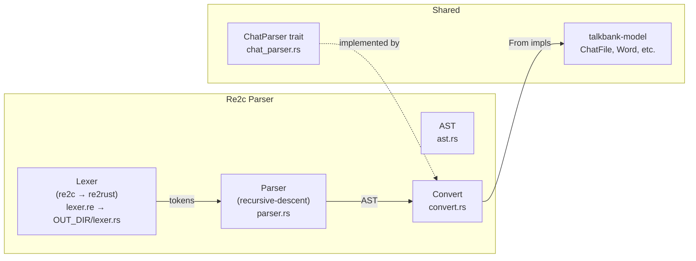
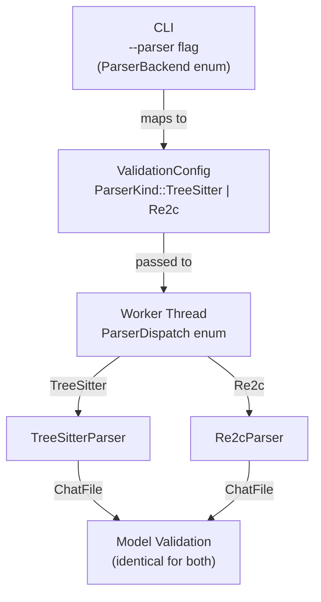

# Re2cParser Parity Report: Design, Implementation, and Gap Analysis

**Last modified:** 2026-03-30 07:18 EDT
**Status:** Current

This document describes the Re2cParser's design, its current state of parity
with TreeSitterParser, and the known gaps. It is written for a newcomer who
has never seen either parser.

## 1. Why Two Parsers?

TalkBank uses a tree-sitter grammar (`grammar/grammar.js`) to parse CHAT
transcripts. The tree-sitter parser (`TreeSitterParser`) is the canonical
implementation — it powers the CLI, LSP, validation, and all downstream tools.

The Re2c parser (`talkbank-re2c-parser`) is an alternative implementation
using [re2c](https://re2c.org/) for lexing and handwritten recursive-descent
for parsing. It exists to:

1. **Validate the grammar** — an independent implementation that must produce
   identical output is the strongest possible specification test.
2. **Improve batch speed** — Phase 1 findings showed 2.96x faster parse
   speed across 79 reference corpus files.
3. **Eliminate the tree-sitter C dependency** — the re2c parser is pure Rust
   (after code generation), simplifying builds and packaging.

## 2. Architecture



### 2.1 Lexer (re2c/re2rust)

**Source:** `src/lexer.re` (5,711 lines)
**Generated:** `OUT_DIR/lexer.rs` (by `re2rust` via `build.rs`)

The lexer uses re2c **conditions** (start states) for context-sensitive
lexing. Each condition recognizes a different subset of tokens:

| Condition | Purpose |
|-----------|---------|
| `INITIAL` | Line-type dispatch (`@`, `*`, `%`) |
| `MAIN_CONTENT` | Main tier body (words, annotations, terminators) |
| `MOR_CONTENT` | `%mor` POS\|lemma structure |
| `GRA_CONTENT` | `%gra` index\|head\|relation |
| `PHO_CONTENT` | `%pho` IPA + grouping |
| `SIN_CONTENT` | `%sin` gesture codes |
| `TIER_CONTENT` | Generic dependent tier body |
| `HEADER_CONTENT` | Opaque header value text |
| `ID_CONTENT` | `@ID` 10-field pipe-delimited |
| `TYPES_CONTENT` | `@Types` 3-field |
| `LANGUAGES_CONTENT` | `@Languages` comma-separated |
| `PARTICIPANTS_CONTENT` | `@Participants` structured |
| `MEDIA_CONTENT` | `@Media` structured |

**Error recovery:** Every condition has a per-condition error fallback token
(e.g., `ErrorInMainContent`, `ErrorInMorContent`) that consumes exactly one
character and stays in the same condition. The lexer never fails.

**Rich tokens:** The lexer emits `Token::Word` with pre-extracted fields
(`raw_text`, `prefix`, `body`, `form_marker`, `lang_suffix`, `pos_tag`).
This means lex-only consumers see words as coherent units.

### 2.2 Parser (recursive-descent)

**Source:** `src/parser.rs` (1,840 lines)

Mechanically translated from `grammar/grammar.js`. The parser consumes the
token stream and produces an intermediate AST (`ast.rs`, 532 lines).

The parser is generic over `ErrorSink`:
```rust
pub struct Parser<'a, E: ErrorSink = NullErrorSink> {
    source: &'a str,
    tokens: Vec<(Token<'a>, LexerSpan)>,
    pos: usize,
    errors: E,
}
```

By default, `Parser::new()` uses `NullErrorSink` (errors silently dropped).
`Parser::with_errors()` accepts a caller-provided sink for streaming
diagnostics.

### 2.3 Conversion (AST → model)

**Source:** `src/convert.rs` (1,798 lines)

Zero-copy `From` implementations convert the re2c AST to `talkbank-model`
types (`ChatFile`, `MainTier`, `Word`, `MorTier`, etc.). The AST carries
`&str` slices borrowed from the input, not owned strings.

### 2.4 ChatParser Trait

**Source:** `src/chat_parser_impl.rs`

`Re2cParser` implements the `ChatParser` trait from `talkbank-model`,
providing 25 parse methods (file, headers, utterances, words, all tier types).

## 3. Pipeline Integration

The re2c parser is wired into the CLI as an optional parser backend:

```bash
chatter validate --parser re2c corpus/reference/
chatter validate --parser re2c --roundtrip --force corpus/reference/
```



**Key types:**
- `ParserBackend` (`talkbank-cli/src/cli/args/core.rs`) — CLI enum
- `ParserKind` (`talkbank-transform/src/validation_runner/config.rs`) — config enum
- `ParserDispatch` (`talkbank-transform/src/validation_runner/worker.rs`) — internal dispatch

**TreeSitterParser remains the default.** LSP always uses TreeSitterParser
(needs incremental parsing). Cache keys include the parser label, so
tree-sitter and re2c caches are independent.

## 4. Current Parity State

### 4.1 Happy Path (Valid CHAT)

| Metric | Result |
|--------|--------|
| Reference corpus (85 files) | 85/85 SemanticEq ✓ |
| Reference corpus roundtrip | 85/85 pass ✓ |
| Lexer corpus validation | 99,907 files, zero lexer errors ✓ |
| Full corpus parse (99,744 files) | **89,676 equivalent (89.9%)** |
| Full corpus divergences | **10,068 semantic mismatches (10.1%)** |

### 4.2 Full Corpus Divergences (2026-03-30)

The 10,068 divergences are all `SemanticMismatch` — both parsers produce a
`ChatFile`, but the model objects differ under `SemanticEq`. Zero panics,
zero rejections.

**Distribution by corpus:**

| Corpus | Count | % of divergences |
|--------|-------|-----------------|
| childes-other-data | 1,705 | 16.9% |
| childes-eng-na-data | 1,577 | 15.7% |
| childes-eng-uk-data | 1,390 | 13.8% |
| slabank-data | 1,139 | 11.3% |
| childes-romance-germanic-data | 773 | 7.7% |
| ca-data | 673 | 6.7% |
| homebank-password-data | 538 | 5.3% |
| homebank-bergelson-data | 523 | 5.2% |
| phon-other-data | 513 | 5.1% |
| aphasia-data | 358 | 3.6% |
| (12 more corpora) | 879 | 8.7% |

### 4.3 Root Cause Breakdown (2026-03-30)

Sub-categorization of all 10,068 divergent files:

| Root Cause | Files | % | Description |
|-----------|-------|---|-------------|
| Content length mismatch | 6,680 | 66.3% | Re2c produces different number of content items per utterance. Likely caused by event-in-group bug below cascading to content count. |
| Event type trailing `>` | 570 | 5.7% | `<&=laughs> [<]` → re2c: `"laughs>"`, ts: `"laughs"`. Closing `>` of angle bracket leaked into event text. |
| Missing dependent tiers | 1,252 | 12.4% | Re2c drops entire dependent tiers that TreeSitter parses. |
| Media bullets (NAK bytes) | 643 | 6.4% | `\x15start_end\x15` not parsed as bullets in dependent tier text. |
| Annotation differences | 246 | 2.4% | Scoped annotation text differs between parsers. |
| Header trailing whitespace | 239 | 2.4% | Re2c preserves trailing spaces; CHAT rule is to always trim. |
| Retrace kind mismatch | 36 | 0.4% | `[/]`/`[//]`/`[///]` classification differs. Needs adjudication. |
| Postcode trailing space | 16 | 0.2% | Same as header whitespace bug. |
| Bullet skip field | 6 | 0.1% | Re2c missing `bullet.skip` field. |

**Reports:**
- `/tmp/re2c_divergence_categories.json` — top-level categorization
- `/tmp/re2c_main_tier_subcategories.json` — main tier sub-categories
- `/tmp/re2c_corpus_divergences.json` — full file list

**Key finding:** The event-type trailing `>` bug likely cascades into the
content length mismatch category. When `&=laughs>` is parsed as a different
token structure, the content item count changes. Fixing the `>` leak may
resolve a large fraction of the 6,680 content length mismatches.

### 4.3 Error Handling Parity

**This is the largest gap.**

#### Parse-time error reporting

| Aspect | TreeSitterParser | Re2cParser |
|--------|-----------------|------------|
| Error reporting sites | ~310 across 83 files | 2 catch-all sites |
| Error codes used | ~69 distinct codes | 1 (`UnexpectedSyntax`) |
| ChatParser methods using ErrorSink | All 25 | 1 of 25 (`parse_chat_file`) |
| Error tokens from lexer | N/A (tree-sitter CST ERROR nodes) | 19 types (silently skipped) |
| Error spec tests | 187 specs (74 not_implemented) | 0 specs tested |

**Details:**

1. **Only `parse_chat_file` reports errors.** The other 24 `ChatParser` trait
   methods have `_errors` (underscore prefix, explicitly ignored). This means
   fragment parsing (words, tiers, headers) produces no diagnostics.

2. **Only 2 error reporting sites in the parser** — both are catch-all
   branches that fire when a token doesn't match any pattern. They report
   `ErrorCode::UnexpectedSyntax` as a warning.

3. **19 lexer error token types are defined but never converted to
   `ParseError`.** The parser's catch-all `advance()` skip handles them, but
   doesn't map to model-level error codes.

#### Post-parse validation (identical)

Both parsers produce a `ChatFile` that goes through the same
`validate()` / `validate_with_alignment()` in `talkbank-model`. This layer
detects:
- Missing required headers (@Languages, @Participants, @ID)
- Invalid field values
- Tier alignment mismatches (%mor/%gra word count vs main tier)
- Cross-utterance validation (linkers, terminators)

**This is why `chatter validate --parser re2c` validates 85/85 reference
files correctly** — the model-layer validation catches real-world errors
regardless of which parser produced the ChatFile.

## 5. Offset Propagation

All 25 `ChatParser` trait methods accept an `offset: usize` parameter and
apply `SpanShift::shift_spans_after()` to the result. However:

- All spans in the re2c parser are `Span::DUMMY` (0, 0)
- `shift_spans_after` skips dummy spans by design
- **Offset shifting is wired but currently a no-op**

Real byte-offset spans require tracking positions in the lexer and threading
them through the AST and conversion layers. This is future work.

## 6. What Needs to Happen for Full Parity

### 6.1 Resolve 10,068 Divergences

1. **Categorize divergences** — build a tool that diffs the two parser outputs
   per file and classifies the root cause (word body, header, tier, etc.)
2. **Add reference corpus files** — each unique divergence pattern should have
   a representative file in `corpus/reference/`
3. **Add specs** — new construct specs in `spec/constructs/` for patterns the
   re2c parser currently mishandles
4. **Fix the re2c parser** — update `parser.rs` and `convert.rs` for each
   pattern, using TDD (failing spec test → fix → green)

### 6.2 Error Reporting Parity

1. **Wire ErrorSink through all 24 remaining ChatParser methods** — replace
   `_errors` with `errors` and create streaming parser variants (like
   `parse_chat_file_streaming`)
2. **Map lexer error tokens to ParseError** — the 19 error token types
   already carry context strings; map them to appropriate `ErrorCode` values
3. **Add parser-level error detection** — the recursive-descent parser needs
   error branches for:
   - Missing terminators
   - Malformed headers
   - Invalid bracket annotations
   - Missing required structure
4. **Run generated error spec tests against Re2cParser** — modify
   `generated_error_tests.rs` to parameterize over both parsers

### 6.3 Real Span Tracking

1. **Lexer:** Track `current_offset: u32` in the `Lexer` struct, emit
   `(Token, Span)` pairs
2. **AST:** Add `Span` fields to AST types
3. **Conversion:** Propagate real spans to model types instead of `Span::DUMMY`
4. **Offset:** `shift_spans_after` will then have visible effect

### Priority Order

1. **Divergence resolution** — directly improves the reference corpus and specs
2. **Error reporting** — needed for production use as a real alternative
3. **Span tracking** — needed for LSP-quality diagnostics

## 7. Testing Infrastructure

| Test | What it covers | Runs against |
|------|---------------|-------------|
| `equivalence_tests.rs` (re2c crate) | SemanticEq on reference corpus + words + tiers | Both parsers |
| `model_study.rs` (re2c crate) | Per-construct equivalence with JSON diff | Both parsers |
| `full_corpus_parse_test.rs` (re2c crate) | SemanticEq on all 99,744 files | Both parsers |
| `parser_equivalence_files.rs` (parser-tests) | TreeSitter parse-success on reference corpus | TreeSitter only |
| `generated_error_tests.rs` (parser-tests) | Error code detection for 187 specs | TreeSitter only |
| `roundtrip_reference_corpus.rs` (parser-tests) | Parse-serialize-reparse-compare | TreeSitter only |
| `corpus_lex_tests.rs` (re2c crate) | Lexer zero-error on wild corpus | Re2c lexer only |

**Gap:** No test runs error specs against Re2cParser. No test compares error
output between parsers. The `full_corpus_parse_test` compares happy-path
output only.

## 8. File Inventory

| File | Lines | Role |
|------|-------|------|
| `src/lexer.re` | 5,711 | re2c lexer source (hand-edited) |
| `src/parser.rs` | 1,840 | Recursive-descent parser |
| `src/convert.rs` | 1,798 | AST → model conversion |
| `src/token.rs` | 766 | Token enum with rich fields |
| `src/ast.rs` | 532 | Intermediate AST types |
| `src/chat_parser_impl.rs` | ~340 | ChatParser trait implementation |
| `src/chat_lines.rs` | 219 | Per-line parsing dispatch |
| `src/error.rs` | 123 | ParseError type |
| `src/lib.rs` | 100 | Public API |
| **Total** | **~11,400** | |
