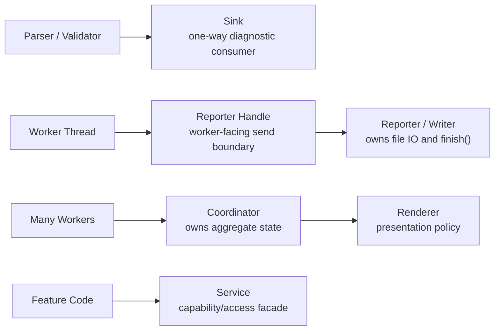
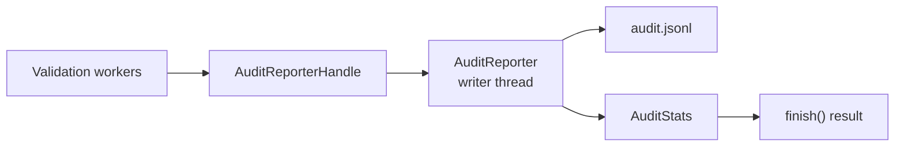

# Boundary Vocabulary

This note defines the naming and responsibility vocabulary used for architecture work in `talkbank-tools`. The immediate driver was the audit of `*sink*` abstractions, but the same rules apply more broadly to services, coordinators, renderers, and worker-facing handles.

## Why this exists

The codebase now has several explicit architecture seams:

- parser and validation diagnostics stream through `ErrorSink`
- CLI audit mode owns a dedicated reporting thread
- `validate_parallel` uses renderers for output policy
- the LSP backend routes parser and semantic-token access through language services
- dashboard and roundtrip harnesses use coordinators that own aggregate state

Those seams become harder to maintain when names blur together. Calling every one-way boundary a "sink" hides whether the object is:

- a pure streaming interface
- a collector with stored state
- a writer with flush/finalize semantics
- an adapter that transforms and forwards events
- a coordinator that owns aggregate state and worker orchestration

## Naming Rules

### `Sink`

Use `Sink` only for a narrow one-way reporting abstraction.

A sink should:

- accept events or diagnostics from producers
- not own orchestration or aggregate runtime control
- usually be swappable with another implementation
- often implement a trait such as `ErrorSink`

Good current examples:

- `ErrorSink`
- `ErrorCollector`
- `ChannelErrorSink`
- `AsyncChannelErrorSink`
- `NullErrorSink`
- `ConfigurableErrorSink`
- `OffsetAdjustingErrorSink`
- `TeeErrorSink`
- `TerminalErrorSink`

These all preserve the same core idea: callers emit diagnostics and do not care how they are ultimately stored, transformed, or displayed. `ErrorCollector` is the concrete in-memory collector for cases that need stored diagnostics after a parse or validation pass.

Current code layout:

- `crates/talkbank-model/src/errors/error_sink.rs` for the trait and lightweight forwarding sinks
- `crates/talkbank-model/src/errors/collectors.rs` for in-memory collectors and counters
- `crates/talkbank-model/src/errors/async_channel_sink.rs` for the async channel-backed sink
- `crates/talkbank-model/src/errors/configurable_sink.rs`, `offset_adjusting_sink.rs`, and `tee_sink.rs` for adapters

### `Reporter` or `Writer`

Use `Reporter` or `Writer` when the object owns output lifecycle and delivery mechanics.

A reporter or writer usually:

- owns a file, socket, thread, or other concrete output resource
- has explicit flush, finish, or shutdown semantics
- may also own summary accounting for that output stream

Current example:

- `AuditReporter` in `crates/talkbank-cli/src/commands/validate/audit_reporter.rs`

That type is not a sink in the narrow sense. It owns the audit writer thread, finalization semantics, and the summary stats returned at the end of the run. Its cloneable worker-facing boundary is `AuditReporterHandle`.

### `Adapter`

Use `Adapter` when a type changes the shape or interpretation of data while preserving the outer contract.

Examples:

- `OffsetAdjustingErrorSink` adapts spans before forwarding to another `ErrorSink`
- `ConfigurableErrorSink` adapts severity/filter policy before forwarding

If the main job is transformation plus delegation, prefer `Adapter` or keep the existing narrow sink name only when the type is fundamentally still "an `ErrorSink` implementation."

### `Coordinator`

Use `Coordinator` when one object owns aggregate state and consumes worker results.

A coordinator usually:

- owns counters, summary state, or reducer state
- receives messages from workers or background tasks
- forwards user-facing events downstream
- is the only place where final summary state is assembled

Current examples by role, even where the type name is not literally `Coordinator`:

- `tests/roundtrip_corpus/runner.rs` owns `RoundtripStats`
- `src/test_dashboard/runner.rs` and `app.rs` split worker emission from UI-owned state

When shared mutable state between workers appears, the first question should be whether a coordinator boundary is missing.

### `Renderer`

Use `Renderer` for presentation policy, not orchestration.

A renderer should:

- decide how events become text, JSON, or UI state
- avoid owning discovery, cancellation, or worker management

Current example:

- `crates/talkbank-cli/src/commands/validate_parallel/renderer.rs`

### `Service`

Use `Service` for a capability boundary that hides construction and access mechanics.

A service may:

- provide thread-local or cached access to stateful internals
- expose closures or narrow methods for feature code
- prevent call sites from depending on raw storage details

Current example:

- `crates/talkbank-lsp/src/backend/language_services.rs`

## Current Decisions

The repo keeps the `ErrorSink` family. That architecture is still good because parsers and validators naturally emit zero-to-many diagnostics and should not care how the caller consumes them.

The repo does not keep the old audit naming. The former `StreamingAuditSink` has been renamed to `AuditReporter` because it is a concrete reporting subsystem with a dedicated writer thread and explicit finalization.

## Review Checklist

When adding a new boundary type, ask:

1. Is this just a one-way consumer of events or diagnostics?
2. Does it own a resource with flush, finish, or shutdown semantics?
3. Does it aggregate state from multiple workers?
4. Is it presentation policy rather than orchestration?
5. Is it hiding thread-local, cached, or lazily initialized capabilities?

If the answers are mixed, the type is probably doing too much and should be split before naming it.
