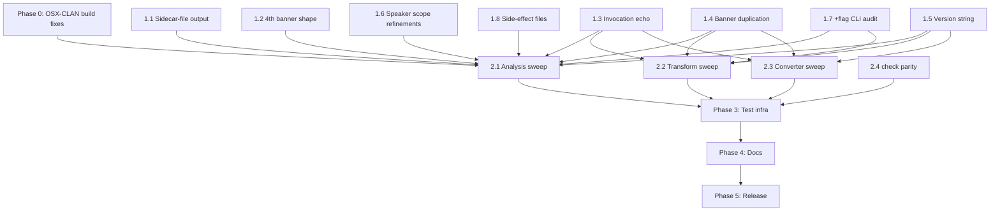

# Plan — Achieve CLAN parity for `chatter clan`

**Status:** Approved (all six open questions resolved 2026-05-21)
**Last updated:** 2026-05-21 20:30 EDT
**Companion:** [STATUS.md](STATUS.md) — live per-command verdicts.

## North star

`chatter clan <cmd>` becomes a **byte-level drop-in replacement** for the
corresponding `OSX-CLAN/src/unix/bin/<cmd>` binary. A researcher who
has a script targeting CLAN should be able to swap the binary path
and see identical stderr / stdout / sidecar-file outputs.

There are zero existing `chatter clan` users: the expected user base
is waiting for full parity before adopting. There is no chatter-side
CLI or output convention to preserve. Default is to match CLAN; only
the three intrinsic divergences below are kept.

## Permanent intrinsic divergences

These cannot be removed without harming the tool's correctness:

1. **File argument vs stdin.** CLAN reads `< file.cha` only; chatter
   accepts a positional file argument. The banner's `From file …` /
   `From pipe input` line necessarily differs in shape. Researchers
   migrate by removing the `<` redirection.
2. **Timestamp.** Each invocation has its own `ctime`. CLAN does
   too; researchers' scripts must already tolerate this.

Version string was previously intrinsic; with the Phase 1.5
decision (CLAN-style `DD-Mon-YYYY` build date), it's no longer a
divergence — chatter emits a build date in CLAN's exact format.

CLAN's other "quirks" — banner duplication, sidecar files, ASCII art
formatting — are **not** intrinsic divergences. Chatter matches them.

## Out of scope (deliberate divergences)

These are deliberate scope decisions where chatter does not target
byte-level parity with CLAN. Each is documented per-command.

- **MOR / POST grammar family.** `mor`, `megrasp`, `post`, `postlist`,
  `postmodrules`, `posttrain` are stub commands that exit with an
  error directing users at batchalign's neural morphotag pipeline.
  See `book/src/clan-reference/commands/mor.md` and siblings.
- **String-hacking replaced by AST traversal.** Internal
  implementation differs from CLAN's text-substitution approach;
  output bytes match, the path to them does not.
- **CLAN bugs chatter fixes.** Any command may uncover CLAN bugs
  where chatter's output is correct and CLAN's is not. **chatter
  keeps the correct output and documents the divergence**; we do
  **not** reproduce known-wrong CLAN behavior for "parity."
  `chatter clan check` is the clearest case — CLAN's CHECK has many
  fixed limitations chatter deliberately corrects — but the same
  logic applies any time the parity sweep surfaces a bug. Per-
  command classification: chatter-wrong → fix chatter; CLAN-wrong
  → document; both-wrong-or-unclear → escalate. Documented per page
  in a "Documented CLAN-bug divergences" section. See
  `~/.claude/projects/-Users-chen-talkbank/memory/feedback_clan_bugs_chatter_fixes.md`
  for the working policy.

## Current state (2026-05-21)

| Bucket | Count | Commands |
|---|---:|---|
| Body byte-level parity | 15 | freq, mlu, mlt, freqpos, kwal, combo, wdlen, vocd, phonfreq, dist, maxwd, eval, eval-d, sugar, kideval |
| Required-flag refusal parity | 8 | chains, dss, ipsyn, mortable, eval, eval-d, sugar, kideval |
| Deliberately not implemented | 6 | mor, megrasp, post, postlist, postmodrules, posttrain |
| Untouched | ~50 | analysis: chip, codes, complexity, corelex, flucalc, gem, gemfreq, keymap, modrep, rely, script, timedur, trnfix, uniq, wdsize, plus refusal-only-touched bodies (chains, dss, ipsyn, mortable); transforms: chstring, combtier, compound, dataclean, dates, delim, fixbullets, fixit, flo, indent, lines, longtier, lowcase, makemod, ort, postmortem, quotes, repeat, retrace, roles, tierorder, trim; converters: chat2{elan,praat,srt,text,vtt}, {elan,lab,lena,lipp,play,praat,rtf,salt,srt,text}2chat; plus check |

See [STATUS.md](STATUS.md) for the per-command verdict table.

---

## Phase 1: Cross-cutting framework (closes whole classes of gaps)

Each item in this phase fixes a class of divergence that affects
multiple commands. Done **first** so the per-command work in Phase 2
doesn't re-litigate the same architectural question.

### 1.1 Sidecar-file output pattern

**Affects:** `wdsize`, `complexity`, `codes`, plus an unknown number
of other commands that may switch to sidecar output. Verify against
each command in Phase 2.

**Behavior to match.** CLAN's sidecar-writing commands emit only the
banner + `Output file <pipeout.<cmd>.<ext>>` line to stdout, and
write the analysis body to a side file named
`pipeout.<cmd>.{cex,xls}` in the current working directory.

**Implementation.** Add a per-command sidecar declaration to
`CommandOutput` (or a parallel trait):

```rust
pub trait CommandOutput {
    /// Sidecar-file extension when CLAN routes this command's body
    /// to a `pipeout.<cmd>.<ext>` file instead of stdout. `None`
    /// means stdout. `Some("xls")` means write to
    /// `pipeout.<cmd>.xls`.
    fn clan_sidecar_extension(&self) -> Option<&'static str> {
        None
    }
    // … existing render hooks
}
```

CLI dispatch (`helpers.rs::run_request_and_print`) branches: when
`format == Clan` and `result.clan_sidecar_extension().is_some()`,
the body goes to the sidecar file and stdout gets only the banner
plus the `Output file …` line. chatter's positional file argument
is mapped to the literal CLAN string `pipeout` for the side-effect
filename so the byte stream is identical.

**Test.** Per-command parity tests verify both stdout (banner +
"Output file" line) and the sidecar-file contents.

### 1.2 4th banner shape: header-tier filter continuation

**Affects:** `codes`, `complexity`, possibly others.

**Behavior to match.** CLAN's banner can carry a fourth continuation
line `  and ONLY header tiers matching: @ID:;` (with the indent
shown) after the dep-tier line.

**Implementation.** Extend `ClanScopeMode` with a new variant
`MainAndDependentAndHeader { dep: &'static str, header: &'static str }`,
or add a separate `clan_header_scope() -> Option<&'static str>`
method on `AnalysisCommandName` that the banner builder consults.

The latter composes more cleanly with the existing three modes —
each `ClanScopeMode` value gets an optional header-filter
continuation appended.

### 1.3 Invocation-args echo on banner first line — **DONE (2026-05-21)**

**Affects:** every command. Today chatter emits just the command
name on banner line 1 (`freq`); CLAN emits the user's full argv
joined by spaces (`freq +scat <path>`).

**Behavior matched (2026-05-21).** chatter now echoes the original
argv from the CLAN-subcommand position onward, with chatter-only
flags filtered:

| user typed                                  | CLAN line 1                 | chatter line 1              |
|---------------------------------------------|------------------------------|------------------------------|
| `freq file.cha` / `chatter clan freq file.cha` | `freq file.cha`             | `freq file.cha`             |
| `freq +scat file.cha`                        | `freq +scat file.cha`       | `freq +scat file.cha`       |
| `freq +t*CHI file.cha`                       | `freq +t*CHI file.cha`      | `freq +t*CHI file.cha`      |
| `chatter clan freq --format clan file.cha`   | n/a                          | `freq file.cha`             |

**Implementation (landed 2026-05-21).** New pure helper
`build_clan_invocation_echo(args, clan_pos) -> String` in
`crates/talkbank-cli/src/commands/clan/helpers.rs` takes the full
process argv plus the position of the `clan` subcommand and
returns the post-`clan` slice joined by spaces, filtering
chatter-only `--format`/`-f` and their values. Runtime wrapper
`clan_invocation_echo()` calls `std::env::args()` and
`find_clan_subcommand_position()`.

`format_clan_banner` gained a new leading `invocation: &str`
parameter; the existing `command_name` parameter is preserved for
line 3 of the banner ("`freq (DD-Mon-YYYY) is conducting…`"). Both
banner emission sites in `helpers.rs::run_request_and_print` now
thread the echo through.

**Tests.** 9 pure-function tests in `helpers.rs::tests`
covering: prefix stripping, no-flag invocation, `--format` / `-f`
both with-value and `=`-form filtering, global-flag-before-clan
handling, `clan` absent → empty echo, CLAN-style `+t*CHI` preserved
verbatim. Smoke-confirmed end-to-end via `chatter clan freq
+scat path/to/file.cha`.

**Out-of-scope follow-ups for Phase 1.7.** Reverse-mapping of
chatter-native flags (`--speaker CHI` → `+t*CHI`,
`--include-word cat` → `+scat`, etc.) is intentionally deferred.
The typical migration use case has researchers pasting CLAN-style
flags directly, in which case the echo is byte-perfect already.
The reverse map will be added per-command as Phase 1.7 audits each
CLAN binary's `usage()`.

### 1.4 Banner duplication — **CLOSED, divergence documented (2026-05-21)**

**Affects:** every command in stdin invocations.

**CLAN behaviour.** `cutt.cpp` mainloop's `FirstTime` branch emits
the six-line banner at startup AND emits it again once stdin commits
to a scratch file. Two identical banner blocks back to back, but
only for stdin invocations (`freq < file.cha`); file-arg
invocations (`freq file.cha`) emit once.

**Decision (resolved 2026-05-21):** Classify as a CLAN-bug
divergence per the new `clan-bugs-chatter-fixes` rule. The
duplication is internal pipeline plumbing (`FirstTime` + scratch-
file-commit ordering) with no semantic content; researchers'
scripts that anchor on the `****` separator find one and proceed.
chatter emits the banner once on every invocation; the divergence
is documented in
[`book/src/clan-reference/divergences/framework.md`](../../book/src/clan-reference/divergences/framework.md)
under "CLAN-bug divergences (chatter improves on CLAN)" with
ledger row **CLAN-DIV-001**.

**Rationale.** Doubling the block would be visual noise with no
information value. If a future user's script genuinely depends on
seeing exactly two blocks, that script is parsing CLAN's plumbing as
content and should be updated; this is the documented migration
guidance.

**No code change** lands for this item — the policy is set now to
avoid landing a regression once stdin support is wired in.

### 1.5 Version-string shape — **DONE (2026-05-21)**

**Affects:** every command's banner.

**Decision (resolved 2026-05-21):** CLAN-style date
`(DD-Mon-YYYY)`. chatter's banner line 2 now shows the chatter
build date in CLAN's exact format. Maximum byte-level parity;
researchers' scripts that grep the banner don't need to special-
case chatter.

**Implementation (landed 2026-05-21).** `crates/talkbank-cli/build.rs`
emits `CLAN_BUILD_DATE` from `chrono::Local::now().format("%e-%b-%Y")`
with leading whitespace trimmed (chrono's `%e` pads single-digit days
with a leading space; CLAN does not). `CLAN_BANNER_VERSION` in
`crates/talkbank-cli/src/commands/clan/helpers.rs` is now
`env!("CLAN_BUILD_DATE")` instead of `env!("CARGO_PKG_VERSION")`.

The semver doesn't disappear — `chatter --version` still reports
it; only the per-command CLAN banner uses the build date.

**Test.** `banner_version_matches_clan_date_format` in
`helpers.rs::tests` asserts the constant splits into `[day, mon,
year]` on `-`, with the day being 1–31, the month an abbreviated
English name, and the year a plausible build-year (2025–2100).
Smoke-confirmed end-to-end via `chatter clan freq --format clan`
on `corpus/reference/core/basic-conversation.cha`:

```
freq
Thu May 21 23:08:56 2026
freq (21-May-2026) is conducting analyses on:
```

### 1.6 Speaker-tier filter refinements — **partially DONE (2026-05-21)**

**Affects:** every command with a speaker filter.

**Behavior matched (2026-05-21).** Three of the simpler shapes
landed:

| invocation                        | banner                                                              |
|-----------------------------------|---------------------------------------------------------------------|
| (no `+t`)                         | `ALL speaker tiers`                                                 |
| `+tX`                             | `ONLY speaker main tiers matching: *X;`                            |
| `+tX +tY`                         | `ONLY speaker main tiers matching: *X; *Y;`                        |
| `-tX`                             | `ALL speaker main tiers EXCEPT the ones matching: *X;`             |
| `-tX -tY`                         | `ALL speaker main tiers EXCEPT the ones matching: *X; *Y;`         |
| `+tX -tY` (both)                  | `ONLY speaker main tiers matching: *X;` (CLAN: exclude silent)     |

**Implementation (landed 2026-05-21).** New pure function
`build_main_scope(includes: &[String], excludes: &[String])` in
`crates/talkbank-cli/src/commands/clan/helpers.rs` produces the
banner sentence directly from the two filter lists. The `*` prefix
is re-prepended (chatter's rewriter strips it before clap parsing);
each pattern gets a trailing `;`, separated by spaces. Six unit
tests in `helpers.rs::tests` cover every combination above.

**Deferred shapes (Phase 1.7 follow-ups).** Two CLAN scope variants
need data the chatter CLI does not yet expose to the banner builder:

- `ONLY speaker main tiers with IDs matching: …` for
  `+t@ID="…"` filters. `--id-filter` already feeds the matcher; the
  banner mapping (CLAN lowercases the pattern and appends `*:;`)
  needs an audit.
- `ONLY speaker main tiers with role(s): …` for `+t#ROLE`.
  No chatter analog yet — adding a role filter is the larger lift,
  scheduled with Phase 1.7's per-command +flag audit.

### 1.7 Legacy `+flag` CLI rewriting

**Affects:** every command — required for "I can paste my CLAN
command line into chatter and it works."

**Behavior to match.** `chatter clan freq +s"cat" +t*CHI file.cha`
must produce the same result as `freq +s"cat" +t*CHI < file.cha`
under CLAN. The `+`-flag syntax is the CLAN convention researchers
have decades of muscle memory for.

**Current state.** `talkbank-cli` has a `clan_args::rewrite_clan_args()`
that converts `+`-flags to `--`-flags. Need to **audit its coverage**
against each command's full CLAN flag set:

```bash
# In CLAN's source, each <cmd>.cpp has a usage() function listing
# its CLAN flags. Cross-reference against rewrite_clan_args().
rg -A 30 'void usage\(\)' OSX-CLAN/src/clan/<cmd>.cpp
```

For each command, document the full set of supported flags in the
clan-reference page.

### 1.8 Side-effect file outputs (besides sidecar bodies)

**Affects:** `chains`, `codes`, possibly others — they write
`pipeout.coded.xls` etc. as additional side-effect files
**alongside** their stdout output. This is separate from the
sidecar-body pattern of 1.1; here the file is supplementary.

**Behavior to match.** When CLAN writes `pipeout.coded.xls`,
chatter writes the same file with the same contents.

**Implementation.** Per-command opt-in to writing supplementary
side-effect files. The framework provides a helper for writing
the file in the current working directory.

---

## Phase 2: Per-command parity sweeps

Each pass works through a class of commands using the established
parity-test loop: build CLAN binary → run parity script → fix
chatter to match → re-vet.

### 2.1 Analysis commands (~17 remaining)

After Phase 1 lands, this batch becomes mostly mechanical.

| Command | Notes |
|---|---|
| `chip` | Multi-speaker interaction profile |
| `codes` | %cod code frequency (4th banner shape from 1.2 + sidecar from 1.1) |
| `chains` body | Currently refusal-only; body parity once `--tier` is provided |
| `complexity` | Reads %gra; sidecar-file pattern (1.1) + 4th banner shape (1.2) |
| `cooccur` | Word co-occurrence |
| `corelex` | Build-fix needed (see Phase 0 below) |
| `dss` body | Refusal-only today; body parity with `--speaker` set |
| `flucalc` | Disfluency metrics |
| `gem` | Gem extraction (transform-class, see 2.2?) |
| `gemfreq` | Word freq within gem segments |
| `ipsyn` body | Refusal-only today |
| `keymap` | Code-keyword contingency |
| `modrep` | %mod / %pho comparison |
| `mortable` body | Refusal-only today |
| `rely` | Inter-rater agreement (paired-file) |
| `script` | Template-script comparison |
| `timedur` | Bullet timing durations |
| `trnfix` | Tier comparison |
| `uniq` | Repeated utterances |
| `wdsize` | Sidecar-file pattern (1.1); build-by-hand binary (Phase 0) |

### 2.2 Transform commands (~22 remaining)

Transform commands write a modified `.cha` to stdout (or `--output`)
plus optional reports. The CLAN-format output is the rewritten CHAT
file itself.

| Command | Notes |
|---|---|
| `chstring` | String replacement via change-file |
| `combtier` | Combine dependent tiers |
| `compound` | Dash → plus normalization |
| `dataclean` | Format cleanup |
| `dates` | Compute @Comment ages |
| `delim` | Add missing terminators |
| `fixbullets` | Timing bullet repair |
| `fixit` | Normalize formatting |
| `flo` | Add %flo tier |
| `indent` | Overlap-marker alignment |
| `lines` | Line numbering |
| `longtier` | Remove line wrapping |
| `lowcase` | Lowercase main tier |
| `makemod` | Generate %mod from pron lexicon |
| `ort` | Orthographic conversion |
| `postmortem` | %mor post-processing rules |
| `quotes` | Extract quoted text |
| `repeat` | Mark revisions |
| `retrace` | Add %ret tier |
| `roles` | Rename speakers |
| `tierorder` | Reorder dependent tiers |
| `trim` | Remove dependent tiers |

Most of these are simple `parse → mutate AST → re-serialize`
roundtrips. The CLAN parity question is mostly about: does the
re-serialized CHAT match CLAN's byte-for-byte? For commands that
existed in CLAN with subtle whitespace / ordering behaviors, the
parity script will surface them.

### 2.3 Converter commands (15)

Format converters: CHAT ↔ ELAN / Praat / SRT / VTT / LAB / LENA /
LIPP / PLAY / RTF / SALT / text.

| Command | Notes |
|---|---|
| `chat2elan`, `elan2chat` | ELAN EAF XML |
| `chat2praat`, `praat2chat` | Praat TextGrid |
| `chat2srt`, `srt2chat` | SRT subtitles |
| `chat2vtt` | WebVTT (no reverse — CLAN doesn't do `vtt2chat`) |
| `chat2text`, `text2chat` | Plain text |
| `lab2chat` | LAB phonetic |
| `lena2chat` | LENA acoustic |
| `lipp2chat` | LIPP phonetic |
| `play2chat` | PLAY transcript |
| `rtf2chat` | Rich Text |
| `salt2chat` | SALT |

For format converters, the relevant parity test is whether the
*target-format output* (e.g., the generated ELAN EAF XML or Praat
TextGrid) matches CLAN's. The CHAT-banner discussion doesn't apply —
converters emit the target format, not CLAN-style banner text.

### 2.4 `check` and validation

**Decision (resolved 2026-05-21):** Byte-level parity with CLAN's
`check` is **NOT a goal**. chatter's validator deliberately
improves on CLAN's CHECK — CLAN has known fixed limitations that
chatter corrects. The parity sweep treats CLAN's `check` as a
**find-missing-rules oracle**, not a byte-level reference.

Per-discrepancy classification, run on every divergence the parity
script surfaces:

- **chatter wrong, CLAN right** → close the gap in chatter.
- **CLAN wrong, chatter right** → keep chatter's correct output;
  document the divergence in `book/src/clan-reference/commands/
  check.md` under a "Documented CLAN-bug divergences" section.
  Each entry names the input shape, CLAN's output, chatter's
  output, and the source-grounded reason chatter is correct.
- **Both wrong or unclear** → escalate to operator before
  classifying.

Same logic applies to **any other command** that surfaces a CLAN
bug during parity testing (see the "Out of scope: CLAN bugs
chatter fixes" entry).

---

## Phase 3: Test infrastructure

### 3.1 Canonical fixture corpus

Build a small set of CHAT fixtures under
`tests/fixtures/clan-parity/`, one per command, that exercise each
command's interesting input variations. Keep fixtures small (5-15
utterances) for readable diffs.

Existing ad-hoc fixtures used during development:
- `/tmp/parity-freq.cha` (basic two-speaker)
- `/tmp/parity-mlu.cha` (with %mor)
- `/tmp/parity-rich.cha` (main + %mor + %pho)
- `/tmp/parity-cod.cha` (with %cod codes)

Promote these to `tests/fixtures/clan-parity/`.

### 3.2 Automated parity testing in CI

**Decision (resolved 2026-05-21):** Static fixtures only. CI does
**not** build OSX-CLAN. Instead, expected CLAN output is
snapshotted to disk under `tests/fixtures/clan-parity/expected/`
and committed to the repo. CI diffs chatter's output against the
on-disk snapshots.

Refresh procedure (developer-side):

```bash
# After OSX-CLAN changes or a chatter render-layer change, regen:
scripts/clan-parity/refresh-snapshots.sh

# This script:
# 1. Rebuilds OSX-CLAN binaries (via Phase 0 patches if needed).
# 2. For each (cmd, fixture) pair in the test matrix, runs
#    CLAN_BIN < fixture, normalizes the intrinsic-variable bits
#    (timestamp), and writes the result to
#    tests/fixtures/clan-parity/expected/<cmd>-<fixture>.txt.
# 3. Commits the changed snapshots.
```

CI then runs `cargo nextest run -p talkbank-clan --test clan_parity`
which diffs chatter output against the committed snapshots. Snapshot
drift surfaces in PR review as a normal diff, not a CI failure
mystery.

**Risk.** Snapshots become a parallel source of truth that can drift
from CLAN if no one re-runs `refresh-snapshots.sh` for a while.
Mitigate by adding a `# Last refreshed: <date> against OSX-CLAN <sha>`
header to each snapshot file and a CI lint that warns if any header
is older than (say) 90 days.

### 3.3 Snapshot golden tests

For per-command unit tests of `render_clan` outputs (no real CLAN
binary involved), use `insta` snapshots. These already exist for
some commands (`mlu_render_clan_format`, `freq_render_clan_format`,
etc.); extend to every command as parity work lands.

---

## Phase 0 (parallel to Phase 1): Build the upstream

### 0.1 OSX-CLAN makefile completeness

Three commands have no explicit `$(DD)/<cmd>` rule:

- `wdsize`
- `complexity`
- `corelex`

The makefile falls back to make's implicit `.cpp` rule which drops
CFLAGS. Either:

1. Submit a PR to OSX-CLAN adding the missing rules.
2. Maintain a thin patch in `scripts/clan-parity/` that adds the
   rules before the build.

`corelex` additionally needs extra object files (`isMatch` /
`ALTLABELS` symbols) — investigate which source files contribute.

### 0.2 OSX-CLAN sibling-repo posture

Document the relationship between this repo's parity work and
OSX-CLAN as a sibling repo:

- OSX-CLAN is the **upstream authority** for CHAT semantics and
  CLAN behavior, per `docs/discrepancy-adjudication.md`.
- This repo's `scripts/clan-parity/` invokes OSX-CLAN binaries at
  `../OSX-CLAN/src/unix/bin/`.
- Any patches to OSX-CLAN go through TalkBank-core review,
  not unilaterally.

---

## Phase 4: Documentation

The parity work has substantial doc implications. The
`book/src/clan-reference/` pages were written when chatter clan was
a forward-looking design discussion; now that the implementation is
catching up, the docs need to switch tone from "proposed mapping" to
"current behavior."

### 4.1 Per-command page rewrites

Each `book/src/clan-reference/commands/<cmd>.md` page currently has
sections:

- Purpose (matches CLAN)
- Usage (chatter command line)
- Options (chatter flags)
- Behavior
- **Differences from CLAN** ← currently mixes implemented
  divergences, unimplemented flag proposals, and design
  deliberation
- **Mapping notes** ← legacy-CLAN-flag → chatter-flag proposals

The Differences / Mapping sections violate the talkbank-tools
[no-deliberation doc-content principle](../book/src/contributing/documentation-architecture.md).
For each page that has reached body parity (the 15 in §"Current
state"), rewrite to:

- Drop "Mapping notes" (the legacy-flag rewriter handles this; the
  doc doesn't need to enumerate it).
- Drop "Differences from CLAN" unless there's an actual deliberate
  divergence remaining; if so, state it tersely as "CLAN parity:
  matches except for X" or as a "Documented intentional divergence."
- Add a "CLAN parity" line near the top: `matches`, `partial
  (see below)`, or `not implemented`.

### 4.2 DRAFT `+dN` / `--display-mode` sections

The audit catalog carries 15 needs-fix items, all on a `Display
Modes (+dN / --display-mode N)` DRAFT section across the
clan-reference pages. Per the May-11 plan, these were deferred to
"after PI review + clan-rewriter implementation."

As parity work lands per command, the DRAFT section on that
command's page should be re-evaluated:

- If `+dN` is in the implemented flag set → write the section as
  current behavior.
- If `+dN` is unresolved → leave the DRAFT marker but remove it
  from the audit catalog's needs-fix backlog.
- If `+dN` doesn't apply to the command → remove the section.

### 4.3 Migration-from-CLAN guide

**Decision (resolved 2026-05-21):** Two-tier guide covering both
the CLI-using and CLAN-GUI-using audiences.

Add `book/src/clan-reference/migration-from-clan.md` (or extend
the existing `migration.md` in `getting-started/`) with two
clearly-marked entry points:

**Track A: "I run CLAN from the terminal."** Focus on flag
mappings, byte-level parity, the two intrinsic divergences
(file-arg vs stdin, timestamp). Drop-in command-line replacement
story.

**Track B: "I use the CLAN GUI app."** Conceptual mapping:
each GUI menu / dialog → chatter command. Migration cost
acknowledged: GUI users learn the terminal, but get faster
batch processing and reproducible scripts in exchange. Pointer
at the VS Code extension as an alternative GUI for CHAT
editing (separate from analysis-command parity).

Plus shared content for both audiences:

- The CLAN-format output mode is the default; researchers see
  byte-level matches with their existing CLAN-driven scripts.
- The `+`-flag rewriter accepts CLAN's flag syntax verbatim.
- Per-command "CLAN parity" table linking to each command's
  reference page.
- The MOR/POST family deliberately not implemented (with
  pointer at batchalign).
- The "CLAN bugs chatter fixes" ledger (linked from each
  affected command page).

### 4.4 Audit catalog re-vetting

After each per-command page rewrite:

- Run `audit-docs scan` (rescan the catalog).
- For sections that flipped state (DRAFT → current, or
  needs-fix-with-old-notes → fixed), re-vet via `audit-docs vet`.
- Track in `docs/release-doc-audit/audit.db` as the source of truth.

### 4.5 Public release artifacts

- A short README change announcing CLAN parity as the
  flagship `chatter clan` feature.
- Updated `book/src/install/` page noting that chatter is now a
  drop-in replacement.
- Release notes calling out the migration story.

---

## Phase 5: Release

After Phase 1 + Phase 2 land and Phase 4 docs are caught up:

### 5.1 Binaries and distribution

- Build chatter binaries for the three release platforms (macOS
  ARM, macOS x64, Linux x64). Existing `release.yml` workflow
  covers this.
- Bundle the OSX-CLAN binaries as a one-time-comparison reference
  in the release artifact? **Open question** — would help
  researchers verify parity themselves.

### 5.2 Communication

- Email to the CHAT mailing list / talkbank-l.
- Update `talkbank.org`'s CLAN page with a "chatter clan is now
  drop-in compatible" callout.
- TalkBank-core review and sign-off on the migration narrative.

---

## Dependencies and order of operations



The four `Phase 1` items that affect every command — 1.3 (invocation
echo), 1.4 (banner duplication), 1.5 (version string), 1.7 (`+flag`
CLI) — should land before Phase 2 begins so the per-command sweep
doesn't have to revisit each command twice.

---

## Effort estimate

Rough order-of-magnitude. Estimates assume the established workflow
(build CLAN binary, run parity, fix per-command issue, iterate) and
no surprises in CLAN-side complexity.

| Phase | Items | Estimate |
|---|---|---|
| 0   | OSX-CLAN build fixes | ~1 day |
| 1.1 | Sidecar-file pattern | ~1-2 days |
| 1.2 | 4th banner shape    | ~0.5 day |
| 1.3 | Invocation echo     | ~1-2 days (flag mapping work) |
| 1.4 | Banner duplication  | ~0.5 day |
| 1.5 | Version string      | ~0.5 day (decision-dependent) |
| 1.6 | Speaker refinements | ~1 day |
| 1.7 | +flag CLI audit     | ~2-3 days (per-command audit) |
| 1.8 | Side-effect files   | ~0.5 day (per command that needs it) |
| 2.1 | Analysis sweep      | ~3-5 days |
| 2.2 | Transform sweep     | ~3-5 days |
| 2.3 | Converter sweep     | ~5-7 days (per-format work) |
| 2.4 | `check` parity      | ~5+ days (separate track) |
| 3   | Test infra          | ~2-3 days |
| 4   | Documentation       | ~3-5 days |
| 5   | Release             | ~1-2 days |

Total: ~30-50 days of focused work. Could compress with parallelism
(e.g., transforms and converters are mostly independent of analysis).

---

## Resolved decisions (2026-05-21)

All six open questions resolved before Phase 1 work begins:

| # | Question | Decision |
|---|---|---|
| 1 | Version-string shape (Phase 1.5) | **CLAN-style date** `(DD-Mon-YYYY)`. chatter injects its own build date in CLAN's exact format. Drops from "intrinsic divergence" → "matched." |
| 2 | `+`-flag CLI coverage (Phase 1.7) | **Full per-command audit.** For each command, read its `usage()` in `OSX-CLAN/src/clan/<cmd>.cpp`, enumerate every `+`-flag, verify `rewrite_clan_args()` + the per-command CLI handle them all, document each mapping in the clan-reference page. |
| 3 | `check` parity (Phase 2.4) | **Not byte-level parity.** chatter's validator deliberately improves on CLAN's CHECK; track divergences as documented improvements, not regressions. Use CLAN check as a find-missing-rules oracle. Same logic for any other command that surfaces a CLAN bug. |
| 4 | OSX-CLAN as CI dependency (Phase 3.2) | **Static fixtures only.** Snapshot expected CLAN output under `tests/fixtures/clan-parity/expected/`. CI diffs chatter against snapshots. Developer-side `refresh-snapshots.sh` regenerates from a fresh OSX-CLAN build when needed. |
| 5 | TalkBank-core review timing (Phase 5.2) | **Staged for sign-off** after each phase lands. Five review touchpoints across the project — catches misclassifications and scope disagreements before they propagate. |
| 6 | Migration guide audience (Phase 4.3) | **Two-tier guide** for both CLI-using and CLAN-GUI-using audiences. Track A: command-line drop-in. Track B: GUI-to-CLI conceptual mapping. Shared content covers flag-rewriter, parity table, MOR/POST stubs, CLAN-bug-divergence ledger. |

---

## Exit criteria

The job is done when **every** command in the table below produces
output identical to its CLAN counterpart on a representative fixture,
modulo the three intrinsic divergences:

```
80 total CLAN commands
  - 6 deliberately not implemented (MOR / POST family)
  = 74 in-scope commands
```

All 74 commands at byte-level body parity (and refusal parity where
CLAN refuses without required flags) on at least one representative
fixture per command. Documented in `STATUS.md`, snapshotted in
`talkbank-clan/tests/`, and validated by `cargo nextest run -p
talkbank-clan --test clan_parity` against fresh-built OSX-CLAN
binaries.

The work is not "done" until a researcher with a working CLAN
pipeline can swap `chatter clan` in and see no output difference.
