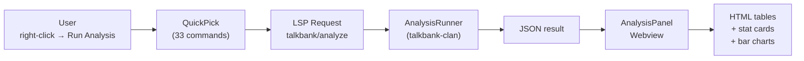

# TalkBank CHAT VS Code Extension — Developer Guide

**Status:** Current
**Last updated:** 2026-04-13 20:34 EDT

Internal reference for maintainers of the VS Code extension and LSP server.

---

## Table of Contents

1. [Architecture Overview](#architecture-overview)
2. [Crate & Module Map](#crate--module-map)
3. [Backend State Machine](#backend-state-machine)
4. [Document Lifecycle](#document-lifecycle)
5. [Validation Pipeline](#validation-pipeline)
6. [Alignment Data Flow](#alignment-data-flow)
7. [Adding a New LSP Feature](#adding-a-new-lsp-feature)
8. [Dependency Graph Rendering](#dependency-graph-rendering)
9. [Semantic Tokens](#semantic-tokens)
10. [VS Code Extension Internals](#vs-code-extension-internals)
11. [Testing](#testing)
12. [Debugging](#debugging)
13. [Performance Notes](#performance-notes)
14. [Unimplemented / Future Work](#unimplemented--future-work)

---

## Architecture Overview

The system is split across three layers:

```
┌──────────────────────────────────────────────────┐
│  VS Code Extension  (TypeScript)                 │
│  Commands, tree views, webviews, status bar       │
│  Communicates with LSP server via stdio            │
├──────────────────────────────────────────────────┤
│  talkbank-lsp  (Rust binary)                     │
│  LSP protocol, caching, feature handlers          │
│  Presentation layer only — no domain logic        │
├──────────────────────────────────────────────────┤
│  talkbank-model + talkbank-parser    │
│  Parsing, data model, validation, alignment       │
│  Source of truth for all CHAT semantics            │
└──────────────────────────────────────────────────┘
```

Key principle: **the LSP server is a presentation layer**. All parsing, validation, and alignment computation lives in `talkbank-model` and `talkbank-parser`. The LSP crate formats and routes that information to the VS Code client.

The analysis pipeline illustrates the full end-to-end flow from user action to rendered output:



---

## Crate & Module Map

### talkbank-lsp (`crates/talkbank-lsp/`)

```
src/
├── main.rs                         # Binary entry point (tokio + tower-lsp)
├── lib.rs                          # Library root (exposes modules for testing)
├── semantic_tokens.rs              # SemanticTokensProvider, token legend
│
├── backend/
│   ├── mod.rs                      # LanguageServer trait impl, request dispatch
│   ├── state.rs                    # Backend struct (shared state, all caches)
│   ├── capabilities.rs             # build_initialize_result() — LSP capabilities (see list below)
│   ├── documents.rs                # did_open/change/save/close handlers
│   ├── requests.rs                 # LSP request routing (hover, completion, etc.)
│   ├── utils.rs                    # offset↔position conversion, utterance lookup
│   ├── validation_cache.rs         # ValidationCache — grouped errors by scope
│   ├── incremental.rs              # IncrementalChatDocument (future optimization)
│   ├── analysis.rs                 # talkbank/analyze handler — dispatches to talkbank_clan
│   ├── participants.rs             # talkbank/getParticipants, talkbank/formatIdLine handlers
│   ├── chat_ops.rs                 # talkbank/getSpeakers, filterDocument, getUtterances, formatBulletLine
│   │
│   ├── diagnostics/
│   │   ├── mod.rs                  # Public API re-exports
│   │   ├── validation_orchestrator.rs  # validate_and_publish() entry point
│   │   ├── cache_builder.rs        # Builds ValidationCache from errors
│   │   ├── conversion.rs           # ParseError → lsp_types::Diagnostic
│   │   ├── related_info.rs         # Adds related locations to diagnostics
│   │   └── text_diff.rs            # Incremental change tracking
│   │
│   └── features/
│       ├── mod.rs                  # Re-exports
│       ├── hover.rs                # Hover handler → alignment module
│       ├── completion.rs           # Speaker, tier, postcode completion
│       ├── code_action.rs          # Quick fixes (E241, E242, E301, E308)
│       ├── code_lens.rs            # Utterance count per speaker above @Participants
│       ├── references.rs           # Find all references for speaker codes
│       ├── rename.rs               # Rename speaker across @Participants, @ID, main tiers
│       ├── inlay_hints.rs          # Alignment count mismatch hints
│       ├── on_type_formatting.rs  # Auto-tab after tier prefix
│       ├── workspace_symbol.rs    # Workspace symbol search
│       ├── document_link.rs       # @Media file links
│       ├── selection_range.rs     # Smart expand selection
│       ├── linked_editing.rs      # Simultaneous speaker edit
│       ├── folding_range.rs       # Utterance and header folding
│       ├── document_symbol.rs     # Document symbol outline
│       └── highlights/
│           ├── mod.rs              # Entry point, dispatches by tier type
│           ├── tier_handlers.rs    # Per-tier highlight logic
│           └── range_finders.rs    # Span → LSP Range computation
│
├── alignment/
│   ├── mod.rs                      # find_alignment_hover_info() entry point
│   ├── types.rs                    # AlignmentHoverInfo struct
│   ├── finders.rs                  # Index helpers (count_alignable_before, etc.)
│   ├── tests.rs                    # Integration tests
│   │
│   ├── formatters/
│   │   ├── mod.rs                  # Re-exports
│   │   ├── alignment_info.rs       # AlignmentHoverInfo → Markdown
│   │   ├── content.rs              # Content formatting
│   │   ├── mor.rs                  # %mor display formatting
│   │   ├── pho.rs                  # %pho display formatting
│   │   ├── pos.rs                  # POS tag descriptions
│   │   └── sin.rs                  # %sin display formatting
│   │
│   └── tier_hover/
│       ├── mod.rs                  # Dispatch to tier-specific handlers
│       ├── main_tier.rs            # Main tier word hover
│       ├── mor_tier.rs             # %mor item hover
│       ├── gra_tier.rs             # %gra relation hover
│       ├── pho_tier.rs             # %pho item hover
│       ├── sin_tier.rs             # %sin item hover
│       └── helpers.rs              # Shared span/index utilities
│
└── graph/
    ├── mod.rs                      # generate_dot_graph() entry point
    ├── builder.rs                  # DOT format rendering
    ├── edges.rs                    # Dependency edge styling / coloring
    ├── labels.rs                   # Node label extraction from %mor
    └── tests.rs
```

### talkbank-highlight (`crates/talkbank-highlight/`)

```
src/lib.rs     # HighlightConfig, TokenType enum, highlight() → Vec<HighlightToken>
```

Shared library used by the LSP for semantic tokens. Wraps `tree-sitter-highlight` with the CHAT grammar's `highlights.scm` queries.

### Advertised LSP Capabilities

All capabilities are declared in `capabilities.rs`:

- Text document sync (incremental)
- Hover, completion (triggers: `*`, `%`, `+`, `@`, `[`), formatting
- Code actions, code lens
- Go-to-definition, references, rename (with prepare)
- Document highlights, document symbols, folding ranges
- Semantic tokens (full + range)
- Inlay hints
- Selection range
- Linked editing range
- On-type formatting (trigger: `:`)
- Workspace symbols
- Document links
- Execute command (12 custom commands)

### VS Code Extension (`vscode/`)

```
src/
├── extension.ts                   # Entry point: activate(), LSP client setup, 20+ commands
├── analysisPanel.ts               # Webview: renders CLAN analysis JSON as styled tables/cards
├── graphPanel.ts                  # Webview: Graphviz DOT → SVG via WASM
├── mediaPanel.ts                  # Webview: audio/video playback with segment tracking
├── waveformPanel.ts               # Webview: Web Audio API waveform visualization
├── kidevalPanel.ts                # Webview: KidEval/Eval normative comparison panel
├── idEditorPanel.ts               # Webview: @ID header table editor (LSP-backed)
├── validationExplorer.ts          # TreeDataProvider for bulk validation
├── cacheManager.ts                # Status bar cache indicator
├── clanIntegration.ts             # Optional CLAN IPC opener (send2clan FFI)
├── picturePanel.ts                # Webview: elicitation picture display
├── coderPanel.ts                  # Coder mode: .cut codes file → %cod tier insertion (LSP-backed)
├── coderState.ts                  # Effect-owned persistent coder session state
├── specialChars.ts                # Compose-key mode for CA/CHAT special characters
├── textFileService.ts             # Async text-file boundary for command-side reads
├── models/
│   └── cacheStatistics.ts         # Cache stats types & utilities
├── utils/
│   ├── alignmentSidecar.ts        # Parse LSP alignment sidecar payloads into segments
│   ├── bulletParser.ts            # Fallback parser for •beg_end• timing markers (when LSP unavailable)
│   ├── mediaResolver.ts           # Resolve @Media: to filesystem path
│   ├── speakerFilter.ts           # Legacy speaker filter (retained for tests; primary path uses LSP)
│   ├── cliLocator.ts              # Finds chatter binary (CLI + validation)
│   └── projectLocator.ts          # Finds project root via Cargo.toml
└── test/                          # Unit tests (vitest)

syntaxes/
└── chat.tmLanguage.json           # TextMate grammar (fallback highlighting)

snippets/
└── chat.json                      # 8 CHAT snippets (header, participants, tiers, gem)

language-configuration.json        # Bracket pairs, comments, auto-closing
package.json                       # Extension manifest (commands, menus, keybindings, views)
```

---

## Backend State Machine

All LSP server state lives in the `Backend` struct (`backend/state.rs`). It is `Clone`-safe (everything behind `Arc`), shared across all async request handlers.

### Caches

| Field | Type | Purpose | Lifetime |
|-------|------|---------|----------|
| `documents` | `DashMap<Url, String>` | Raw file text | did_open → did_close |
| `parse_trees` | `DashMap<Url, Tree>` | tree-sitter parse trees | Rebuilt on every edit |
| `chat_files` | `DashMap<Url, ChatFile>` | Parsed model objects | Rebuilt on every edit |
| `parse_clean` | `DashMap<Url, bool>` | Parse health flag | Rebuilt on every edit |
| `validation_cache` | `DashMap<Url, ValidationCache>` | Errors grouped by scope | Rebuilt on validation |
| `pending_validations` | `DashMap<Url, u64>` | Debounce IDs | Transient |

All caches use `DashMap` for lock-free concurrent reads. Parser access and semantic-token generation now go through the `language_services` layer, which uses lazily initialized thread-local instances instead of backend-wide mutexes.

### Debounce Mechanism

`did_change` increments `validation_counter` and stores the ID in `pending_validations`. After a 250ms `tokio::time::sleep`, validation checks if the stored ID still matches — if not, a newer edit superseded it and validation is skipped.

### Cache Miss Strategy

Feature handlers (hover, highlights, etc.) first check the `chat_files` cache. On miss, they re-parse the document text from `documents`. This means features always work even if validation hasn't completed yet.

---

## Document Lifecycle

```
did_open(uri, text)
  ├─ Store text in documents cache
  ├─ Parse immediately (no debounce)
  ├─ Validate → publish diagnostics
  └─ Populate all caches

did_change(uri, text)
  ├─ Update documents cache
  ├─ Increment validation_counter
  ├─ Sleep 250ms (debounce)
  ├─ If ID still current: parse → validate → publish
  └─ If stale: skip (newer edit will handle it)

did_save(uri)
  └─ Re-validate immediately (no debounce)

did_close(uri)
  ├─ Remove from all caches
  └─ Publish empty diagnostics (clears editor squiggles)
```

---

## Validation Pipeline

Entry point: `diagnostics/validation_orchestrator.rs :: validate_and_publish()`

```
validate_and_publish(resources, uri, text, old_text?)
  │
  ├─ 1. Parse text with TreeSitterParser
  │     → ChatFile + Vec<ParseError> + Tree
  │
  ├─ 2. Run model validation (ChatFile::validate())
  │     → Vec<ParseError> (header, alignment, tier consistency)
  │
  ├─ 3. Convert ParseError → lsp_types::Diagnostic
  │     │  ├─ Map Span → LSP Range
  │     │  ├─ Map severity → DiagnosticSeverity
  │     │  ├─ Set error code, source ("talkbank")
  │     │  └─ Attach related_information (context pointers)
  │     │
  │     └─ conversion.rs + related_info.rs
  │
  ├─ 4. Build ValidationCache (grouped by scope)
  │     └─ cache_builder.rs
  │
  ├─ 5. Update backend caches
  │     ├─ chat_files[uri] = ChatFile
  │     ├─ parse_trees[uri] = Tree
  │     ├─ parse_clean[uri] = bool
  │     └─ validation_cache[uri] = ValidationCache
  │
  └─ 6. Publish diagnostics via client.publish_diagnostics()
```

### ValidationCache Structure

Errors are grouped for incremental updates (not yet fully utilized):

- `header_errors` — errors in the header block
- `scoped_errors` — errors tied to specific scopes
- `bullet_errors` — timing bullet errors
- `utterance_errors: Vec<Vec<ParseError>>` — per-utterance error lists
- Hash signatures per utterance for change detection

---

## Alignment Data Flow

Alignment is the core feature that connects all tiers. Here is how it flows from the model into the LSP.

### Where alignment lives

`talkbank-model` computes alignment metadata during parsing. Each `Utterance` in a `ChatFile` carries an `AlignmentSet` that maps indices between tiers:

```
Utterance
  ├── main_tier: MainTier        (words, timestamps)
  ├── dependent_tiers: Vec<DependentTier>
  └── alignment: Option<AlignmentSet>
        ├── mor_pairs: Vec<AlignmentPair>   (main ↔ %mor)
        ├── gra_pairs: Vec<GraPair>         (mor ↔ %gra)
        ├── pho_pairs: Vec<AlignmentPair>   (main ↔ %pho)
        ├── mod_pairs: Vec<AlignmentPair>   (main ↔ %mod)
        └── sin_pairs: Vec<AlignmentPair>   (main ↔ %sin)
```

### Hover flow

```
User hovers at position (line, character)
  │
  ├─ requests.rs::handle_hover()
  │    ├─ Fetch ChatFile from cache (or re-parse)
  │    ├─ Fetch Tree from cache
  │    └─ Call alignment::find_alignment_hover_info()
  │
  ├─ alignment/mod.rs::find_alignment_hover_info()
  │    ├─ Convert position to byte offset
  │    ├─ Find utterance containing offset
  │    ├─ Determine tier type (main / mor / gra / pho / sin)
  │    └─ Dispatch to tier_hover::{main,mor,gra,pho,sin}_tier handler
  │
  ├─ tier_hover/main_tier.rs (example)
  │    ├─ Walk tree-sitter nodes to find word at offset
  │    ├─ Count alignable items before this word → alignment index
  │    ├─ Look up AlignmentSet.mor_pairs[index] → %mor item
  │    ├─ Look up AlignmentSet.gra_pairs → %gra relation
  │    ├─ Look up other tier pairs
  │    └─ Build AlignmentHoverInfo { element_type, content, aligned_to_* }
  │
  ├─ formatters/alignment_info.rs::format_alignment_info()
  │    ├─ Render element header
  │    ├─ Render each aligned tier section (↔ %mor, ↔ %gra, etc.)
  │    ├─ Render details (POS description, stem, affixes, etc.)
  │    └─ Return Markdown string
  │
  └─ Return Hover { contents: MarkupContent::Markdown }
```

### Highlight flow

Similar to hover, but returns `Vec<DocumentHighlight>` instead of text:

```
User clicks on word
  → find utterance → determine tier → find alignment index
  → for each aligned tier: compute Range for the aligned item
  → return highlights with kind = TEXT (clicked) or READ (aligned)
```

### Go-to-definition flow

```
Speaker code (*CHI)  → scan headers for @Participants → jump to declaration
%mor item            → look up mor_pairs → find main tier word span
%gra item            → look up gra_pairs → find mor index → find main tier span
```

---

## Adding a New LSP Feature

Step-by-step process for adding a new LSP capability.

### 1. Advertise the capability

Edit `backend/capabilities.rs`. Add the new provider to `build_initialize_result()`:

```rust
// Example: adding rename support
rename_provider: Some(OneOf::Left(true)),
```

### 2. Create the feature handler

Add a new file in `backend/features/` (e.g., `rename.rs`):

```rust
use lsp_types::*;
use crate::backend::state::Backend;

pub fn handle_rename(
    backend: &Backend,
    params: RenameParams,
) -> Option<WorkspaceEdit> {
    let uri = &params.text_document_position.text_document.uri;
    let text = backend.documents.get(uri)?;
    // ... implementation
}
```

### 3. Wire it into the LanguageServer trait

Edit `backend/mod.rs`. Add the trait method:

```rust
async fn rename(&self, params: RenameParams) -> Result<Option<WorkspaceEdit>> {
    Ok(features::rename::handle_rename(&self.backend, params))
}
```

### 4. Re-export

Add to `backend/features/mod.rs`:

```rust
pub mod rename;
```

### 5. Test

Add tests in the feature file or a dedicated test module. Feature handlers are pure functions (Backend + params → result), so they're straightforward to test with constructed inputs.

### Pattern to follow

Every feature handler follows the same shape:

1. Get document text from `backend.documents`
2. Get cached `ChatFile` from `backend.chat_files` (or re-parse)
3. Get cached `Tree` from `backend.parse_trees` (if needed for tree-sitter node queries)
4. Compute the result using model data
5. Convert to LSP types and return

### Custom LSP Commands

These are non-standard LSP commands invoked via `workspace/executeCommand`:

| Command | Parameters | Returns | Description |
|---------|-----------|---------|-------------|
| `talkbank/showDependencyGraph` | [fileUri, line] | DOT string | Generate dependency graph for utterance |
| `talkbank/analyze` | [fileUri, command, args] | JSON | Run a CLAN analysis command via talkbank_clan |
| `talkbank/getParticipants` | [fileUri] | IdEntry[] | Parse @ID lines into structured fields |
| `talkbank/formatIdLine` | [fields] | string (@ID: line) | Serialize fields to canonical @ID format |
| `talkbank/kidevalDatabases` | [libDir] | JSON | Discover kideval .db files in directory |
| `talkbank/evalDatabases` | [libDir] | JSON | Discover eval .db files in directory |
| `talkbank/getSpeakers` | [fileUri] | string[] | Extract declared speaker codes from document |
| `talkbank/filterDocument` | [fileUri, speakers[]] | string | Filter document to selected speakers |
| `talkbank/getUtterances` | [fileUri] | Utterance[] | Extract utterances with speaker and timing |
| `talkbank/formatBulletLine` | [timestamp] | string | Format a timing bullet for transcription mode |
| `talkbank/scopedFind` | [ScopedFindInput] | ScopedFindMatch[] | Search within specific tiers/speakers (text or regex) |
| `talkbank/getAlignmentSidecar` | [fileUri] | AlignmentData | Get alignment data for media playback |

---

## Media Playback Architecture

### Segment sourcing

Playback segments come from two sources, in priority order:

1. **LSP alignment sidecar** (`talkbank/getAlignmentSidecar`) — the server
   returns per-utterance timing from the parsed AST.  Used when the LSP is
   running.
2. **Fallback bullet parser** (`bulletParser.ts`) — scans the raw document
   text for `•beg_end•` markers.  Used when the LSP is unavailable.

Both paths return `Segment[]` in **document order** (by line number).
Segments are never sorted by time.

### Playback loop

`mediaPanel.js` implements the playback loop:

1. Seek media to `seg.beg / 1000` seconds.
2. Poll `currentTime` every 100ms (matching CLAN's polling interval).
3. When `currentTime >= seg.end / 1000`, advance to the next segment.
4. In continuous mode, repeat until the segment array is exhausted (or
   walk-length limit is reached).

### Overlapping bullets

CHAT allows cross-speaker overlapping bullets (E701 only requires
non-decreasing start times; E704 only prohibits same-speaker self-overlap
beyond 500ms).  When the segment array contains overlapping time ranges
from different speakers:

- **Play at Cursor**: Plays the single utterance's time range.  Unaffected.
- **Continuous Play**: Plays each segment in full, in document order.
  The overlap region is heard twice — once for each speaker's utterance.
  This matches CLAN behavior: each speaker's complete turn is played
  without truncation.
- **Waveform**: Overlapping segments render as stacked colored bars.

No merging, reordering, or simultaneous playback is attempted.  This is
intentional — for transcription review, hearing each speaker's complete
utterance in sequence is more useful than mixed playback.

### Key files

| File | Role |
|------|------|
| `src/webview/mediaPanel.js` | Playback loop, polling, segment advancement |
| `src/mediaPanel.ts` | Webview lifecycle, PostMessage protocol |
| `src/commands/media.ts` | `playBullet()`, `playContinuous()` command handlers |
| `src/utils/bulletParser.ts` | Fallback `•beg_end•` parser |
| `src/utils/alignmentSidecar.ts` | LSP sidecar segment conversion |

## Dependency Graph Rendering

### Server side (`graph/`)

`generate_dot_graph(utterance)` produces a DOT string:

1. **`labels.rs`**: Extract word labels from `%mor` tier — one label per morphological chunk
2. **`edges.rs`**: Style each `%gra` relation with a color based on relation type (SUBJ=blue, OBJ=red, ROOT=green, etc.)
3. **`builder.rs`**: Assemble the DOT digraph:
   - Invisible ROOT node (shape=point)
   - Word nodes with `"word\nindex"` labels
   - Invisible ordering edges (maintain left-to-right sequence)
   - Colored dependency edges with relation labels

### Client side (`graphPanel.ts`)

1. Extension sends `workspace/executeCommand` with `talkbank/showDependencyGraph`
2. LSP returns DOT string
3. `GraphPanel.createOrShow()` creates a webview panel
4. Webview loads `@hpcc-js/wasm` Graphviz from the bundled `node_modules` directory via webview-safe URI (works offline)
5. Calls `graphvizInstance.layout(dotSource, 'svg', 'dot')`
6. Injects rendered SVG into the DOM
7. Toolbar provides zoom, fit, and SVG/PNG export

### Singleton pattern

`GraphPanel.currentPanel` ensures only one graph panel exists. Invoking the command on a different utterance reuses the existing panel via `update()`.

### KidEval Panel (`kidevalPanel.ts`)

Shared panel for `kideval`, `eval`, and `evald` modes. Mode is selected at creation via `EvalMode` type.

1. Extension calls `talkbank/kidevalDatabases` or `talkbank/evalDatabases` LSP command
2. Webview shows database picker, age/gender filters
3. User clicks Run → extension calls `talkbank/analyze` with the selected command
4. Results rendered as z-score comparison tables
5. Export CSV via PostMessage protocol

### ID Editor Panel (`idEditorPanel.ts`)

All CHAT parsing/serialization delegated to LSP — TypeScript is a thin UI layer.

1. Extension calls `talkbank/getParticipants` → returns structured `IdEntry[]`
2. Webview renders as editable table with 10 columns
3. On save, each row is sent to `talkbank/formatIdLine` → canonical `@ID:` line
4. Extension applies WorkspaceEdit to update the document

### Analysis Panel — CSV Export

Both `AnalysisPanel` and `KidevalPanel` support CSV export via a PostMessage:
- Webview JS collects table data via DOM traversal
- Posts `{ command: 'exportCsv', csv: string }` to extension
- Extension opens save dialog, writes to file

---

## Semantic Tokens

### Token types (11)

| Index | Type | Used For |
|-------|------|----------|
| 0 | keyword | Headers (@Begin, @End), tier prefixes |
| 1 | variable | Speaker codes (*CHI, *MOT) |
| 2 | string | Quoted strings, word content |
| 3 | comment | Comment lines |
| 4 | type | Type annotations, complex structures |
| 5 | operator | Postcodes, morphological separators (\|, -, +, &) |
| 6 | number | Timing values, indices |
| 7 | function | Dependent tier prefixes, special markers |
| 8 | tag | Tier labels, annotation markers |
| 9 | punctuation | Terminators (. ? !), special punctuation |
| 10 | error | Syntax errors, malformed tokens |

### How it works

1. `talkbank-highlight` runs `tree-sitter-highlight` with `highlights.scm` queries
2. Returns `Vec<HighlightToken>` with byte ranges and `TokenType` enum
3. LSP's `SemanticTokensProvider` converts these to delta-encoded LSP tokens
4. Delta encoding: each token is `(delta_line, delta_start, length, type, modifiers)`

The TextMate grammar (`chat.tmLanguage.json`) provides fallback highlighting when semantic tokens aren't available (e.g., before the LSP finishes starting).

---

## VS Code Extension Internals

### Activation

Triggered by `onLanguage:chat` (opening any `.cha` file). `activate()` in `extension.ts`:

1. Finds the `talkbank-lsp` binary and spawns it via stdio transport
2. Registers bullet time-marker decorations (dimmed opacity)
3. Registers 20+ command handlers (analysis, media, walker, transcription, etc.)
4. Creates `ValidationExplorerProvider` tree view
5. Initializes `CacheManager` (status bar, auto-refresh every 5s)
6. Initializes `ClanIntegration` (optional)

### LSP binary resolution

The LSP launcher searches for the standalone `talkbank-lsp` binary in this order:
1. System PATH (via `which talkbank-lsp`) — works for installed/distributed builds
2. `target/debug/talkbank-lsp` relative to the extension directory
3. `target/release/talkbank-lsp` relative to the extension directory

If none are found, it falls back to the debug path (which will fail with a clear LSP error message). The binary is spawned with no arguments — it speaks LSP over stdio directly.

### Validation Explorer

`validationExplorer.ts` implements `TreeDataProvider`. It does **not** use the LSP for bulk validation — it shells out to the `chatter validate` CLI with `--format json`, parses the JSON output, and builds the tree view from the results. This lets it validate entire directories without loading every file into the LSP.

### Graph Panel

`graphPanel.ts` is a webview that loads Graphviz WASM from the bundled `node_modules` directory via the `@hpcc-js/wasm` package (works offline). The DOT source is injected as a JSON-escaped string literal in the HTML template. The webview has no message passing — it's a one-shot render that gets replaced on update.

### Cache Manager

`cacheManager.ts` shells out to `chatter cache stats --json` every 5 seconds to update the status bar. The status bar item is clickable and shows a popup with detailed statistics via `vscode.window.showInformationMessage`.

### Extension Settings

Defined in `package.json` under `contributes.configuration`:

| Setting | Type | Default | Description |
|---------|------|---------|-------------|
| `talkbank.lsp.binaryPath` | string | `""` | Absolute path to the `talkbank-lsp` binary. Empty = auto-detect. |
| `talkbank.inlayHints.enabled` | boolean | `true` | Show inlay hints for timing durations and tier relationships. |
| `talkbank.validation.severity` | string | `"all"` | Filter diagnostics by severity level. |
| `talkbank.walker.*` | various | — | Walk length, loop count, backspace amount, pause length, playback speed. |

---

## Testing

### LSP server

```bash
cargo test -p talkbank-lsp
```

Tests are in `alignment/tests.rs`, `graph/tests.rs`, and inline `#[cfg(test)]` modules. Feature handlers are pure functions, so they can be tested by constructing `Backend` state and invoking handlers directly.

### VS Code extension

```bash
cd vscode
npm test              # vitest
npm run lint          # eslint
npm run test:coverage # vitest with coverage
```

### Manual testing

Launch the extension in development mode:

```bash
cd vscode
code --extensionDevelopmentPath=.
```

Open a `.cha` file from `../corpus/reference/` and verify features work.

---

## Debugging

### LSP server tracing

The server uses `tracing` for structured logging. Enable with `RUST_LOG`:

```bash
RUST_LOG=debug cargo run -p talkbank-lsp
RUST_LOG=talkbank_lsp::alignment=trace cargo run -p talkbank-lsp
```

### VS Code Output panel

Select "TalkBank Language Server" from the Output panel dropdown to see LSP communication logs and server stderr.

### Inspecting LSP messages

Set `"talkbank-lsp.trace.server": "verbose"` in VS Code settings (if the extension supports it) or use the built-in LSP inspector.

---

## Performance Notes

### Debounce timing

The 250ms debounce on `did_change` is a trade-off between responsiveness and CPU usage. For large files, parsing + validation can take 10-50ms, so 250ms ensures we don't thrash on fast typing.

### DashMap vs thread-local services

`DashMap` is used for all per-document caches because multiple LSP requests can arrive concurrently (e.g., hover while validation is running). The parser and semantic-token provider are thread-confined resources, so the backend now reaches them through thread-local language services instead of a shared `Mutex`.

### Semantic tokens

Full semantic tokens are recomputed on every request. Range-based semantic tokens are now supported, computing tokens only for the visible range. Delta (incremental) semantic tokens are not yet implemented.

### Validation Explorer

The explorer shells out to the CLI, which runs fully parallel validation (crossbeam workers). This is intentionally separate from the LSP — the LSP handles single-file validation on edit, while the CLI handles bulk validation.

---

## Unimplemented / Future Work

Features that are natural next steps, roughly ordered by impact:

### Recently implemented

| Feature | Notes |
|---------|-------|
| **Range semantic tokens** | Compute tokens only for the visible range. Reduces work for large files. |
| **Walker configuration** | Walk length, loop count, backspace amount, pause length, speed — configurable via settings. |
| **Selection range** | Smart expand/shrink selection by CHAT structure (`selection_range.rs`). |
| **On-type formatting** | Auto-tab after tier prefix (`on_type_formatting.rs`). |
| **Workspace symbols** | Workspace-wide symbol search (`workspace_symbol.rs`). |
| **Document links** | Clickable @Media file links (`document_link.rs`). |
| **Linked editing range** | Simultaneous speaker code editing (`linked_editing.rs`). |
| **Diagnostic tags** | LSP diagnostic tags for deprecated/unnecessary markers. |
| **Picture display** | `picturePanel.ts` — show elicitation images from `%pic:` references or directory scan. |
| **Coding mode** | `coderPanel.ts` — load `.cut` codes file, step through uncoded utterances, insert `%cod:` tiers. Persistent session state now lives in `coderState.ts` and command-side file reads go through `textFileService.ts`. |
| **LSP-backed document ops** | `chat_ops.rs` — `getSpeakers`, `filterDocument`, `getUtterances`, `formatBulletLine` replace TypeScript string parsing with model-based LSP commands. |
| **Scoped find** | `talkbank/scopedFind` LSP command + `talkbank.scopedFind` VS Code command. Search within specific tiers (main, %mor, %gra, %pho, etc.) and/or specific speakers. Supports plain text and regex. |
| **More quick fixes** | `code_action.rs` handles 21 error codes: E241, E242, E244, E258, E259, E301, E305, E306, E308, E312, E313, E322, E323, E362, E501–E504, E506, E507, E604. |
| **Pull diagnostics** | LSP 3.17 `textDocument/diagnostic` and `workspace/diagnostic` pull model. Server caches last-published diagnostics and serves them on demand. Supports both per-document and workspace-wide queries. |
| **Incremental parsing** | Already integrated in `validation_orchestrator.rs` — re-parses only affected utterances on edit, handles insertion/deletion splice, reuses header validation when headers unchanged. `IncrementalChatDocument` struct provides additional helper utilities. |

---

## Key Files to Read First

If you're new to this codebase, read these in order:

1. `backend/state.rs` — understand the shared state and caches
2. `backend/mod.rs` — see how LSP requests are dispatched
3. `backend/documents.rs` — understand the document lifecycle
4. `diagnostics/validation_orchestrator.rs` — understand the validation pipeline
5. `alignment/mod.rs` — understand how hover/highlight finds alignment data
6. `alignment/tier_hover/main_tier.rs` — concrete example of a tier handler
7. `graph/mod.rs` — understand graph generation
8. `extension.ts` — understand the TypeScript side

---

Last Updated: 2026-03-06
