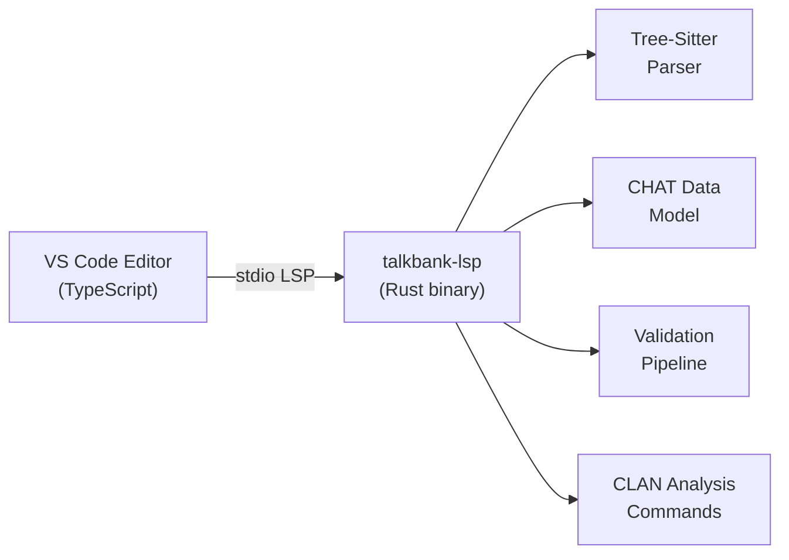

# Your First CHAT File

**Last updated:** 2026-03-30 13:40 EDT

This chapter walks you through opening a CHAT transcript and exploring the
extension's core features one at a time. Each section introduces a single
capability so you can see what the extension does before diving into the
detailed reference chapters.

If you have not yet installed the extension, start with
[Installation](installation.md).

---

## How the Extension Works

Before we begin, here is a brief look at the architecture. The VS Code
extension is a thin TypeScript layer that delegates all CHAT intelligence to a
Rust language server. Every feature -- validation, alignment, analysis,
formatting -- runs inside this server.

The editor sends your keystrokes and commands to the server over standard I/O.
The server parses the file with a tree-sitter grammar, builds a typed data
model, runs validation, and sends diagnostics and responses back. You do not
need to know any of this to use the extension -- it all happens behind the
scenes.

---

## Open a CHAT File

Open any `.cha` file in VS Code. If you have the `talkbank-tools` repository
cloned, good files to start with are in the `corpus/reference/` directory.
These files cover a range of CHAT features across 20 languages.

As soon as the file opens, you should see:

- **Colored text** -- headers (`@UTF8`, `@Begin`, `@Participants`) are bold,
  speaker codes (`*CHI:`, `*MOT:`) have their own color, dependent tiers
  (`%mor:`, `%gra:`) have another, and timing bullets are dimmed
- **Utterance counts** above the `@Participants` header showing how many
  utterances each speaker contributes (e.g., "CHI: 42 utterances")
- **A structured outline** in the breadcrumb bar and Outline view
  (`Cmd+Shift+O`) showing every utterance by speaker

> **[SCREENSHOT: CHAT file with syntax highlighting]**
> *Capture this: a `corpus/reference/` file open in the editor. The screenshot
> should show colored headers, speaker codes, dependent tiers, dimmed timing
> bullets, and the code lens utterance counts above `@Participants`.*

---

## See Validation Errors

Open the Problems panel with `Cmd+Shift+M`. If the file has any issues --
missing headers, undeclared speakers, alignment mismatches, malformed timing
bullets -- they appear here as errors and warnings.

Errors also show as red squiggly underlines in the editor text. Warnings show
as yellow underlines. Hover over an underlined region to see the diagnostic
message and error code.

Validation runs continuously as you type. Make an intentional edit -- for
example, delete the terminator (`.` or `?`) at the end of an utterance line --
and watch a new diagnostic appear within a fraction of a second.

> **[SCREENSHOT: Problems panel with diagnostics]**
> *Capture this: the Problems panel showing 2-3 diagnostics (mix of errors and
> warnings), with one error also visible as a red underline in the editor.*

---

## Play Audio from a Bullet

If the file has an `@Media:` header pointing to an audio or video file, you
can play segments directly from the editor.

Click on a timing bullet -- the `bullet_number_number` markers that look like
`15230_18450` (these are millisecond timestamps). Or place your cursor anywhere
on a main tier line and press `Cmd+Shift+Enter` (**Play Media at Cursor**).

The extension opens a media panel and plays the audio segment corresponding to
that utterance.

To play continuously from the cursor to the end of the file, press
`Cmd+Shift+/` (**Play Media Continuously**). The editor cursor follows along,
highlighting each utterance as it plays.

> **[SCREENSHOT: Media playback panel]**
> *Capture this: the editor with a CHAT file on the left and the media panel
> open on the right, showing the audio player with playback controls and a
> speed slider. The current utterance should be highlighted in the editor.*

---

## Hover for Cross-Tier Alignment

Place your mouse over any word on a `*CHI:` or `*MOT:` main tier line. A hover
popup appears showing how that word aligns across all annotation tiers:

- **%mor** -- morphological breakdown (part of speech, lemma, affixes)
- **%gra** -- grammatical relation (SUBJ, OBJ, DET, etc.)
- **%pho** -- phonetic transcription
- **%sin** -- sign/gesture annotation

This alignment works bidirectionally: hover a token on `%mor` to see the
aligned main tier word, or hover a `%gra` relation to see which word it
annotates.

Click any word on any tier and all its aligned counterparts across every other
tier highlight simultaneously.

> **[SCREENSHOT: Cross-tier hover popup]**
> *Capture this: the cursor hovering over a word on a `*CHI:` line, with the
> hover popup showing aligned %mor and %gra information. Optionally also show
> the document highlight (colored background) on the corresponding %mor token.*

---

## Show the Dependency Graph

Place your cursor on an utterance that has a `%gra:` tier, then press
`Cmd+Shift+G` (**Show Dependency Graph**).

A panel opens beside the editor showing the grammatical dependency structure of
that utterance as a color-coded graph. Arcs are labeled with grammatical
relations (SUBJ, OBJ, DET, MOD, ROOT, etc.) and colored by type.

The graph renders locally using bundled Graphviz WASM -- no internet connection
required. You can export the graph as SVG or PNG using the toolbar buttons.

> **[SCREENSHOT: Dependency graph panel]**
> *Capture this: the editor with a CHAT file on the left and the dependency
> graph panel on the right, showing a tree with labeled arcs for a simple
> utterance like "the dog ate the cookie".*

---

## Run a CLAN Analysis Command

Right-click anywhere in the editor to open the context menu. Under
**TalkBank: Analysis**, select **Run CLAN Analysis...**

A QuickPick menu appears listing all 33 CLAN analysis commands with one-line
descriptions. Select **freq** (word frequency counts).

The results appear in a styled panel with stat cards, tables, and bar charts.
You can export the results to CSV using the "Export CSV" button for use in
spreadsheets or statistical software.

Other commonly used commands:

| Command | What It Does |
|---------|-------------|
| `freq` | Word frequency counts |
| `mlu` | Mean length of utterance |
| `mlt` | Mean length of turn |
| `dss` | Developmental Sentence Score |
| `kideval` | Compare against normative databases |
| `vocd` | Vocabulary diversity |

Commands that need extra input (keywords, file paths) prompt you before
running. You can also run analysis on an entire directory by right-clicking a
folder in the Explorer sidebar and selecting **Run CLAN Analysis on
Directory...**

> **[SCREENSHOT: CLAN analysis results panel]**
> *Capture this: the analysis panel showing freq results -- a stat card with
> total word count, a frequency table, and a bar chart of the top 10 words.*

---

## Apply a Quick Fix

If the Problems panel shows an error with a lightbulb icon, the extension can
fix it automatically.

Place your cursor on the underlined error and press `Cmd+.` (**Quick Fix**).
A menu appears with available fixes. For example:

- `xx` on a main tier line? The fix replaces it with `xxx`
- Missing terminator? The fix appends the appropriate punctuation
- Undeclared speaker? The fix adds them to `@Participants`

The extension offers automatic fixes for 21 error codes covering the most
common CHAT formatting issues.

> **[SCREENSHOT: Quick fix menu]**
> *Capture this: the cursor on a diagnostic underline, with the quick fix
> lightbulb menu showing one or two available corrections.*

---

## Open the Waveform View

Press `Cmd+Shift+W` (**Show Waveform View**) to see a visual representation
of the linked audio file.

The waveform panel shows the audio amplitude with colored overlays marking each
timed utterance. Click anywhere on the waveform to seek both the audio and the
editor cursor to that point. Zoom in and out with the toolbar buttons or mouse
wheel.

During playback, the waveform auto-scrolls to keep the current segment visible.

> **[SCREENSHOT: Waveform panel]**
> *Capture this: the waveform panel showing an audio waveform with colored
> utterance overlays. At least two or three utterance segments should be
> visible with different colors.*

---

## What to Explore Next

You have now seen the core features. Here are some paths to explore further:

- **[Quick Reference](quick-reference.md)** -- complete tables of all keyboard
  shortcuts, commands, and settings
- **[Media Playback](../media/playback.md)** -- continuous play, rewind,
  looping, and playback speed control
- **[Walker Mode](../media/walker.md)** -- step through utterances one at a
  time with `Alt+Down` / `Alt+Up`
- **[Transcription Mode](../media/transcription.md)** -- transcribe from audio
  with `F4` to stamp timing bullets
- **[Coder Mode](../coder/overview.md)** -- load a codes file and step through
  uncoded utterances
- **[Running CLAN Commands](../analysis/running-commands.md)** -- the full set
  of 33 analysis commands
- **[Editing Features](../editing/validation.md)** -- validation, quick fixes,
  completion, snippets, and formatting
