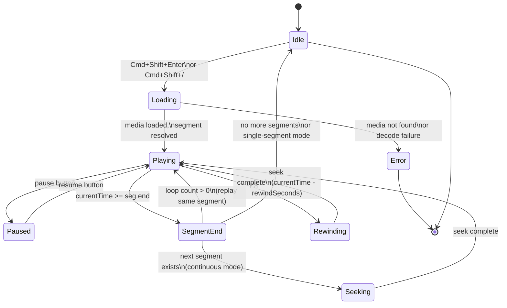

# Media Playback

**Last updated:** 2026-03-30 13:40 EDT

Play audio or video files linked via `@Media:` headers directly inside VS Code.
The extension sources timing segments from the language server's alignment sidecar
when available, falling back to direct bullet parsing (`bulletParser.ts`) when the
LSP is unavailable.

## Play at Cursor

**Shortcut:** `Cmd+Shift+Enter` (macOS) / `Ctrl+Shift+Enter` (Windows/Linux)

Plays the single bullet segment nearest to the cursor position. A media panel opens
in the editor showing playback controls. The segment is determined by the timing
bullet on or nearest to the current editor line --- for example, if the cursor is on
a `*CHI:` line containing `go home .`, playback covers the time range
in that line's bullet.

> **[SCREENSHOT: Media panel with speed slider and playback controls]**
> *Capture this: open a .cha file with media, press Cmd+Shift+Enter, and screenshot
> the media panel showing the speed slider, play/pause button, and time display.*

## Continuous Play

**Shortcut:** `Cmd+Shift+/` (macOS) / `Ctrl+Shift+/` (Windows/Linux)

Plays all segments from the cursor position through to the end of the file. The
editor selection tracks the currently-playing utterance line, scrolling the document
to keep the active line visible.

Segments play sequentially in **document order** (top to bottom), not sorted by media
time. When one segment finishes, playback seeks to the next segment's start time.

> **[VIDEO: 30s demo of continuous playback]**
> *Capture this: start continuous playback from the middle of a multi-speaker file.
> Show the editor cursor advancing through utterance lines as each segment plays.*

## Playback Speed

The media panel toolbar includes a speed slider ranging from **0.25x to 2x**. Drag
the slider to adjust playback speed --- the current rate is shown next to the slider.
This is particularly useful for slowing down fast speech during transcription or
alignment review.

## Rewind

**Shortcut:** `F8`

Rewinds playback by a configurable number of seconds (default: 2). The rewind amount
is controlled by the `talkbank.transcription.rewindSeconds` setting:

```json
{
  "talkbank.transcription.rewindSeconds": 3
}
```

The minimum value is 0.5 seconds. Rewind works during both single-segment and
continuous playback.

## Loop

**Shortcut:** `F5`

Toggles looping of the current segment. When enabled, the current bullet's time range
repeats automatically. The loop count is controlled by `talkbank.walker.loopCount`:

| Value | Behavior |
|-------|----------|
| `1` | Play once (no looping) |
| `3` | Play three times, then advance |
| `0` | Loop indefinitely until manually stopped |

## Playback State Machine

The following diagram shows the states a playback session transitions through:



The playback loop in `mediaPanel.js` polls `currentTime` every 100 ms (matching
CLAN's polling interval). When `currentTime >= seg.end / 1000`, the loop either
advances to the next segment (continuous mode), replays (loop mode), or stops
(single-segment mode).

## Overlapping Bullets (Cross-Speaker Overlap)

CHAT allows cross-speaker overlapping bullets --- two different speakers can have
utterances whose time ranges overlap, as long as utterances are ordered by start
time in the file (validation rule E701). Same-speaker self-overlap beyond 500 ms
is prohibited by E704.

When the file contains overlapping bullets, playback works as follows:

- **Play at Cursor** plays exactly the clicked utterance's time range. No other
  utterances are affected.

- **Continuous Play** plays each utterance in full, in document order. If speaker
  A's utterance covers 0--3.5s and speaker B's covers 2--2.5s, you hear A's full
  range, then B's full range. The overlapping audio region (2--2.5s) is heard
  twice --- once as part of each speaker's turn. This matches CLAN behavior and
  lets you hear each speaker's complete utterance without truncation.

- **Waveform overlays** render each segment independently. Overlapping segments
  appear as stacked colored bars on the waveform (see
  [Waveform Visualization](waveform.md)).

This behavior is intentional. For transcripts with frequent backchannels and short
overlapping speech (common in aphasia protocols, conversation analysis, and
multi-party recordings), hearing each speaker's complete turn in sequence is more
useful than trying to play simultaneous audio streams.

## Requirements

1. The `.cha` file must contain an `@Media:` header specifying the filename and type
   (audio or video). For example: `@Media: interview, audio`
2. The referenced media file must be findable by the extension's media resolver ---
   see [Media Resolution](resolution.md) for the full search order.
3. The media format must be playable by the browser engine embedded in VS Code
   (typically MP3, WAV, MP4, WebM).

## Stop Playback

Use the Command Palette (`Cmd+Shift+P`) and search for **TalkBank: Stop Playback**
to halt any active playback session.

## See Also

- [Waveform Visualization](waveform.md) --- visual audio waveform with segment overlays
- [Walker Mode](walker.md) --- step through utterances one at a time with auto-play
- [Transcription Mode](transcription.md) --- create transcripts with F4 timing stamps
- [Media Resolution](resolution.md) --- how the extension finds media files
- [Keyboard Shortcuts](../configuration/keyboard-shortcuts.md) --- customize playback keybindings
